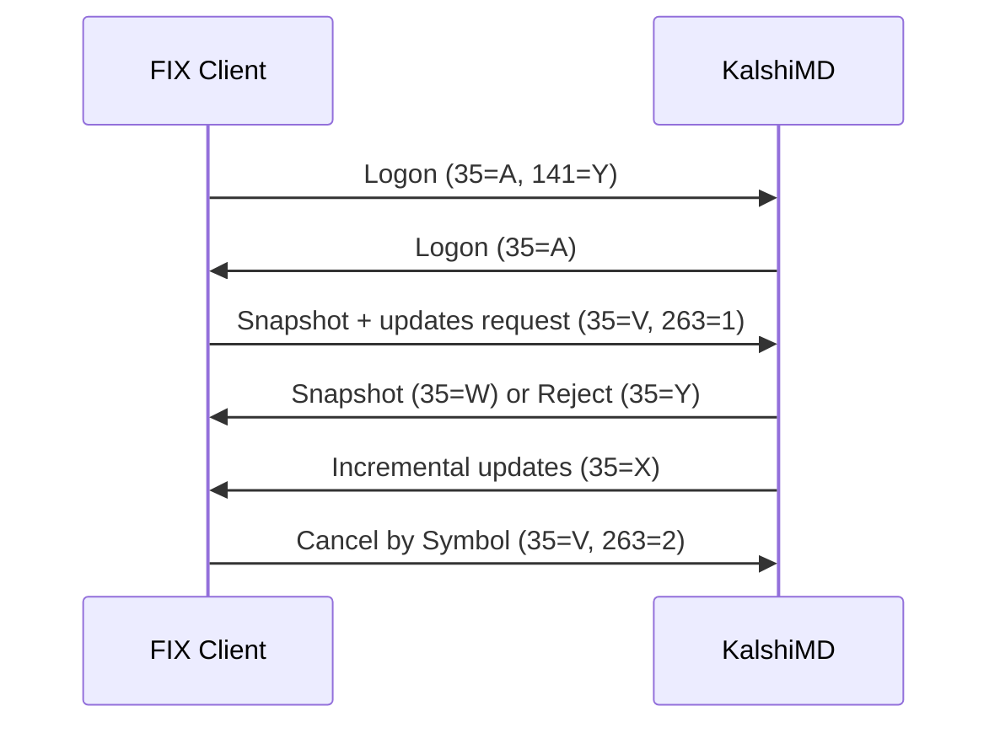
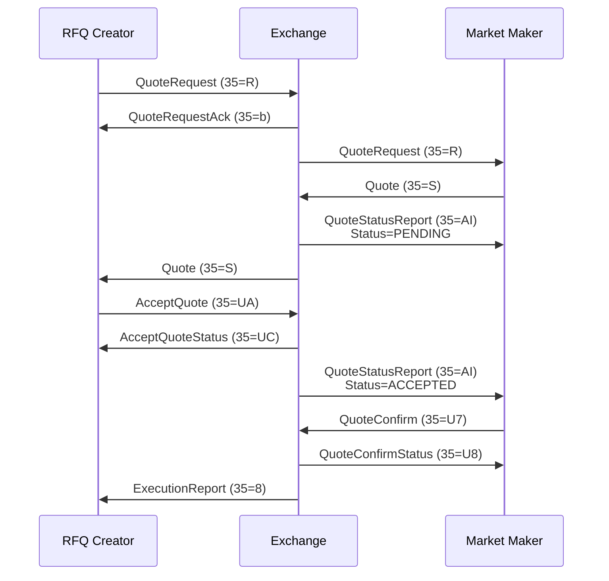

# Source: https://docs.kalshi.com/llms-full.txt
# Vendored 2026-08-17. Full documentation, replacing the index stub.

# Get Account API Limits
Source: https://docs.kalshi.com/api-reference/account/get-account-api-limits

/openapi.yaml get /account/limits
Endpoint to retrieve the authenticated user's Predictions API usage tier and token-bucket limits. Public Predictions tiers include Basic, Advanced, Expert, Premier, Paragon, Prime, and Prestige.


# Get Account API Usage Level Volume Progress
Source: https://docs.kalshi.com/api-reference/account/get-account-api-usage-level-volume-progress

/openapi.yaml get /account/api_usage_level/volume_progress
Returns the authenticated user's latest cron-computed trading volume progress toward volume-based API usage tiers for the predictions (event_contract) lane. Volume figures are reported as fixed-point contract counts.


# List Non-Default Endpoint Costs
Source: https://docs.kalshi.com/api-reference/account/list-non-default-endpoint-costs

/openapi.yaml get /account/endpoint_costs
Lists API v2 endpoints whose configured token cost differs from the default cost. Endpoints that use the default cost are omitted.


# Upgrade Account API Usage Level
Source: https://docs.kalshi.com/api-reference/account/upgrade-account-api-usage-level

/openapi.yaml post /account/api_usage_level/upgrade
Grants a permanent Advanced API usage-level grant. Currently only the Predictions exchange instance is supported. Criteria: at least 1 of the user's last 100 Predictions orders was created via API. Use Get Account API Limits to inspect the resulting usage tier and grants.

<Note>
  **Rate limit:** 30 tokens per request. See `GET /trade-api/v2/account/endpoint_costs` for current non-default endpoint costs.
</Note>


# Create API Key
Source: https://docs.kalshi.com/api-reference/api-keys/create-api-key

/openapi.yaml post /api_keys
 Endpoint for creating a new API key with a user-provided public key.  This endpoint allows users with Premier or Market Maker API usage levels to create API keys by providing their own RSA public key. The platform will use this public key to verify signatures on API requests.


# Delete API Key
Source: https://docs.kalshi.com/api-reference/api-keys/delete-api-key

/openapi.yaml delete /api_keys/{api_key}
 Endpoint for deleting an existing API key.  This endpoint permanently deletes an API key. Once deleted, the key can no longer be used for authentication. This action cannot be undone.


# Generate API Key
Source: https://docs.kalshi.com/api-reference/api-keys/generate-api-key

/openapi.yaml post /api_keys/generate
 Endpoint for generating a new API key with an automatically created key pair.  This endpoint generates both a public and private RSA key pair. The public key is stored on the platform, while the private key is returned to the user and must be stored securely. The private key cannot be retrieved again.


# Get API Keys
Source: https://docs.kalshi.com/api-reference/api-keys/get-api-keys

/openapi.yaml get /api_keys
 Endpoint for retrieving all API keys associated with the authenticated user.  API keys allow programmatic access to the platform without requiring username/password authentication. Each key has a unique identifier and name.


# Accept Block Trade Proposal
Source: https://docs.kalshi.com/api-reference/communications/accept-block-trade-proposal

/openapi.yaml post /communications/block-trade-proposals/{block_trade_proposal_id}/accept
 Endpoint for accepting a block trade proposal.


# Accept Quote
Source: https://docs.kalshi.com/api-reference/communications/accept-quote

/openapi.yaml put /communications/quotes/{quote_id}/accept
DEPRECATED: Use PUT /communications/rfqs/{rfq_id}/quotes/{quote_id}/accept instead. Endpoint for accepting a quote. This will require the quoter to confirm.

<Warning>
  This endpoint is deprecated. Use `PUT /communications/rfqs/{rfq_id}/quotes/{quote_id}/accept` instead.
</Warning>


# Accept RFQ Quote
Source: https://docs.kalshi.com/api-reference/communications/accept-rfq-quote

/openapi.yaml put /communications/rfqs/{rfq_id}/quotes/{quote_id}/accept
 Endpoint for accepting a quote scoped to its RFQ. This will require the quoter to confirm.


# Confirm Quote
Source: https://docs.kalshi.com/api-reference/communications/confirm-quote

/openapi.yaml put /communications/quotes/{quote_id}/confirm
DEPRECATED: Use PUT /communications/rfqs/{rfq_id}/quotes/{quote_id}/confirm instead. Endpoint for confirming a quote. This will start a timer for order execution.

<Warning>
  This endpoint is deprecated. Use `PUT /communications/rfqs/{rfq_id}/quotes/{quote_id}/confirm` instead.
</Warning>


# Confirm RFQ Quote
Source: https://docs.kalshi.com/api-reference/communications/confirm-rfq-quote

/openapi.yaml put /communications/rfqs/{rfq_id}/quotes/{quote_id}/confirm
 Endpoint for confirming a quote scoped to its RFQ. This will start a timer for order execution.


# Create Quote
Source: https://docs.kalshi.com/api-reference/communications/create-quote

/openapi.yaml post /communications/quotes
 Endpoint for creating a quote in response to an RFQ

<Note>
  **Rate limit:** 2 tokens per request. See `GET /trade-api/v2/account/endpoint_costs` for current non-default endpoint costs.
</Note>


# Create RFQ
Source: https://docs.kalshi.com/api-reference/communications/create-rfq

/openapi.yaml post /communications/rfqs
 Endpoint for creating a new RFQ. You can have a maximum of 100 open RFQs at a time.


# Delete Quote
Source: https://docs.kalshi.com/api-reference/communications/delete-quote

/openapi.yaml delete /communications/quotes/{quote_id}
DEPRECATED: Use DELETE /communications/rfqs/{rfq_id}/quotes/{quote_id} instead. Endpoint for deleting a quote, which means it can no longer be accepted.

<Warning>
  This endpoint is deprecated. Use `DELETE /communications/rfqs/{rfq_id}/quotes/{quote_id}` instead.
</Warning>

<Note>
  **Rate limit:** 2 tokens per request. See `GET /trade-api/v2/account/endpoint_costs` for current non-default endpoint costs.
</Note>


# Delete RFQ
Source: https://docs.kalshi.com/api-reference/communications/delete-rfq

/openapi.yaml delete /communications/rfqs/{rfq_id}
 Endpoint for deleting an RFQ by ID


# Delete RFQ Quote
Source: https://docs.kalshi.com/api-reference/communications/delete-rfq-quote

/openapi.yaml delete /communications/rfqs/{rfq_id}/quotes/{quote_id}
 Endpoint for deleting a quote scoped to its RFQ, which means it can no longer be accepted.

<Note>
  **Rate limit:** 2 tokens per request. See `GET /trade-api/v2/account/endpoint_costs` for current non-default endpoint costs.
</Note>


# Get Block Trade Proposals
Source: https://docs.kalshi.com/api-reference/communications/get-block-trade-proposals

/openapi.yaml get /communications/block-trade-proposals
 Endpoint for getting block trade proposals visible to the authenticated user.


# Get Communications ID
Source: https://docs.kalshi.com/api-reference/communications/get-communications-id

/openapi.yaml get /communications/id
 Endpoint for getting the communications ID of the logged-in user.


# Get Quote
Source: https://docs.kalshi.com/api-reference/communications/get-quote

/openapi.yaml get /communications/quotes/{quote_id}
DEPRECATED: Use GET /communications/rfqs/{rfq_id}/quotes/{quote_id} instead. Endpoint for getting a particular quote.

<Warning>
  This endpoint is deprecated. Use `GET /communications/rfqs/{rfq_id}/quotes/{quote_id}` instead.
</Warning>

<Note>
  **Rate limit:** 2 tokens per request. See `GET /trade-api/v2/account/endpoint_costs` for current non-default endpoint costs.
</Note>


# Get Quotes
Source: https://docs.kalshi.com/api-reference/communications/get-quotes

/openapi.yaml get /communications/quotes
 Endpoint for getting quotes


# Get RFQ
Source: https://docs.kalshi.com/api-reference/communications/get-rfq

/openapi.yaml get /communications/rfqs/{rfq_id}
 Endpoint for getting a single RFQ by id


# Get RFQ Quote
Source: https://docs.kalshi.com/api-reference/communications/get-rfq-quote

/openapi.yaml get /communications/rfqs/{rfq_id}/quotes/{quote_id}
 Endpoint for getting a particular quote scoped to its RFQ.

<Note>
  **Rate limit:** 2 tokens per request. See `GET /trade-api/v2/account/endpoint_costs` for current non-default endpoint costs.
</Note>


# Get RFQs
Source: https://docs.kalshi.com/api-reference/communications/get-rfqs

/openapi.yaml get /communications/rfqs
 Endpoint for getting RFQs


# Propose Block Trade
Source: https://docs.kalshi.com/api-reference/communications/propose-block-trade

/openapi.yaml post /communications/block-trade-proposals
 Endpoint for creating a block trade proposal.


# Get Event
Source: https://docs.kalshi.com/api-reference/events/get-event

/openapi.yaml get /events/{event_ticker}
Endpoint for getting data about an event by its ticker. An event represents a real-world occurrence that can be traded on, such as an election, sports game, or economic indicator release.
Events contain one or more markets where users can place trades on different outcomes.
All events are accessible through this endpoint, even if their associated markets are older than the historical cutoff.


# Get Event Candlesticks
Source: https://docs.kalshi.com/api-reference/events/get-event-candlesticks

/openapi.yaml get /series/{series_ticker}/events/{ticker}/candlesticks
 End-point for returning aggregated data across all markets corresponding to an event.


# Get Event Fee Changes
Source: https://docs.kalshi.com/api-reference/events/get-event-fee-changes

/openapi.yaml get /events/fee_changes
Event fees are an override layered on top of the parent series' fee structure. If `fee_type_override` and `fee_multiplier_override` are null, that indicates the override is cleared.


# Get Event Forecast Percentile History
Source: https://docs.kalshi.com/api-reference/events/get-event-forecast-percentile-history

/openapi.yaml get /series/{series_ticker}/events/{ticker}/forecast_percentile_history
Endpoint for getting the historical raw and formatted forecast numbers for an event at specific percentiles.


# Get Event Metadata
Source: https://docs.kalshi.com/api-reference/events/get-event-metadata

/openapi.yaml get /events/{event_ticker}/metadata
 Endpoint for getting metadata about an event by its ticker.  Returns only the metadata information for an event.


# Get Events
Source: https://docs.kalshi.com/api-reference/events/get-events

/openapi.yaml get /events
Get all events. This endpoint excludes multivariate events.
To retrieve multivariate events, use the GET /events/multivariate endpoint.
All events are accessible through this endpoint, even if their associated markets are older than the historical cutoff.


# Get Multivariate Events
Source: https://docs.kalshi.com/api-reference/events/get-multivariate-events

/openapi.yaml get /events/multivariate
Retrieve multivariate (combo) events. These are dynamically created events from multivariate event collections. Supports filtering by series and collection ticker.


# Get Exchange Schedule
Source: https://docs.kalshi.com/api-reference/exchange/get-exchange-schedule

/openapi.yaml get /exchange/schedule
 Endpoint for getting the exchange schedule.


# Get Exchange Status
Source: https://docs.kalshi.com/api-reference/exchange/get-exchange-status

/openapi.yaml get /exchange/status
 Endpoint for getting the exchange status.


# Get Series Fee Changes
Source: https://docs.kalshi.com/api-reference/exchange/get-series-fee-changes

/openapi.yaml get /series/fee_changes


# Get User Data Timestamp
Source: https://docs.kalshi.com/api-reference/exchange/get-user-data-timestamp

/openapi.yaml get /exchange/user_data_timestamp
 There is typically a short delay before exchange events are reflected in the API endpoints. Whenever possible, combine API responses to PUT/POST/DELETE requests with WebSocket data to obtain the most accurate view of the exchange state. This endpoint provides an approximate indication of when the data from the following endpoints was last validated: GetBalance, GetOrder(s), GetFills, GetPositions


# Get FCM Orders
Source: https://docs.kalshi.com/api-reference/fcm/get-fcm-orders

/openapi.yaml get /fcm/orders
Endpoint for FCM members to get orders filtered by subtrader ID.
This endpoint requires FCM member access level and allows filtering orders by subtrader ID.


# Get FCM Positions
Source: https://docs.kalshi.com/api-reference/fcm/get-fcm-positions

/openapi.yaml get /fcm/positions
Endpoint for FCM members to get market positions filtered by subtrader ID.
This endpoint requires FCM member access level and allows filtering positions by subtrader ID.


# Get Historical Cutoff Timestamps
Source: https://docs.kalshi.com/api-reference/historical/get-historical-cutoff-timestamps

/openapi.yaml get /historical/cutoff
Returns the cutoff timestamps that define the boundary between **live** and **historical** data.

## Cutoff fields
- `market_settled_ts` : Markets that **settled** before this timestamp, and their candlesticks, must be accessed via `GET /historical/markets` and `GET /historical/markets/{ticker}/candlesticks`.
- `trades_created_ts` : Trades that were **filled** before this timestamp must be accessed via `GET /historical/fills`.
- `orders_updated_ts` : Orders that were **canceled or fully executed** before this timestamp must be accessed via `GET /historical/orders`. Resting (active) orders are always available in `GET /portfolio/orders`.
- `market_positions_last_updated_ts` : Settled positions **archived from the live data set** before this timestamp must be accessed via `GET /historical/positions`. Unsettled positions are always available in `GET /portfolio/positions`.


# Get Historical Fills
Source: https://docs.kalshi.com/api-reference/historical/get-historical-fills

/openapi.yaml get /historical/fills
 Endpoint for getting all historical fills for the member. A fill is when a trade you have is matched.


# Get Historical Market
Source: https://docs.kalshi.com/api-reference/historical/get-historical-market

/openapi.yaml get /historical/markets/{ticker}
 Endpoint for getting data about a specific market by its ticker from the historical database.


# Get Historical Market Candlesticks
Source: https://docs.kalshi.com/api-reference/historical/get-historical-market-candlesticks

/openapi.yaml get /historical/markets/{ticker}/candlesticks
 Endpoint for fetching historical candlestick data for markets that have been archived from the live data set. Time period length of each candlestick in minutes. Valid values: 1 (1 minute), 60 (1 hour), 1440 (1 day).


# Get Historical Markets
Source: https://docs.kalshi.com/api-reference/historical/get-historical-markets

/openapi.yaml get /historical/markets
Endpoint for getting markets that have been archived to the historical database. Filters are mutually exclusive.


# Get Historical Orders
Source: https://docs.kalshi.com/api-reference/historical/get-historical-orders

/openapi.yaml get /historical/orders
 Endpoint for getting orders that have been archived to the historical database.


# Get Historical Positions
Source: https://docs.kalshi.com/api-reference/historical/get-historical-positions

/openapi.yaml get /historical/positions
 Endpoint for getting settled market positions that have been archived to the historical database. Positions whose markets were archived before `market_positions_last_updated_ts` on `GET /historical/cutoff` are available via this endpoint. Positions are archived per whole event: a settled event's positions move here together and are never split between this endpoint and `GET /portfolio/positions`. Unsettled positions are always available via `GET /portfolio/positions`.


# Get Historical Trades
Source: https://docs.kalshi.com/api-reference/historical/get-historical-trades

/openapi.yaml get /historical/trades
 Endpoint for getting all historical trades for all markets. Trades that were filled before the historical cutoff are available via this endpoint. Block trades are included by default and identified by the `is_block_trade` field; use the `is_block_trade` query parameter to filter by block / non-block. See [Historical Data](https://docs.kalshi.com/getting_started/historical_data) for details.


# Get Incentives
Source: https://docs.kalshi.com/api-reference/incentive-programs/get-incentives

/openapi.yaml get /incentive_programs
 List incentives with optional filters. Incentives are rewards programs for trading activity on specific markets.


# Get Event Live Data
Source: https://docs.kalshi.com/api-reference/live-data/get-event-live-data

/openapi.yaml get /live_data/events/{event_ticker}
Get live data for an event by its event ticker. Serves event-keyed live data such as crypto price charts, commodity price timeseries, and weather observations. The `type` field in the response names the schema of the `details` object.


# Get Game Stats
Source: https://docs.kalshi.com/api-reference/live-data/get-game-stats

/openapi.yaml get /live_data/milestone/{milestone_id}/game_stats
Get play-by-play game statistics for a specific milestone. Supported sports: Pro Football, College Football, Pro Basketball, College Men's Basketball, College Women's Basketball, WNBA, Soccer, Pro Hockey, and Pro Baseball. Returns null for unsupported milestone types or milestones without a Sportradar ID.


# Get Live Data
Source: https://docs.kalshi.com/api-reference/live-data/get-live-data

/openapi.yaml get /live_data/milestone/{milestone_id}
Get live data for a specific milestone.


# Get Live Data (with type)
Source: https://docs.kalshi.com/api-reference/live-data/get-live-data-with-type

/openapi.yaml get /live_data/{type}/milestone/{milestone_id}
Get live data for a specific milestone. This is the legacy endpoint that requires a type path parameter. Prefer using `/live_data/milestone/{milestone_id}` instead.


# Get Multiple Live Data
Source: https://docs.kalshi.com/api-reference/live-data/get-multiple-live-data

/openapi.yaml get /live_data/batch
Get live data for multiple milestones


# Batch Get Market Candlesticks
Source: https://docs.kalshi.com/api-reference/market/batch-get-market-candlesticks

/openapi.yaml get /markets/candlesticks
Endpoint for retrieving candlestick data for multiple markets.

- Accepts up to 100 market tickers per request
- Returns up to 10,000 candlesticks total across all markets
- Returns candlesticks grouped by market_id
- Optionally includes a synthetic initial candlestick for price continuity (see `include_latest_before_start` parameter)


# Get Market
Source: https://docs.kalshi.com/api-reference/market/get-market

/openapi.yaml get /markets/{ticker}
 Endpoint for getting data about a specific market by its ticker. A market represents a specific binary outcome within an event that users can trade on (e.g., "Will candidate X win?"). Markets have yes/no positions, current prices, volume, and settlement rules.


# Get Market Candlesticks
Source: https://docs.kalshi.com/api-reference/market/get-market-candlesticks

/openapi.yaml get /series/{series_ticker}/markets/{ticker}/candlesticks
Time period length of each candlestick in minutes. Valid values: 1 (1 minute), 60 (1 hour), 1440 (1 day).
Candlesticks for markets that settled before the historical cutoff are only available via `GET /historical/markets/{ticker}/candlesticks`. See [Historical Data](https://docs.kalshi.com/getting_started/historical_data) for details.


# Get Market Orderbook
Source: https://docs.kalshi.com/api-reference/market/get-market-orderbook

/openapi.yaml get /markets/{ticker}/orderbook
 Endpoint for getting the current order book for a specific market.  The order book shows all active bid orders for both yes and no sides of a binary market. It returns yes bids and no bids only (no asks are returned). This is because in binary markets, a bid for yes at price X is equivalent to an ask for no at price (100-X). For example, a yes bid at 7¢ is the same as a no ask at 93¢, with identical contract sizes.  Each side shows price levels with their corresponding quantities and order counts, organized from best to worst prices.


# Get Markets
Source: https://docs.kalshi.com/api-reference/market/get-markets

/openapi.yaml get /markets
Filter by market status. Possible values: `unopened`, `open`, `closed`, `settled`. Leave empty to return markets with any status.
 - Only one `status` filter may be supplied at a time.
 - Timestamp filters will be mutually exclusive from other timestamp filters and certain status filters.

 | Compatible Timestamp Filters | Additional Status Filters| Extra Notes |
 |------------------------------|--------------------------|-------------|
 | min_created_ts, max_created_ts | `unopened`, `open`, *empty* | |
 | min_close_ts, max_close_ts | `closed`, *empty* | |
 | min_settled_ts, max_settled_ts | `settled`, *empty* | |
 | min_updated_ts | *empty* | Incompatible with all filters besides `mve_filter=exclude`. May be combined with `series_ticker`, which requires `mve_filter=exclude` |

 Markets that settled before the historical cutoff are only available via `GET /historical/markets`. See [Historical Data](https://docs.kalshi.com/getting_started/historical_data) for details.


# Get Multiple Market Orderbooks
Source: https://docs.kalshi.com/api-reference/market/get-multiple-market-orderbooks

/openapi.yaml get /markets/orderbooks
Endpoint for getting the current order books for multiple markets in a single request. The order book shows all active bid orders for both yes and no sides of a binary market. It returns yes bids and no bids only (no asks are returned). This is because in binary markets, a bid for yes at price X is equivalent to an ask for no at price (100-X). For example, a yes bid at 7¢ is the same as a no ask at 93¢, with identical contract sizes. Each side shows price levels with their corresponding quantities and order counts, organized from best to worst prices. Returns one orderbook per requested market ticker.


# Get Series
Source: https://docs.kalshi.com/api-reference/market/get-series

/openapi.yaml get /series/{series_ticker}
 Endpoint for getting data about a specific series by its ticker.  A series represents a template for recurring events that follow the same format and rules (e.g., "Monthly Jobs Report", "Weekly Initial Jobless Claims", "Daily Weather in NYC"). Series define the structure, settlement sources, and metadata that will be applied to each recurring event instance within that series.


# Get Series List
Source: https://docs.kalshi.com/api-reference/market/get-series-list

/openapi.yaml get /series
 Endpoint for getting data about multiple series with specified filters.  A series represents a template for recurring events that follow the same format and rules (e.g., "Monthly Jobs Report", "Weekly Initial Jobless Claims", "Daily Weather in NYC"). This endpoint allows you to browse and discover available series templates by category.


# Get Trades
Source: https://docs.kalshi.com/api-reference/market/get-trades

/openapi.yaml get /markets/trades
Endpoint for getting all trades for all markets. A trade represents a completed transaction between two users on a specific market. Each trade includes the market ticker, price, quantity, and timestamp information. Block trades are included in the response by default and identified by the `is_block_trade` field; use the `is_block_trade` query parameter to filter by block / non-block. This endpoint returns a paginated response. Use the 'limit' parameter to control page size (1-1000, defaults to 100). The response includes a 'cursor' field - pass this value in the 'cursor' parameter of your next request to get the next page. An empty cursor indicates no more pages are available.


# Get Milestone
Source: https://docs.kalshi.com/api-reference/milestone/get-milestone

/openapi.yaml get /milestones/{milestone_id}
 Endpoint for getting data about a specific milestone by its ID.


# Get Milestones
Source: https://docs.kalshi.com/api-reference/milestone/get-milestones

/openapi.yaml get /milestones
Minimum start date to filter milestones. Format: RFC3339 timestamp


# Create Market In Multivariate Event Collection
Source: https://docs.kalshi.com/api-reference/multivariate/create-market-in-multivariate-event-collection

/openapi.yaml post /multivariate_event_collections/{collection_ticker}
Endpoint for creating an individual market in a multivariate event collection. This endpoint must be hit at least once before trading or looking up a market. Users are limited to 5000 creations per week.


# Get Multivariate Event Collection
Source: https://docs.kalshi.com/api-reference/multivariate/get-multivariate-event-collection

/openapi.yaml get /multivariate_event_collections/{collection_ticker}
 Endpoint for getting data about a multivariate event collection by its ticker.


# Get Multivariate Event Collections
Source: https://docs.kalshi.com/api-reference/multivariate/get-multivariate-event-collections

/openapi.yaml get /multivariate_event_collections
 Endpoint for getting data about multivariate event collections.


# Create Order Group
Source: https://docs.kalshi.com/api-reference/order-groups/create-order-group

/openapi.yaml post /portfolio/order_groups/create
 Creates a new order group with a contracts limit measured over a rolling 15-second window. Users can have up to 100,000 order groups at a time. When the limit is hit, all orders in the group are cancelled and no new orders can be placed until reset.


# Delete Order Group
Source: https://docs.kalshi.com/api-reference/order-groups/delete-order-group

/openapi.yaml delete /portfolio/order_groups/{order_group_id}
 Deletes an order group and cancels all orders within it. This permanently removes the group.


# Get Order Group
Source: https://docs.kalshi.com/api-reference/order-groups/get-order-group

/openapi.yaml get /portfolio/order_groups/{order_group_id}
 Retrieves details for a single order group including all order IDs and auto-cancel status.


# Get Order Groups
Source: https://docs.kalshi.com/api-reference/order-groups/get-order-groups

/openapi.yaml get /portfolio/order_groups
 Retrieves all order groups for the authenticated user.


# Reset Order Group
Source: https://docs.kalshi.com/api-reference/order-groups/reset-order-group

/openapi.yaml put /portfolio/order_groups/{order_group_id}/reset
 Resets the order group's matched contracts counter to zero, allowing new orders to be placed again after the limit was hit.


# Trigger Order Group
Source: https://docs.kalshi.com/api-reference/order-groups/trigger-order-group

/openapi.yaml put /portfolio/order_groups/{order_group_id}/trigger
 Triggers the order group, canceling all orders in the group and preventing new orders until the group is reset.


# Update Order Group Limit
Source: https://docs.kalshi.com/api-reference/order-groups/update-order-group-limit

/openapi.yaml put /portfolio/order_groups/{order_group_id}/limit
 Updates the order group contracts limit (rolling 15-second window). If the updated limit would immediately trigger the group, all orders in the group are canceled and the group is triggered.


# Amend Order (V2)
Source: https://docs.kalshi.com/api-reference/orders/amend-order-v2

/openapi.yaml post /portfolio/events/orders/{order_id}/amend
Endpoint for amending the price and/or max fillable count of an existing event-market order using the V2 request/response shape. The request `count` is the updated total/max fillable count, equal to already filled count plus desired resting remaining count. This behavior matches the v1 amend endpoints; only the request/response shape differs.

<Note>
  Amending a resting order preserves queue position only when the amendment decreases size. All other amendments — like increasing size or changing price forfeit queue position and place the order at the back of the queue.
</Note>


# Batch Cancel Orders (V2)
Source: https://docs.kalshi.com/api-reference/orders/batch-cancel-orders-v2

/openapi.yaml delete /portfolio/events/orders/batched
Endpoint for cancelling a batch of event-market orders using the V2 response shape. The maximum batch size scales with your tier's write budget — see [Rate Limits and Tiers](/getting_started/rate_limits).

<Note>
  **Rate limit:** 2 tokens per order in the batch — billed per item, so total cost for a batch of N cancels is N × 2. See `GET /trade-api/v2/account/endpoint_costs` for current non-default endpoint costs.
</Note>


# Batch Create Orders (V2)
Source: https://docs.kalshi.com/api-reference/orders/batch-create-orders-v2

/openapi.yaml post /portfolio/events/orders/batched
Endpoint for submitting a batch of event-market orders using the V2 request/response shape. The maximum batch size scales with your tier's write budget — see [Rate Limits and Tiers](/getting_started/rate_limits).

<Note>
  **Rate limit:** 10 tokens per order in the batch — billed per item, so total cost for a batch of N orders is N × 10. See `GET /trade-api/v2/account/endpoint_costs` for current non-default endpoint costs.
</Note>


# Cancel Order (V2)
Source: https://docs.kalshi.com/api-reference/orders/cancel-order-v2

/openapi.yaml delete /portfolio/events/orders/{order_id}
Endpoint for cancelling event-market orders using the V2 response shape. Returns `{order_id, client_order_id, reduced_by}` rather than a full order object.

<Note>
  **Rate limit:** 2 tokens per request. See `GET /trade-api/v2/account/endpoint_costs` for current non-default endpoint costs.
</Note>


# Create Order (V2)
Source: https://docs.kalshi.com/api-reference/orders/create-order-v2

/openapi.yaml post /portfolio/events/orders
Endpoint for submitting event-market orders using the V2 request/response shape (single-book `bid`/`ask` side and fixed-point dollar prices). The legacy `/portfolio/orders` endpoint will be deprecated no earlier than May 6, 2026 — clients should migrate to this path.


# Decrease Order (V2)
Source: https://docs.kalshi.com/api-reference/orders/decrease-order-v2

/openapi.yaml post /portfolio/events/orders/{order_id}/decrease
Endpoint for decreasing the remaining count of an existing event-market order using the V2 request/response shape. Exactly one of `reduce_by` or `reduce_to` must be provided.


# Get Order
Source: https://docs.kalshi.com/api-reference/orders/get-order

/openapi.yaml get /portfolio/orders/{order_id}
 Endpoint for getting a single order.

<Note>
  **Rate limit:** 2 tokens per request. See `GET /trade-api/v2/account/endpoint_costs` for current non-default endpoint costs.
</Note>


# Get Order Queue Position
Source: https://docs.kalshi.com/api-reference/orders/get-order-queue-position

/openapi.yaml get /portfolio/orders/{order_id}/queue_position
 Endpoint for getting an order's queue position in the order book. This represents the amount of orders that need to be matched before this order receives a partial or full match. Queue position is determined using a price-time priority.


# Get Orders
Source: https://docs.kalshi.com/api-reference/orders/get-orders

/openapi.yaml get /portfolio/orders
Restricts the response to orders that have a certain status: resting, canceled, or executed.
Orders that have been canceled or fully executed before the historical cutoff are only available via `GET /historical/orders`. Resting orders will always be available through this endpoint. See [Historical Data](https://docs.kalshi.com/getting_started/historical_data) for details.


# Get Queue Positions for Orders
Source: https://docs.kalshi.com/api-reference/orders/get-queue-positions-for-orders

/openapi.yaml get /portfolio/orders/queue_positions
 Endpoint for getting queue positions for all resting orders. Queue position represents the number of contracts that need to be matched before an order receives a partial or full match, determined using price-time priority.


# Create Subaccount
Source: https://docs.kalshi.com/api-reference/portfolio/create-subaccount

/openapi.yaml post /portfolio/subaccounts
Creates a new subaccount for the authenticated user. This endpoint is available to all users on the Advanced API tier and above. Subaccounts are numbered sequentially starting from 1. Maximum 63 numbered subaccounts per user (64 including the primary account).


# Get All Subaccount Balances
Source: https://docs.kalshi.com/api-reference/portfolio/get-all-subaccount-balances

/openapi.yaml get /portfolio/subaccounts/balances
Gets balances for all subaccounts including the primary account.


# Get Balance
Source: https://docs.kalshi.com/api-reference/portfolio/get-balance

/openapi.yaml get /portfolio/balance
Endpoint for getting the balance and portfolio value of a member. `portfolio_value` is always scoped to the requested `exchange_index` (defaulting to 0). When `subaccount` is omitted, `balance` is the primary account's aggregate available balance; pass `subaccount` explicitly (0 for primary, 1-63 for subaccounts) to read that subaccount's balance on the requested exchange index instead. This endpoint also accepts API keys with the 'read::portfolio_balance' scope.


# Get Deposits
Source: https://docs.kalshi.com/api-reference/portfolio/get-deposits

/openapi.yaml get /portfolio/deposits
Endpoint for getting the member's deposit history.


# Get Fills
Source: https://docs.kalshi.com/api-reference/portfolio/get-fills

/openapi.yaml get /portfolio/fills
Endpoint for getting all fills for the member. A fill is when a trade you have is matched.
Fills that occurred before the historical cutoff are only available via `GET /historical/fills`. See [Historical Data](https://docs.kalshi.com/getting_started/historical_data) for details.


# Get Intra Account Transfer
Source: https://docs.kalshi.com/api-reference/portfolio/get-intra-account-transfer

/openapi.yaml get /portfolio/intra_exchange_instance_transfers/{transfer_id}
Endpoint for getting a single intra-account transfer by id.


# Get Intra Account Transfers
Source: https://docs.kalshi.com/api-reference/portfolio/get-intra-account-transfers

/openapi.yaml get /portfolio/intra_exchange_instance_transfers
Endpoint for fetching intra-exchange account transfer history.


# Get Positions
Source: https://docs.kalshi.com/api-reference/portfolio/get-positions

/openapi.yaml get /portfolio/positions
Restricts the positions to those with any of following fields with non-zero values, as a comma separated list. The following values are accepted: position, total_traded


# Get Settlements
Source: https://docs.kalshi.com/api-reference/portfolio/get-settlements

/openapi.yaml get /portfolio/settlements
 Endpoint for getting the member's settlements historical track.


# Get Subaccount Netting
Source: https://docs.kalshi.com/api-reference/portfolio/get-subaccount-netting

/openapi.yaml get /portfolio/subaccounts/netting
Gets the netting enabled settings for all subaccounts.


# Get Subaccount Transfers
Source: https://docs.kalshi.com/api-reference/portfolio/get-subaccount-transfers

/openapi.yaml get /portfolio/subaccounts/transfers
Gets a paginated list of all transfers between subaccounts for the authenticated user.


# Get Total Resting Order Value
Source: https://docs.kalshi.com/api-reference/portfolio/get-total-resting-order-value

/openapi.yaml get /portfolio/summary/total_resting_order_value
 Endpoint for getting the total value, in cents, of resting orders. This endpoint is only intended for use by FCM members (rare). Note: If you're uncertain about this endpoint, it likely does not apply to you.


# Get Withdrawals
Source: https://docs.kalshi.com/api-reference/portfolio/get-withdrawals

/openapi.yaml get /portfolio/withdrawals
Endpoint for getting the member's withdrawal history.


# Intra Account Transfer
Source: https://docs.kalshi.com/api-reference/portfolio/intra-account-transfer

/openapi.yaml post /portfolio/intra_exchange_instance_transfer
Endpoint for transferring funds within the same account.


# Transfer Between Subaccounts
Source: https://docs.kalshi.com/api-reference/portfolio/transfer-between-subaccounts

/openapi.yaml post /portfolio/subaccounts/transfer
Transfers funds between the authenticated user's subaccounts. Use 0 for the primary account, or 1-63 for numbered subaccounts. Set exchange_index to apply the transfer on a specific exchange shard (defaults to 0).


# Update Subaccount Netting
Source: https://docs.kalshi.com/api-reference/portfolio/update-subaccount-netting

/openapi.yaml put /portfolio/subaccounts/netting
Updates the netting enabled setting for a specific subaccount. Use 0 for the primary account, or 1-63 for numbered subaccounts.


# Get Filters for Sports
Source: https://docs.kalshi.com/api-reference/search/get-filters-for-sports

/openapi.yaml get /search/filters_by_sport
Retrieve available filters organized by sport.

This endpoint returns filtering options available for each sport, including scopes and competitions. It also provides an ordered list of sports for display purposes.


# Get Tags for Series Categories
Source: https://docs.kalshi.com/api-reference/search/get-tags-for-series-categories

/openapi.yaml get /search/tags_by_categories
Retrieve tags organized by series categories.

This endpoint returns a mapping of series categories to their associated tags, which can be used for filtering and search functionality.


# Get Structured Target
Source: https://docs.kalshi.com/api-reference/structured-targets/get-structured-target

/openapi.yaml get /structured_targets/{structured_target_id}
 Endpoint for getting data about a specific structured target by its ID.


# Get Structured Targets
Source: https://docs.kalshi.com/api-reference/structured-targets/get-structured-targets

/openapi.yaml get /structured_targets
Page size (min: 1, max: 2000)


# CF Benchmarks REST Passthrough
Source: https://docs.kalshi.com/cfbenchmarks/rest-passthrough

Query CF Benchmarks REST data using your existing Kalshi API credentials

## Overview

The CF Benchmarks REST passthrough lets you query the [CF Benchmarks](https://www.cfbenchmarks.com) REST API using your existing Kalshi API credentials. Requests are authenticated the same way as any other Kalshi Trade API call, so you do not need a separate CF Benchmarks API key.

Send a request to the `/cfbenchmarks` endpoint and the path and query string are forwarded to CF Benchmarks. The upstream response is returned wrapped in a standard Kalshi `data` envelope.

## Access

The passthrough requires an authenticated Kalshi Trade API request, and it is available only to accounts with the appropriate entitlement. If you receive an authorization error and believe you should have access, contact Kalshi.

## Rate limit

Each passthrough request costs **50 tokens** from your Read bucket; the default request costs 10. At the Basic tier's 200 tokens-per-second read budget, that sustains 4 requests per second. See [Rate Limits and Tiers](/getting_started/rate_limits) for budgets and bucket behavior.

## Base URL and Path Mapping

Use the production Trade API base URL (see [API Environments](/getting_started/api_environments) for all hosts and the demo environment):

```text theme={null}
https://external-api.kalshi.com/trade-api/v2
```

Everything after `/cfbenchmarks/`, including the query string, is forwarded to the CF Benchmarks REST API at `https://www.cfbenchmarks.com/api/v1/`.

| Kalshi request                                  | Forwarded to                                         |
| ----------------------------------------------- | ---------------------------------------------------- |
| `GET /trade-api/v2/cfbenchmarks/values?id=BRTI` | `https://www.cfbenchmarks.com/api/v1/values?id=BRTI` |

## Authentication

Authenticate with standard Kalshi API key request signing. See [API Keys](/getting_started/api_keys) and [Quick Start: Authenticated Requests](/getting_started/quick_start_authenticated_requests) for the full signing flow.

As with all Trade API endpoints, sign the request path from the API root **without** the query string:

```text theme={null}
/trade-api/v2/cfbenchmarks/values
```

## Example

```bash theme={null}
curl "https://external-api.kalshi.com/trade-api/v2/cfbenchmarks/values?id=BRTI" \
  -H "KALSHI-ACCESS-KEY: <your-access-key>" \
  -H "KALSHI-ACCESS-SIGNATURE: <request-signature>" \
  -H "KALSHI-ACCESS-TIMESTAMP: <timestamp-ms>"
```

The raw CF Benchmarks payload is returned under the `data` field:

```json theme={null}
{
  "data": {
    "serverTime": "2019-08-13T23:30:53.992Z",
    "payload": {}
  }
}
```

## Available Endpoints

The passthrough forwards any path and query parameters supported by CF Benchmarks. For the list of available endpoints, supported parameters, and index identifiers (such as `BRTI`), refer to the official [CF Benchmarks API documentation](https://docs.cfbenchmarks.com/api/category/rest/).

## Error Handling

The passthrough maps upstream conditions to standard Kalshi error responses:

| Condition                                                | Kalshi response                          |
| -------------------------------------------------------- | ---------------------------------------- |
| Resource not found upstream                              | `404 not_found`                          |
| Upstream rate limit exceeded                             | `429 too_many_requests`                  |
| Upstream authorization failure, server error, or timeout | `503 service_unavailable`                |
| Other upstream client errors                             | `400 bad_request` (with upstream detail) |


# API Changelog
Source: https://docs.kalshi.com/changelog/index

Stay updated with API changes and version history

You can subscribe to the RSS changelog at `/changelog/rss.xml` if you'd like to stay ahead of breaking changes.

This changelog is a work in progress. As always, we welcome any feedback in our Discord #dev channel!

This changelog covers Kalshi's REST, WebSocket, and FIX APIs across both the
Predictions and Margin exchanges. Use the entry tags to filter by API
surface (`REST`, `WebSocket`, `FIX`) or exchange (`Predictions`, `Margin`).
FIX API changes, previously tracked on a separate page, now live here under
the `FIX` tag.

<Update label="August 24, 2026">
  Upcoming exchange sharding: Crypto, Tennis, and Baseball will be provisioned
  on dedicated exchange instances. Please see
  [Exchange Sharding](/getting_started/exchange_sharding) for changes to trading.
</Update>

<Update label="August 22, 2026">
  **Rollout timing:**

  * Maker fees will be enabled at 11:59 PM on Wednesday, August 19.
  * Post-only mode will be disabled and the quoter fee swap will be enabled at
    11:59 PM on Friday, August 21.

  For combo trades, if a quoter executes against an order that has rested on
  the book for less than five seconds, both parties' fees will be adjusted: the
  quoter will pay the maker fee, and the resting counterparty will pay the
  taker fee. See the [Kalshi Fee Schedule](https://kalshi.com/docs/kalshi-fee-schedule.pdf)
  for details.
</Update>

<Update label="August 20, 2026">
  `GET /trade-api/v2/portfolio/summary/total_resting_order_value` now returns
  `resting_order_value_breakdown`, with a fixed-point dollar `balance` for each
  exchange index.
</Update>

<Update label="August 20, 2026">
  `GET /portfolio/orders`, `GET /portfolio/positions`, and `GET /portfolio/fills` now accept an optional `exchange_index` filter.
  Omitting it returns results from all exchange indexes.
</Update>

<Update label="August 20, 2026">
  Sub-account-restricted API keys can now use the
  [communications endpoints](/api-reference/communications) and create combo
  markets, scoped to the key's locked sub-account: omitting `subaccount` acts
  on the locked sub-account, any other sub-account is rejected, and a
  different sub-account's RFQs and quotes cannot be read in detail or acted
  on. Scoping matches rows created through the API; web-created RFQs are not
  addressable per sub-account. The `write::trade` scope is now sufficient for
  `POST /multivariate_event_collections/{collection_ticker}` (parent `write`
  keys are unaffected). On FIX, restricted sessions still support the maker
  quote lifecycle only; block-trade endpoints also remain unavailable to
  restricted keys.
</Update>

<Update label="August 16, 2026">
  `GET /trade-api/v2/api_keys` now returns `api_key_region_expiration_ts`, the
  unix timestamp (seconds) when your location attestation for API key requests
  expires. Once this date has passed, API keys are not valid for trading
  Sports, Elections, and Entertainment markets. The field is absent when the
  account has never attested.
</Update>

<Update label="August 13, 2026">
  A new `price_level_structure`, `center_deci_edge_centi_cent`, is available:
  \$0.0001 (0.01¢) ticks below \$0.01 and above \$0.99, with \$0.001 (0.1¢)
  ticks in between. No API fields or message formats change. As with other
  structures, snap order and RFQ quote prices to the `step` of the band
  containing the price in the market's `price_ranges` array rather than
  keying off the structure name. See
  [Fixed-Point Representation](/getting_started/fixed_point_migration) for the
  full structure reference.
</Update>

<Update label="August 13, 2026">
  `GET /trade-api/v2/portfolio/balance` now scopes `portfolio_value` to the
  requested `exchange_index` (defaulting to 0); it previously covered
  positions across all exchange indexes. Passing `subaccount` explicitly
  (including 0, previously treated as omitted) returns that subaccount's
  `balance` on the requested exchange index. Omitting `subaccount` keeps
  the primary account's aggregate `balance`.
</Update>

<Update label="August 13, 2026">
  Predictions trade WebSocket messages now include `is_block_trade`, indicating
  whether the trade was matched off book.
</Update>

<Update label="August 13, 2026">
  Each `exchange_index_statuses` entry now includes its shard `description`.
</Update>

<Update label="August 13, 2026">
  Margin order groups are now bound to a single `exchange_index`.
  Order groups may only reference markets belonging to their respective `exchange_index`.

  Affected endpoints:

  * `GET /trade-api/v2/margin/markets`
  * `GET /trade-api/v2/margin/markets/{ticker}`
  * `POST /trade-api/v2/margin/order_groups/create`

  For now, all margin markets are `exchange_index=0`.
</Update>

<Update label="August 13, 2026">
  The maximum number of order groups a user can have at a time is increasing
  from 25,000 to 100,000.

  **Affected endpoint:** `POST /trade-api/v2/portfolio/order_groups/create`
</Update>

<Update label="August 6, 2026">
  The deprecated multivariate lookup surface has been removed:

  * `PUT /trade-api/v2/multivariate_event_collections/{collection_ticker}/lookup` no longer exists. This endpoint predated RFQs and had been marked deprecated; use `POST /trade-api/v2/multivariate_event_collections/{collection_ticker}` to create or resolve a combo market, or the communications (RFQ) APIs for quoting workflows.
  * The `multivariate` WebSocket channel (message type `multivariate_lookup`) no longer exists. Subscriptions to it now return an unknown-channel error. For multivariate market state changes, use the `multivariate_market_lifecycle` channel.
</Update>

<Update label="August 17, 2026">
  Multivariate (combo) markets are moving from `deci_cent` (\$0.001 ticks) to
  a new `price_level_structure`, `center_centi_edge_centi_cent`: a uniform
  \$0.0001 (0.01¢) tick across the full range. Other markets are unchanged.

  No API fields or message formats change. Prices on these markets use all
  four decimal places of the existing `*_dollars` fields — read prices from
  those fields (integer-cent fields cannot represent sub-cent prices) and
  snap order and RFQ quote prices to the `step` in the market's
  `price_ranges` array rather than keying off the structure name.

  Existing combo markets migrate in place with resting orders preserved, each
  emitting the existing `price_level_structure_updated` event with its new
  `price_ranges`. See [Fixed-Point Representation](/getting_started/fixed_point_migration)
  for the full structure reference.
</Update>

<Update label="August 13, 2026">
  When an RFQ (`35=R`) selects legs that form an invalid multivariate
  combination, the `QuoteRequestReject` (`35=AG`) now carries three new
  pieces of information:

  * `MVEValidationReasonCode` (20187): a stable reason code —
    `conflicting_leg_outcomes`, `duplicated_legs`, or
    `invalid_market_combination` — matching the `code` field of the REST
    error body. Branch on this.
  * `Text` (58): a human-readable explanation of why the combination is
    invalid.
  * `NoMVEOffendingLegs` (20185): a repeating group of the offending market
    tickers, each entry carrying `MVEOffendingMarketTicker` (20186).

  `QuoteRequestRejectReason` (658) is unchanged (`99` = OTHER), so existing
  handling keeps working. This mirrors the richer REST error bodies on
  `POST /trade-api/v2/multivariate_event_collections/{collection_ticker}`.
</Update>

<Update label="August 13, 2026">
  Adding APIs to track intra-exchange account transfers:

  * `GET /portfolio/intra_exchange_instance_transfers` (paginated history)
  * `GET /portfolio/intra_exchange_instance_transfers/{transfer_id}`
</Update>

<Update label="August 6, 2026">
  Exchange-generated order and trade `ExecutionReport (35=8)` messages now include `LastMkt<30>` with the source exchange index.
</Update>

<Update label="August 6, 2026">
  `GET /trade-api/v2/margin/markets` and `GET /trade-api/v2/margin/markets/{ticker}`
  now return `long_leverage_estimates` and `short_leverage_estimates`, keyed by the
  same notional sizes as `leverage_estimates`.
</Update>

<Update label="August 6, 2026">
  `PUT /portfolio/order_groups/{order_group_id}/limit` now supports the `subaccount` parameter.
</Update>

<Update label="August 6, 2026">
  Multivariate event collection responses now include `exchange_index`.

  **Affected endpoints:**

  * `GET /multivariate_event_collections`
  * `GET /multivariate_event_collections/{collection_ticker}`
</Update>

<Update label="July 30, 2026">
  `POST /trade-api/v2/multivariate_event_collections/{collection_ticker}` now
  returns richer error bodies when the selected legs form an invalid
  combination. The `message` field explains why the combination is invalid
  (for example, which selections conflict), and the `details` field lists the
  offending market tickers as a comma-separated string when they are known.

  The `code` field is unchanged (`conflicting_leg_outcomes`,
  `duplicated_legs`, `invalid_market_combination`), so existing error
  handling keeps working.
</Update>

<Update label="August 6, 2026">
  The `service` field announced as deprecated on July 28 has been removed from
  error response bodies. It is no longer returned by any REST endpoint.

  Branch on `code` instead, which is present on every error response. Clients
  that read `service` should treat it as absent; clients that already branch on
  `code` need no change.
</Update>

<Update label="July 28, 2026">
  The `service` field on error response bodies is deprecated and will be removed
  in a future release. It names the internal Kalshi service that produced the
  error, is absent from many error responses already, and is not a stable way to
  classify failures.

  Use the `code` field instead, which is present on every error response and is
  the intended contract for branching. No response has changed yet — `service`
  is still returned wherever it was before.
</Update>

<Update label="July 30, 2026">
  Market created messages on the `market_lifecycle_v2` and
  `multivariate_market_lifecycle` channels now include an `exchange_index`
  field identifying the exchange shard the market lives on. `event_lifecycle`
  messages include the same field for the event's markets.

  **Affected channels:**

  * `market_lifecycle_v2`
  * `multivariate_market_lifecycle`
</Update>

<Update label="July 30, 2026">
  `GET /series` now exposes `exchange_index`, identifying the target exchange instance for new events.
</Update>

<Update label="July 30, 2026">
  A new endpoint, `GET /trade-api/v2/live_data/events/{event_ticker}`, returns
  live data keyed by event ticker — previously only available on the internal
  API. It serves event-keyed live data such as crypto price charts (e.g.
  `KXBTC15M` events), commodity price timeseries, and weather observations.

  The response's `live_data.type` field names the schema of the flexible
  `live_data.details` object. An optional `range` query parameter (e.g.
  `15min`, `1h`, `1d`) restricts the returned timeseries window where the
  underlying live data type supports it.
</Update>

<Update label="July 30, 2026">
  API keys restricted to a single subaccount, previously rejected with a 403
  on the order queue position endpoints, can now read queue positions for
  orders in their locked subaccount. The queue positions listing infers the
  key's locked subaccount when the `subaccount` parameter is omitted and
  rejects requests that explicitly target a different subaccount. The
  single-order endpoint returns a 404 for orders outside the locked
  subaccount.

  **Affected endpoints:**

  * `GET /trade-api/v2/portfolio/orders/queue_positions`
  * `GET /trade-api/v2/portfolio/orders/{order_id}/queue_position`
</Update>

<Update label="July 30, 2026">
  Event objects returned by the REST API now include a `cadence` value inside
  `product_metadata` when the event has one set. It tells you how often the
  event recurs, for example `fifteen_min`. Events without a cadence set are
  returned the same as before.

  **Affected endpoints:**

  * `GET /trade-api/v2/events`
  * `GET /trade-api/v2/events/{event_ticker}`
</Update>

<Update label="July 30, 2026">
  API keys restricted to a single subaccount, previously rejected with a 403
  on the batch order endpoints, can now batch-create and batch-cancel orders.
  The API infers the key's locked subaccount for any order in the batch that
  omits it, and rejects the whole batch (no orders are placed or canceled) if
  any entry explicitly targets a different subaccount.

  **Affected endpoints:**

  * `POST /trade-api/v2/portfolio/events/orders/batched`
  * `DELETE /trade-api/v2/portfolio/events/orders/batched`
</Update>

<Update label="July 30, 2026">
  The `quote_created` message on the `communications` channel now includes a
  `subaccount` field when your side of the quote used a subaccount, matching
  `quote_accepted` and `quote_executed`. Quote creators receive the subaccount
  their quote was placed under; RFQ creators receive the subaccount their RFQ
  was created under. Each recipient sees only their own subaccount number,
  never the counterparty's.

  This lets makers quoting from multiple subaccounts attribute a
  `quote_created` message immediately, without waiting for the
  `POST /trade-api/v2/communications/quotes` response.
</Update>

<Update label="July 30, 2026">
  API keys restricted to a single subaccount can now use every REST order-group
  endpoint. The API infers the key's locked subaccount when the request omits
  it and rejects requests that explicitly target a different subaccount.

  Unrestricted API keys are unaffected.

  **Affected endpoints:**

  * All `/trade-api/v2/portfolio/order_groups` endpoints
  * All `/trade-api/v2/margin/order_groups` endpoints
</Update>

<Update label="July 23, 2026">
  Attempts to create an order group after reaching the 25,000-group limit will
  be rejected.

  Before the change window, users above the limit will have their oldest unused
  order groups cancelled until 20,000 remain, leaving headroom below the new
  limit. Order groups containing resting orders will not be selected for this
  cleanup.

  **Affected endpoints:**

  * `POST /trade-api/v2/portfolio/order_groups/create`
  * `POST /trade-api/v2/margin/order_groups/create`
</Update>

<Update label="July 22, 2026">
  `GET /incentive_programs` now excludes incentive programs whose market
  belongs to a hidden event, matching the visibility of the events themselves.
</Update>

<Update label="July 23, 2026">
  Added `GET /historical/positions` — an authenticated endpoint for querying settled positions archived to the historical database. Supports `ticker` and `event_ticker` filtering with cursor pagination.

  Positions are archived per whole event: a settled event's positions move to the historical database together and are never split between this endpoint and `GET /portfolio/positions`. Use this endpoint for positions older than the new `market_positions_last_updated_ts` cutoff returned by `GET /historical/cutoff`. See [Historical Data](/getting_started/historical_data) for details.
</Update>

<Update label="July 23, 2026">
  Subaccount-restricted API keys, previously denied at session start, can now
  open WebSocket sessions. Private channels are scoped to the key's locked
  subaccount — `fill`, `user_orders`, `market_positions`,
  `order_group_updates`, `communications`, and `orderbook_delta`
  (`fill`, `user_orders`, `order_group_updates`, and `orderbook_delta` on the
  Margin exchange) — so a restricted key sees exactly what a full-account key
  sees, minus every sibling subaccount.

  * `orderbook_delta` still delivers the full book; only the own-order
    annotation (`subaccount`, `client_order_id`) is withheld when a resting
    order belongs to a sibling subaccount.
  * `communications` still broadcasts every RFQ (public by design, so makers
    can quote them); only quotes, acceptances, and executions are scoped.

  Full-account keys are unaffected. No new fields are introduced.
</Update>

<Update label="July 23, 2026">
  An API key restricted to a single subaccount (created via `POST /api_keys`
  with `subaccount`), previously rejected at logon, can now log on to an
  `RfqMode` FIX session and run the maker quote lifecycle: `Quote (35=S)`,
  `QuoteConfirm (35=U7)`, and `QuoteCancel (35=Z)`.

  Every quote is pinned to the key's subaccount: on `Quote (35=S)`, an omitted
  `AllocAccount<79>` defaults to it and a mismatching value is rejected;
  `QuoteConfirm` and `QuoteCancel` act only on that subaccount's quotes; fills
  attribute to it. You can run one restricted key per subaccount with
  concurrent RFQ sessions — a quote acceptance routes to the session that
  created the quote.

  Creating an RFQ (`35=R`) and `AcceptQuote (35=UA)` remain unavailable to
  restricted keys. Unrestricted keys are unchanged.
</Update>

<Update label="July 23, 2026">
  Authenticated WebSocket clients can subscribe to the new `pyth_value` channel
  to receive deduplicated Pyth prices by underlying ticker. The channel supports
  filtering, dynamic subscription updates, and discovery of recently streamed
  underlyings.
</Update>

<Update label="July 9, 2026">
  FIX Tag 2446 (`AggressorSide`) is now supported on `35=X` (Incremental Refresh)
  with `MDEntryType=2` (Trade).
</Update>

<Update label="July 9, 2026">
  REST now supports looking up a quote within a specific RFQ by passing both the
  RFQ ID and quote ID in the path. The quote must belong to the requested RFQ;
  otherwise, the endpoint returns `404 Not Found`.

  The quote-ID-only lookup endpoint remains supported for now, but is
  deprecated. Use the RFQ-scoped lookup endpoint instead.

  **Affected endpoints:**

  * `GET /trade-api/v2/communications/rfqs/{rfq_id}/quotes/{quote_id}`
  * `GET /trade-api/v2/communications/quotes/{quote_id}`
</Update>

<Update label="July 4, 2026">
  `GET /trade-api/v2/exchange/announcements` has been removed from the Predictions
  REST API. Exchange schedule remains available through
  `GET /trade-api/v2/exchange/schedule`.

  **Affected endpoints:**

  * `GET /trade-api/v2/exchange/announcements`
</Update>

<Update label="July 9, 2026">
  The following deprecated fields have been removed from the Predictions REST API schema:

  * `Market.response_price_units`
  * `Market.fractional_trading_enabled`
  * `MarketPosition.resting_orders_count`

  `Market.price_level_structure`, `Market.price_ranges`, and the fixed-point count and dollar
  fields remain the canonical replacements.
</Update>

<Update label="July 9, 2026">
  `GET /trade-api/v2/margin/orders` now includes an `order_reason` field when
  `order_source` is `system`. The field is `liquidation` for liquidation orders
  and `take_profit_stop_loss` for take-profit/stop-loss orders. User-placed
  orders continue to omit `order_reason`.

  **Affected endpoints:**

  * `GET /trade-api/v2/margin/orders`
</Update>

<Update label="July 23, 2026">
  Seven new `price_level_structure` values are being introduced:
  `center_whole_edge_half_cent`, `center_whole_edge_quint_cent`,
  `center_half_edge_half_cent`, `center_half_edge_quint_cent`,
  `center_half_edge_deci_cent`, `center_quint_edge_quint_cent`, and
  `center_quint_edge_deci_cent`. Naming follows
  `center_{center}_edge_{edge}_cent`, where `whole` = 1¢, `half` = 0.5¢,
  `quint` = 0.2¢, and `deci` = 0.1¢. Edge bands are \$0.00–\$0.10 and
  \$0.90–\$1.00; the center band is \$0.10–\$0.90. Existing values
  (`linear_cent`, `tapered_deci_cent`, `deci_cent`) are unchanged.

  There are no new fields and no new decimal precision. The source of truth
  for a market's valid prices remains the `price_ranges` array on the market
  object (`{ start, end, step }` bands in fixed-point dollars) — consume it
  dynamically per market rather than keying logic off the
  `price_level_structure` label. Structure changes are delivered on the
  existing `market_lifecycle_v2` WebSocket channel via the existing
  `price_level_structure_updated` event, which includes the updated
  `price_ranges`. When a market moves to a finer tick, resting orders are
  preserved and carried over to the new grid.

  Rollout: pilot markets switch to the new structures the week of
  July 27, 2026, scheduled to avoid disrupting actively-trading markets,
  with expansion to higher-volume markets the week of August 3, 2026.
</Update>

<Update label="July 2, 2026">
  Multivariate lookup history endpoints are fully deprecated.
</Update>

<Update label="July 2, 2026">
  Each position returned by `GET /trade-api/v2/margin/risk` and
  `GET /trade-api/v2/margin/positions` now includes an `is_portfolio` flag. When it
  is `true`, the position is hedged within a portfolio, so its per-position risk
  metrics cannot be attributed to it individually and are not reported — on
  `/margin/risk` that means `maintenance_margin_required`, `position_leverage`, and
  `estimated_liquidation_price`, and on `/margin/positions` that means `margin_used`
  and the derived `roe`. When it is `false`, those per-position values are populated
  as before.

  **Affected endpoints:**

  * `GET /trade-api/v2/margin/risk`
  * `GET /trade-api/v2/margin/positions`
</Update>

<Update label="June 30, 2026">
  API keys can use `write::trade` to grant access to order, order-group, and
  RFQ/quote write endpoints without granting transfer-write access. Parent
  `write` keys continue to grant broad write access, including trade and transfer
  child scopes.
</Update>

<Update label="July 2, 2026">
  The `market_lifecycle_v2` channel now emits an optional `price_ranges` array
  alongside `price_level_structure` on `created` and
  `price_level_structure_updated` events. Each entry is a `{ start, end, step }`
  band in fixed-point dollars describing the market's valid prices — the same
  data returned on the REST market object.

  This lets consumers read a market's valid-price grid directly from the event,
  with no follow-up REST call when a market's tick size / structure changes. The
  field is only present on events that carry a `price_level_structure`.

  **Affected channel:**

  * `market_lifecycle_v2` (`created`, `price_level_structure_updated` events)
</Update>

<Update label="June 29, 2026">
  `GET /trade-api/v2/margin/positions` now omits `margin_used` (and the derived
  `roe`) for a portfolio-margin position that shares its asset class with other
  positions in the same subaccount. Margin for those positions is computed jointly
  for the group and is not attributable to a single market. `margin_used` stays
  populated for gross markets and for single-position (lone) portfolio markets.

  **Affected endpoints:**

  * `GET /trade-api/v2/margin/positions`
</Update>

<Update label="June 26, 2026">
  Effective immediately, `GET /trade-api/v2/margin/risk` no longer populates per-market maintenance
  margin, leverage, or estimated liquidation price unless the data is for a
  subaccount with a single position or for a gross margin market.

  **Affected endpoints:**

  * `GET /trade-api/v2/margin/risk`
</Update>

<Update label="July 2, 2026">
  `GET /trade-api/v2/exchange/status` now returns two additional fields:

  * `intra_exchange_transfers_active` — whether intra-exchange transfers are
    currently permitted.
  * `exchange_index_statuses` — a per-index breakdown with one entry per exchange
    index. Each entry carries `exchange_index`, `exchange_active`,
    `trading_active`, and `intra_exchange_transfers_active`.

  **Affected endpoints:**

  * `GET /trade-api/v2/exchange/status`
</Update>

<Update label="July 2, 2026">
  `GET /trade-api/v2/portfolio/subaccounts/balances` now returns one balance per
  exchange index. Each entry includes an `exchange_index` field, so a subaccount
  with funds on multiple indexes appears as multiple entries rather than a single
  combined row.

  **Affected endpoints:**

  * `GET /trade-api/v2/portfolio/subaccounts/balances`
</Update>

<Update label="July 2, 2026">
  On `AcceptQuote (35=UA)`, when a quote can no longer be accepted the
  `AcceptQuoteStatus (35=UC)` reject (`AcceptQuoteStatus<21025>=1`) now reports a
  specific reason in `Text<58>` rather than a generic message — notably
  `NOT_FOUND` when the quote was cleared by a server roll/restart (or is
  otherwise unknown) and `EXPIRED` when it was cancelled or has expired — so RFQ
  creators can distinguish a flushed quote from a genuine cancellation.

  **Affected FIX messages:**

  * `AcceptQuote (35=UA)`
</Update>

<Update label="July 2, 2026">
  Previously, some `OrderCancelReplaceRequest (35=G)` and
  `OrderCancelRequest (35=F)` failures came back as an `OrderCancelReject (35=9)`
  with `Text<58>=INTERNAL_ERROR`, even though the exchange had cleanly rejected
  the request for a specific reason. The most common case was replacing an order
  with a price the market does not accept, for example a sub-tick price on a
  market that does not support fractional prices.

  These rejects now report the underlying reason in `Text<58>`, with a
  corresponding `CxlRejReason<102>`:

  * Invalid price (off-tick, out-of-band, `$0`, or `$1`): `Text<58>=INVALID_PRICE`, `CxlRejReason<102>=99` (Other)
  * Unknown market: `Text<58>=MARKET_NOT_FOUND`, `CxlRejReason<102>=99` (Other)
  * Duplicate client order ID: `Text<58>=ORDER_ALREADY_EXISTS`, `CxlRejReason<102>=6` (Duplicate ClOrdID)

  A rejected cancel or replace does not change the original order; it continues
  to rest unchanged. Clients that branched on `Text<58>=INTERNAL_ERROR` for these
  cases should switch to reading the specific reason text.
</Update>

<Update label="June 25, 2026">
  Effective immediately, RFQ quotes are no longer guaranteed to remain queryable
  unless they have reached a post-acceptance state: `accepted`, `confirmed`, or
  `executed`. Open quotes and cancelled quotes may still be returned on a
  best-effort basis, but clients should not treat them as durable records. If an
  open quote is cleared during a server roll or restart, it should be treated as
  effectively cancelled and no longer actionable, even if there is no queryable
  cancelled quote record. Later requests for that quote may return
  `404 Not Found`.

  Clients should store the RFQ ID returned for each RFQ and include it alongside
  the quote ID when performing quote actions. REST now supports RFQ-scoped quote
  action endpoints using `rfq_id` as a path parameter:

  * `DELETE /trade-api/v2/communications/rfqs/{rfq_id}/quotes/{quote_id}`
  * `PUT /trade-api/v2/communications/rfqs/{rfq_id}/quotes/{quote_id}/accept`
  * `PUT /trade-api/v2/communications/rfqs/{rfq_id}/quotes/{quote_id}/confirm`

  The existing quote-ID-only action endpoints remain supported for now, but are
  deprecated. Use the RFQ-scoped action endpoints instead:

  * `DELETE /trade-api/v2/communications/quotes/{quote_id}`
  * `PUT /trade-api/v2/communications/quotes/{quote_id}/accept`
  * `PUT /trade-api/v2/communications/quotes/{quote_id}/confirm`

  For FIX, quote actions now accept optional `RfqId<21023>` together with
  `QuoteId<117>` on `QuoteCancel (35=Z)`, `QuoteConfirm (35=U7)`, and
  `AcceptQuote (35=UA)`. When `RfqId<21023>` is provided, the quote must belong
  to that RFQ; when it is omitted, the exchange will continue to resolve the RFQ
  from `QuoteId<117>` on a best-effort basis.

  We expect `rfq_id` / `RfqId<21023>` to become required for quote actions in a
  future migration, but this requirement will not take effect within the next
  7 days. Start sending the RFQ ID now to avoid future migration work.

  **Affected endpoints:**

  * `GET /trade-api/v2/communications/quotes`
  * `GET /trade-api/v2/communications/quotes/{quote_id}`
  * `GET /trade-api/v2/communications/rfqs/{rfq_id}/quotes/{quote_id}`
  * `DELETE /trade-api/v2/communications/quotes/{quote_id}`
  * `PUT /trade-api/v2/communications/quotes/{quote_id}/accept`
  * `PUT /trade-api/v2/communications/quotes/{quote_id}/confirm`
  * `DELETE /trade-api/v2/communications/rfqs/{rfq_id}/quotes/{quote_id}`
  * `PUT /trade-api/v2/communications/rfqs/{rfq_id}/quotes/{quote_id}/accept`
  * `PUT /trade-api/v2/communications/rfqs/{rfq_id}/quotes/{quote_id}/confirm`

  **Affected FIX messages:**

  * `QuoteCancel (35=Z)`
  * `QuoteConfirm (35=U7)`
  * `AcceptQuote (35=UA)`
</Update>

<Update label="June 25, 2026">
  Qualification requirements for all tiers has been halved.
</Update>

<Update label="June 25, 2026">
  FIX order entry now supports `ExDestination<100>` for exchange index
  selection. `NewOrderSingle (35=D)` and `OrderCancelRequest (35=F)` may use
  `ExDestination=-1` to auto-route by market ticker.

  ExecutionReport `ExecID<17>` values for non-default exchange indexes include
  the exchange index as `clock;event;exchange_index`.

  Note: exchange index `0` is currently the only exchange index available in
  production.
</Update>

<Update label="June 24, 2026">
  FIX RFQ `Quote (35=S)` creation now supports `ExecInst<18>=6`
  (ParticipantDontInitiate) to request post-only quote behavior.
</Update>

<Update label="June 23, 2026">
  `GET /trade-api/v2/communications/quotes/{quote_id}` will cost 2 tokens per
  request, matching the non-default cost for quote create and delete.

  **Affected endpoints:**

  * `GET /trade-api/v2/communications/quotes/{quote_id}`
</Update>

<Update label="June 20, 2026">
  `GET /trade-api/v2/communications/quotes` no longer supports filtering by
  `market_ticker` or `event_ticker`, effective immediately. Requests should
  filter quotes by user, RFQ, status, or update time instead.

  **Affected endpoints:**

  * `GET /trade-api/v2/communications/quotes`
</Update>

<Update label="June 19, 2026">
  Closed RFQs and cancelled quotes returned by the communications APIs will be
  retained for 7 days after their last update, reduced from the previous
  14-day retention window.

  **Affected endpoints:**

  * `GET /communications/rfqs`
  * `GET /communications/quotes`
</Update>

<Update label="July 2, 2026">
  You can now restrict an API key to a single sub-account when you create it.
  Pass `subaccount` (0-63) to `POST /api_keys` or `POST /api_keys/generate`. A
  restricted key may only read and trade on that one sub-account: requests that
  target another sub-account are rejected, and the key cannot transfer funds
  between sub-accounts or create sub-accounts. Restricted keys can use supported
  REST and FIX order-entry or market-data sessions; they cannot open WebSocket,
  FIX listener, drop-copy, RFQ, or retransmission sessions. `GET /api_keys`
  returns each key's `subaccount` (absent when the key is unrestricted). Omit
  `subaccount` to create an unrestricted key; existing keys are unaffected.

  **Affected endpoints:**

  * `POST /api_keys`
  * `POST /api_keys/generate`
  * `GET /api_keys`
</Update>

<Update label="June 18, 2026">
  The events API now returns `settlement_sources` on each event, mirroring the
  field already available on series. Each entry has a `name` and `url`
  identifying an official source used to determine the event's markets.

  **Affected endpoints:**

  * `GET /events`
  * `GET /events/{event_ticker}`
</Update>

<Update label="June 18, 2026">
  `metadata_updated` events on the `market_lifecycle_v2` channel now include
  `strike_type` and `cap_strike` (plus `custom_strike` for custom/structured
  markets) alongside `floor_strike`. Consumers can reconstruct a market's full
  strike range directly from the push — e.g. a `between` band needs both floor
  and cap, and `less` markets are cap-only — without a follow-up fetch against
  the eventually-consistent read model.

  `metadata_updated` is now also emitted when a market's `cap_strike` or
  `strike_type` changes; previously only `floor_strike` and `yes_sub_title`
  changes triggered it.
</Update>

<Update label="June 18, 2026">
  FIX RFQ `Quote (35=S)` notifications sent to RFQ creators now include the
  quoter's public communications ID in `NoPartyIDs` with `PartyRole=35`
  (Liquidity Provider).
</Update>

<Update label="June 18, 2026">
  FIX market data incremental refreshes now include trades as `MDEntryType<269>=2`.
  See FIX docs for more information.
</Update>

<Update label="June 18, 2026">
  Legacy `/portfolio/orders` mutation endpoints will be deprecated sometime
  between June 18 and June 25. Once deprecated, calls to these endpoints will return
  `Please switch to the V2 endpoints` with a link to the V2 order API
  reference.

  Use the V2 event-order endpoints:

  * [Create Order (V2)](/api-reference/orders/create-order-v2)
  * [Cancel Order (V2)](/api-reference/orders/cancel-order-v2)
  * [Decrease Order (V2)](/api-reference/orders/decrease-order-v2)
  * [Batch Create Orders (V2)](/api-reference/orders/batch-create-orders-v2)
  * [Batch Cancel Orders (V2)](/api-reference/orders/batch-cancel-orders-v2)
  * [Amend Order (V2)](/api-reference/orders/amend-order-v2)

  **Affected endpoints:**

  * `POST /trade-api/v2/portfolio/orders`
  * `DELETE /trade-api/v2/portfolio/orders/{order_id}`
  * `POST /trade-api/v2/portfolio/orders/{order_id}/decrease`
  * `POST /trade-api/v2/portfolio/orders/batched`
  * `DELETE /trade-api/v2/portfolio/orders/batched`
  * `POST /trade-api/v2/portfolio/orders/{order_id}/amend`
</Update>

<Update label="June 18, 2026">
  `GET /trade-api/v2/events` now supports a `tickers` query parameter to
  filter the response to a comma-separated list of event tickers.

  **Affected endpoints:**

  * `GET /trade-api/v2/events`
</Update>

<Update label="June 18, 2026">
  Each position returned by `GET /trade-api/v2/margin/positions` now includes
  a `subaccount` field with the subaccount number that holds it (0 for primary,
  1-63 for subaccounts).

  **Affected endpoints:**

  * `GET /trade-api/v2/margin/positions`
</Update>

<Update label="June 18, 2026">
  API keys can use `read::block_trade_accept` and
  `write::block_trade_accept` to grant narrow block-trade proposal viewing and
  acceptance permissions without granting broad account `read` or `write`
  access. Use `read::portfolio_balance` for narrow balance checks. Parent
  scopes still grant broad access, so standard `read` and `write` keys continue
  to work.

  **Affected endpoints:**

  * `GET /trade-api/v2/communications/block-trade-proposals`
  * `POST /trade-api/v2/communications/block-trade-proposals/{block_trade_proposal_id}/accept`
  * `GET /trade-api/v2/portfolio/balance`
</Update>

<Update label="June 18, 2026">
  Sanity limits enforced on orderbook subscriptions:

  * Max 500k market subscriptions per session.
  * Max 10k/s commands per second enforced.
</Update>

<Update label="June 18, 2026">
  `GET /trade-api/v2/communications/quotes` now supports `min_ts` and `max_ts`
  query parameters to restrict results to quotes last updated within a time
  window, formatted as Unix Timestamps.

  Also fixes cursor pagination on this endpoint: previously, paging through a
  large set of quotes could end early and silently drop most of the results.

  **Affected endpoints:**

  * `GET /trade-api/v2/communications/quotes`
</Update>

<Update label="June 11, 2026">
  New endpoint: `GET /trade-api/v2/account/api_usage_level/volume_progress` reports your trailing 30d volume and the earn/keep volume goals for each volume-based API usage tier.
</Update>

<Update label="June 11, 2026">
  Perps margin market responses now include mark prices and their timestamps.

  **Affected endpoints:**

  * `GET /trade-api/v2/margin/markets`
  * `GET /trade-api/v2/margin/markets/{ticker}`
</Update>

<Update label="June 11, 2026">
  Users can now self-promote to the Advanced API tier by calling
  `POST /trade-api/v2/account/api_usage_level/upgrade`.

  **Affected endpoints:**

  * `POST /trade-api/v2/account/api_usage_level/upgrade`
</Update>

<Update label="June 11, 2026">
  `GET /trade-api/v2/margin/fee_tiers` now returns active maker and taker
  fee rates for each eligible margin market instead of zeroing the response.

  **Affected endpoints:**

  * `GET /trade-api/v2/margin/fee_tiers`
</Update>

<Update label="June 11, 2026">
  Perps market data now includes dollar notional companions for lifetime volume,
  24h volume, and open interest contract-count fields. Perps candlesticks also include a
  period-specific volume notional field. These fields are additive and preserve
  the existing contract-count fields.

  **Affected endpoints and channels:**

  * `GET /trade-api/v2/margin/markets`
  * `GET /trade-api/v2/margin/markets/{ticker}`
  * `GET /trade-api/v2/margin/markets/{ticker}/candlesticks`
  * WebSocket `margin_ticker`
</Update>

<Update label="June 11, 2026">
  Margin market responses now report `tick_size`.

  **Affected endpoints:**

  * `GET /trade-api/v2/margin/markets`
  * `GET /trade-api/v2/margin/markets/{ticker}`
</Update>

<Update label="June 11, 2026">
  RFQs will support fractional contract quantities beginning with the June 11,
  2026 release. API clients will be able to create RFQs with positive
  `contracts_fp` values in `0.01`-contract increments, and quote responses may
  include fractional values in fixed-point quantity fields such as
  `yes_contracts_offered_fp` and `no_contracts_offered_fp`.

  FIX RFQ flows may also carry fractional quantities in `OrderQty(38)`,
  `BidSize(134)`, and `OfferSize(135)` on `QuoteRequest (35=R)`,
  `Quote (35=S)`, and `QuoteStatusReport (35=AI)` messages.

  **Affected endpoints and FIX flows:**

  * `POST /communications/rfqs`
  * `GET /communications/rfqs`
  * `GET /communications/quotes`
  * FIX `QuoteRequest (35=R)`, `Quote (35=S)`, and `QuoteStatusReport (35=AI)`
</Update>

<Update label="June 5, 2026">
  We're introducing automated API rate-limit tiers: Premier, Paragon, and Prime are now earned
  automatically from your trailing trading volume (and can still be granted manually). Each tier is
  backed by a **grant**, which you can view in the new `grants` array of
  `GET /trade-api/v2/account/limits`.

  See [Rate Limits and Tiers](/getting_started/rate_limits) for the thresholds and how grants work.

  **Live Thursday, June 11, 2026.**

  **Affected endpoints:**

  * `GET /trade-api/v2/account/limits`
  * `GET /trade-api/v2/account/limits/perps`
</Update>

<Update label="June 4, 2026">
  Legacy `/portfolio/orders` mutation and batch endpoint rate-limit token costs
  will be 10x the corresponding V2 `/portfolio/events/orders` endpoint costs.
  The V2 endpoint costs are unchanged.

  Switch to the V2 event-order endpoints to keep full write rate-limit access
  for these workflows:

  * [Create Order (V2)](/api-reference/orders/create-order-v2)
  * [Cancel Order (V2)](/api-reference/orders/cancel-order-v2)
  * [Amend Order (V2)](/api-reference/orders/amend-order-v2)
  * [Decrease Order (V2)](/api-reference/orders/decrease-order-v2)
  * [Batch Create Orders (V2)](/api-reference/orders/batch-create-orders-v2)
  * [Batch Cancel Orders (V2)](/api-reference/orders/batch-cancel-orders-v2)

  **Affected endpoints:**

  * `POST /trade-api/v2/portfolio/orders` - cost `50` to `100`
  * `DELETE /trade-api/v2/portfolio/orders/{order_id}` - cost `10` to `20`
  * `POST /trade-api/v2/portfolio/orders/{order_id}/amend` - cost `50` to `100`
  * `POST /trade-api/v2/portfolio/orders/{order_id}/decrease` - cost `50` to `100`
  * `POST /trade-api/v2/portfolio/orders/batched` - cost `50` to `100`
  * `DELETE /trade-api/v2/portfolio/orders/batched` - cost `10` to `20`
</Update>

<Update label="June 4, 2026">
  When a post-only order would cross the book, the `last_update_reason` field is
  now reported as `PostOnlyCrossCancel` instead of `Decrease`.

  **Affected surfaces:**

  * `GET /portfolio/orders`
  * `GET /portfolio/order/{orderId}`
  * `orderbook_delta` WebSocket channel
</Update>

<Update label="June 4, 2026">
  **FIX API v1.0.31**

  * ExecutionReports (35=8) for post-only orders canceled because they would cross now carry a Text (58) reason of `POST_ONLY_CROSS`
</Update>

<Update label="June 4, 2026">
  **FIX API v1.0.30**

  * Starting Thursday, June 4, 2026, the FIX API ExecutionReport (35=8) rejection Text (58) distinguishes rejects where the order's outcome is unconfirmed from rejects where the order was definitely not applied
    * `EXCHANGE_UNAVAILABLE` now means the gateway could not confirm whether the order was applied (the exchange was unreachable, the request timed out, or it was interrupted after the order may have been accepted). Reconcile the order's state, or retry with the same ClOrdID
    * `INTERNAL_ERROR` is a new value for a reject from a healthy exchange that could not be mapped to a specific reason. The order was not applied, so it is safe to fix and resubmit
    * Previously both cases returned `EXCHANGE_UNAVAILABLE`
</Update>

<Update label="June 2, 2026">
  API keys can now use `write::transfer` to grant access only to
  transfer-scoped write endpoints without granting the broad `write` parent
  scope. Parent scopes still grant broad access, so `write` continues to grant
  all write endpoint groups, including transfer-scoped writes.
</Update>

<Update label="June 1, 2026">
  Legacy `/portfolio/orders` mutation and batch endpoint rate-limit token costs
  will be 5x the corresponding V2 `/portfolio/events/orders` endpoint costs.
  The V2 endpoint costs are unchanged.

  **Affected endpoints:**

  * `POST /trade-api/v2/portfolio/orders` - cost `15` to `50`
  * `DELETE /trade-api/v2/portfolio/orders/{order_id}` - cost `3` to `10`
  * `POST /trade-api/v2/portfolio/orders/{order_id}/amend` - cost `15` to `50`
  * `POST /trade-api/v2/portfolio/orders/{order_id}/decrease` - cost `15` to `50`
  * `POST /trade-api/v2/portfolio/orders/batched` - cost `15` to `50`
  * `DELETE /trade-api/v2/portfolio/orders/batched` - cost `3` to `10`
</Update>

<Update label="May 29, 2026">
  Public V2 trade responses now include `is_block_trade`, which identifies
  trades matched off-book as block trades. The same endpoints now support an
  optional `is_block_trade` query parameter; omit it to return all trades, set
  it to `true` for only block trades, or set it to `false` for only non-block
  trades.

  **Affected endpoints:**

  * `GET /trade-api/v2/markets/trades`
  * `GET /trade-api/v2/historical/trades`
</Update>

<Update label="May 29, 2026">
  **FIX API v1.0.29**

  * Added market lifecycle support on the `KalshiMD` session via Security Status messages
    * `SecurityStatusRequest` (35=e) subscribes (`263=1`) or unsubscribes (`263=2`) a single `Symbol<55>`
    * `SecurityStatus` (35=f) streams `SecurityTradingStatus<326>` changes: `3`=resume (activated), `2`=trading halt, `100`=Kalshi determined, `101`=Kalshi settled
    * Changes-only: no initial snapshot is sent on subscribe
    * For more info see [Market Data](/fix/market-data)
</Update>

<Update label="May 28, 2026">
  Starting Thursday, May 28, 2026, `GET /portfolio/balance` returns `balance_dollars`, the member's available balance as a fixed-point dollar string, alongside the existing integer-cent `balance` field. This precision change applies only to direct members of the exchange: direct member balances are aligned to centi-cent (`$0.0001`, or `0.01c`) precision. The legacy `balance` field truncates any sub-cent amount, so use `balance_dollars` for exact values.

  See [Fee Rounding](/getting_started/fee_rounding) for balance alignment and rounding mechanics.
</Update>

<Update label="May 28, 2026">
  **FIX API v1.0.28**

  * Added market data support on the dedicated `KalshiMD` session
    * Subscriptions are identified by `Symbol<55>`
    * `MarketDataRequest` (35=V) requests order book snapshots (`263=0`) or snapshot-plus-updates subscriptions (`263=1`); cancel with `263=2` (symbols in `55`, or none to cancel all)
    * `MarketDataSnapshotFullRefresh` (35=W) returns the full aggregated book; `MarketDataIncrementalRefresh` (35=X) streams subsequent level changes
    * `MarketDataRequestReject` (35=Y) is sent when a request cannot be accepted
    * For more info see [Market Data](/fix/market-data)
</Update>

<Update label="May 28, 2026">
  **FIX API v1.0.27**

  * Starting Thursday, May 28, 2026, direct member BALANCE collateral changes on ExecutionReport (35=8) may be emitted with four decimal places
</Update>

<Update label="May 25, 2026">
  Effective Monday, May 25, 2026, rate-limit token costs for legacy
  `/portfolio/orders` mutation and batch endpoints are increased. The V2
  `/portfolio/events/orders` endpoints are unchanged.

  **Affected endpoints:**

  * `POST /trade-api/v2/portfolio/orders` - cost `10` to `15`
  * `DELETE /trade-api/v2/portfolio/orders/{order_id}` - cost `2` to `3`
  * `POST /trade-api/v2/portfolio/orders/{order_id}/amend` - cost `10` to `15`
  * `POST /trade-api/v2/portfolio/orders/{order_id}/decrease` - cost `10` to `15`
  * `POST /trade-api/v2/portfolio/orders/batched` - cost `10` to `15`
  * `DELETE /trade-api/v2/portfolio/orders/batched` - cost `2` to `3`
</Update>

<Update label="May 21, 2026">
  In certain uncommon cases, responses from `DELETE /trade-api/v2/portfolio/events/orders/{order_id}` and `POST /trade-api/v2/portfolio/events/orders/{order_id}/amend` do not describe the order that was cancelled or amended — the `order_id`, `client_order_id`, and quantity fields (`reduced_by_centicount`, `remaining_centicount`, fill fields) in the response may not correspond to your request. The cancel or amend itself executes correctly against the intended order; only the response body is affected. Downstream order and position state are correct.

  As a result, the previously announced rate-limit cost bump on the legacy `/portfolio/orders*` endpoints is delayed until May 21.

  **Affected endpoints:**

  * `DELETE /trade-api/v2/portfolio/events/orders/{order_id}`
  * `POST /trade-api/v2/portfolio/events/orders/{order_id}/amend`
</Update>

<Update label="May 18, 2026">
  **FIX API v1.0.26**

  * Added `SplitCollateralReturn` (21027) Logon flag
    * With Logon flag `21027=Y`, Execution Reports with `ExecType=Trade` include two new tags:
      * `SingleMarketCollateralReturn` (21030): collateral freed from reducing/closing a position in a single market
      * `RangedMarketCollateralReturn` (21031): collateral freed from MECNET/DIRECNET netting across a market group
    * Both values are in dollars and only present when non-zero
    * These are informational subsets of the existing BALANCE collateral change — they describe components within the total balance delta
    * Without `21027`, Execution Reports remain unchanged (existing behavior)
</Update>

<Update label="May 12, 2026">
  `POST /trade-api/v2/portfolio/events/orders/{order_id}/decrease` now
  accepts `reduce_by` (fixed-point contract count) in addition to
  `reduce_to`. Exactly one of the two must be provided.
</Update>

<Update label="May 12, 2026">
  Subaccount creation now supported for all direct members with advanced API access.
</Update>

<Update label="May 12, 2026">
  The WebSocket docs now include the current public error code list with each
  code's name, message, description, and user-error classification.

  WebSocket error code `25` is now returned as `Subscription buffer overflow`
  when a subscription's event buffer overflows during a message burst. When this
  happens, subscribe to a smaller subset of data, or ensure that your connection
  read throughput is optimized.

  See the [WebSocket error messages](/websockets/websocket-connection#error-messages)
  section for the full list.
</Update>

<Update label="May 11, 2026">
  Cancelled quotes are now automatically deleted 14 days after cancellation. Previously, only quotes associated with closed RFQs were cleaned up. This applies to all cancelled quotes regardless of their parent RFQ status.

  Affected endpoint: `GET /communications/quotes`.
</Update>

<Update label="May 11, 2026">
  `GET /trade-api/v2/margin/fee_tiers` now returns `maker_fee_rates` and
  `taker_fee_rates`. Each is a map from market ticker to the fee rate as
  a decimal fraction of notional (e.g. `0.0008` = 0.08% = 8 bps). Compute
  the expected fee directly as `notional * rate`.

  The previous `maker_fee_tiers` and `taker_fee_tiers` tier-name maps have
  been removed from the response.

  **Affected endpoints:**

  * `GET /trade-api/v2/margin/fee_tiers`
</Update>

<Update label="May 11, 2026">
  The `metadata_updated` event on the `market_lifecycle_v2` WebSocket channel
  now includes `yes_sub_title` as a top-level field when a market's yes
  subtitle changes.

  **Affected channels:**

  * `market_lifecycle_v2`
</Update>

<Update label="May 8, 2026">
  **FIX API v1.0.25**

  * BidSize (134) and OfferSize (135) conditionally offered on QuoteStatusReport (35=AI).
</Update>

<Update label="May 7, 2026">
  `CreateOrderGroup` now returns `subaccount`, the subaccount number that owns the created order group. The value is `0` for the primary account and `1-63` for subaccounts.

  Affected endpoint: `POST /portfolio/order_groups/create`.
</Update>

<Update label="May 7, 2026">
  Added `rfq_user_filter` to `GetQuotes` for filtering by quotes in response to RFQs created by the authenticated user.

  Affected endpoint: `GET /communications/quotes`.
</Update>

<Update label="May 7, 2026">
  **FIX API v1.0.24**

  * OrderGroupResponse (UOH) now echoes AllocAccount (tag 79), with `79=0` for the primary account and `79=1-63` for subaccounts
</Update>

<Update label="May 6, 2026">
  Order, Fill, and Trade responses now include two new normalized direction
  fields. Each carries the full directional bit on its own — combining
  `action` with `side` is no longer required to know what the user is
  positioned for. The two fields encode the same bit in two vocabularies:
  `bid` is equivalent to `yes`, `ask` is equivalent to `no`.

  * `outcome_side` (`yes` | `no`) — the outcome the user profits from.
    Buy-yes and sell-no produce `yes`; buy-no and sell-yes produce `no`.
  * `book_side` (`bid` | `ask`) — same bit in book vocabulary.

  Affected REST responses (`svc-api2`):

  * `Order` (GetOrders, GetOrder, GetHistoricalOrders, and order-write responses)
  * `Fill` (GetFills, GetFillsHistorical)
  * `Trade` (public) — fields are named `taker_outcome_side` and `taker_book_side` to match the existing `taker_side`

  Affected WebSocket channels (`svc-apiexternal-ws`):

  * `user_orders`
  * `fill`
  * `trade` — `taker_outcome_side` and `taker_book_side`

  `outcome_side` describes directional exposure only; it does not change
  the order's price. An order at price `p` with `outcome_side=no` is
  matched by an order at the same price `p` with `outcome_side=yes` —
  both parties trade at the same price, just on opposite directions.

  Existing `action`, `side`, `is_yes`, `purchased_side`, and `taker_side`
  fields are now marked deprecated. `outcome_side` and `book_side` are
  the canonical way to determine order/trade direction going forward.
  The legacy fields **will not be removed before May 28, 2026** — please
  migrate to the new fields when integrating against these endpoints.

  See the [Order direction](/getting_started/order_direction) reference
  page for the full migration table and equivalence rules.
</Update>

<Update label="May 7, 2026">
  Added the dedicated external Trade API hosts to the docs and examples:

  * Production REST: `https://external-api.kalshi.com/trade-api/v2`
  * Production WebSocket: `wss://external-api-ws.kalshi.com/trade-api/ws/v2`
  * Demo REST: `https://external-api.demo.kalshi.co/trade-api/v2`
  * Demo WebSocket: `wss://external-api-ws.demo.kalshi.co/trade-api/ws/v2`

  Existing shared hosts remain supported for compatibility. Request signing is unchanged: sign the full request path from the API root, without the hostname or query string.
</Update>

<Update label="May 5, 2026">
  The `market_lifecycle_v2` WebSocket channel now supports a new event type
  `metadata_updated`. Initially this will only be triggered by a floor strike
  update, but may expand to more fields in the future. The message contains the
  updated `floor_strike` as a top-level field.

  **Affected channels:**

  * `market_lifecycle_v2`
</Update>

<Update label="May 5, 2026">
  Added `post_only` as an option when creating a quote.
  If the quote is marked post-only, it will never take resting orders on the book or be subject to a taker fee: it will be automatically cancelled at the normal execution if it were to match with a resting order.
</Update>

<Update label="May 5, 2026">
  Added `GET /trade-api/v2/portfolio/deposits` and `GET /trade-api/v2/portfolio/withdrawals` endpoints.

  * Query deposit/withdrawal history for the authenticated user
  * Cursor-based pagination via `limit` and `cursor` parameters

  **New endpoints:**

  * `GET /trade-api/v2/portfolio/deposits`
  * `GET /trade-api/v2/portfolio/withdrawals`
</Update>

<Update label="May 5, 2026">
  V2 order mutating endpoints now include a `ts_ms` field carrying the
  matching engine's wall-clock timestamp at which the request was
  processed, as Unix epoch milliseconds:

  * `POST /trade-api/v2/portfolio/events/orders`
  * `DELETE /trade-api/v2/portfolio/events/orders/{order_id}`
  * `POST /trade-api/v2/portfolio/events/orders/{order_id}/decrease`
  * `POST /trade-api/v2/portfolio/events/orders/{order_id}/amend`
  * `POST /trade-api/v2/portfolio/events/orders/batched`
  * `DELETE /trade-api/v2/portfolio/events/orders/batched`

  The `order_group_updates` WebSocket channel payload now includes a
  `ts_ms` field with the same matching-engine timestamp, matching the
  pattern already used by `trades`, `fill`, `user_orders`, and
  `orderbook_delta`.
</Update>

<Update label="May 5, 2026">
  **FIX API v1.0.23**

  * Quote (35=S) now accepts `RestRemainder` (21015)
    * Set `21015=Y` to rest the quote remainder after execution
    * Omitting the tag or setting `21015=N` preserves the existing behavior
</Update>

<Update label="May 1, 2026">
  Added `user_filter=self` to filter RFQs and quotes by the authenticated user.
  Existing creator user ID filters remain supported temporarily but are considered deprecated.
</Update>

<Update label="Apr 30, 2026">
  The deprecated `tick_size` field on Market response objects has been
  deprecated since **Jan 5, 2026** and will be removed on **May 7, 2026**.

  Use `price_level_structure` and `price_ranges[].step` to determine each
  market's valid tick sizes.

  **Affected responses:**

  * Market response objects returned by REST API v2 endpoints
</Update>

<Update label="Apr 30, 2026">
  Beginning Apr 30, 2026, `GET /trade-api/v2/account/limits` returns a
  nested object per bucket with `refill_rate` (tokens added per second)
  and `bucket_capacity` (max tokens the bucket can hold). When the bucket
  has no burst headroom, `bucket_capacity` equals `refill_rate` — i.e.
  one second of budget.

  ```json theme={null}
  {
    "usage_tier": "advanced",
    "read":  {"refill_rate": 200, "bucket_capacity": 200},
    "write": {"refill_rate": 100, "bucket_capacity": 200}
  }
  ```

  See [Rate Limits and Tiers](/getting_started/rate_limits) for budget
  semantics.

  **Affected endpoints:**

  * `GET /trade-api/v2/account/limits`
</Update>

<Update label="Apr 28, 2026">
  **FIX API v1.0.22**

  * Added `AlwaysEmitNewBeforeTrade` (21026) Logon flag
    * With Logon flag `21026=Y`, the gateway always emits a standalone `New<0>` execution report before any `Trade<F>` report, even when an order takes liquidity in the same matching cycle as its placement
    * Without `21026`, the New ack continues to be folded into the first Trade report when both events arrive in the same batch (existing behavior)
    * Useful for clients whose state machines require an explicit `39=0` ack before they can issue replaces against the order
</Update>

<Update label="Apr 22, 2026">
  Added a public endpoint to inspect the routes whose configured token
  cost differs from the default 10-token cost.

  The response includes `default_cost` for context and lists only the
  endpoints that do not use that default cost.

  **Affected endpoints:**

  * `GET /trade-api/v2/account/endpoint_costs`
</Update>

<Update label="Apr 23, 2026">
  Write endpoints now allow brief bursts above your per-second budget — when
  your client is running below its steady rate, the unused capacity
  accumulates and can be spent in a single pulse. See
  [Rate Limits and Tiers](/getting_started/rate_limits) for details.
</Update>

<Update label="Apr 22, 2026">
  **New endpoints:**

  * `POST /trade-api/v2/portfolio/events/orders` — create
  * `DELETE /trade-api/v2/portfolio/events/orders/{order_id}` — cancel
  * `POST /trade-api/v2/portfolio/events/orders/{order_id}/amend` — amend
  * `POST /trade-api/v2/portfolio/events/orders/{order_id}/decrease` — decrease
  * `POST /trade-api/v2/portfolio/events/orders/batched` — batch create
  * `DELETE /trade-api/v2/portfolio/events/orders/batched` — batch cancel

  **We recommend all clients switch over.** The existing `/portfolio/orders*` endpoints will be marked deprecated no earlier than **May 21, 2026**. Rate-limit costs on the legacy `/portfolio/orders*` endpoints may also increase starting **May 14, 2026** — migrate to the V2 endpoints to avoid disruption.
</Update>

<Update label="Apr 23, 2026">
  Rolling out a new token-cost rate-limit system with separate read and write
  budgets and a new **Paragon** tier. All existing tiers get at least as much
  headroom as before and no client changes are required. See
  [Rate Limits and Tiers](/getting_started/rate_limits) for full details.

  In the coming weeks, single-query read endpoints will be priced below
  the default cost.
</Update>

<Update label="Apr 20, 2026">
  Added `get_snapshot` action to `update_subscription` on the `orderbook_delta` WebSocket channel.

  Sends an `orderbook_snapshot` response for the requested markets without adding them to the subscription or affecting the existing delta stream.

  ```json theme={null}
  {
    "cmd": "update_subscription",
    "params": {
      "sids": [456],
      "market_tickers": ["MARKET-1", "MARKET-2"],
      "action": "get_snapshot"
    }
  }
  ```

  Only `market_tickers` is supported (not `market_ticker`, `market_id`, or `market_ids`).

  **Affected channel:**

  * `orderbook_delta`
</Update>

<Update label="Apr 20, 2026">
  **FIX API v1.0.21**

  * OrderGroupRequest (UOG) now accepts AllocAccount (tag 79) to scope the operation to a subaccount
    * Applies to all five actions: Create, Reset, Delete, Trigger, Update
    * Omit or set `79=0` to operate on the primary account
    * An OrderGroupID created under one subaccount cannot be managed without the matching AllocAccount on the follow-up request
  * OrderGroupResponse (UOH) now echoes OrderGroupContractsLimit (tag 20132) on Create and Update responses
</Update>

<Update label="Apr 17, 2026">
  The `fractional_trading_enabled` field on `Market` and `EventChildMarket` responses is deprecated. It no longer carries information:

  * `Market` and `EventChildMarket` responses now support fractional trading unconditionally — the field is always `true`.

  The `fractional_trading_updated` event on the `market_lifecycle_v2` WebSocket channel is removed, since the underlying state can no longer change.

  The `fractional_trading_enabled` field will be removed in a future release after a separate pre-announcement that includes the exact removal date. Clients relying on this field should stop reading it; treat every active market returned by these responses as fractional.
</Update>

<Update label="Apr 16, 2026">
  Added `occurrence_datetime` to API v2 market responses.

  This field returns the recorded datetime when the underlying event occurred, when that value is available.

  **Affected endpoints:**

  * `GET /trade-api/v2/markets`
  * `GET /trade-api/v2/markets/:ticker`
  * `GET /trade-api/v2/events`
  * `GET /trade-api/v2/events/:event_ticker`
</Update>

<Update label="Apr 15, 2026">
  Added new millisecond Unix timestamp fields to non-margin WebSocket messages while keeping the existing seconds and RFC3339 timestamp fields unchanged for now.

  ```diff theme={null}
  + ticker.ts_ms
  + trade.ts_ms
  + fill.ts_ms
  + orderbook_delta.ts_ms
  + user_order.created_ts_ms
  + user_order.last_updated_ts_ms
  + user_order.expiration_ts_ms
  ```

  The older timestamp fields are now deprecated in the AsyncAPI documentation:

  ```diff theme={null}
  - ticker.ts
  - ticker.time
  - trade.ts
  - fill.ts
  - orderbook_delta.ts
  - user_order.created_time
  - user_order.last_update_time
  - user_order.expiration_time
  ```

  These deprecated fields will be removed in a future API version only after a separate pre-announcement that includes the exact removal date.

  **Affected WebSocket channels:**

  * `ticker`: added `ts_ms`
  * `trade`: added `ts_ms`
  * `fill`: added `ts_ms`
  * `orderbook_delta`: added optional `ts_ms`
  * `user_order`: added `created_ts_ms`, `last_updated_ts_ms`, and `expiration_ts_ms`
</Update>

<Update label="Apr 10, 2026">
  Added `series_ticker` filtering to `GET /trade-api/v2/historical/markets`.

  This filter follows the existing historical markets behavior and is mutually exclusive with the other primary historical filters (`tickers`, `event_ticker`, and `mve_filter`).

  **Affected endpoints:**

  * `GET /trade-api/v2/historical/markets`
</Update>

<Update label="Mar 30, 2026">
  Removed `client_order_id` from `GET /portfolio/fills` and `GET /portfolio/fills/historical` responses.

  **Affected endpoints:**

  * `GET /trade-api/v2/portfolio/fills`
  * `GET /trade-api/v2/portfolio/fills/historical`
</Update>

<Update label="Mar 30, 2026">
  Added `GET /trade-api/v2/markets/orderbooks` endpoint.

  * Accepts a list of market tickers via `tickers` query parameter (up to 100)
  * Returns one orderbook per requested ticker

  **Affected endpoints:**

  * `GET /trade-api/v2/markets/orderbooks`
</Update>

<Update label="Mar 25, 2026">
  **Effective April 2, 2026**

  This release removes the last remaining legacy fields:

  * Removed `yes_total_cost` and `no_total_cost` (integer cents) from `GET /portfolio/settlements`. Use `yes_total_cost_dollars` and `no_total_cost_dollars`.
  * Removed `yes_price_fixed` and `no_price_fixed` (string aliases) from `GET /portfolio/fills`. Use `yes_price_dollars` and `no_price_dollars`.
  * Removed `position_cost`, `realized_pnl`, `fees_paid`, and `position_fee_cost` (integer centi-cents) from the `market_positions` WebSocket channel. Use the `_dollars` equivalents.
</Update>

<Update label="Mar 26, 2026">
  * The `subaccount` field is now returned on **WebSocket** `quote_accepted` and `quote_executed` messages when the quote or RFQ was placed from a subaccount.
  * The **REST** `Quote` object now includes `creator_subaccount` and `rfq_creator_subaccount` fields, visible to the respective party.
</Update>

<Update label="Mar 25, 2026">
  Fixed `GET /markets` and `GET /markets/{ticker}` so `custom_strike["Multivariate Event Ticker"]` returns the actual multivariate event ticker instead of the MVE collection ticker.
</Update>

<Update label="Mar 19, 2026">
  Added a new `multivariate_market_lifecycle` WebSocket channel for multivariate event (MVE) markets.

  This channel emits MVE lifecycle messages for:

  * `created`
  * `activated`
  * `deactivated`
  * `close_date_updated`
  * `determined`
  * `settled`

  The existing `market_lifecycle_v2` channel continues to exclude `KXMVE`-prefixed tickers.

  **Affected channels:**

  * `multivariate_market_lifecycle`
  * `market_lifecycle_v2`
</Update>

<Update label="Mar 20, 2026">
  * `Trade.created_time` and `MarketPosition.last_updated_ts` are now required in the OpenAPI contract.
  * Deprecated compatibility fields on `Market` and `Settlement` remain available, but are no longer marked as required.
  * Fixed schema inconsistencies where `Trade.price` and `EventPosition.resting_orders_count` were listed as required without defined properties.
  * Added semantic deprecation markers for deprecated fields such as `EventData.category` and `MarketPosition.resting_orders_count`.
</Update>

<Update label="Mar 12, 2026">
  Two new event types added to the `market_lifecycle_v2` WebSocket channel:

  * **`fractional_trading_updated`**: emitted when a market's fractional trading setting is changed. Includes `fractional_trading_enabled` (boolean).
  * **`price_level_structure_updated`**: emitted when a market's price level structure is changed. Includes `price_level_structure` (string, e.g. `"linear_cent"`, `"deci_cent"`, `"tapered_deci_cent"`).

  Additionally, the `created` event now includes `fractional_trading_enabled` and `price_level_structure` fields.

  **Affected channel:**

  * `market_lifecycle_v2`
</Update>

<Update label="Mar 11, 2026">
  When pulling quotes, two new fields return the computed quote size (measured in contracts) derived from the specified prices and the requested notional size in the RFQ.
</Update>

<Update label="Mar 11, 2026">
  * The following legacy fields are temporarily restored to allow additional migration time. Their `_dollars` equivalents remain the recommended fields:
    * `market_positions` WebSocket: `position_cost`, `realized_pnl`, `fees_paid`, `position_fee_cost`
    * `GET /portfolio/settlements`: `yes_total_cost`, `no_total_cost`
  * `yes_bid_size_fp` and `yes_ask_size_fp` are now correctly populated on nested market responses (`GET /events/{ticker}`).
</Update>

<Update label="Mar 10, 2026">
  * `Fill` responses now expose `yes_price_dollars` and `no_price_dollars` to align with the API-wide `_dollars` naming convention. Legacy `yes_price_fixed` and `no_price_fixed` remain available for now but are deprecated.
  * `GET /portfolio/settlements` now exposes `yes_total_cost_dollars` and `no_total_cost_dollars` in fixed-point dollars.
  * Legacy settlement cent fields `yes_total_cost` and `no_total_cost` remain available for now because these `_dollars` fields were added late in the fixed-point migration, but clients are recommended to migrate now.

  See [Fixed-Point Migration](/getting_started/fixed_point_migration) for the recommended field mappings.
</Update>

<Update label="Mar 8, 2026">
  * Legacy integer count fields (with `_fp` equivalents) and integer cents price fields (with `_dollars` equivalents) will be **removed** from all REST and WebSocket response payloads on **March 12, 2026**
  * Fractional trading will be enabled on 10 additional markets on **March 12**
  * Subpenny pricing goes live on 2 markets on **March 9**: `KXGREENLAND-29` (deci\_cent) and `KXGDPNOM-RUS26` (tapered\_deci\_cent)

  See [Fixed-Point Migration](/getting_started/fixed_point_migration) for details.
</Update>

<Update label="Mar 7, 2026">
  Selected portfolio response `_dollars` fields now emit up to `6` decimal places, using micro\_cent source values from upstream portfolio protos.

  **Affected endpoints:**

  * `GET /portfolio/orders`
  * `GET /portfolio/orders/{order_id}`
  * `GET /portfolio/fills`
  * `GET /portfolio/positions`
</Update>

<Update label="Mar 6, 2026">
  Added `GET /historical/trades` — a public endpoint for querying all trades archived to the historical database. Supports the same filters as `GET /markets/trades`.

  Use this endpoint for trades that occurred before the `trades_created_ts` cutoff returned by `GET /historical/cutoff`. See [Historical Data](/getting_started/historical_data) for details.
</Update>

<Update label="Mar 5, 2026">
  * Added `is_yes` (boolean) to the `user_orders` WebSocket channel
  * `side` (string `"yes"`/`"no"`) remains available for compatibility
</Update>

<Update label="Mar 3, 2026">
  * Legacy integer count fields (with `_fp` equivalents) and integer cents price fields (with `_dollars` equivalents) will be removed on **March 12, 2026**
  * Fractional trading will roll out per-market starting the week of **March 9, 2026**; check `fractional_trading_enabled` on Market responses
  * On fractional-enabled markets, legacy integer fields may be truncated; migrate to `_fp` and `_dollars` to avoid data loss

  Docs: [Fixed-Point Migration](/getting_started/fixed_point_migration) and [Fee Rounding](/getting_started/fee_rounding).
</Update>

<Update label="Mar 1, 2026">
  **FIX API v1.0.20**

  * Added `OrderExpiryCancel` support for expired status mapping in execution reports
    * With Logon flag `21012=Y`, both `CloseCancel` and `OrderExpiryCancel` emit `ExecType(150)=C` and `OrdStatus(39)=C`
    * Without `21012`, behavior remains `Canceled<4>` for compatibility
</Update>

<Update label="Feb 27, 2026">
  **FIX API v1.0.19**

  * SettlementPrice (730) precision extended in MarketSettlementReport
    * SettlementPrice will continue to be in cents but may have up to two decimal places (e.g. `30.60` instead of `30`)
    * This enables sub-cent settlement values to be represented without truncation
  * MiscFeeAmt (137) now reports actual settlement fees in MarketSettlementReport
    * Previously hardcoded to zero; now reflects the real settlement fee for each position
</Update>

<Update label="Feb 24, 2026">
  Market responses now include:

  * `yes_bid_size_fp`: total contract size of orders to buy yes at the best bid price
  * `yes_ask_size_fp`: total contract size of orders to sell yes at the best ask price

  Affected endpoints:

  * `GET /markets`
  * `GET /markets/{ticker}`
</Update>

<Update label="Feb 23, 2026">
  New endpoints for managing netting settings on individual subaccounts:

  * **`GET /portfolio/subaccounts/netting`**: returns the netting enabled status for all subaccounts
  * **`PUT /portfolio/subaccounts/netting`**: updates the netting enabled status for a specific subaccount (pass `subaccount_number` and `enabled` in the request body)

  Use `subaccount_number=0` for the primary account or `1`–`63` for numbered subaccounts. New subaccounts inherit the primary account's netting setting at creation time.
</Update>

<Update label="Feb 21, 2026">
  Fractional share trading is now available for testing in the demo environment on the following markets:

  * `KXUCL-26-ARS`
  * `KXUCL-26-AJA`

  Legacy fields will be deprecated on `March 5, 2026`:

  * Integer count fields with an `_fp` equivalent will no longer be returned. See [Fixed-Point Contracts](/getting_started/fixed_point_contracts) for migration details.
  * Integer cents price fields (e.g., `yes_bid`, `no_ask`, `last_price`) will no longer be returned. Their `_dollars` equivalents are already available. See [Subpenny Pricing](/getting_started/subpenny_pricing) for details.

  More information will be forthcoming on how fee rounding works with fractional contracts.
</Update>

<Update label="Feb 19, 2026">
  The `market_lifecycle_v2` WebSocket channel now includes a `settlement_value` field (fixed-point dollar string) on `market_determined` events, indicating the settlement price of the market.

  Expected release date: `February 26, 2026`
</Update>

<Update label="Feb 17, 2026">
  `GET /portfolio/balance` now accepts an optional `subaccount` query parameter, consistent with other portfolio endpoints (orders, fills, positions, settlements).

  * **Omitted or `subaccount=0`**: returns balance and portfolio value for the primary account (default)
  * **`subaccount=N`**: returns balance and portfolio value for that specific subaccount
</Update>

<Update label="Feb 13, 2026">
  The `liquidity` and `liquidity_dollars` fields on Market responses are deprecated and will return 0.

  Affected endpoints:

  * `GET /markets`
  * `GET /markets/{ticker}`
  * `GET /events`
  * `GET /events/{ticker}`
  * `GET /events/multivariate`
</Update>

<Update label="Feb 16, 2026">
  The deprecation timeline for non fixed-point count fields has been pushed back.
  Fields that have a `_fp` equivalent will continue to be returned via API until at least `February 26, 2026`.

  See [Fixed-Point Contracts](/getting_started/fixed_point_contracts) for updated migration details.
</Update>

<Update label="Feb 19, 2026">
  Kalshi now partitions exchange data into **live** and **historical** tiers. Historical data must be accessed via the new historical API endpoints. The `GET /historical/cutoff` endpoint returns the cutoff timestamps that define this boundary.

  **Cutoff timestamps and what they mean:**

  * `market_settled_ts` — partitioned by **market settlement time**. Markets and their candlesticks that settled before this timestamp are only available via `GET /historical/markets` and `GET /historical/markets/{ticker}/candlesticks`.
  * `trades_created_ts` — partitioned by **trade fill time**. Fills that occurred before this timestamp are only available via `GET /historical/fills`.
  * `orders_updated_ts` — partitioned by **order cancellation or execution time**. Orders canceled or fully executed before this timestamp are only available via `GET /historical/orders`. **Resting (active) orders are unaffected** and always appear in `GET /portfolio/orders`.

  **New endpoints:**

  * `GET /historical/cutoff` — returns the market, trade, and order cutoff timestamps
  * `GET /historical/markets` — settled markets older than the cutoff
  * `GET /historical/markets/{ticker}` — single historical market by ticker
  * `GET /historical/markets/{ticker}/candlesticks` — candlestick data for historical markets
  * `GET /historical/fills` — trade fills older than the cutoff
  * `GET /historical/orders` — canceled/executed orders older than the cutoff

  **Impacted live endpoints:**

  * `GET /markets`, `GET /markets/{ticker}` — settled markets older than `market_settled_ts` will not appear
  * `GET /events` with `with_nested_markets=true` — nested markets older than `market_settled_ts` will not be included
  * `GET /series/{series_ticker}/markets/{ticker}/candlesticks`, `GET /markets/candlesticks` — candlestick data is tied to the market; historical markets' candlesticks must be fetched from `GET /historical/markets/{ticker}/candlesticks`
  * `GET /markets/trades`, `GET /portfolio/fills` — fills older than `trades_created_ts` will not appear
  * `GET /portfolio/orders` — completed/canceled orders older than `orders_updated_ts` will not appear (resting orders are unaffected)
</Update>

<Update label="Feb 12, 2026">
  **FIX API v1.0.18**

  * Execution report precision extended for fractional shares
    * On qty fields, Kalshi will return at least a scale of 2 instead of 0.
    * E.g. on a trade which executes for 10 contracts, Kalshi will return `CumQty: 14=10.00` as opposed to `14=10`
    * Despite the change in precision, the numerical value will remain unchanged for now because fractional trading is not yet enabled on any market.
    * Affected fields: `LastQty`, `CumQty`, `LeavesQty`
</Update>

<Update label="Feb 11, 2026">
  `POST /portfolio/orders` removed `type`; `type=market` is no longer offered.
</Update>

<Update label="Feb 12, 2026">
  The `market_lifecycle_v2` WebSocket channel no longer emits lifecycle messages for multivariate event (MVE) markets and events.
  All events and markets with `KXMVE` ticker prefix are now filtered from all lifecycle message types on this channel.

  **Affected channel:**

  * `market_lifecycle_v2`
</Update>

<Update label="Feb 12, 2026">
  The `ticker_v2` WebSocket channel has been removed. This was an undocumented experimental channel
  intended as a v2 iteration of the ticker channel but was rolled back due to user feedback.

  Users should continue using the standard `ticker` channel for real-time market updates, which includes
  top-of-book prices, sizes, and last trade information.

  **Removed channel:**

  * `ticker_v2`
</Update>

<Update label="Feb 11, 2026">
  * `ticker` channel now provides high precision `time` field.
  * `skip_ticker_ack` subscription-level flag supports skipping market tickers sent in the OK message following a channel update.
</Update>

<Update label="Feb 11, 2026">
  Market response payloads now include `fractional_trading_enabled` consistently across event and market data surfaces.

  **Affected endpoints:**

  * `GET /events`
  * `GET /events/{event_ticker}`
  * `GET /markets`
  * `GET /markets/{ticker}`
</Update>

<Update label="Feb 5, 2026">
  The `GET /incentive_programs` endpoint now returns a `market_id` field containing the market's unique identifier for each incentive program.

  **Affected endpoint:**

  * `GET /incentive_programs`
</Update>

<Update label="Feb 3, 2026">
  Added `user_orders` WebSocket channel to stream real-time order updates (created, updated, canceled, executed)
  for the authenticated user. Supports optional `market_tickers` filter and dynamic
  `update_subscription` commands to add or remove markets.

  **New channel:**

  * `user_orders`
</Update>

<Update label="Feb 3, 2026">
  `GET /portfolio/order_groups` and `GET /portfolio/order_groups/{order_group_id}` now accept an optional `subaccount` query parameter.
  When provided, results are filtered to that specific subaccount.
  When omitted, results are returned across all subaccounts.

  **Affected endpoints:**

  * `GET /portfolio/order_groups`
  * `GET /portfolio/order_groups/{order_group_id}`
</Update>

<Update label="Feb 2, 2026">
  The `POST /communications/rfqs` endpoint now accepts an optional `subaccount` parameter to create RFQs on behalf of a subaccount.
  The `GET /communications/rfqs` endpoint now accepts an optional `subaccount` query parameter to filter RFQs by subaccount.

  **Affected endpoints:**

  * `POST /communications/rfqs`
  * `GET /communications/rfqs`
</Update>

<Update label="Jan 30, 2026">
  Order queue position returns `queue_position_fp` representing the quantity of shares preceeeding the given order.
  Note: the new field is 0-indexed, e.g. the first order in the queue returns `0.00`.

  Affected endpoints:

  * `GET /portfolio/orders/queue_positions`
  * `GET /portfolio/orders/{order_id}/queue_position`
</Update>

<Update label="Feb 12, 2026">
  The `ticker` and `margin_ticker` WebSocket channels now include top-of-book sizes and last trade size:

  * `yes_bid_size_fp` / `bid_size_fp` — number of contracts at the best bid price
  * `yes_ask_size_fp` / `ask_size_fp` — number of contracts at the best ask price
  * `last_trade_size_fp` — number of contracts in the most recent trade

  Size changes (even without price changes) now trigger ticker updates. All size fields are fixed-point strings supporting fractional contracts.

  **Affected channels:**

  * `ticker`
  * `margin_ticker`
</Update>

<Update label="Jan 29, 2026">
  Order responses now include `subaccount_number` (0 for primary, 1-63 for subaccounts) for direct users.

  **Affected endpoints:**

  * `GET /portfolio/orders`
  * `GET /portfolio/orders/{order_id}`
</Update>

<Update label="Jan 29, 2026">
  The `subaccount` query parameter behavior has been updated for orders, fills, and settlements.
  When `subaccount` is omitted, results are returned across all subaccounts for the authenticated direct member.
  When `subaccount` is provided (including `0` for primary), results are filtered to that specific subaccount.

  **Affected endpoints:**

  * `GET /portfolio/orders`
  * `GET /portfolio/fills`
  * `GET /portfolio/settlements`
</Update>

<Update label="Jan 29, 2026">
  See [Fixed-Point Contracts](/getting_started/fixed_point_contracts) for updated migration details.
</Update>

<Update label="Jan 29, 2026">
  Fill WebSocket messages now include `fee_cost` as a fixed-point dollars string.

  **Affected channel:**

  * `fill`
</Update>

<Update label="Jan 28, 2026">
  The following endpoints now accept an optional `subaccount` parameter:

  **Order operations:**

  * `DELETE /portfolio/orders/{order_id}` - Cancel order
  * `POST /portfolio/orders/{order_id}/amend` - Amend order
  * `POST /portfolio/orders/{order_id}/decrease` - Decrease order

  **Order group operations:**

  * `POST /portfolio/order_groups` - Create order group
  * `PUT /portfolio/order_groups/{order_group_id}/limit` - Update order group limit
  * `PUT /portfolio/order_groups/{order_group_id}/trigger` - Trigger order group
  * `DELETE /portfolio/order_groups/{order_group_id}` - Delete order group
</Update>

<Update label="Jan 28, 2026">
  Batch cancel now supports per-order subaccounts while remaining backwards compatible with the existing `ids` payload.

  **Batch cancel:**

  * `POST /portfolio/orders/batched/cancel`
  * New request shape: `orders: [{ order_id, subaccount? }]` (subaccount defaults to `0`)
  * Legacy `ids` array is still accepted and maps to subaccount `0`
</Update>

<Update label="Jan 28, 2026">
  Added `target_cost_dollars` (and `rfq_target_cost_dollars` on quotes) as a fixed-point dollar string
  to RFQ and Quote responses. The `CreateRFQ` endpoint now accepts `target_cost_dollars` as an alternative
  to `target_cost_centi_cents`.

  The `target_cost_centi_cents` and `rfq_target_cost_centi_cents` fields are now deprecated.

  **Affected endpoints:**

  * `POST /communications/rfqs`
  * `GET /communications/rfqs`
  * `GET /communications/rfqs/{rfq_id}`
  * `GET /communications/quotes`
  * `GET /communications/quotes/{quote_id}`
</Update>

<Update label="Jan 27, 2026">
  The subaccount balance field will be represented as a fixed-point dollars string instead of
  a centicent integer.

  **Affected endpoint:**

  * `GET /portfolio/subaccounts/balances`
</Update>

<Update label="Jan 27, 2026">
  The exhange `fee_cost` will be made available on the Fills API starting `January 28, 2026`.

  **Affected endpoint:**

  * `GET /portfolio/fills`
</Update>

<Update label="Jan 26, 2026">
  Added more specific error codes for order validation failures. These replace the generic `invalid_order` response in certain cases:

  **New error codes:**

  * `invalid_order_size` - Order quantity is invalid
  * `available_balance_too_low` - Insufficient available balance for the order
  * `order_id_and_client_order_id_mismatch` - OrderID does not match ClOrdID on amend/cancel
  * `order_side_mismatch` - Order side mismatch on amend/cancel
  * `order_ticker_mismatch` - Market ticker mismatch on amend/cancel

  **Affected endpoints:**

  * `POST /portfolio/orders`
  * `POST /portfolio/orders/{order_id}/amend`
  * `DELETE /portfolio/orders/{order_id}`
</Update>

<Update label="Jan 22, 2026">
  The `POST /communications/quotes` endpoint now accepts an optional `subaccount` parameter to create quotes on behalf of a subaccount.

  **Affected endpoint:**

  * `POST /communications/quotes`
</Update>

<Update label="Jan 22, 2026">
  New endpoint which provides authorized user their api tier and corresponding read and write limits.

  **New endpoint:**

  * `GET /account/limits`

  Release date: `January 28, 2026`
</Update>

<Update label="Jan 22, 2026">
  Added `order_group_updates` WebSocket channel to stream order group lifecycle updates
  (created, triggered, reset, deleted, limit\_updated). Payloads include `contracts_limit_fp`
  for created and limit\_updated events.

  **New channel:**

  * `order_group_updates`

  Release date: `January 29, 2026`
</Update>

<Update label="Jan 21, 2026">
  The `client_order_id` and `updated_client_order_id` fields in amend order requests are now optional.

  **Behavior changes:**

  * You can now amend orders without providing `client_order_id` fields by using only the `order_id` from the URL path
  * If you provide an `updated_client_order_id`, the order can be found by the exchange and the `client_order_id` updated just on `order_id` alone

  **Affected endpoint:**

  * `POST /trade-api/v2/portfolio/orders/{order_id}/amend`

  **Example:**

  ```json theme={null}
  {
    "ticker": "MARKET-TICKER",
    "side": "yes",
    "action": "buy",
    "count_fp": "50.00",
    "yes_price": 30
  }
  ```

  This will amend the order identified by `order_id` without requiring `client_order_id` fields.

  Release date: `January 28, 2026`
</Update>

<Update label="Jan 29, 2026">
  Release date: `January 29, 2026`
</Update>

<Update label="Jan 29, 2026">
  Added an endpoint to update the contracts limit for an order group (rolling 15-second window). If the updated limit would immediately trigger the group, all orders in the group are canceled and the group is triggered.

  **New endpoint:**

  * `PUT /portfolio/order_groups/{order_group_id}/limit`

  **Response updates:**

  * `GET /portfolio/order_groups`
  * `GET /portfolio/order_groups/{order_group_id}`

  Both now include `contracts_limit` and `contracts_limit_fp`.

  Release date: `January 29, 2026`
</Update>

<Update label="Jan 22, 2026">
  Added `*_fp` fixed-point contract count fields in the WebSocket AsyncAPI spec and examples
  (orderbook, ticker, trades, fills, positions, communications). See the [WebSocket reference](/websockets).

  Release date: `January 22, 2026`
</Update>

<Update label="Jan 21, 2026">
  Added `updated_time` to Market responses and `min_updated_ts` filter to `GET /markets`, which filters for only markets updated later than the provided unix ts.

  Affected endpoints:

  * `GET /markets/{ticker}`
  * `GET /markets`.
</Update>

<Update label="Jan 20, 2026">
  Currently, a market settled to a scalar result will return `""` in the `market_result` field.
  Starting in the next release, this value will read `"scalar"` instead.

  Affected endpoints:

  * `GET /markets/{ticker}`
  * `GET /markets`

  Release date: `January 28, 2026`
</Update>

<Update label="Jan 21, 2026">
  Added manual trigger support for order groups.

  **New endpoint:**

  * `PUT /portfolio/order_groups/{order_group_id}/trigger`

  Release date: `January 22, 2026`
</Update>

<Update label="Jan 16, 2026">
  Maker RFQ client order IDs now use the format `quote:<hash>:<quote_id>`, where `hash` is an
  8-character hash segment and the maker's quote ID is added as a suffix.

  Release date: `January 22, 2026`
</Update>

<Update label="Jan 16, 2026">
  Added `include_latest_before_start` parameter to the single market candlesticks endpoint for price continuity.

  When set to `true`, prepends a synthetic candlestick that:

  * Uses the close price from the most recent candlestick before `start_ts`
  * Sets `previous_price` to enable continuous price charting

  **Affected endpoint:**

  * `GET /series/{series_ticker}/markets/{ticker}/candlesticks`

  Release date: `January 22, 2026`
</Update>

<Update label="Jan 15, 2026">
  Added `*_fp` string fields for contract counts across REST API requests and responses.

  **Example order response:**

  ```json theme={null}
  {
    "count": 10,
    "count_fp": "10.00",
    "fill_count": 5,
    "fill_count_fp": "5.00"
  }
  ```

  See [Fixed-Point Contracts](/getting_started/fixed_point_contracts) for migration details.

  Release date: `Jan 22, 2026`
</Update>

<Update label="Jan 13, 2026">
  Settlement value on component legs are now reported when pulling MVEs.

  Release date: `January 13, 2025`
</Update>

<Update label="Jan 12, 2026">
  Added sharding support to the `communications` WebSocket channel for high-throughput RFQ/quote consumers.

  **New subscription parameters:**

  * `shard_factor` (int): Number of shards to divide messages across (e.g., 4)
  * `shard_key` (int): Which shard this connection receives (0 to shard\_factor-1)

  Messages are sharded by `market_ticker` using consistent hashing. Clients can run multiple connections with different `shard_key` values to distribute load while ensuring complete coverage.

  **Validation:**

  * `shard_factor` must be > 0 when provided
  * `shard_key` must be >= 0 and \< `shard_factor`
  * `shard_key` requires `shard_factor` to be set

  **Example subscription:**

  ```json theme={null}
  {
    "id": 1,
    "cmd": "subscribe",
    "params": {
      "channels": ["communications"],
      "shard_factor": 4,
      "shard_key": 0
    }
  }
  ```

  **No breaking changes:** When these parameters are omitted, all messages are received as before. Existing integrations are unaffected.
</Update>

<Update label="Jan 9, 2026">
  New endpoints for managing subaccounts within a user's portfolio.

  **New endpoints:**

  * `POST /portfolio/subaccounts` - Create a new subaccount
  * `GET /portfolio/subaccounts/balances` - Get balances for all subaccounts
  * `POST /portfolio/subaccounts/transfer` - Transfer funds between subaccounts
  * `GET /portfolio/subaccounts/transfers` - Get paginated history of subaccount transfers

  **Note:** Transfers require a unique `client_transfer_id` for idempotency.
</Update>

<Update label="Jan 9, 2026">
  On `GET /markets`, responses may bear `is_provisional: true`, indicating that the market will be removed
  from the API if it has no activity by settlement time.

  Notes:

  * Historical and existing markets are unaffected, this change only applies going forward.
  * A market will never transition into the provisional state if it was not created as provisional.

  Expected release date: `January 9, 2025`.
</Update>

<Update label="Jan 6, 2026">
  Added optional `volume` field to Series responses showing total contracts traded across all events in the series.

  **Affected endpoints:**

  * `GET /series` - Added `include_volume` query parameter (default: `false`)
  * `GET /series/{series_ticker}` - Added `include_volume` query parameter (default: `false`)

  When `include_volume=true`, the response includes the `volume` field with the total contracts traded.

  Release date: `January 15, 2026`
</Update>

<Update label="Jan 6, 2026">
  Cent-denominated price fields will be removed from Market responses.

  Affected endpoints:

  * `GET /markets`
  * `GET /markets/{ticker}`
  * `GET /events`
  * `GET /events/{ticker}`

  Fields to be removed:

  * `response_price_units`, `notional_value`, `yes_bid`, `yes_ask`, `no_bid`, `no_ask`, `last_price`, `previous_yes_bid`, `previous_yes_ask`, `previous_price`, `liquidity` → Use `*_dollars` equivalents (e.g., `yes_bid_dollars`)
  * `tick_size` → Use `price_level_structure` and `price_ranges`

  Release date: `January 15, 2026`
</Update>

<Update label="Jan 5, 2026">
  The deprecated fields `category` and `risk_limit_cents` will be removed from Market responses.

  **Affected endpoints:**

  * `GET /markets`
  * `GET /markets/{ticker}`

  Release date: `January 8, 2026`
</Update>

<Update label="Dec 22, 2025">
  Search endpoints now accept lowercase query parameters for improved flexibility and consistency.

  Release date: `December 22, 2025`
</Update>

<Update label="Dec 19, 2025">
  Added `settlement_ts` field to `GET /markets` and `GET /markets/{ticker}` responses.

  Release date: `December 25, 2025`
</Update>

<Update label="Dec 16, 2025">
  The `Market` response object now documents all possible `status` values: `initialized`, `inactive`, `active`, `closed`, `determined`, `disputed`, `amended`, `finalized`.
</Update>

<Update label="Dec 13, 2025">
  In `GET /markets`, markets that have been paused by an administrator will be available under new the `paused` status filter.
</Update>

<Update label="Dec 11, 2025">
  `GET /portfolio/settlements` will return each settled position's Event Ticker.
  Release Date: `December 18, 2025`
</Update>

<Update label="Dec 18, 2025">
  API keys now support a `scopes` field. Valid scopes are `read` and `write`. Keys default to full access if not specified. All existing API keys will have both scopes.

  Release date: `December 18, 2025`
</Update>

<Update label="Dec 5, 2025">
  `GET /portfolio/positions` will only return unsettled positions. For fetching settled market positions, switch to `GET /portfolio/settlements`.

  Release date: December 11, 2025
</Update>

<Update label="Dec 2, 2025">
  Breaking Change: `GET /events` excludes multivariate events

  Release date: December 4, 2025
</Update>

<Update label="Dec 1, 2025">
  Release date: `December 4, 2025`
</Update>

<Update label="Dec 1, 2025">
  `DELETE /portfolio/orders/batched` is now generally available. Advanced API access is no longer required. (The Nov 14th update only applied to `POST`.)

  Release date: `December 4, 2025`
</Update>

<Update label="Nov 30, 2025">
  **FIX API v1.0.17**

  * **BREAKING CHANGE**: Tag reorganization for improved compatibility
    * QuoteConfirmStatus now uses tag 21010 (currently supporting both 297 and 21010)
    * SkipPendingExecReports now uses tag 21011 (currently accepting both 21003 and 21011)
    * Tag 297 designated for standard QuoteStatus field
    * Tag 21003 designated for ResendEventCount field
    * Clients should update to use new tags; legacy support will be removed in future version
</Update>

<Update label="Nov 30, 2025">
  **FIX API v1.0.16**

  * Added MaxExecutionCost (21009) NewOrderSingle flag.
</Update>

<Update label="Nov 29, 2025">
  `GET /live_data/{type}/milestone/{milestone_id}` and `GET /live_data/batch` now returns `milestone_id` in the response.

  Release date: `December 4, 2025`
</Update>

<Update label="Nov 23, 2025">
  Updates to filtering in `GET /markets`

  * Inactive markets during tradable hours will returned in the `open` selector.
  * Inactive markets during tradable hours no longer appear in the `closed` selector.
  * Restricting to a single status filter allowed per request (previously announced).

  Release date: `November 27, 2025`
</Update>

<Update label="Nov 21, 2025">
  Subpenny fields `yes_bid_dollars` and `no_bid_dollars` available on the Get Quote API. Affected endpoints:

  * `GET /communications/quotes`
  * `GET /communications/quotes/{quote_id}`
</Update>

<Update label="Nov 27, 2025">
  Adds new endpoint `GET /markets/candlesticks`

  Retrieve candlestick data for multiple markets in a single API call. Supports up to 10,000 candlesticks total across all requested markets.

  Expected release: `November 27, 2025`
</Update>

<Update label="Nov 21, 2025">
  **Breaking changes to order expiration and immediate-or-cancel (IoC) handling:**

  1. **Past expiration timestamps now rejected**: Orders with `expiration_ts` in the past will be rejected with error "Expiration timestamp must be in the future" instead of being automatically converted to IoC orders.

  2. **IoC + expiration\_ts combination rejected**: Orders cannot specify both `time_in_force: "immediate_or_cancel"` and `expiration_ts`. This will be rejected at the API level with error "Cannot specify both immediate\_or\_cancel and expiration\_ts".

  3. **IoC orders no longer support expiration**: The IoC order type is now independent and does not accept an expiration timestamp.

  **Migration guide**: If you were previously using past `expiration_ts` values to indicate IoC behavior, you must now explicitly set `time_in_force: "immediate_or_cancel"` instead.

  Expected release: `TBD`
</Update>

<Update label="Nov 21, 2025">
  **FIX API v1.0.15**

  * Added PreserveOriginalOrderQty (21008) Logon flag to maintain original OrderQty across all execution reports
</Update>

<Update label="Nov 20, 2025">
  'Pending' is being removed from the status enum on orders

  Expected release: `November 27, 2025`
</Update>

<Update label="Nov 14, 2025">
  `POST /portfolio/orders/batched` will now be generally available. Advanced API access is no longer a prerequisite.

  Release date: `November 20, 2025`
</Update>

<Update label="Nov 14, 2025">
  Added `created_time` to `GET /markets` && `GET /market` responses.

  Release date: `November 20, 2025`
</Update>

<Update label="Nov 11, 2025">
  Breaking changes planned to `GET /markets` endpoint for performance reasons:
  Timestamp filters will be mutually exclusive from other timestamp filters and certain status filters.

  | Compatible Timestamp Filters       | Additional Status Filters   |
  | ---------------------------------- | --------------------------- |
  | min\_created\_ts, max\_created\_ts | `unopened`, `open`, *empty* |
  | min\_close\_ts, max\_close\_ts     | `closed`, *empty*           |
  | min\_settled\_ts, max\_settled\_ts | `settled`, *empty*          |
</Update>

<Update label="Nov 11, 2025">
  Added new timestamp filters for the `GET /markets` endpoint:

  * `min_created_ts`
  * `max_created_ts`
  * `min_settled_ts`
  * `max_settled_ts`
</Update>

<Update label="Nov 7, 2025">
  * `GET /portfolio/positions` will no longer return `resting_orders_count` in both the `event_positions` and `market_positions` field.
  * The `resting_order_count` filter on `GET /portfolio/positions` will no longer be supported. Requests specifying this filter will return a 400 error.

  Expected release: `November 13, 2025`
</Update>

<Update label="Nov 13, 2025">
  `GET /portfolio/settlements` now returns the sum of trade fees paid by the user on a settled market position.
</Update>

<Update label="Nov 6, 2025">
  Fixed two issues with the `GET /events` endpoint's `limit` parameter:

  * **Default increased**: The default limit is now 200 (previously 100) to return more results per page
  * **Parameter**: Requests with `with_nested_markets=true` now properly respect `limit=200` instead of being capped at 100
</Update>

<Update label="Nov 6, 2025">
  The `GET /portfolio/positions` endpoint now includes `total_cost_shares`, which tracks the total number of shares traded on an event (including both YES and NO contracts).
</Update>

<Update label="Nov 6, 2025">
  Added comprehensive support for multivariate events (combos) with new API endpoints and enhanced filtering:

  **New Endpoint and deprecation of multivariate events in GetEvents endpoint**

  * `GET /events/multivariate` - Retrieve multivariate events with filtering by series and collection ticker.
  * `GET /events` will EXCLUDE multivariate events upon the next release (November 13th). Please use the new endpoint!

  **Enhanced Market Filtering:**

  * `GET /markets` now supports `mve_filter` parameter:
    * `"only"` - Returns only multivariate events
    * `"exclude"` - Excludes multivariate events
    * No parameter - Returns all events (default behavior)

  Expected release: `November 6th, 2025`
</Update>

<Update label="Oct 24, 2025">
  Fixed batch order creation to return proper error details when post-only orders cross the market. The response now includes:

  * Error code: `"invalid order"`
  * Error details: `"post only cross"`

  This makes the batch endpoint consistent with single order creation and provides clear feedback on why post-only orders were rejected.
</Update>

<Update label="Oct 20, 2025">
  The `GET /portfolio/orders` endpoint's `event_ticker` parameter now supports filtering by multiple events using comma-separated values.

  **Example usage:**

  ```
  GET /portfolio/orders?event_ticker=EVENT1,EVENT2,EVENT3
  ```

  **Backward Compatible:**

  * Single event ticker queries continue to work as before
  * Multiple event tickers return orders from all specified events
</Update>

<Update label="Oct 19, 2025">
  Fixed missing fields in Quote responses: `rfq_target_cost_centi_cents`, `rfq_creator_order_id`, and `creator_order_id` are now properly included in all Quote-related endpoints.
</Update>

<Update label="Oct 16, 2025">
  The `GET /events` endpoint now supports an optional flag, `with_milestones`, that includes all milestones related to the returned events.

  Expected release: `October 16, 2025`
</Update>

<Update label="Oct 14, 2025">
  The order returned by create order is now the same model as the model returned by get order.
</Update>

<Update label="Oct 13, 2025">
  The `GET /v2/incentive_programs` and `GET /incentive_programs` endpoints now return a `series_ticker` field for each incentive program.

  Expected release: `October 13, 2025`
</Update>

<Update label="Oct 10, 2025">
  The `price_level_structure` field has been moved from the event level to the market level. Each market now has its own `price_level_structure` field.

  **Affected endpoints:**

  * `GET /trade-api/v2/events`
  * `GET /trade-api/v2/events/:event_ticker`
  * `GET /trade-api/v2/markets`
  * `GET /trade-api/v2/markets/:ticker`

  **Note:** The `price_level_structure` field on event objects is now deprecated and will be removed. Please use the field on individual market objects instead.

  Expected release date: `Oct 15th, 2025`
</Update>

<Update label="Oct 13, 2025">
  Fixed the `GET /series` endpoint's tags parameter to properly support tags containing spaces. Previously, the parameter would split on both commas AND spaces, breaking searches for tags like "Rotten Tomatoes".

  **Breaking Change:**

  * The `tags` query parameter now **only** splits on commas (`,`), not spaces
  * Tags with spaces (e.g., "Rotten Tomatoes") now work correctly
  * Multiple tags must be comma-separated: `?tags=Rotten Tomatoes,Television`

  **Before (broken):**

  ```
  GET /series?tags=Rotten Tomatoes
  // Was incorrectly parsed as: ["Rotten", "Tomatoes"]
  // Result: No matches found
  ```

  **After (fixed):**

  ```
  GET /series?tags=Rotten Tomatoes
  // Correctly parsed as: ["Rotten Tomatoes"]
  // Result: Returns series with the "Rotten Tomatoes" tag

  GET /series?tags=Rotten Tomatoes,Television
  // Correctly parsed as: ["Rotten Tomatoes", "Television"]
  // Result: Returns series with either tag
  ```

  This change may affect integrations that relied on space-separated tags. Please update to use comma-separated tags only.
</Update>

<Update label="Oct 8, 2025">
  Fixed routing inconsistency where certain collection endpoints required trailing slashes, causing unnecessary 301 redirects for requests without them.

  **Endpoints now returning 200 for requests without trailing slash** (previously returned 301):

  * `GET /milestones`
  * `GET /structured_targets`
  * `GET /multivariate_event_collections`
  * `GET /series`
  * `GET /api_keys`
  * `POST /api_keys`

  **Note:** Requests with trailing slashes (e.g., `/milestones/`) will now receive a 301 redirect to the version without the trailing slash, which is the opposite of the previous behavior.
</Update>

<Update label="Oct 9, 2025">
  Subpenny fields have been added to orders (`taker_fees_dollars`, `maker_fees_dollars`), as well as to public trades (`yes_price_dollars`, `no_price_dollars`).

  Endpoints affected:

  * `GET /trade-api/v2/portfolio/orders`
  * `GET /trade-api/v2/markets/trades`
</Update>

<Update label="Oct 9, 2025">
  Fields have been added to all RFQ and quote messages to support subpenny pricing via the dollar normalized price fields.
  For more info reference:

  * [Subpenny Pricing](/getting_started/subpenny_pricing)
  * [WebSocket Documentation](/websockets)
</Update>

<Update label="Oct 7, 2025">
  Enhanced the existing `GET /portfolio/balance` endpoint to include a `portfolio_value` field that provides the total portfolio value (available balance plus current market value of all positions), both in cents.
</Update>

<Update label="Oct 1, 2025">
  The `GET /series/fee_changes` endpoint now returns user-facing fee type names (`quadratic`, `quadratic_with_maker_fees`, `flat`) instead of internal fee structure names. This change also applies to CustomerIO notifications for scheduled series fee updates.

  Expected release: `October 1, 2025`
</Update>

<Update label="Oct 1, 2025">
  **FIX API v1.0.14**

  * Added support for subpenny pricing across multiple FIX messages
  * For more info see [Subpenny Pricing](/fix/subpenny-pricing)
</Update>

<Update label="Sep 25, 2025">
  Repeated subscriptions on the same WebSocket call will no longer error. If passing
  the same market tickers as before, no action will be taken. If passing new market tickers,
  they will be added to your existing subscription.

  Additionally, the user may supply WS Command `list_subscriptions` to view their existing subscriptions.

  Expected release: `October 1, 2025`
</Update>

<Update label="Sep 25, 2025">
  For optimization purposes, partial fills generated by self-crossing FoK orders are not rolled back.
  If a FoK order self-crosses, order execution proceeds based on `self_trade_prevention_type`:

  * `taker_at_cross`: the taker is canceled, execution stops. Any partial fills are executed.
  * `maker`: the maker is canceled, execution continues. After execution, remaining taker quantity is canceled.
    Any fills are executed.

  This fixes a bug where partially filled FoK orders with Maker STP entered into the book after self-crossing.
  Expected enforced date: `Oct 1, 2025`.
</Update>

<Update label="Sep 22, 2025">
  User seeking a simple way to determine the direction of their fill should reference purchased\_side. Both BUY YES or SELL NO result in purchased\_side = YES. The addition of this field is the first step in standardizing the fills WebSocket and REST endpoints, which have different conventions for the interpretation 'side' and 'user\_action'.

  Expected Enforce Date: deprecation date for existing fields not yet scheduled.
</Update>

<Update label="Sep 21, 2025">
  Added new public API endpoint for getting all of a series' scheduled fees:

  * `GET /series/fee_changes` - Get a series' fee changes. If query string parameter show\_historical is set to true, ALL fee changes previous and upcoming will be shown. If set to false, only upcoming fee changes will be shown
</Update>

<Update label="Sep 25, 2025">
  Specifying `order_type` is no longer required and only `limit` type orders will be supported.
  Price must be supplied based on the underlying market structure. Example usage:

  ```
  {"yes_price": 99, "side: "yes"} // buy yes or sell no at market price
  {"no_price": 99, "side: "no"} // buy no or sell yes at market price
  ```

  Expected enforce date: `Sep 25, 2025`
</Update>

<Update label="Sep 18, 2025">
  WebSocket connections per user are limited by usage tier. The default limit begins at 200 and increases based on API usage tier.
</Update>

<Update label="Sep 18, 2025">
  A new WS channel is being introduced for streaming information related to pre-trade communications (RFQs and quotes).
</Update>

<Update label="Sep 15, 2025">
  Additional metadata is being added to RFQs on multivarate events (MVEs) that break down their component parts explicitly. Market payloads are also being expanded with these new optional fields that are filled only for MVE markets.
</Update>

<Update label="Sep 15, 2025">
  Added new public API endpoint for event candlesticks:

  * `GET /candlesticks` - Get candlesticks for all markets associated with an event. If the # of candlesticks exceeds 5000, paginate the results and return an adjustedEndTs which should be used as the start\_ts for your next request.
</Update>

<Update label="Sept 11, 2025">
  The TypeScript SDK is now available through NPM! Install with `npm install kalshi-typescript`.

  Documentation and examples available at docs.kalshi.com
</Update>

<Update label="Sep 11, 2025">
  Added new public API endpoint for forecast percentiles history:

  * `GET /forecast_percentiles_history` - Get percentile history of a event forecast
</Update>

<Update label="Sep 10, 2025">
  Added new public API endpoint for incentive programs (not yet live):

  * `GET /incentive_programs` - List incentive programs with filtering options (by market ticker, active status, payout status)
</Update>

<Update label="Sep 9, 2025">
  Subpenny pricing fields have been added to WebSocket messages. Any message bearing price in cents will now also bear
  an equivalent fixed-point dollars field.

  For more info, see [Subpenny Pricing](/getting_started/subpenny_pricing).
</Update>

<Update label="Sep 9, 2025">
  Both the individual and batch `GET` events endpoints now also return `available_on_brokers` which indicates that they are available on intermediate platforms/ brokers.
</Update>

<Update label="Sep 6, 2025">
  The python SDK is being generated from our OpenAPI spec and is available through pip with pip install kalshi-python.
  Docs for the new SDK are available on docs.kalshi.com/python-sdk.
</Update>

<Update label="Aug 31, 2025">
  Subpenny pricing fields have been added to APIs involving price, fees, and money in general.
  E.g. next to a field called `"price": 12` (representing 12 cents), you will also see `"price_dollars": "0.1200"`,
  which is a string bearing a fixed-point representation of money accuate to at 4 decimal points.

  For now, this change is read-only, meaning that the minimum allowable tick size for orders is still 1c. Eventually,
  we will introduce sub-penny pricing on orders. For now, please prepare for an eventual migration to the higher granularity
  price representation.

  For more info, see [Subpenny Pricing](/getting_started/subpenny_pricing).
</Update>

<Update label="Sep 2, 2025">
  The market payload has been updated to include two new fields that describe markets which are part of Multivariate Events.
</Update>

<Update label="Sep 2, 2025">
  The market payload has been updated to include two new fields that describe markets which are part of Multivariate Events.
</Update>

<Update label="Aug 21, 2025">
  The MVE payload has been expanded to support more flexible structures. Several fields that are now redundant are deprecated, but not yet removed.
</Update>

<Update label="Aug 21, 2025">
  The Settlements API now includes the settlement value for a yes contract.
</Update>

<Update label="Aug 21, 2025">
  The get\_milestones endpoint now uses case-insensitive matching for the category parameter, resolving inconsistent filtering behavior between "Sports" and "sports".
</Update>

<Update label="Aug 15, 2025">
  **FIX API v1.0.13**

  * Added Order Group management messages (UOG/UOH)
  * Support for automatic order cancellation with contracts limits
  * Create, Reset, and Delete operations for order groups
</Update>

<Update label="Aug 14, 2025">
  Filtering events by close ts and series by tags supported in the API.
</Update>

<Update label="Aug 13, 2025">
  The batch order endpoints are now available to all API users in the demo environment:

  **Affected Endpoints:**

  * `POST /portfolio/orders/batched` (BatchCreateOrders)
  * `DELETE /portfolio/orders/batched` (BatchCancelOrders)

  **Changes:**

  * Basic tier users can now access batch endpoints in demo environment
  * Production environment remains unchanged - Advanced tier or higher still required
  * Rate limits still apply based on user tier

  This change enables developers to test batch order functionality without needing Advanced tier access in the demo environment.
</Update>

<Update label="Aug 13, 2025">
  The error messages when an incorrect API signature is passed have been improved
</Update>

<Update label="Aug 9, 2025">
  The OpenAPI specification for the Kalshi API is now available at `https://docs.kalshi.com/openapi.yaml`. This allows developers to easily generate client libraries and integrate with the API using OpenAPI-compatible tools.
</Update>

<Update label="Aug 8, 2025">
  Added `client_order_id` field to orderbook delta WebSocket messages. This field appears only when you caused the orderbook change and contains the client\_order\_id of your order that triggered the delta.

  **WebSocket Message Enhancement:**

  * New field: `client_order_id` (string, optional)
  * Present only when the authenticated user's order causes the orderbook change
  * Contains the client-provided order ID of the triggering order

  See the WebSocket documentation for implementation details.
</Update>

<Update label="Aug 1, 2025">
  Added `GET /portfolio/orders/queue_positions` endpoint for retrieving queue positions of multiple resting orders.

  **Request Parameters:**

  * `market_tickers` (optional): Array of market tickers to filter by
  * `event_ticker` (optional): Event ticker to filter by

  Note: You must specify one of `market_tickers` and `event_ticker` in the request.
</Update>

<Update label="July 31, 2025">
  We are migrating our API documentation to a new platform:

  * **RSS feed moved** from `https://trading-api.readme.io/changelog.rss` to `https://docs.kalshi.com/changelog/rss.xml`
  * **Documentation site** `trading-api.readme.io` is now deprecated
  * **New documentation home**: `https://docs.kalshi.com`
  * Historical changelog entries will not be backfilled to the new RSS feed

  Please update your bookmarks and RSS subscriptions.
</Update>

<Update label="July 31, 2025">
  The GetEventMetadata endpoint has been expanded to include settlement sources.
</Update>

<Update label="July 29, 2025">
  The GetApiVersion endpoint has been removed. API versioning will not be available for the time being.
</Update>

<Update label="June 26, 2025">
  **FIX API v1.0.12**

  * Added support for ListenerSession Logon flag for KalshiNR/KalshiRT
  * Added support for ReceiveSettlementReports Logon flag for KalshiRT
  * Deprecated SecurityGroup
</Update>

<Update label="June 12, 2025">
  **FIX API v1.0.11**

  * Removed Required from OrderQty on Cancel 35=F
  * Added PostOnly to Create 35=D
</Update>

<Update label="Apr 15, 2025">
  **FIX API v1.0.10**

  * Removed deprecated event settlement message type
  * Added ListenerSession and SkipPendingExecReports flag to Logon message type
</Update>


# Authentication & Sessions
Source: https://docs.kalshi.com/fix-margin/authentication

API key creation, logon, session lifecycle, and message retransmission

## API Key Setup

FIX API keys use the same RSA key pair as the [REST API](/getting_started/api_keys). Generate a 2048-bit RSA key pair and register the public key in your [account profile](https://kalshi.com/account/profile). The resulting API Key ID (UUID) is your `SenderCompID`.

```bash theme={null}
openssl genpkey -algorithm RSA -pkeyopt rsa_keygen_bits:2048 -out kalshi-fix.key
openssl rsa -in kalshi-fix.key -pubout -out kalshi-fix.pub
```

## Logon (35=A)

The initiator sends a Logon message. The acceptor responds with either a Logon (success) or Logout (failure).

### Required Fields

| Tag  | Name             | Description                    | Value                    |
| ---- | ---------------- | ------------------------------ | ------------------------ |
| 98   | EncryptMethod    | Method of encryption           | None\<0>                 |
| 96   | RawData          | Client logon message signature | Base64 encoded signature |
| 1137 | DefaultApplVerID | Default application version    | FIX50SP2\<9>             |

### Optional Fields

| Tag   | Name                     | Description                                                                                                                          | Default   |
| ----- | ------------------------ | ------------------------------------------------------------------------------------------------------------------------------------ | --------- |
| 141   | ResetSeqNumFlag          | Reset sequence numbers on logon. **Must be Y for KalshiNR and KalshiDC.**                                                            | N         |
| 108   | HeartbeatInt             | Heartbeat interval in seconds, must be >= 3.                                                                                         | 30        |
| 8013  | CancelOrdersOnDisconnect | Cancel orders on disconnection                                                                                                       | N         |
| 20126 | ListenerSession          | Listen-only session. **KalshiNR/KalshiRT only, requires SkipPendingExecReports=Y.**                                                  | N         |
| 20200 | MessageRetentionPeriod   | How long session messages are stored for retransmission, max 72 hours. **KalshiRT only.**                                            | 24        |
| 21005 | UseDollars               | Fixed-point dollar pricing flag. Margin sessions always use fixed-point dollar pricing; clients should treat this as always enabled. | Always on |
| 21011 | SkipPendingExecReports   | Skip `PENDING_NEW` / `PENDING_REPLACE` / `PENDING_CANCEL` execution reports                                                          | N         |
| 21012 | UseExpiredOrdStatus      | Emit `Expired<C>` for expiry-style system cancellations instead of `Canceled<4>`                                                     | N         |
| 21007 | EnableIocCancelReport    | Partially filled IOC orders produce a cancel report                                                                                  | N         |
| 21008 | PreserveOriginalOrderQty | `OrderQty` tag 38 always reflects original order quantity across states                                                              | N         |

### Signature Generation

The RawData field must contain a PSS RSA signature of the pre-hash string:

```
PreHashString = SendingTime + SOH + MsgType + SOH + MsgSeqNum + SOH + SenderCompID + SOH + TargetCompID
```

<Warning>
  The SendingTime in the PreHashString must match exactly the value in field 52 of the Logon message. SendingTime must be within 30 seconds of the server's current time, or the message will be rejected with `SessionRejectReason<373>=10`.
</Warning>

<CodeGroup>
  ```python Python theme={null}
  from base64 import b64encode
  from Cryptodome.Signature import pss
  from Cryptodome.Hash import SHA256
  from Cryptodome.PublicKey import RSA

  private_key = RSA.import_key(open('kalshi-fix.key').read().encode('utf-8'))

  sending_time = "20230809-05:28:18.035"
  msg_type = "A"
  msg_seq_num = "1"
  sender_comp_id = "your-fix-api-key-uuid"
  target_comp_id = "KalshiNR"

  msg_string = chr(1).join([
      sending_time, msg_type, msg_seq_num,
      sender_comp_id, target_comp_id
  ])

  msg_hash = SHA256.new(msg_string.encode('utf-8'))
  signature = pss.new(private_key).sign(msg_hash)
  raw_data_value = b64encode(signature).decode('utf-8')
  ```
</CodeGroup>

## Heartbeat & Sequence Numbers

| Behavior                             | Detail                                                                   |
| ------------------------------------ | ------------------------------------------------------------------------ |
| Default heartbeat interval           | 30 seconds                                                               |
| Missed heartbeat                     | Connection terminates if heartbeat response not received within interval |
| Sequence number lower than expected  | Connection terminated                                                    |
| Sequence number higher than expected | Recoverable with ResendRequest (KalshiRT only)                           |

## Message Retransmission

Message retransmission (ResendRequest, SequenceReset) is only supported on **KalshiRT**. `ResetSeqNumFlag<141>` must always be `Y` on KalshiNR and KalshiDC.

The [drop copy session](/fix-margin/drop-copy) provides an alternative way to query for missed execution reports. For a real-time streaming feed, see [Listener Sessions](/fix-margin/listener-sessions).

### ResendRequest (35=2)

**KalshiRT only.** Lookback window controlled by `MessageRetentionPeriod`.

| Tag | Name       | Description             |
| --- | ---------- | ----------------------- |
| 7   | BeginSeqNo | Lower bound (inclusive) |
| 16  | EndSeqNo   | Upper bound (inclusive) |

## Logout (35=5)

Either side may initiate a Logout. The counterparty responds with a Logout, and the transport connection is terminated. If `CancelOrdersOnDisconnect=Y` was set on Logon, all open orders are canceled.


# Connectivity
Source: https://docs.kalshi.com/fix-margin/connectivity

Endpoints, transport configuration, and rate limits for the Kalshi Margin FIX API

## Endpoints

<Tabs>
  <Tab title="Production">
    **Order Entry Host:** `margin-mm.fix.elections.kalshi.com`

    **Market Data Host:** `margin-marketdata.fix.elections.kalshi.com`

    | Purpose                              | Port | TargetCompID | Description                                                                                                                                                                                                  |
    | ------------------------------------ | ---- | ------------ | ------------------------------------------------------------------------------------------------------------------------------------------------------------------------------------------------------------ |
    | Order Entry (without retransmission) | 8228 | KalshiNR     | Submit, modify, and cancel orders; no message persistence or retransmission. Supports [Listener Sessions](/fix-margin/listener-sessions) for read-only streaming                                             |
    | Order Entry (with retransmission)    | 8230 | KalshiRT     | Order entry with message retransmission. Supports [Listener Sessions](/fix-margin/listener-sessions) for read-only streaming. Contact [institutional@kalshi.com](mailto:institutional@kalshi.com) for access |
    | Drop Copy                            | 8229 | KalshiDC     | Request-response queries for historical execution reports                                                                                                                                                    |
    | Market Data                          | 8233 | KalshiMD     | Order book snapshots and incremental updates. Available only on market data host                                                                                                                             |
  </Tab>

  <Tab title="Demo">
    **Order Entry Host:** `margin-fix.demo.kalshi.co`

    **Market Data Host:** `margin-marketdata.fix.demo.kalshi.co`

    | Purpose                              | Port | TargetCompID | Description                                                                                                                                                                                                  |
    | ------------------------------------ | ---- | ------------ | ------------------------------------------------------------------------------------------------------------------------------------------------------------------------------------------------------------ |
    | Order Entry (without retransmission) | 8228 | KalshiNR     | Submit, modify, and cancel orders; no message persistence or retransmission. Supports [Listener Sessions](/fix-margin/listener-sessions) for read-only streaming                                             |
    | Order Entry (with retransmission)    | 8230 | KalshiRT     | Order entry with message retransmission. Supports [Listener Sessions](/fix-margin/listener-sessions) for read-only streaming. Contact [institutional@kalshi.com](mailto:institutional@kalshi.com) for access |
    | Drop Copy                            | 8229 | KalshiDC     | Request-response queries for historical execution reports                                                                                                                                                    |
    | Market Data                          | 8233 | KalshiMD     | Order book snapshots and incremental updates. Available only on market data host                                                                                                                             |
  </Tab>
</Tabs>

## Session Configuration

All connections use **FIXT.1.1** with application version **FIX50SP2**.

| Parameter    | Value                                                    |
| ------------ | -------------------------------------------------------- |
| SenderCompID | Your FIX API key (UUID format)                           |
| TargetCompID | One of `KalshiNR`, `KalshiRT`, `KalshiDC`, or `KalshiMD` |
| Session ID   | `TargetCompID + SenderCompID`                            |

Only one FIX connection is allowed per API key. Separate API keys are required for concurrent connections.

## SSL/TLS

You must use TLS 1.2 or higher (not plain TCP) to connect to the margin FIX gateway. Cipher suites follow [AWS Network Load Balancer TLS policies](https://docs.aws.amazon.com/elasticloadbalancing/latest/network/create-tls-listener.html#describe-ssl-policies). If your FIX implementation does not support native TLS connections, use a local proxy such as [stunnel](https://www.stunnel.org/).

To obtain the server certificate for pinning on the initiator side:

```bash theme={null}
openssl s_client -showcerts -connect <host>:<port> < /dev/null | openssl x509 > kalshi-fix.pem
```

## Private Connectivity

For participants requiring network-level isolation, Kalshi supports private connectivity via [AWS PrivateLink](https://docs.aws.amazon.com/vpc/latest/privatelink/what-is-privatelink.html). With PrivateLink, FIX traffic is routed entirely within the AWS backbone and never traverses the public internet.

Members on the Premier tier or above can contact [institutional@kalshi.com](mailto:institutional@kalshi.com) to provision a PrivateLink endpoint for their AWS account.

## Rate Limits

* **Limit**: FIX application messages use the same token model, token costs, and margin Read/Write buckets as the equivalent REST API operations.
* **Scope**: Application messages only (from client to server)
* **Excluded**: Logout (35=5), Heartbeat (35=0), TestRequest (35=1)
* Logon (35=A) **is** rate-limited.
* Order-entry messages use the margin Write bucket. See [Rate Limits and Tiers](/getting_started/rate_limits) for tier budgets and token-cost behavior.
* Mass Cancel Request (35=q) is limited to 1 request/second.

## Maintenance Window

See [Maintenance and Pauses](/getting_started/maintenance_and_pauses) for scheduled maintenance times and the difference between trading pauses and exchange pauses.

Sessions may be disconnected during the maintenance window. Kalshi does not initiate sequence number resets during maintenance; clients should reset sequence numbers on their side when reconnecting.

KalshiRT sessions retain message continuity across the maintenance window. If your KalshiRT session is disconnected, you can request retransmission of any messages missed during the downtime after reconnecting.

### CancelOrderOnPause

To control what happens to your resting orders during a [pause](/getting_started/maintenance_and_pauses), set tag `21006` (CancelOrderOnPause) on your **New Order Single (35=D)** messages:

| Value       | Behavior                                                                 |
| ----------- | ------------------------------------------------------------------------ |
| Y           | Order is automatically cancelled when a trading or exchange pause begins |
| N (default) | Order remains resting on the book and resumes when activity reopens      |


# Drop Copy Session
Source: https://docs.kalshi.com/fix-margin/drop-copy

Recover missed margin execution reports and query historical order events

<Warning>
  **This is not a traditional drop copy session.** Kalshi's Drop Copy uses a request-response pattern for querying historical execution reports. For a real-time streaming feed, use a [Listener Session](/fix-margin/listener-sessions) on KalshiRT instead.
</Warning>

Lookback window is limited to the last 3 hours. Only ExecutionReport (35=8) messages are returned. Rejects and pending orders (ExecID `"-1;-1"`) are excluded.

<Note>
  Resent messages have new FIX sequence numbers, different from their original numbers on the trading session. Use ExecID to reconcile.
</Note>

## EventResendRequest (35=U1)

Request execution reports within a specified ExecID range.

| Tag   | Name        | Description                                                      | Required |
| ----- | ----------- | ---------------------------------------------------------------- | -------- |
| 21001 | BeginExecID | Starting ExecID (inclusive)                                      | Yes      |
| 21002 | EndExecID   | Ending ExecID (inclusive). Defaults to latest ExecID if omitted. | No       |

**Example:**

```fix theme={null}
8=FIXT.1.1|35=U1|21001=12345;67890|21002=12350;67895|
```

## EventResendComplete (35=U2)

Sent after all requested events have been resent.

| Tag   | Name             | Description                         | Required |
| ----- | ---------------- | ----------------------------------- | -------- |
| 45    | RefSeqNum        | MsgSeqNum of the EventResendRequest | Yes      |
| 21003 | ResendEventCount | Total number of events resent       | Yes      |

## EventResendReject (35=U3)

Sent when a resend request cannot be fulfilled.

| Tag   | Name                    | Description                                                                                                                         | Required |
| ----- | ----------------------- | ----------------------------------------------------------------------------------------------------------------------------------- | -------- |
| 45    | RefSeqNum               | MsgSeqNum of the EventResendRequest                                                                                                 | Yes      |
| 21004 | EventResendRejectReason | Rejection code: `1`=Too many resend requests, `2`=Server error, `3`=BeginExecID too small (outside window), `4`=EndExecID too large | Yes      |


# Error Handling
Source: https://docs.kalshi.com/fix-margin/error-handling

Understanding and handling errors on margin FIX sessions

## Overview

Margin FIX uses standard FIX error messages with additional detail in the Text field. Errors fall into two categories:

* **Session-level errors**: Protocol violations, handled with Reject (35=3)
* **Business-level errors**: Application logic issues, handled with BusinessMessageReject (35=j) or order-specific rejection messages

## Error Message Types

### Reject (35=3)

Used for session-level protocol violations.

| Tag | Name                | Description                         | Required |
| --- | ------------------- | ----------------------------------- | -------- |
| 45  | RefSeqNum           | Sequence number of rejected message | Yes      |
| 58  | Text                | Human-readable error description    | No       |
| 371 | RefTagID            | Tag that caused the rejection       | No       |
| 372 | RefMsgType          | Message type being rejected         | No       |
| 373 | SessionRejectReason | Rejection reason code               | No       |

#### Session Reject Reasons (373)

| Code | Reason                      | Description                                          |
| ---- | --------------------------- | ---------------------------------------------------- |
| 0    | Invalid tag number          | Unknown tag in message                               |
| 1    | Required tag missing        | Mandatory field not present                          |
| 2    | Tag not defined for message | Tag not valid for this message type                  |
| 3    | Undefined tag               | Tag number not in FIX specification                  |
| 4    | Tag without value           | Empty tag value                                      |
| 5    | Incorrect value             | Invalid value for tag                                |
| 6    | Incorrect data format       | Wrong data type                                      |
| 8    | Signature problem           | Authentication failure                               |
| 9    | CompID problem              | SenderCompID/TargetCompID issue                      |
| 10   | SendingTime accuracy        | SendingTime must be within 30 seconds of server time |
| 11   | Invalid MsgType             | Unknown message type                                 |

### BusinessMessageReject (35=j)

Used for application-level business logic errors.

| Tag | Name                 | Description                         | Required |
| --- | -------------------- | ----------------------------------- | -------- |
| 45  | RefSeqNum            | Sequence number of rejected message | Yes      |
| 58  | Text                 | Human-readable error description    | No       |
| 372 | RefMsgType           | Message type being rejected         | Yes      |
| 379 | BusinessRejectRefID  | Business ID from rejected message   | No       |
| 380 | BusinessRejectReason | Business rejection reason code      | Yes      |

#### Business Reject Reasons (380)

| Code | Reason                               | Description                                         |
| ---- | ------------------------------------ | --------------------------------------------------- |
| 0    | Other                                | See Text field                                      |
| 1    | Unknown ID                           | Referenced ID not found                             |
| 2    | Unknown Security                     | Invalid symbol                                      |
| 3    | Unsupported Message Type             | Message type not implemented on this margin session |
| 4    | Application not available            | System temporarily unavailable                      |
| 5    | Conditionally required field missing | Context-specific field missing                      |

## Order-Specific Rejections

### Order Reject Reasons (103)

In ExecutionReport (35=8) with `ExecType=Rejected`:

| Code | Reason                           | Common Causes                             |
| ---- | -------------------------------- | ----------------------------------------- |
| 1    | Unknown symbol                   | Invalid margin market ticker              |
| 2    | Exchange closed                  | Trading paused or unavailable             |
| 3    | Order exceeds limit              | Risk limit breach or insufficient margin  |
| 4    | Too late to enter                | Market not accepting new orders           |
| 5    | Stale order                      | Expired timestamp on request              |
| 6    | Duplicate order                  | ClOrdID already used                      |
| 11   | Unsupported order characteristic | Invalid order parameters                  |
| 13   | Incorrect quantity               | Invalid order size                        |
| 15   | Unknown account                  | Subaccount not found or permission denied |
| 99   | Other                            | See Text field                            |

### Cancel Reject Reasons (102)

In OrderCancelReject (35=9):

| Code | Reason             | Description                                 |
| ---- | ------------------ | ------------------------------------------- |
| 0    | Too late to cancel | Order already filled                        |
| 1    | Unknown order      | Order not found or identifiers do not match |
| 99   | Other              | See Text field                              |

## Common Error Scenarios

**Example: Invalid Tag**

```fix theme={null}
// Sent
8=FIXT.1.1|35=D|11=123|38=10|333333=test|...

// Response: Reject
8=FIXT.1.1|35=3|45=5|58=Undefined tag received|371=333333|372=D|373=3|
```

**Example: Order Rejected by Exchange**

```fix theme={null}
// Sent
8=FIXT.1.1|35=D|11=456|38=10|55=BTC-PERP|44=19.5000|...

// Response: ExecutionReport (Rejected)
8=FIXT.1.1|35=8|11=456|150=8|39=8|58=EXCHANGE_PAUSED|103=2|...
```

<Note>
  Order-entry failures returned by the exchange are sent as ExecutionReport (35=8) with ExecType=Rejected, not as BusinessMessageReject. BusinessMessageReject (35=j) is used for application-layer failures before normal exchange rejection handling, such as rate limiting or listener-session restrictions.
</Note>

**Example: Insufficient Balance**

```fix theme={null}
// Response: ExecutionReport
8=FIXT.1.1|35=8|11=789|150=8|39=8|58=INSUFFICIENT_BALANCE|103=3|...
```

## Troubleshooting

### MsgSeqNum Too High on Logon

**Symptom**: Logon fails or the server sends a ResendRequest for messages the client doesn't have.

**Cause**: The client is sending a `MsgSeqNum` higher than what the server last saw. This typically happens when the client's local sequence store persists across sessions but the server has reset (e.g. after maintenance or a prior `ResetSeqNumFlag=Y` logon).

**Fix**:

* **KalshiNR, KalshiDC**: Set `ResetSeqNumFlag<141>=Y` on every Logon. These sessions require it; Logon will be rejected without it.
* **KalshiRT**: If you don't need to recover missed messages, set `ResetSeqNumFlag<141>=Y` to reset both sides to 1. If you do need retransmission continuity, ensure your local sequence store matches the server's state.

If using QuickFIX, set `ResetOnLogon=Y` in your session config for non-retransmission sessions.

### SendingTime Rejected

**Symptom**: Reject (35=3) with `SessionRejectReason<373>=10`.

**Cause**: The client's clock is more than 30 seconds off from the server. Sync your system clock via NTP.

### Duplicate Session ("already exists")

**Symptom**: Logout (35=5) immediately after Logon with `Text<58>="already exists"`.

**Cause**: Another FIX connection is already active with the same API key and TargetCompID. Only one connection is allowed per API key per session type. This can also occur if a previous connection was not cleanly closed and the server hasn't yet detected the disconnect.

**Fix**: Ensure the previous session is fully disconnected before reconnecting. If the prior connection was lost unexpectedly, wait for the server's heartbeat timeout to expire (up to 60 seconds depending on your `HeartbeatInt` setting) before retrying. Use separate API keys for concurrent connections.

### Logon Signature Rejected

**Symptom**: Logout immediately after Logon with a signature error.

**Cause**: The `SendingTime` used in the pre-hash string doesn't match the `SendingTime<52>` in the actual Logon message. If using a FIX library, the library may auto-populate `SendingTime`. Use that exact value when computing the signature, not a separately generated timestamp.


# Listener Sessions
Source: https://docs.kalshi.com/fix-margin/listener-sessions

Real-time read-only feed of margin execution reports from your trading session

## Overview

A listener session provides a **real-time, read-only stream** of execution reports from your margin trading session. This is what most exchanges refer to as a "drop copy": a live shadow feed of all fills and order state changes. Kalshi's [Drop Copy session](/fix-margin/drop-copy) (KalshiDC) is a separate request-response tool for querying historical execution reports, not a live feed.

## How It Works

A listener session is not a separate endpoint. It is a **mode** enabled on a standard KalshiNR or KalshiRT order entry session by setting `ListenerSession=Y` (tag 20126) during Logon.

Once connected, the listener session receives the same execution reports as your active trading session in real time, but **cannot send any orders or modifications**.

Listener sessions connect to the same KalshiNR or KalshiRT endpoints listed on the [Connectivity](/fix-margin/connectivity) page. A **separate API key** is required (read-only scope is sufficient).

## Logon Configuration

### Required Logon Fields

| Tag   | Name                   | Value | Description                     |
| ----- | ---------------------- | ----- | ------------------------------- |
| 20126 | ListenerSession        | Y     | Enables listen-only mode        |
| 21011 | SkipPendingExecReports | Y     | Required when ListenerSession=Y |

### Restrictions

The following Logon flags are **not compatible** with listener sessions:

| Tag  | Name                     | Restriction            |
| ---- | ------------------------ | ---------------------- |
| 8013 | CancelOrdersOnDisconnect | Must be N (or omitted) |

## What You Receive

Listener sessions receive **ExecutionReport (35=8)** messages for all order activity on your account, including:

* New order acknowledgements
* Fills and partial fills
* Order cancellations
* Order replacements

## What You Cannot Do

Listener sessions are strictly read-only. The following message types will be **rejected**:

* NewOrderSingle (35=D)
* OrderCancelRequest (35=F)
* OrderCancelReplaceRequest (35=G)
* OrderMassCancelRequest (35=q)


# Market Data
Source: https://docs.kalshi.com/fix-margin/market-data

Request margin order book snapshots and incremental updates through FIX

Market data is available on the dedicated **KalshiMD** session. It supports order book snapshots and incremental updates for margin markets. Subscriptions are identified by `Symbol<55>`.

`KalshiMD` does not support message retransmission. Use `ResetSeqNumFlag<141>=Y` on Logon.

## Message Flow



## Market Data Request (35=V)

| Tag | Name                    | Type    | Required | Description                                                                                                                                                                                               |
| --- | ----------------------- | ------- | -------- | --------------------------------------------------------------------------------------------------------------------------------------------------------------------------------------------------------- |
| 263 | SubscriptionRequestType | Char    | Y        | `0`=Snapshot, `1`=Snapshot plus updates, `2`=Disable previous snapshot plus update request                                                                                                                |
| 146 | NoRelatedSym            | Integer | C        | Number of `55=Symbol` entries in the repeating group that follows. Required for `263=0` and `263=1`. For `263=2`, the listed symbols are unsubscribed; omit to cancel all of the session's subscriptions. |
| 55  | Symbol                  | String  | C        | Repeating group field. The margin market tickers to subscribe to or cancel.                                                                                                                               |

```fix Example snapshot request theme={null}
8=FIXT.1.1|35=V|49=your-api-key|56=KalshiMD|263=0|146=1|55=BTC-PERP|
```

```fix Example snapshot-plus-updates subscription theme={null}
8=FIXT.1.1|35=V|49=your-api-key|56=KalshiMD|263=1|146=1|55=BTC-PERP|
```

```fix Example cancel a symbol theme={null}
8=FIXT.1.1|35=V|49=your-api-key|56=KalshiMD|263=2|146=1|55=BTC-PERP|
```

```fix Example cancel all subscriptions theme={null}
8=FIXT.1.1|35=V|49=your-api-key|56=KalshiMD|263=2|
```

## Market Data Snapshot Full Refresh (35=W)

Sent in response to a snapshot request and immediately after a snapshot-plus-updates subscription is accepted. Correlate by `Symbol<55>`.

| Tag | Name        | Type     | Required | Description                               |
| --- | ----------- | -------- | -------- | ----------------------------------------- |
| 55  | Symbol      | String   | Y        | Margin market ticker.                     |
| 268 | NoMDEntries | Integer  | Y        | Number of book levels.                    |
| 269 | MDEntryType | Char     | Y        | Repeating group field. `0`=Bid, `1`=Offer |
| 270 | MDEntryPx   | Price    | Y        | Book level price in dollars.              |
| 271 | MDEntrySize | Quantity | Y        | Book level size in contracts.             |

```fix Example snapshot response theme={null}
8=FIXT.1.1|35=W|49=KalshiMD|56=your-api-key|55=BTC-PERP|268=2|269=0|270=19.5000|271=10.00|269=1|270=19.5100|271=5.00|
```

## Market Data Incremental Refresh (35=X)

Sent after a subscribed market's aggregated book levels change or a trade occurs. Correlate by `Symbol<55>` on each entry.

| Tag  | Name           | Type     | Required | Description                                             |
| ---- | -------------- | -------- | -------- | ------------------------------------------------------- |
| 268  | NoMDEntries    | Integer  | Y        | Number of market data entries.                          |
| 279  | MDUpdateAction | Char     | Y        | Repeating group field. `0`=New, `1`=Change, `2`=Delete. |
| 55   | Symbol         | String   | Y        | Repeating group field. Margin market ticker.            |
| 269  | MDEntryType    | Char     | Y        | Repeating group field. `0`=Bid, `1`=Offer, `2`=Trade    |
| 270  | MDEntryPx      | Price    | Y        | Price in dollars.                                       |
| 271  | MDEntrySize    | Quantity | Y        | Size in contracts.                                      |
| 2446 | AggressorSide  | Char     | C        | Trade entries only. `1`=Buy, `2`=Sell.                  |

```fix Example incremental update theme={null}
8=FIXT.1.1|35=X|49=KalshiMD|56=your-api-key|268=1|279=1|55=BTC-PERP|269=0|270=19.5000|271=15.00|
```

```fix Example trade update theme={null}
8=FIXT.1.1|35=X|49=KalshiMD|56=your-api-key|268=1|279=0|55=BTC-PERP|269=2|270=19.5000|271=3.00|2446=1|
```

## Market Data Request Reject (35=Y)

Sent when a market data request cannot be accepted. Unknown market tickers are not currently rejected; the server sends an empty snapshot if it has no order book for the requested symbol.

| Tag | Name           | Type   | Required | Description                      |
| --- | -------------- | ------ | -------- | -------------------------------- |
| 281 | MDReqRejReason | Char   | N        | Reject reason.                   |
| 58  | Text           | String | N        | Human-readable rejection detail. |

### Common Reject Reasons (281)

* `2`=Insufficient bandwidth, including request or session symbol limits
* `4`=Unsupported `SubscriptionRequestType`


# Order Entry
Source: https://docs.kalshi.com/fix-margin/order-entry

Submit, modify, and cancel margin orders through FIX messages

## New Order Single (35=D)

| Tag   | Name                    | Type         | Required | Description                                                                                                              |
| ----- | ----------------------- | ------------ | -------- | ------------------------------------------------------------------------------------------------------------------------ |
| 11    | ClOrderID               | String       | Y        | Client order identifier for idempotency. UUID format is preferred.                                                       |
| 18    | ExecInst                | Char         | N        | Execution instruction flags. Supported values: `6 = Post Only`                                                           |
| 38    | OrderQty                | Decimal      | Y        | Quantity of contracts to trade. Only whole-number quantities are supported.                                              |
| 40    | OrdType                 | Char         | Y        | Supported values: `2 = Limit`                                                                                            |
| 44    | Price                   | Decimal      | Y        | Price per contract in fixed-point dollars, up to 4 decimal places.                                                       |
| 54    | Side                    | Char         | Y        | Supported values: `1 = Buy (bid)`, `2 = Sell (ask)`                                                                      |
| 55    | Symbol                  | String       | Y        | Market ticker                                                                                                            |
| 59    | TimeInForce             | Char         | N        | Supported values: `0 = Day`, `1 = Good Till Cancel`, `3 = Immediate Or Cancel`, `4 = Fill Or Kill`, `6 = Good Till Date` |
| 126   | ExpireTime              | UTCTimestamp | C        | Required when `TimeInForce = GTD`                                                                                        |
| 448   | PartyID                 | String       | N        | Only applicable for FCM entities. Customer-account or subaccount identifier.                                             |
| 452   | PartyRole               | Integer      | N        | Only applicable for FCM entities. Supported value: `24 = Customer Account`                                               |
| 453   | NoPartyIDs              | Integer      | N        | Only applicable for FCM entities. Currently only `1` is supported.                                                       |
| 79    | AllocAccount            | Integer      | N        | Subaccount number (0-63). Alternative to NoPartyIDs.                                                                     |
| 526   | SecondaryClOrdID        | UUID         | N        | [Order group](/getting_started/order_groups) identifier.                                                                 |
| 2964  | SelfTradePreventionType | Integer      | N        | Supported values: `1 = Taker At Cross`, `2 = Maker`                                                                      |
| 21006 | CancelOrderOnPause      | Boolean      | N        | Cancel the order if trading pauses                                                                                       |

```fix Example New Margin Order theme={null}
8=FIXT.1.1|9=200|35=D|34=5|52=20230809-12:34:56.789|49=your-api-key|56=KalshiNR|
11=550e8400-e29b-41d4-a716-446655440000|38=10.00|40=2|54=1|55=BTC-PERP|44=19.5000|
59=1|10=123|
```

## Order Cancel/Replace Request (35=G)

Used to modify an existing order without canceling it.

### Supported Modifications

* **OrderQty**: Increase or decrease the quantity. Increasing quantity forfeits queue priority.
* **Price**: Change the limit price.

| Tag | Name         | Type    | Required | Description                                   |
| --- | ------------ | ------- | -------- | --------------------------------------------- |
| 11  | ClOrderID    | String  | Y        | Unique modification request identifier        |
| 37  | OrderID      | String  | N        | Kalshi exchange order identifier              |
| 38  | OrderQty     | Decimal | Y        | New total quantity for the order              |
| 40  | OrdType      | Char    | Y        | Supported value: `2 = Limit`                  |
| 41  | OrigClOrdID  | String  | Y        | ClOrderID of the order to modify              |
| 44  | Price        | Decimal | N        | New fixed-point dollar price                  |
| 54  | Side         | Char    | Y        | Must match the original order side            |
| 55  | Symbol       | String  | Y        | Must match the original margin market ticker  |
| 448 | PartyID      | String  | N        | FCM customer-account or subaccount identifier |
| 452 | PartyRole    | Integer | N        | FCM party role                                |
| 453 | NoPartyIDs   | Integer | N        | FCM party count                               |
| 79  | AllocAccount | Integer | N        | Subaccount number                             |

## Order Cancel Request (35=F)

Cancel all remaining quantity of an existing order.

| Tag | Name         | Type    | Required | Description                                   |
| --- | ------------ | ------- | -------- | --------------------------------------------- |
| 11  | ClOrderID    | String  | Y        | Unique cancel request identifier              |
| 37  | OrderID      | String  | N        | Kalshi exchange order identifier              |
| 41  | OrigClOrdID  | String  | Y        | ClOrderID of the order to cancel              |
| 54  | Side         | Char    | Y        | Must match the original order side            |
| 55  | Symbol       | String  | Y        | Must match the original margin market ticker  |
| 448 | PartyID      | String  | N        | FCM customer-account or subaccount identifier |
| 452 | PartyRole    | Integer | N        | FCM party role                                |
| 453 | NoPartyIDs   | Integer | N        | FCM party count                               |
| 79  | AllocAccount | Integer | N        | Subaccount number                             |

## Execution Report (35=8)

This message is sent by the exchange to reflect changes to an order's state.

| Tag | Name         | Type         | Required | Description                                                                                                    |
| --- | ------------ | ------------ | -------- | -------------------------------------------------------------------------------------------------------------- |
| 6   | AvgPx        | Decimal      | Y        | Average fill price in fixed-point dollars                                                                      |
| 11  | ClOrderID    | String       | Y        | ClOrderID from the last change-making request                                                                  |
| 14  | CumQty       | Decimal      | Y        | Total quantity filled so far                                                                                   |
| 17  | ExecID       | String       | Y        | Unique sequenced identifier for this report message                                                            |
| 30  | LastMkt      | String       | C        | Exchange index that produced the report.                                                                       |
| 31  | LastPx       | Decimal      | C        | Price of the last fill in fixed-point dollars                                                                  |
| 32  | LastQty      | Decimal      | C        | Quantity of the last fill                                                                                      |
| 37  | OrderID      | String       | Y        | Exchange order identifier                                                                                      |
| 38  | OrderQty     | Decimal      | Y        | Order quantity. By default this is `LeavesQty + CumQty`; if `21008=Y`, it remains the original order quantity. |
| 39  | OrdStatus    | Char         | Y        | Current status of the order after this event                                                                   |
| 41  | OrigClOrdID  | String       | C        | Previous ClOrderID for replaced/canceled orders                                                                |
| 44  | Price        | Decimal      | C        | Limit price in fixed-point dollars                                                                             |
| 54  | Side         | Char         | Y        | Original order side                                                                                            |
| 55  | Symbol       | String       | Y        | Margin market ticker                                                                                           |
| 58  | Text         | String       | N        | Human-readable result description                                                                              |
| 60  | TransactTime | UTCTimestamp | Y        | Timestamp for the triggering event                                                                             |
| 103 | OrdRejReason | Integer      | C        | Rejection reason when `ExecType = Rejected`                                                                    |
| 126 | ExpireTime   | UTCTimestamp | C        | Expiration timestamp                                                                                           |
| 150 | ExecType     | Char         | Y        | Why this execution report was sent                                                                             |
| 151 | LeavesQty    | Decimal      | Y        | Remaining quantity open for execution                                                                          |
| 448 | PartyID      | String       | N        | FCM customer-account or subaccount identifier                                                                  |
| 452 | PartyRole    | Integer      | N        | FCM party role                                                                                                 |
| 453 | NoPartyIDs   | Integer      | N        | FCM party count                                                                                                |
| 79  | AllocAccount | Integer      | C        | Subaccount number                                                                                              |

### Order Status (39)

* **New\<0>**: Active order, no fills
* **Partially Filled\<1>**: Some quantity filled
* **Filled\<2>**: Completely filled
* **Canceled\<4>**: Canceled
* **Replaced\<5>**: Order modified via Cancel/Replace
* **Pending Cancel\<6>**: Cancel pending
* **Rejected\<8>**: Order rejected
* **Pending New\<A>**: Order pending acceptance
* **Expired\<C>**: Time-in-force expired
* **Pending Replace\<E>**: Modification pending

<Note>
  With default settings, expiry-style system cancellations are reported as `Canceled&lt;4&gt;`. If `21012 (UseExpiredOrdStatus)=Y`, expiry-style system cancellations emit `Expired&lt;C&gt;`.
</Note>

### Order Rejection Reasons (103)

* **Unknown symbol\<1>**
* **Exchange closed\<2>**
* **Order exceeds limit\<3>**
* **Too late to enter\<4>**
* **Stale order\<5>**
* **Duplicate order\<6>**
* **Unsupported order characteristic\<11>**
* **Incorrect quantity\<13>**
* **Unknown account\<15>**
* **Other\<99>**

### Execution Types (150)

* **New\<0>**
* **Trade\<F>**
* **Canceled\<4>**
* **Replaced\<5>**
* **Rejected\<8>**
* **Expired\<C>**
* **Pending New\<A>**
* **Pending Cancel\<6>**
* **Pending Replace\<E>**

### Text Field Values (58)

Common values include:

* `EXCHANGE_UNAVAILABLE`
* `INTERNAL_ERROR`
* `MARKET_ALREADY_CLOSED`
* `MARKET_INACTIVE`
* `MARKET_NOT_FOUND`
* `SELF_CROSS_ATTEMPT`
* `ORDER_ALREADY_EXISTS`
* `EXCEEDED_PER_MARKET_RISK_LIMIT`
* `EXCEEDED_ORDER_GROUP_RISK_LIMIT`
* `ORDER_GROUP_NOT_FOUND`
* `FOK_INSUFFICIENT_VOLUME`
* `POST_ONLY_CROSS`
* `ORDER_GROUP_CANCEL`
* `TAKER_CANCEL_FOR_SELF_TRADE_PREVENTION`
* `MAKER_CANCEL_FOR_SELF_TRADE_PREVENTION`
* `IMMEDIATE_OR_CANCELLED`

### OrderCancelReject (35=9)

Exchange-returned amend and cancel failures are returned as OrderCancelReject (35=9), not ExecutionReport.

| Text (58)                     | CxlRejReason (102)      |
| ----------------------------- | ----------------------- |
| `INVALID_AMEND_QTY_FOR_ORDER` | Broker                  |
| `CANNOT_UPDATE_FILLED_ORDER`  | Broker                  |
| `SELF_CROSS_ATTEMPT`          | Invalid price increment |

### Position and Fee Information

When `ExecType = Trade`:

| Tag  | Name               | Description                           |
| ---- | ------------------ | ------------------------------------- |
| 704  | LongQty            | Net long position after trade         |
| 705  | ShortQty           | Net short position after trade        |
| 136  | NoMiscFees         | Number of fees                        |
| 137  | MiscFeeAmt         | Total fees in dollars                 |
| 138  | MiscFeeCurr        | Currency (USD)                        |
| 139  | MiscFeeType        | Exchange fees                         |
| 891  | MiscFeeBasis       | Fee unit (always `ABSOLUTE&lt;0&gt;`) |
| 880  | TrdMatchID         | Trade identifier                      |
| 1057 | AggressorIndicator | Taker/maker flag                      |

### Collateral Changes

| Tag  | Name                      | Description                  |
| ---- | ------------------------- | ---------------------------- |
| 1703 | NoCollateralAmountChanges | Number of collateral changes |
| 1704 | CollateralAmountChange    | Delta in dollars             |
| 1705 | CollateralAmountType      | Balance or payout            |

### Party Information

Party fields from the original request are echoed in execution reports when a sub-account is involved.

### Rejection Reasons (102)

* **Too late to cancel\<0>**
* **Unknown order\<1>**
* **Other\<99>**

## Mass Cancel Request (35=q)

Cancel all orders for the trading session. Only available on KalshiNR (NewOrderMode) sessions.

| Tag | Name                  | Description            |
| --- | --------------------- | ---------------------- |
| 11  | ClOrderID             | Unique request ID      |
| 530 | MassCancelRequestType | Cancel for session\<6> |

## Mass Cancel Report (35=r)

Response to mass cancel request.

| Tag | Name                   | Description                 |
| --- | ---------------------- | --------------------------- |
| 11  | ClOrderID              | Request ID                  |
| 37  | OrderID                | Operation ID                |
| 531 | MassCancelResponse     | Success\<6> or Rejected\<0> |
| 532 | MassCancelRejectReason | If rejected                 |

<Note>
  Individual ExecutionReports follow for each cancelled order.
</Note>


# Order Groups
Source: https://docs.kalshi.com/fix-margin/order-groups

Manage order groups for automatic position management

For an overview of order groups and how they work, see [Order Groups](/getting_started/order_groups).

## Order Group Request (35=UOG)

Manage order groups with Create, Reset, Delete, Trigger, and Update operations.

### Required Fields

| Tag   | Name             | Description          | Type/Values                                                |
| ----- | ---------------- | -------------------- | ---------------------------------------------------------- |
| 20131 | OrderGroupAction | Operation to perform | Create\<1>, Reset\<2>, Delete\<3>, Trigger\<4>, Update\<5> |

### Fields by Action

#### Create (Action=1)

| Tag   | Name                     | Description                             | Required |
| ----- | ------------------------ | --------------------------------------- | -------- |
| 20132 | OrderGroupContractsLimit | Maximum contracts allowed (1-1,000,000) | Yes      |

<Note>
  The OrderGroupID is generated by the server and returned in the response. Do not include tag 20130 in Create requests.
</Note>

#### Reset (Action=2)

| Tag   | Name         | Description          | Required |
| ----- | ------------ | -------------------- | -------- |
| 20130 | OrderGroupID | ID of group to reset | Yes      |

#### Delete (Action=3)

| Tag   | Name         | Description           | Required |
| ----- | ------------ | --------------------- | -------- |
| 20130 | OrderGroupID | ID of group to delete | Yes      |

<Warning>
  Deleting an order group cancels all resting orders in that group.
</Warning>

#### Trigger (Action=4)

| Tag   | Name         | Description            | Required |
| ----- | ------------ | ---------------------- | -------- |
| 20130 | OrderGroupID | ID of group to trigger | Yes      |

<Warning>
  Trigger immediately cancels all orders in the specified order group, regardless of whether the contracts limit has been reached.
</Warning>

#### Update (Action=5)

| Tag   | Name                     | Description                                 | Required |
| ----- | ------------------------ | ------------------------------------------- | -------- |
| 20130 | OrderGroupID             | ID of group to update                       | Yes      |
| 20132 | OrderGroupContractsLimit | New maximum contracts allowed (1-1,000,000) | Yes      |

<Note>
  If the updated limit would immediately trigger the group based on the rolling 15-second window, the server cancels all orders in the group and marks it as triggered until reset.
</Note>

**Examples:**

```fix Create Margin Order Group theme={null}
8=FIXT.1.1|9=150|35=UOG|34=5|52=20230809-12:34:56.789|49=your-api-key|56=KalshiNR|
20131=1|20132=5000|10=123|
```

```fix Reset Margin Order Group theme={null}
8=FIXT.1.1|9=150|35=UOG|34=6|52=20230809-12:34:57.789|49=your-api-key|56=KalshiNR|
20131=2|20130=770e8400-e29b-41d4-a716-446655440002|10=124|
```

```fix Delete Margin Order Group theme={null}
8=FIXT.1.1|9=150|35=UOG|34=7|52=20230809-12:34:58.789|49=your-api-key|56=KalshiNR|
20131=3|20130=770e8400-e29b-41d4-a716-446655440002|10=125|
```

```fix Trigger Margin Order Group theme={null}
8=FIXT.1.1|9=150|35=UOG|34=8|52=20230809-12:34:59.789|49=your-api-key|56=KalshiNR|
20131=4|20130=770e8400-e29b-41d4-a716-446655440002|10=126|
```

```fix Update Margin Order Group Limit theme={null}
8=FIXT.1.1|9=150|35=UOG|34=9|52=20230809-12:35:00.789|49=your-api-key|56=KalshiNR|
20131=5|20130=770e8400-e29b-41d4-a716-446655440002|20132=2500|10=127|
```

## Order Group Response (35=UOH)

Response to order group management requests.

### Response Fields

| Tag   | Name         | Description           |
| ----- | ------------ | --------------------- |
| 20130 | OrderGroupID | ID of the order group |

<Note>
  Business-logic errors (e.g. order group not found, exchange-returned errors) are returned as BusinessMessageReject (35=j) messages. Malformed fields (e.g. invalid UUID format for OrderGroupID) produce a session-level Reject (35=3).
</Note>


# Authentication & Sessions
Source: https://docs.kalshi.com/fix/authentication

API key creation, logon, session lifecycle, and message retransmission

## API Key Setup

FIX API keys use the same RSA key pair as the [REST API](/getting_started/api_keys). Generate a 2048-bit RSA key pair and register the public key in your [account profile](https://kalshi.com/account/profile). The resulting API Key ID (UUID) is your `SenderCompID`.

```bash theme={null}
openssl genpkey -algorithm RSA -pkeyopt rsa_keygen_bits:2048 -out kalshi-fix.key
openssl rsa -in kalshi-fix.key -pubout -out kalshi-fix.pub
```

## Logon (35=A)

The initiator sends a Logon message. The acceptor responds with either a Logon (success) or Logout (failure).

### Required Fields

| Tag  | Name             | Description                    | Value                    |
| ---- | ---------------- | ------------------------------ | ------------------------ |
| 98   | EncryptMethod    | Method of encryption           | None\<0>                 |
| 96   | RawData          | Client logon message signature | Base64 encoded signature |
| 108  | HeartbeatInt     | Heartbeat interval (seconds)   | N > 3                    |
| 1137 | DefaultApplVerID | Default application version    | FIX50SP2\<9>             |

### Optional Fields

| Tag   | Name                     | Description                                                                                                                 | Default           |
| ----- | ------------------------ | --------------------------------------------------------------------------------------------------------------------------- | ----------------- |
| 141   | ResetSeqNumFlag          | Reset sequence numbers on logon. **Must be Y for non-retransmission sessions.**                                             | N                 |
| 8013  | CancelOrdersOnDisconnect | Cancel orders on any disconnection (including graceful logout)                                                              | N                 |
| 20126 | ListenerSession          | Listen-only session. **KalshiNR/RT only, requires SkipPendingExecReports=Y.**                                               | N                 |
| 20127 | ReceiveSettlementReports | Receive settlement reports. **KalshiRT and KalshiPT only. Default to Y on KalshiPT.**                                       | N (Y on KalshiPT) |
| 20200 | MessageRetentionPeriod   | How long session messages will be stored for retransmission, max of 72 hours. **KalshiRT and KalshiPT only.**               | 24                |
| 21005 | UseDollars               | Enable dollar-based price format for prices, including subpenny precision                                                   | N                 |
| 21011 | SkipPendingExecReports   | Skip PENDING\_\{NEW\|REPLACE\|CANCEL} execution reports                                                                     | N                 |
| 21012 | UseExpiredOrdStatus      | Emit Expired\<C> (150/39) for expiry-style system cancellations (CloseCancel and OrderExpiryCancel) instead of Canceled\<4> | N                 |
| 21007 | EnableIocCancelReport    | Partially filled IOC orders produce a cancel report                                                                         | N                 |
| 21008 | PreserveOriginalOrderQty | OrderQty tag 38 always reflects original order quantity across all states                                                   | N                 |
| 21026 | AlwaysEmitNewBeforeTrade | Emit a standalone New\<0> execution report before any Trade\<F> report when both occur in the same matching cycle           | N                 |
| 21027 | SplitCollateralReturn    | Include per-trade collateral return breakdown (tags 21030/21031) on Execution Reports                                       | N                 |

### Signature Generation

The RawData field must contain a PSS RSA signature of the pre-hash string:

```
PreHashString = SendingTime + SOH + MsgType + SOH + MsgSeqNum + SOH + SenderCompID + SOH + TargetCompID
```

<Warning>
  **SendingTime in Signature**

  The SendingTime in the PreHashString must match **exactly** the value in field 52 of the Logon message. Format: `YYYYMMDD-HH:MM:SS.mmm`.

  SendingTime must be within 30 seconds of the server's current time, or the message will be rejected with `SessionRejectReason<373>=10`.
</Warning>

<CodeGroup>
  ```python Python theme={null}
  from base64 import b64encode
  from Cryptodome.Signature import pss
  from Cryptodome.Hash import SHA256
  from Cryptodome.PublicKey import RSA

  private_key = RSA.import_key(open('kalshi-fix.key').read().encode('utf-8'))

  sending_time = "20230809-05:28:18.035"
  msg_type = "A"
  msg_seq_num = "1"
  sender_comp_id = "your-fix-api-key-uuid"
  target_comp_id = "KalshiNR"  # Must match TargetCompID in tag 56

  msg_string = chr(1).join([
      sending_time, msg_type, msg_seq_num,
      sender_comp_id, target_comp_id
  ])

  msg_hash = SHA256.new(msg_string.encode('utf-8'))
  signature = pss.new(private_key).sign(msg_hash)
  raw_data_value = b64encode(signature).decode('utf-8')
  ```
</CodeGroup>

## Heartbeat & Sequence Numbers

| Behavior                             | Detail                                                                   |
| ------------------------------------ | ------------------------------------------------------------------------ |
| Default heartbeat interval           | 30 seconds                                                               |
| Missed heartbeat                     | Connection terminates if heartbeat response not received within interval |
| Sequence number lower than expected  | Connection terminated                                                    |
| Sequence number higher than expected | Recoverable with ResendRequest (KalshiRT, KalshiPT only)                 |

## Message Retransmission

Message retransmission (ResendRequest, SequenceReset) is only supported on **KalshiRT** and **KalshiPT**.

<Warning>
  For all other sessions, `ResetSeqNumFlag<141>` in the Logon message must always be `Y` or the Logon will be rejected.
</Warning>

The [drop copy session](/fix/drop-copy) provides an alternative way to query for missed execution reports. For a real-time streaming feed, see [Listener Sessions](/fix/listener-sessions).

### ResendRequest (35=2)

**KalshiRT and KalshiPT only.** Lookback window limited to 24 hours (or up to 72 hours if `MessageRetentionPeriod` was set on Logon).

| Tag | Name       | Description             |
| --- | ---------- | ----------------------- |
| 7   | BeginSeqNo | Lower bound (inclusive) |
| 16  | EndSeqNo   | Upper bound (inclusive) |

## Logout (35=5)

Either side may initiate a Logout. The counterparty responds with a Logout, and the transport connection is terminated. If `CancelOrdersOnDisconnect=Y` was set on Logon, all open orders are canceled.


# Common Components
Source: https://docs.kalshi.com/fix/common-components

Standard header, trailer, and shared components across all FIX messages

Kalshi's FIX implementation uses **FIXT.1.1** with application version **FIX50SP2**. Members on the Premier tier or above have FIX access by default. For all other tiers, contact [institutional@kalshi.com](mailto:institutional@kalshi.com) to inquire about access.

## FIX Dictionary

Download the Kalshi-specific FIX dictionary for import into your FIX engine:

* [Kalshi FIX Dictionary (XML)](https://assets.kalshi.com/fix/kalshi-fix-dictionary.xml)

<Note>
  If you are using a FIX engine such as [QuickFIX/J](https://www.quickfixj.org/), [QuickFIX/N](https://quickfixn.readthedocs.io/), or [quickfix-go](https://github.com/quickfixgo/quickfix), the standard header and trailer fields below are managed automatically by the library. This section is primarily a reference for custom implementations or debugging.
</Note>

## Standard Header

Every FIX message begins with the following fields:

| Tag | Name            | Type         | Required | Description                                                                                                                                                         |
| --- | --------------- | ------------ | -------- | ------------------------------------------------------------------------------------------------------------------------------------------------------------------- |
| 8   | BeginString     | String       | Y        | Always `FIXT.1.1`                                                                                                                                                   |
| 9   | BodyLength      | Int          | Y        | Message length in bytes, from the tag after BodyLength up to (but not including) the CheckSum field. Must be the second field.                                      |
| 35  | MsgType         | String       | Y        | Identifies the message type. Must be the third field.                                                                                                               |
| 49  | SenderCompID    | String       | Y        | Your FIX API Key (UUID format) when sending; `Kalshi` when receiving.                                                                                               |
| 56  | TargetCompID    | String       | Y        | Session identifier (e.g. `KalshiRT`, `KalshiNR`) when sending; your API key when receiving.                                                                         |
| 34  | MsgSeqNum       | Int          | Y        | Monotonically increasing sequence number, starting at 1.                                                                                                            |
| 52  | SendingTime     | UTCTimestamp | Y        | Time the message was sent, in UTC. Format: `YYYYMMDD-HH:MM:SS.mmm`. Must be within 30 seconds of server time or the message is rejected (`SessionRejectReason=10`). |
| 43  | PossDupFlag     | Boolean      | N        | `Y` if the message is a possible duplicate of a previously sent message (used during retransmission).                                                               |
| 97  | PossResend      | Boolean      | N        | `Y` if the message may contain information that has already been sent under a different sequence number.                                                            |
| 122 | OrigSendingTime | UTCTimestamp | N        | Original SendingTime of a message being resent. Required when `PossDupFlag=Y`.                                                                                      |

## Standard Trailer

Every FIX message ends with:

| Tag | Name     | Type   | Required | Description                                                                                                                                                                                    |
| --- | -------- | ------ | -------- | ---------------------------------------------------------------------------------------------------------------------------------------------------------------------------------------------- |
| 10  | CheckSum | String | Y        | Three-character checksum. Calculated by summing every byte in the message up to (but not including) the CheckSum field, then taking modulo 256. Always three digits, zero-padded (e.g. `007`). |

## Supported MsgTypes

### Session-Level (all sessions)

| MsgType | Name          | Direction                      |
| ------- | ------------- | ------------------------------ |
| A       | Logon         | Both                           |
| 0       | Heartbeat     | Both                           |
| 1       | TestRequest   | Both                           |
| 2       | ResendRequest | Both (KalshiRT, KalshiPT only) |
| 3       | Reject        | Server -> Client               |
| 4       | SequenceReset | Both (KalshiRT, KalshiPT only) |
| 5       | Logout        | Both                           |

### Application-Level

#### Order Entry

| MsgType | Name                      | Sessions                     | Direction        |
| ------- | ------------------------- | ---------------------------- | ---------------- |
| D       | NewOrderSingle            | KalshiNR, KalshiRT           | Client -> Server |
| F       | OrderCancelRequest        | KalshiNR, KalshiRT           | Client -> Server |
| G       | OrderCancelReplaceRequest | KalshiNR, KalshiRT           | Client -> Server |
| q       | OrderMassCancelRequest    | KalshiNR                     | Client -> Server |
| 8       | ExecutionReport           | KalshiNR, KalshiRT, KalshiDC | Server -> Client |
| 9       | OrderCancelReject         | KalshiNR, KalshiRT           | Server -> Client |
| r       | OrderMassCancelReport     | KalshiNR                     | Server -> Client |
| j       | BusinessMessageReject     | All                          | Server -> Client |

#### Order Groups

| MsgType | Name               | Sessions           | Direction        |
| ------- | ------------------ | ------------------ | ---------------- |
| UOG     | OrderGroupRequest  | KalshiNR, KalshiRT | Client -> Server |
| UOH     | OrderGroupResponse | KalshiNR, KalshiRT | Server -> Client |

#### Drop Copy

| MsgType | Name                | Sessions | Direction        |
| ------- | ------------------- | -------- | ---------------- |
| U1      | EventResendRequest  | KalshiDC | Client -> Server |
| U2      | EventResendComplete | KalshiDC | Server -> Client |
| U3      | EventResendReject   | KalshiDC | Server -> Client |

After an EventResendRequest, the server replays the matching historical order updates as ExecutionReport (35=8) messages and then sends EventResendComplete (35=U2) or EventResendReject (35=U3).

#### Market Data

| MsgType | Name                          | Sessions | Direction        |
| ------- | ----------------------------- | -------- | ---------------- |
| V       | MarketDataRequest             | KalshiMD | Client -> Server |
| W       | MarketDataSnapshotFullRefresh | KalshiMD | Server -> Client |
| X       | MarketDataIncrementalRefresh  | KalshiMD | Server -> Client |
| Y       | MarketDataRequestReject       | KalshiMD | Server -> Client |
| e       | SecurityStatusRequest         | KalshiMD | Client -> Server |
| f       | SecurityStatus                | KalshiMD | Server -> Client |

#### Post Trade

| MsgType | Name                   | Sessions           | Direction        |
| ------- | ---------------------- | ------------------ | ---------------- |
| UMS     | MarketSettlementReport | KalshiPT, KalshiRT | Server -> Client |

#### RFQ

| MsgType | Name               | Sessions            | Direction                                               |
| ------- | ------------------ | ------------------- | ------------------------------------------------------- |
| R       | QuoteRequest       | KalshiRT, KalshiRFQ | KalshiRT: Client -> Server; KalshiRFQ: Server -> Client |
| b       | QuoteRequestAck    | KalshiRT            | Server -> Client                                        |
| S       | Quote              | KalshiRT, KalshiRFQ | KalshiRT: Server -> Client; KalshiRFQ: Client -> Server |
| AI      | QuoteStatusReport  | KalshiRFQ           | Server -> Client                                        |
| Z       | QuoteCancel        | KalshiRFQ           | Client -> Server                                        |
| U9      | QuoteCancelStatus  | KalshiRFQ           | Server -> Client                                        |
| AG      | QuoteRequestReject | KalshiRT, KalshiRFQ | Server -> Client                                        |
| UA      | AcceptQuote        | KalshiRT            | Client -> Server                                        |
| UC      | AcceptQuoteStatus  | KalshiRT            | Server -> Client                                        |
| U7      | QuoteConfirm       | KalshiRFQ           | Client -> Server                                        |
| U8      | QuoteConfirmStatus | KalshiRFQ           | Server -> Client                                        |
| UE      | RFQCancel          | KalshiRT            | Client -> Server                                        |
| UB      | RFQCancelStatus    | KalshiRT            | Server -> Client                                        |


# Connectivity
Source: https://docs.kalshi.com/fix/connectivity

Endpoints, transport configuration, and rate limits for the Kalshi FIX API

## Endpoints

<Tabs>
  <Tab title="Production">
    **Order Entry Host:** `mm.fix.elections.kalshi.com`

    **Market Data Host:** `marketdata.fix.elections.kalshi.com`

    | Purpose                              | Port | TargetCompID | Description                                                                                                                                                                                                                                          |
    | ------------------------------------ | ---- | ------------ | ---------------------------------------------------------------------------------------------------------------------------------------------------------------------------------------------------------------------------------------------------- |
    | Order Entry (without retransmission) | 8228 | KalshiNR     | Submit, modify, and cancel orders; no message persistence or retransmission. Supports [Listener Sessions](/fix/listener-sessions) for read-only streaming                                                                                            |
    | Order Entry (with retransmission)    | 8230 | KalshiRT     | Order entry with message retransmission, RFQ creation, and optional settlement reports. Supports [Listener Sessions](/fix/listener-sessions) for read-only streaming. Contact [institutional@kalshi.com](mailto:institutional@kalshi.com) for access |
    | Drop Copy                            | 8229 | KalshiDC     | Request-response queries for historical execution reports                                                                                                                                                                                            |
    | Post Trade                           | 8231 | KalshiPT     | Read-only stream for market settlement reports and position resolution. Contact [institutional@kalshi.com](mailto:institutional@kalshi.com) for access                                                                                               |
    | RFQ                                  | 8232 | KalshiRFQ    | Market maker session for receiving RFQ broadcasts, submitting quotes, and managing quote lifecycle                                                                                                                                                   |
    | Market Data                          | 8233 | KalshiMD     | Order book snapshots and incremental updates. Available only on market data host                                                                                                                                                                     |
  </Tab>

  <Tab title="Demo">
    **Order Entry Host:** `fix.demo.kalshi.co`

    **Market Data Host:** `marketdata.fix.demo.kalshi.co`

    | Purpose                              | Port | TargetCompID | Description                                                                                                                                                                                                                                          |
    | ------------------------------------ | ---- | ------------ | ---------------------------------------------------------------------------------------------------------------------------------------------------------------------------------------------------------------------------------------------------- |
    | Order Entry (without retransmission) | 8228 | KalshiNR     | Submit, modify, and cancel orders; no message persistence or retransmission. Supports [Listener Sessions](/fix/listener-sessions) for read-only streaming                                                                                            |
    | Order Entry (with retransmission)    | 8230 | KalshiRT     | Order entry with message retransmission, RFQ creation, and optional settlement reports. Supports [Listener Sessions](/fix/listener-sessions) for read-only streaming. Contact [institutional@kalshi.com](mailto:institutional@kalshi.com) for access |
    | Drop Copy                            | 8229 | KalshiDC     | Request-response queries for historical execution reports                                                                                                                                                                                            |
    | Post Trade                           | 8231 | KalshiPT     | Read-only stream for market settlement reports and position resolution. Contact [institutional@kalshi.com](mailto:institutional@kalshi.com) for access                                                                                               |
    | RFQ                                  | 8232 | KalshiRFQ    | Market maker session for receiving RFQ broadcasts, submitting quotes, and managing quote lifecycle                                                                                                                                                   |
    | Market Data                          | 8233 | KalshiMD     | Order book snapshots and incremental updates. Available only on market data host                                                                                                                                                                     |
  </Tab>
</Tabs>

## Session Configuration

All connections use **FIXT.1.1** with application version **FIX50SP2**.

| Parameter    | Value                          |
| ------------ | ------------------------------ |
| SenderCompID | Your FIX API Key (UUID format) |
| TargetCompID | See endpoints table above      |
| Session ID   | `TargetCompID + SenderCompID`  |

Only one FIX connection is allowed per API key. Separate API keys are required for concurrent connections.

## SSL/TLS

You must use TLS 1.2 or higher (not plain TCP) to connect to the FIX gateway. Cipher suites follow [AWS Network Load Balancer TLS policies](https://docs.aws.amazon.com/elasticloadbalancing/latest/network/create-tls-listener.html#describe-ssl-policies). If your FIX implementation does not support native TLS connections, use a local proxy such as [stunnel](https://www.stunnel.org/).

To obtain the server certificate for pinning on the initiator side:

```bash theme={null}
openssl s_client -showcerts -connect <host>:<port> < /dev/null | openssl x509 > kalshi-fix.pem
```

For example, to pin against the demo order entry endpoint:

```bash theme={null}
openssl s_client -showcerts -connect fix.demo.kalshi.co:8228 < /dev/null | openssl x509 > kalshi-fix.pem
```

## Private Connectivity

For participants requiring network-level isolation, Kalshi supports private connectivity via [AWS PrivateLink](https://docs.aws.amazon.com/vpc/latest/privatelink/what-is-privatelink.html). With PrivateLink, FIX traffic is routed entirely within the AWS backbone and never traverses the public internet.

Members on the Premier tier or above can contact [institutional@kalshi.com](mailto:institutional@kalshi.com) to provision a PrivateLink endpoint for their AWS account.

## Rate Limits

* **Limit**: FIX application messages use the same token model, token costs, and Read/Write buckets as the equivalent REST API operations.
* **Scope**: Application messages only (from client to server)
* **Excluded**: Logout (35=5), Heartbeat (35=0), TestRequest (35=1)
* Logon (35=A) **is** rate-limited.
* Order-entry and RFQ messages use the Write bucket. See [Rate Limits and Tiers](/getting_started/rate_limits) for tier budgets and token-cost behavior.
* Mass Cancel Request (35=q) is limited to 1 request/second.

## Maintenance Window

See [Maintenance and Pauses](/getting_started/maintenance_and_pauses) for scheduled maintenance times and the difference between trading pauses and exchange pauses.

Sessions may be disconnected during the maintenance window. Kalshi does not initiate sequence number resets during maintenance; clients should reset sequence numbers on their side when reconnecting.

KalshiRT sessions retain message continuity across the maintenance window. If your KalshiRT session is disconnected, you can request retransmission of any messages missed during the downtime after reconnecting.

### CancelOrderOnPause

To control what happens to your resting orders during a [pause](/getting_started/maintenance_and_pauses), set tag `21006` (CancelOrderOnPause) on your **New Order Single (35=D)** messages:

| Value       | Behavior                                                                 |
| ----------- | ------------------------------------------------------------------------ |
| Y           | Order is automatically cancelled when a trading or exchange pause begins |
| N (default) | Order remains resting on the book and resumes when activity reopens      |


# Drop Copy Session
Source: https://docs.kalshi.com/fix/drop-copy

Recover missed execution reports and query historical order events

<Warning>
  **This is not a traditional drop copy session.** Kalshi's Drop Copy uses a request-response pattern for querying historical execution reports. For a real-time streaming feed, use a [Listener Session](/fix/listener-sessions) on KalshiRT instead.
</Warning>

Lookback window is limited to the last 3 hours. Only ExecutionReport (35=8) messages are returned. Rejects and pending orders (ExecID `"-1;-1"`) are excluded.

<Note>
  Resent messages have new FIX sequence numbers, different from their original numbers on the order entry session. Use ExecID to reconcile.
</Note>

## EventResendRequest (35=U1)

Request execution reports within a specified ExecID range.

ExecID format is `clock;event` for exchange index `0` and `clock;event;exchange_index` for other indexes. Resend ranges are scoped to one exchange index; `EndExecID`, if provided, must use the same exchange index as `BeginExecID`.

| Tag   | Name        | Description                                                                                 | Required |
| ----- | ----------- | ------------------------------------------------------------------------------------------- | -------- |
| 21001 | BeginExecID | Starting ExecID (inclusive)                                                                 | Yes      |
| 21002 | EndExecID   | Ending ExecID (inclusive). Defaults to latest ExecID on the same exchange index if omitted. | No       |

**Example:**

```fix theme={null}
8=FIXT.1.1|35=U1|21001=12345;67890|21002=12350;67895|
```

## EventResendComplete (35=U2)

Sent after all requested events have been resent.

| Tag   | Name             | Description                         | Required |
| ----- | ---------------- | ----------------------------------- | -------- |
| 45    | RefSeqNum        | MsgSeqNum of the EventResendRequest | Yes      |
| 21003 | ResendEventCount | Total number of events resent       | Yes      |

## EventResendReject (35=U3)

Sent when a resend request cannot be fulfilled.

| Tag   | Name                    | Description                                                                                                                         | Required |
| ----- | ----------------------- | ----------------------------------------------------------------------------------------------------------------------------------- | -------- |
| 45    | RefSeqNum               | MsgSeqNum of the EventResendRequest                                                                                                 | Yes      |
| 21004 | EventResendRejectReason | Rejection code: `1`=Too many resend requests, `2`=Server error, `3`=BeginExecID too small (outside window), `4`=EndExecID too large | Yes      |


# Error Handling
Source: https://docs.kalshi.com/fix/error-handling

Understanding and handling errors in the FIX protocol

## Overview

Kalshi FIX API uses standard FIX error messages with additional detail in the Text field. Errors fall into two categories:

* **Session-level errors**: Protocol violations, handled with Reject (35=3)
* **Business-level errors**: Application logic issues, handled with BusinessMessageReject (35=j) or specific rejection messages

## Error Message Types

### Reject (35=3)

Used for session-level protocol violations.

| Tag | Name                | Description                         | Required |
| --- | ------------------- | ----------------------------------- | -------- |
| 45  | RefSeqNum           | Sequence number of rejected message | Yes      |
| 58  | Text                | Human-readable error description    | No       |
| 371 | RefTagID            | Tag that caused the rejection       | No       |
| 372 | RefMsgType          | Message type being rejected         | No       |
| 373 | SessionRejectReason | Rejection reason code               | No       |

#### Session Reject Reasons (373)

| Code | Reason                      | Description                                          |
| ---- | --------------------------- | ---------------------------------------------------- |
| 0    | Invalid tag number          | Unknown tag in message                               |
| 1    | Required tag missing        | Mandatory field not present                          |
| 2    | Tag not defined for message | Tag not valid for this message type                  |
| 3    | Undefined tag               | Tag number not in FIX specification                  |
| 4    | Tag without value           | Empty tag value                                      |
| 5    | Incorrect value             | Invalid value for tag                                |
| 6    | Incorrect data format       | Wrong data type                                      |
| 7    | Decryption problem          | Security issue                                       |
| 8    | Signature problem           | Authentication failure                               |
| 9    | CompID problem              | SenderCompID/TargetCompID issue                      |
| 10   | SendingTime accuracy        | SendingTime must be within 30 seconds of server time |
| 11   | Invalid MsgType             | Unknown message type                                 |

### BusinessMessageReject (35=j)

Used for application-level business logic errors.

| Tag | Name                 | Description                         | Required |
| --- | -------------------- | ----------------------------------- | -------- |
| 45  | RefSeqNum            | Sequence number of rejected message | Yes      |
| 58  | Text                 | Human-readable error description    | No       |
| 372 | RefMsgType           | Message type being rejected         | Yes      |
| 379 | BusinessRejectRefID  | Business ID from rejected message   | No       |
| 380 | BusinessRejectReason | Business rejection reason code      | Yes      |

#### Business Reject Reasons (380)

| Code | Reason                               | Description                                                |
| ---- | ------------------------------------ | ---------------------------------------------------------- |
| 0    | Other                                | See Text field for details                                 |
| 1    | Unknown ID                           | Referenced ID not found                                    |
| 2    | Unknown Security                     | Invalid symbol                                             |
| 3    | Unsupported Message Type             | Message type not implemented                               |
| 4    | Application not available            | System temporarily unavailable                             |
| 5    | Conditionally required field missing | Context-specific field missing                             |
| 6    | Not authorized                       | User or API key is not authorized for the requested action |
| 8    | Rate limit exceeded                  | Request was rejected by FIX rate limits                    |

## Order-Specific Rejections

### Order Reject Reasons (103)

In ExecutionReport (35=8) with ExecType=Rejected:

| Code | Reason                           | Common Causes                                                    |
| ---- | -------------------------------- | ---------------------------------------------------------------- |
| 1    | Unknown symbol                   | Invalid market ticker                                            |
| 2    | Exchange closed                  | Outside trading hours                                            |
| 3    | Order exceeds limit              | Position or order size limit, insufficient balance               |
| 4    | Too late to enter                | Market expired/closed                                            |
| 6    | Duplicate order                  | ClOrdID already used                                             |
| 8    | Stale order                      | Timestamp or RFQ quote was expired                               |
| 11   | Unsupported order characteristic | Invalid order parameters, order ID/side/ticker mismatch on amend |
| 13   | Incorrect quantity               | Invalid order size                                               |
| 15   | Unknown account                  | Subaccount or sub-trader does not exist                          |
| 99   | Other                            | See Text field                                                   |

### Cancel Reject Reasons (102)

In OrderCancelReject (35=9):

| Code | Reason                  | Description                                                              |
| ---- | ----------------------- | ------------------------------------------------------------------------ |
| 0    | Too late to cancel      | Order already filled                                                     |
| 1    | Unknown order           | Order ID not found, order ID/side/ticker mismatch                        |
| 2    | Broker                  | Invalid amend quantity, or order already fully filled                    |
| 18   | Invalid price increment | Replace would self-cross with another order belonging to the same trader |
| 99   | Other                   | See Text field                                                           |

## Common Error Scenarios

**Example: Invalid Tag**

**Scenario**: Undefined tag in NewOrderSingle

```fix theme={null}
// Sent
8=FIXT.1.1|35=D|11=123|38=10|333333=test|...

// Response: Reject
8=FIXT.1.1|35=3|45=5|58=Undefined tag received|371=333333|372=D|373=3|
```

**Example: Order Rejected by Exchange**

**Scenario**: Trading during maintenance

```fix theme={null}
// Sent
8=FIXT.1.1|35=D|11=456|38=10|55=HIGHNY-23DEC31|...

// Response: ExecutionReport (Rejected)
8=FIXT.1.1|35=8|11=456|150=8|39=8|58=EXCHANGE_PAUSED|103=2|...
```

<Note>
  Order-entry failures returned by the exchange are sent as ExecutionReport (35=8) with ExecType=Rejected, not as BusinessMessageReject. BusinessMessageReject (35=j) is used for application-layer failures before normal exchange rejection handling, such as rate limiting or listener-session restrictions.
</Note>

**Example: Insufficient Balance**

```fix theme={null}
// Response: ExecutionReport
8=FIXT.1.1|35=8|11=789|150=8|39=8|58=INSUFFICIENT_BALANCE|103=3|...
```

## Troubleshooting

### MsgSeqNum Too High on Logon

**Symptom**: Logon fails or the server sends a ResendRequest for messages the client doesn't have.

**Cause**: The client is sending a `MsgSeqNum` higher than what the server last saw. This typically happens when the client's local sequence store persists across sessions but the server has reset (e.g. after maintenance or a prior `ResetSeqNumFlag=Y` logon).

**Fix**:

* **KalshiNR, KalshiDC, KalshiRFQ, KalshiMD**: Set `ResetSeqNumFlag<141>=Y` on every Logon. These sessions require it; Logon will be rejected without it.
* **KalshiRT, KalshiPT**: If you don't need to recover missed messages, set `ResetSeqNumFlag<141>=Y` to reset both sides to 1. If you do need retransmission continuity, ensure your local sequence store matches the server's state.

If using QuickFIX, set `ResetOnLogon=Y` in your session config for non-retransmission sessions.

### SendingTime Rejected

**Symptom**: Reject (35=3) with `SessionRejectReason<373>=10`.

**Cause**: The client's clock is more than 30 seconds off from the server. Sync your system clock via NTP.

### Duplicate Session ("already exists")

**Symptom**: Logout (35=5) immediately after Logon with `Text<58>="already exists"`.

**Cause**: Another FIX connection is already active with the same API key. Only one connection is allowed per API key. This can also occur if a previous connection was not cleanly closed and the server hasn't yet detected the disconnect.

**Fix**: Ensure the previous session is fully disconnected before reconnecting. If the prior connection was lost unexpectedly, wait for the server's heartbeat timeout to expire (up to 60 seconds depending on your `HeartbeatInt` setting) before retrying. Use separate API keys for concurrent connections.

### Logon Signature Rejected

**Symptom**: Logout immediately after Logon with a signature error.

**Cause**: The `SendingTime` used in the pre-hash string doesn't match the `SendingTime<52>` in the actual Logon message. If using a FIX library, the library may auto-populate `SendingTime`. Use that exact value when computing the signature, not a separately generated timestamp.


# Listener Sessions
Source: https://docs.kalshi.com/fix/listener-sessions

Real-time read-only feed of execution reports from your trading session

## Overview

A listener session provides a **real-time, read-only stream** of execution reports from your trading session. This is what most exchanges refer to as a "drop copy": a live shadow feed of all fills and order state changes. Kalshi's [Drop Copy session](/fix/drop-copy) (KalshiDC) is a separate request-response tool for querying historical execution reports, not a live feed.

## How It Works

A listener session is not a separate endpoint. It is a **mode** enabled on a standard KalshiNR or KalshiRT order entry session by setting `ListenerSession=Y` (tag 20126) during Logon.

Once connected, the listener session receives the same execution reports as your active trading session in real time, but **cannot send any orders or modifications**.

Listener sessions connect to the same KalshiNR or KalshiRT endpoints listed on the [Connectivity](/fix/connectivity) page. A **separate API key** is required (read-only scope is sufficient).

## Logon Configuration

### Required Logon Fields

| Tag   | Name                   | Value | Description                     |
| ----- | ---------------------- | ----- | ------------------------------- |
| 20126 | ListenerSession        | Y     | Enables listen-only mode        |
| 21011 | SkipPendingExecReports | Y     | Required when ListenerSession=Y |

### Restrictions

The following Logon flags are **not compatible** with listener sessions:

| Tag  | Name                     | Restriction            |
| ---- | ------------------------ | ---------------------- |
| 8013 | CancelOrdersOnDisconnect | Must be N (or omitted) |

**Example Logon:**

```fix theme={null}
8=FIXT.1.1|35=A|98=0|108=30|1137=9|20126=Y|21011=Y|96=<signature>|
```

## What You Receive

Listener sessions receive **ExecutionReport (35=8)** messages for all order activity on your account, including:

* New order acknowledgements
* Fills and partial fills
* Order cancellations
* Order replacements

## What You Cannot Do

Listener sessions are strictly read-only. The following message types will be **rejected**:

* NewOrderSingle (35=D)
* OrderCancelRequest (35=F)
* OrderCancelReplaceRequest (35=G)
* OrderMassCancelRequest (35=q)
* QuoteRequest / RFQ creation
* Quote acceptance


# Market Data
Source: https://docs.kalshi.com/fix/market-data

Request order book snapshots and incremental updates through FIX

Market data is available on the dedicated **KalshiMD** session. It supports order book snapshots, incremental updates, and per-market trading-status changes via [Security Status](#security-status). Subscriptions are identified by `Symbol<55>`.

`KalshiMD` does not support message retransmission. Use `ResetSeqNumFlag<141>=Y` on Logon.

## Message Flow


## Market Data Request (35=V)

| Tag | Name                    | Type    | Required | Description                                                                                                                                                                                               |
| --- | ----------------------- | ------- | -------- | --------------------------------------------------------------------------------------------------------------------------------------------------------------------------------------------------------- |
| 263 | SubscriptionRequestType | Char    | Y        | `0`=Snapshot, `1`=Snapshot plus updates, `2`=Disable previous snapshot plus update request                                                                                                                |
| 146 | NoRelatedSym            | Integer | C        | Number of `55=Symbol` entries in the repeating group that follows. Required for `263=0` and `263=1`. For `263=2`, the listed symbols are unsubscribed; omit to cancel all of the session's subscriptions. |
| 55  | Symbol                  | String  | C        | Repeating group field. The market tickers to subscribe to or cancel.                                                                                                                                      |

```fix Example snapshot request theme={null}
8=FIXT.1.1|35=V|49=your-api-key|56=KalshiMD|263=0|146=1|55=KXNBAGAME-26MAY25NYKCLE-NYK|
```

```fix Example snapshot-plus-updates subscription theme={null}
8=FIXT.1.1|35=V|49=your-api-key|56=KalshiMD|263=1|146=1|55=KXNBAGAME-26MAY25NYKCLE-NYK|
```

```fix Example cancel a symbol theme={null}
8=FIXT.1.1|35=V|49=your-api-key|56=KalshiMD|263=2|146=1|55=KXNBAGAME-26MAY25NYKCLE-NYK|
```

```fix Example cancel all subscriptions theme={null}
8=FIXT.1.1|35=V|49=your-api-key|56=KalshiMD|263=2|
```

## Market Data Snapshot Full Refresh (35=W)

Sent in response to a snapshot request and immediately after a snapshot-plus-updates subscription is accepted. Correlate by `Symbol<55>`.

| Tag | Name        | Type     | Required | Description                               |
| --- | ----------- | -------- | -------- | ----------------------------------------- |
| 55  | Symbol      | String   | Y        | Market ticker.                            |
| 268 | NoMDEntries | Integer  | Y        | Number of book levels.                    |
| 269 | MDEntryType | Char     | Y        | Repeating group field. `0`=Bid, `1`=Offer |
| 270 | MDEntryPx   | Price    | Y        | Book level price in dollars.              |
| 271 | MDEntrySize | Quantity | Y        | Book level size in contracts.             |

```fix Example snapshot response theme={null}
8=FIXT.1.1|35=W|49=KalshiMD|56=your-api-key|55=KXNBAGAME-26MAY25NYKCLE-NYK|268=2|269=0|270=0.3500|271=10.00|269=1|270=0.6500|271=5.00|
```

## Market Data Incremental Refresh (35=X)

Sent after a subscribed market's aggregated book levels change or a trade occurs. Correlate by `Symbol<55>` on each entry.

| Tag  | Name           | Type     | Required | Description                                             |
| ---- | -------------- | -------- | -------- | ------------------------------------------------------- |
| 268  | NoMDEntries    | Integer  | Y        | Number of market data entries.                          |
| 279  | MDUpdateAction | Char     | Y        | Repeating group field. `0`=New, `1`=Change, `2`=Delete. |
| 55   | Symbol         | String   | Y        | Repeating group field. Market ticker.                   |
| 269  | MDEntryType    | Char     | Y        | Repeating group field. `0`=Bid, `1`=Offer, `2`=Trade    |
| 270  | MDEntryPx      | Price    | Y        | Price in dollars.                                       |
| 271  | MDEntrySize    | Quantity | Y        | Size in contracts.                                      |
| 2446 | AggressorSide  | Char     | C        | Trade entries only. `1`=Buy, `2`=Sell.                  |

```fix Example incremental update theme={null}
8=FIXT.1.1|35=X|49=KalshiMD|56=your-api-key|268=1|279=1|55=KXNBAGAME-26MAY25NYKCLE-NYK|269=0|270=0.3500|271=15.00|
```

```fix Example trade update theme={null}
8=FIXT.1.1|35=X|49=KalshiMD|56=your-api-key|268=1|279=0|55=KXNBAGAME-26MAY25NYKCLE-NYK|269=2|270=0.6500|271=3.00|2446=1|
```

## Market Data Request Reject (35=Y)

Sent when a market data request cannot be accepted. Unknown market tickers are not currently rejected; the server sends an empty snapshot if it has no order book for the requested symbol.

| Tag | Name           | Type   | Required | Description                      |
| --- | -------------- | ------ | -------- | -------------------------------- |
| 281 | MDReqRejReason | Char   | N        | Reject reason.                   |
| 58  | Text           | String | N        | Human-readable rejection detail. |

### Common Reject Reasons (281)

* `2`=Insufficient bandwidth, including request or session symbol limits
* `4`=Unsupported `SubscriptionRequestType`

## Security Status

`KalshiMD` also streams per-market trading-status changes as `SecurityStatus<35=f>`. Subscribe by `Symbol<55>` with `SecurityStatusRequest<35=e>`. Updates are changes-only; no initial status is sent on subscribe.

### Security Status Request (35=e)

| Tag | Name                    | Type   | Required | Description                                              |
| --- | ----------------------- | ------ | -------- | -------------------------------------------------------- |
| 263 | SubscriptionRequestType | Char   | Y        | `1`=Subscribe, `2`=Unsubscribe.                          |
| 55  | Symbol                  | String | Y        | The single market ticker to subscribe to or unsubscribe. |

```fix Example subscribe theme={null}
8=FIXT.1.1|35=e|49=your-api-key|56=KalshiMD|263=1|55=KXNBAGAME-26MAY25NYKCLE-NYK|
```

```fix Example unsubscribe theme={null}
8=FIXT.1.1|35=e|49=your-api-key|56=KalshiMD|263=2|55=KXNBAGAME-26MAY25NYKCLE-NYK|
```

### Security Status (35=f)

Streamed when a subscribed market changes trading state. Correlate by `Symbol<55>`.

| Tag | Name                  | Type   | Required | Description                                                    |
| --- | --------------------- | ------ | -------- | -------------------------------------------------------------- |
| 55  | Symbol                | String | Y        | Market ticker.                                                 |
| 326 | SecurityTradingStatus | Int    | Y        | See [Trading Status Lifecycle](#trading-status-lifecycle-326). |

```fix Example trading halt theme={null}
8=FIXT.1.1|35=f|49=KalshiMD|56=your-api-key|55=KXNBAGAME-26MAY25NYKCLE-NYK|326=2|
```

### Trading Status Lifecycle (326)

* `3`=Resume: the market was activated and is open for trading
* `2`=Trading halt: the market was deactivated
* `100`=Kalshi determined: the market was determined; trading has ended and the result is known
* `101`=Kalshi settled: the market settled. The subscription for that symbol is then dropped.

Scheduled (time-based) opens and closes are not emitted as discrete events and are not reported here.


# Market Settlement
Source: https://docs.kalshi.com/fix/market-settlement

Settlement reports for market outcomes and position resolution

See [Market Settlement](/getting_started/market_settlement) for an overview. Settlement reports are available on **KalshiPT** sessions by default, unless `ReceiveSettlementReports=N` (tag 20127) is set during Logon, and on **KalshiRT** sessions with `ReceiveSettlementReports=Y`.

## Market Settlement Report (35=UMS)

Provides settlement details for a specific market.

### Message Structure

| Tag   | Name                          | Description                                                          | Required |
| ----- | ----------------------------- | -------------------------------------------------------------------- | -------- |
| 20105 | MarketSettlementReportID      | Unique settlement identifier                                         | Yes      |
| 55    | Symbol                        | Market ticker (e.g., NHIGH-23JAN02-66)                               | Yes      |
| 715   | ClearingBusinessDate          | Date settlement cleared (YYYYMMDD)                                   | Yes      |
| 20106 | TotNumMarketSettlementReports | Total number of settlement reports in sequence                       | No       |
| 20107 | MarketResult                  | Result of the market when determined: `yes`, `no`, or `scalar`       | Yes      |
| 893   | LastFragment                  | Last page indicator (Y/N)                                            | No       |
| 730   | SettlementPrice               | Settlement price of market in cents (2 decimal places, e.g. `30.60`) | Yes      |

### Repeating Groups

Collateral changes and fees are nested inside each `NoMarketSettlementPartyIDs` entry.

#### Party Information (NoMarketSettlementPartyIDs)

| Tag   | Name                       | Description                           |
| ----- | -------------------------- | ------------------------------------- |
| 20108 | NoMarketSettlementPartyIDs | Number of parties                     |
| 20109 | MarketSettlementPartyID    | Unique identifier for party           |
| 20110 | MarketSettlementPartyRole  | Type of party (Customer Account\<24>) |
| 704   | LongQty                    | Decimal quantity of YES position held |
| 705   | ShortQty                   | Decimal quantity of NO position held  |

#### Collateral Changes (NoCollateralAmountChanges)

| Tag  | Name                      | Description                                                             |
| ---- | ------------------------- | ----------------------------------------------------------------------- |
| 1703 | NoCollateralAmountChanges | Number of collateral changes (should be only 1 - payout balance change) |
| 1704 | CollateralAmountChange    | Delta in dollars                                                        |
| 1705 | CollateralAmountType      | `BALANCE` or `PAYOUT`                                                   |

#### Fees (NoMiscFees)

| Tag | Name         | Description                              |
| --- | ------------ | ---------------------------------------- |
| 136 | NoMiscFees   | Number of fee entries (always 1)         |
| 137 | MiscFeeAmt   | Fee amount in dollars (zero when no fee) |
| 138 | MiscFeeCurr  | Currency (USD)                           |
| 139 | MiscFeeType  | Type of fee (Exchange fees\<4>)          |
| 891 | MiscFeeBasis | Unit for fee (Absolute\<0>)              |

## Example Settlement Report

```fix theme={null}
// Market settled as "yes", no fees
8=FIXT.1.1|35=UMS|
20105=settle-123|55=HIGHNY-23DEC31|715=20231231|
20107=yes|730=100.00|
20108=1|
  20109=user-456|20110=24|
  704=100|705=0|
  1703=1|
    1704=100.00|1705=PAYOUT|
  136=1|
    137=0.00|138=USD|139=4|891=0|
893=Y|
```

```fix theme={null}
// Market settled as "yes", with sub-cent rounding fee
8=FIXT.1.1|35=UMS|
20105=settle-456|55=HIGHNY-23DEC31|715=20231231|
20107=yes|730=100.00|
20108=1|
  20109=user-789|20110=24|
  704=100|705=0|
  1703=1|
    1704=100.00|1705=PAYOUT|
  136=1|
    137=0.006|138=USD|139=4|891=0|
893=Y|
```

The first example shows:

* Market HIGHNY-23DEC31 settled as "yes"
* User held 100 Yes contracts
* Received \$100.00 payout to balance
* Zero settlement fees

The second example shows:

* Same market, different user
* $100.00 payout with a $0.006 rounding fee

## Pagination

Large settlement batches may span multiple messages:

| Tag   | Use Case                                  |
| ----- | ----------------------------------------- |
| 20106 | Total number of reports in batch          |
| 893   | LastFragment=N for more pages, Y for last |

<Warning>
  **Important:** The `MarketSettlementReportID` (tag 20105) will be different across paginated responses.
  Each page of results generates a new unique settlement ID. Use the `Symbol` (tag 55) ticker to identify fragments belonging to the same paginated settlement.
</Warning>


# Order Entry
Source: https://docs.kalshi.com/fix/order-entry

Submit, modify, and cancel orders through FIX messages

## New Order Single (35=D)

Used to submit a new order to the Exchange.

| Tag   | Name                    | Type         | Required | Description                                                                                                              |
| ----- | ----------------------- | ------------ | -------- | ------------------------------------------------------------------------------------------------------------------------ |
| 11    | ClOrdID                 | String       | Y        | Client order ID for idempotency. UUID preferred, max 64 chars. Must not match any open order.                            |
| 18    | ExecInst                | Char         | N        | `6`=Post Only                                                                                                            |
| 38    | OrderQty                | Decimal      | Y        | Quantity of contracts. Fractional quantities supported.                                                                  |
| 40    | OrdType                 | Char         | Y        | `2`=Limit                                                                                                                |
| 44    | Price                   | Integer      | Y        | Price per contract in cents (1–99).                                                                                      |
| 54    | Side                    | Char         | Y        | `1`=Buy (Yes), `2`=Sell (No)                                                                                             |
| 55    | Symbol                  | String       | Y        | Market ticker (e.g. `EURUSD-23JUN2618-B1.087`)                                                                           |
| 100   | ExDestination           | Integer      | N        | Exchange index. Omit for exchange index `0`. Use `-1` to auto-route by market ticker.                                    |
| 59    | TimeInForce             | Char         | N        | `0`=Day (expires 11:59:59.999pm ET), `1`=GTC, `3`=IOC, `4`=FOK, `6`=GTD. Past GTD dates are treated as IOC.              |
| 126   | ExpireTime              | UTCTimestamp | C        | Required when TimeInForce=GTD.                                                                                           |
| 117   | QuoteId                 | UUID         | N        | Quote to accept when using NewOrderSingle for an RFQ quote acceptance.                                                   |
| 448   | PartyID                 | UUID         | N        | FCM only. Sub-account identifier.                                                                                        |
| 452   | PartyRole               | Integer      | N        | FCM only. `24`=Customer Account. Required when using PartyID.                                                            |
| 453   | NoPartyIDs              | Integer      | N        | FCM only. Number of parties (only 1 supported).                                                                          |
| 79    | AllocAccount            | Integer      | N        | Subaccount number (0–63). Alternative to NoPartyIDs.                                                                     |
| 526   | SecondaryClOrdID        | UUID         | N        | [Order group](/fix/order-groups) identifier.                                                                             |
| 2964  | SelfTradePreventionType | Integer      | N        | `1`=Taker At Cross (default), `2`=Maker                                                                                  |
| 21006 | CancelOrderOnPause      | Boolean      | N        | Cancel order if trading is paused.                                                                                       |
| 21009 | MaxExecutionCost        | Decimal      | N        | Max execution cost in dollars. Order canceled if unable to fill within cost.                                             |
| 21023 | RfqId                   | UUID         | N        | Server-assigned RFQ ID when using NewOrderSingle to accept an RFQ quote. If provided, the quote must belong to this RFQ. |

<CodeGroup>
  ```fix Example New Order theme={null}
  8=FIXT.1.1|9=200|35=D|34=5|52=20230809-12:34:56.789|49=your-api-key|56=KalshiNR|
  11=550e8400-e29b-41d4-a716-446655440000|38=10|40=2|54=1|55=HIGHNY-23DEC31|44=75|
  59=1|10=123|
  ```
</CodeGroup>

## Order Cancel/Replace Request (35=G)

Used to modify an existing order without canceling it.

### Supported Modifications

* **OrderQty**: Increases or decreases the quantity of your order, note that increasing the quantity for the same point means forfeiting your queue position
* **Price**: Changes the limit price of your order

| Tag | Name          | Type    | Required | Description                                                                              |
| --- | ------------- | ------- | -------- | ---------------------------------------------------------------------------------------- |
| 11  | ClOrdID       | String  | Y        | Unique modification request ID. UUID preferred, max 64 chars.                            |
| 37  | OrderID       | String  | N        | Exchange-assigned order identifier.                                                      |
| 38  | OrderQty      | Decimal | Y        | New total quantity. If equal to filled qty, order is canceled. If less, rejected.        |
| 40  | OrdType       | Char    | Y        | `2`=Limit                                                                                |
| 41  | OrigClOrdID   | String  | Y        | ClOrdID of the order to modify.                                                          |
| 44  | Price         | Integer | N        | New price in cents (1–99). Required if changing price.                                   |
| 54  | Side          | Char    | Y        | Must match original order.                                                               |
| 55  | Symbol        | String  | Y        | Must match original order.                                                               |
| 100 | ExDestination | Integer | N        | Exchange index. Omit for exchange index `0`. Use `-1` to auto-route by `Symbol`.         |
| 448 | PartyID       | UUID    | N        | FCM only. Must match original order.                                                     |
| 452 | PartyRole     | Integer | N        | FCM only. `24`=Customer Account. Must match original order. Required when using PartyID. |
| 453 | NoPartyIDs    | Integer | N        | FCM only. Must match original order (only 1 supported).                                  |
| 79  | AllocAccount  | Integer | N        | Subaccount number (0–63). Must match original order.                                     |

## Order Cancel Request (35=F)

Cancel all remaining quantity of an existing order.

| Tag | Name          | Type    | Required | Description                                                                              |
| --- | ------------- | ------- | -------- | ---------------------------------------------------------------------------------------- |
| 11  | ClOrdID       | String  | Y        | Unique cancel request ID. UUID preferred, max 64 chars.                                  |
| 37  | OrderID       | String  | N        | Exchange-assigned order identifier.                                                      |
| 41  | OrigClOrdID   | String  | Y        | ClOrdID of the order to cancel.                                                          |
| 54  | Side          | Char    | Y        | Must match original order.                                                               |
| 55  | Symbol        | String  | Y        | Must match original order.                                                               |
| 100 | ExDestination | Integer | N        | Exchange index. Omit for exchange index `0`. Use `-1` to auto-route by market ticker.    |
| 448 | PartyID       | UUID    | N        | FCM only. Must match original order.                                                     |
| 452 | PartyRole     | Integer | N        | FCM only. `24`=Customer Account. Must match original order. Required when using PartyID. |
| 453 | NoPartyIDs    | Integer | N        | FCM only. Must match original order (only 1 supported).                                  |
| 79  | AllocAccount  | Integer | N        | Subaccount number (0–63). Must match original order.                                     |

## Execution Report (35=8)

Sent by the exchange to reflect order state changes.

| Tag | Name         | Type         | Required | Description                                                                                                                                                                                                       |
| --- | ------------ | ------------ | -------- | ----------------------------------------------------------------------------------------------------------------------------------------------------------------------------------------------------------------- |
| 6   | AvgPx        | Decimal      | Y        | Average price of all fills on this order.                                                                                                                                                                         |
| 11  | ClOrdID      | String       | Y        | ClOrdID from the last message that changed the order.                                                                                                                                                             |
| 14  | CumQty       | Decimal      | Y        | Total quantity filled so far.                                                                                                                                                                                     |
| 17  | ExecID       | String       | Y        | Unique report ID, sequenced within an exchange index. Format: `clock;event` for exchange index `0` (e.g. `4;7`) and `clock;event;exchange_index` for other indexes (e.g. `4;7;1`). `"-1;-1"` for PENDING reports. |
| 30  | LastMkt      | String       | C        | Exchange index that produced the report.                                                                                                                                                                          |
| 31  | LastPx       | Integer      | C        | Fill price in cents. Present only for ExecType=Trade.                                                                                                                                                             |
| 32  | LastQty      | Decimal      | C        | Fill quantity. Present only for ExecType=Trade.                                                                                                                                                                   |
| 37  | OrderID      | String       | Y        | Exchange-assigned order identifier.                                                                                                                                                                               |
| 38  | OrderQty     | Decimal      | Y        | Total order quantity. OrderQty = CumQty + LeavesQty.                                                                                                                                                              |
| 39  | OrdStatus    | Char         | Y        | Current order status. See Order Status below.                                                                                                                                                                     |
| 41  | OrigClOrdID  | String       | C        | Previous ClOrdID. Present for Replaced/Canceled orders.                                                                                                                                                           |
| 44  | Price        | Integer      | C        | Price per contract in cents.                                                                                                                                                                                      |
| 54  | Side         | Char         | Y        | `1`=Buy (Yes), `2`=Sell (No)                                                                                                                                                                                      |
| 55  | Symbol       | String       | Y        | Market ticker.                                                                                                                                                                                                    |
| 58  | Text         | String       | N        | Human-readable result description. See Text Field Values below.                                                                                                                                                   |
| 60  | TransactTime | UTCTimestamp | C        | Timestamp of the triggering event.                                                                                                                                                                                |
| 103 | OrdRejReason | Integer      | C        | Rejection reason. Present when ExecType=Rejected. See below.                                                                                                                                                      |
| 126 | ExpireTime   | UTCTimestamp | C        | Expiration timestamp. 11:59pm ET for Day orders.                                                                                                                                                                  |
| 150 | ExecType     | Char         | Y        | Report reason. See Execution Types below.                                                                                                                                                                         |
| 151 | LeavesQty    | Decimal      | Y        | Remaining quantity open for execution.                                                                                                                                                                            |
| 448 | PartyID      | UUID         | N        | FCM only. Sub-account identifier.                                                                                                                                                                                 |
| 452 | PartyRole    | Integer      | N        | FCM only. `24`=Customer Account. Present when PartyID is present.                                                                                                                                                 |
| 453 | NoPartyIDs   | Integer      | N        | FCM only. Number of parties (only 1 supported).                                                                                                                                                                   |
| 79  | AllocAccount | Integer      | C        | Subaccount number (0–63). Present if order was placed for a subaccount.                                                                                                                                           |

### Order Status (39)

* **New\<0>**: Active order, no fills
* **Partially Filled\<1>**: Some quantity filled
* **Filled\<2>**: Completely filled
* **Canceled\<4>**: Canceled (may have partial fills)
* **Replaced\<5>**: Order modified via Cancel/Replace
* **Pending Cancel\<6>**: Cancel pending
* **Rejected\<8>**: Order rejected
* **Pending New\<A>**: Order pending acceptance
* **Expired\<C>**: Time in force expired
* **Pending Replace\<E>**: Modification pending

<Note>
  By default, expiry-style system cancellations are reported as **Canceled\<4>**.\
  If Logon tag **21012 (UseExpiredOrdStatus)=Y**, expiry-style system cancellations (CloseCancel and OrderExpiryCancel) are reported as **Expired\<C>**.
</Note>

### Order Rejection Reasons (103)

* **Unknown symbol\<1>**
* **Exchange closed\<2>**
* **Order exceeds limit\<3>**
* **Too late to enter\<4>**
* **Duplicate order\<6>**
* **Stale order\<8>**
* **Unsupported order characteristic\<11>**
* **Incorrect quantity\<13>**
* **Unknown account\<15>**
* **Other\<99>**

### Execution Types (150)

* **New\<0>**: Order accepted
* **Trade\<F>**: Order filled (partial or complete)
* **Canceled\<4>**: Order canceled
* **Replaced\<5>**: Order modified
* **Rejected\<8>**: Order rejected
* **Expired\<C>**: Order expired
* **Pending New\<A>**: Order pending acceptance
* **Pending Cancel\<6>**: Cancel pending
* **Pending Replace\<E>**: Modification pending

### Text Field Values (58)

Common values for the Text field in Execution Reports:

* **EXCHANGE\_UNAVAILABLE** - the gateway could not confirm whether the order was applied (exchange unreachable, request timed out, or interrupted after the order may have been accepted). Reconcile the order's state, or retry with the same ClOrdID. Maps to OrdRejReason "Other"
* **INTERNAL\_ERROR** - a reject from a healthy exchange that could not be mapped to a specific reason. The order was not applied, so it is safe to fix and resubmit. Maps to OrdRejReason "Other"
* **MARKET\_ALREADY\_CLOSED** - maps to OrdRejReason "Exchange closed"
* **MARKET\_INACTIVE** - maps to OrdRejReason "Exchange closed"
* **MARKET\_NOT\_FOUND** - maps to OrdRejReason "Unknown symbol"
* **SELF\_CROSS\_ATTEMPT** - maps to ExecutionType "Canceled"
* **SELF\_CROSS\_ATTEMPT\_PARTIALLY\_FILLED** - maps to ExecutionType "Canceled"
* **ORDER\_ALREADY\_EXISTS** - maps to OrdRejReason "Duplicate order"
* **EXCEEDED\_ORDER\_GROUP\_RISK\_LIMIT** - maps to OrdRejReason "Order exceeds limit"
* **INSUFFICIENT\_BALANCE** - maps to OrdRejReason "Order exceeds limit"
* **EXCHANGE\_PAUSED** - maps to OrdRejReason "Exchange closed"
* **TRADING\_PAUSED** - maps to OrdRejReason "Exchange closed"
* **INVALID\_ORDER** - maps to OrdRejReason "Unsupported order characteristic"
* **ORDER\_GROUP\_NOT\_FOUND** - maps to OrdRejReason "Unsupported order characteristic"
* **EXCEEDED\_PER\_MARKET\_RISK\_LIMIT** - maps to OrdRejReason "Order exceeds limit"
* **EXCEEDED\_SELL\_POSITION\_FLOOR** - maps to OrdRejReason "Order exceeds limit"
* **CUSTOMER\_ACCOUNT\_NOT\_FOUND** - maps to OrdRejReason "Unknown account"
* **PERMISSION\_DENIED\_FOR\_CUSTOMER\_ACCOUNT** - maps to OrdRejReason "Unknown account"
* **FOK\_INSUFFICIENT\_VOLUME** - maps to ExecutionType "Canceled"
* **POST\_ONLY\_CROSS** - maps to ExecutionType "Canceled"
* **ORDER\_GROUP\_CANCEL** - maps to ExecutionType "Canceled"
* **TAKER\_CANCEL\_FOR\_SELF\_TRADE\_PREVENTION** - maps to ExecutionType "Canceled"
* **MAKER\_CANCEL\_FOR\_SELF\_TRADE\_PREVENTION** - maps to ExecutionType "Canceled"
* **IMMEDIATE\_OR\_CANCELLED** - maps to ExecutionType "Canceled"
* **EXPIRED** - maps to OrdRejReason "Stale order" (RFQ quote had expired when the order arrived)

### OrderCancelReject (35=9)

Exchange-side amend and cancel failures are returned as OrderCancelReject (35=9), not ExecutionReport.

| Text (58)                     | CxlRejReason (102)      |
| ----------------------------- | ----------------------- |
| `INVALID_AMEND_QTY_FOR_ORDER` | Broker                  |
| `CANNOT_UPDATE_FILLED_ORDER`  | Broker                  |
| `SELF_CROSS_ATTEMPT`          | Invalid price increment |

### Position and Fee Information

When ExecType=Trade:

| Tag  | Name               | Description                                        |
| ---- | ------------------ | -------------------------------------------------- |
| 704  | LongQty            | Net Yes position after trade as a decimal quantity |
| 705  | ShortQty           | Net No position after trade as a decimal quantity  |
| 136  | NoMiscFees         | Number of fees                                     |
| 137  | MiscFeeAmt         | Total fees in dollars                              |
| 138  | MiscFeeCurr        | Currency (USD)                                     |
| 139  | MiscFeeType        | Exchange Fees\<4>                                  |
| 891  | MiscFeeBasis       | Fee unit (always ABSOLUTE\<0>)                     |
| 880  | TrdMatchID         | Unique trade identifier                            |
| 1057 | AggressorIndicator | Taker/Maker flag                                   |

### Collateral Changes

| Tag  | Name                      | Description                  |
| ---- | ------------------------- | ---------------------------- |
| 1703 | NoCollateralAmountChanges | Number of collateral changes |
| 1704 | CollateralAmountChange    | Delta in dollars             |
| 1705 | CollateralAmountType      | BALANCE or PAYOUT            |

### Collateral Return Breakdown

When Logon tag `21027` (`SplitCollateralReturn`) is set to `Y`, Execution Reports with `ExecType=Trade` include:

| Tag   | Name                         | Type    | Description                                                                                                   |
| ----- | ---------------------------- | ------- | ------------------------------------------------------------------------------------------------------------- |
| 21030 | SingleMarketCollateralReturn | Decimal | Collateral freed from reducing/closing a position in a single market. In dollars. Only present when non-zero. |
| 21031 | RangedMarketCollateralReturn | Decimal | Collateral freed from MECNET/DIRECNET netting across a market group. In dollars. Only present when non-zero.  |

Both values are informational subsets of the `BALANCE` collateral change — they describe components within the total balance delta, not additional amounts.

### Party Information

Party fields from the original order request are echoed back in ExecutionReports:

| Tag | Name         | Description                          |
| --- | ------------ | ------------------------------------ |
| 453 | NoPartyIDs   | Number of parties (for sub-accounts) |
| 448 | PartyID      | Sub-account identifier               |
| 452 | PartyRole    | Customer Account\<24>                |
| 79  | AllocAccount | Subaccount number (0-63)             |

### Rejection Reasons (102)

* **Too late to cancel\<0>**: Order already filled
* **Unknown order\<1>**: Order not found
* **Other\<99>**: See Text field

## Mass Cancel Request (35=q)

Cancel all orders for the trading session. Only available on KalshiNR (NewOrderMode) sessions.

| Tag | Name                  | Description            |
| --- | --------------------- | ---------------------- |
| 11  | ClOrdID               | Unique request ID      |
| 530 | MassCancelRequestType | Cancel for session\<6> |

## Mass Cancel Report (35=r)

Response to mass cancel request.

| Tag | Name                   | Description                 |
| --- | ---------------------- | --------------------------- |
| 11  | ClOrdID                | Request ID                  |
| 37  | OrderID                | Operation ID                |
| 531 | MassCancelResponse     | Success\<6> or Rejected\<0> |
| 532 | MassCancelRejectReason | If rejected                 |

<Note>
  Individual ExecutionReports will follow for each canceled order.
</Note>


# Order Groups
Source: https://docs.kalshi.com/fix/order-groups

Manage order groups for automatic position management

For an overview of order groups and how they work, see [Order Groups](/getting_started/order_groups).

## Order Group Request (35=UOG)

Manage order groups with Create, Reset, Delete, Trigger, and Update operations.

### Required Fields

| Tag   | Name             | Description          | Type/Values                                                |
| ----- | ---------------- | -------------------- | ---------------------------------------------------------- |
| 20131 | OrderGroupAction | Operation to perform | Create\<1>, Reset\<2>, Delete\<3>, Trigger\<4>, Update\<5> |

### Optional Fields

| Tag | Name          | Description                                                                                                                                                                    | Type/Values |
| --- | ------------- | ------------------------------------------------------------------------------------------------------------------------------------------------------------------------------ | ----------- |
| 79  | AllocAccount  | Subaccount number (0-63). When provided on any action, the request targets the order group belonging to that subaccount. Omit (or set to 0) to operate on the primary account. | Integer     |
| 100 | ExDestination | Exchange index. Omit for exchange index `0`.                                                                                                                                   | Integer     |

<Note>
  Order groups are scoped per subaccount. An `OrderGroupID` created under `AllocAccount=2` cannot be reset, updated, deleted, or triggered without also passing `AllocAccount=2` on the follow-up request. If the AllocAccount value does not match the group's owning subaccount, the exchange returns an `ORDER_GROUP_NOT_FOUND` business reject.
</Note>

### Fields by Action

#### Create (Action=1)

| Tag   | Name                     | Description                                    | Required |
| ----- | ------------------------ | ---------------------------------------------- | -------- |
| 20132 | OrderGroupContractsLimit | Maximum contracts allowed (1-1,000,000)        | Yes      |
| 79    | AllocAccount             | Subaccount number (0-63) to own the new group. | No       |

<Note>
  The OrderGroupID is generated by the server and returned in the response. Do not include tag 20130 in Create requests.
</Note>

#### Reset (Action=2)

| Tag   | Name         | Description                                   | Required |
| ----- | ------------ | --------------------------------------------- | -------- |
| 20130 | OrderGroupID | ID of group to reset                          | Yes      |
| 79    | AllocAccount | Subaccount number (0-63) that owns the group. | No       |

#### Delete (Action=3)

| Tag   | Name         | Description                                   | Required |
| ----- | ------------ | --------------------------------------------- | -------- |
| 20130 | OrderGroupID | ID of group to delete                         | Yes      |
| 79    | AllocAccount | Subaccount number (0-63) that owns the group. | No       |

<Warning>
  Deleting an order group cancels all resting orders in that group.
</Warning>

#### Trigger (Action=4)

| Tag   | Name         | Description                                   | Required |
| ----- | ------------ | --------------------------------------------- | -------- |
| 20130 | OrderGroupID | ID of group to trigger                        | Yes      |
| 79    | AllocAccount | Subaccount number (0-63) that owns the group. | No       |

<Warning>
  The Trigger action immediately cancels all orders in the specified order group, regardless of whether the contracts limit has been reached. This is useful for manual risk management or emergency order cancellation.
</Warning>

#### Update (Action=5)

| Tag   | Name                     | Description                                   | Required |
| ----- | ------------------------ | --------------------------------------------- | -------- |
| 20130 | OrderGroupID             | ID of group to update                         | Yes      |
| 20132 | OrderGroupContractsLimit | New maximum contracts allowed (1-1,000,000)   | Yes      |
| 79    | AllocAccount             | Subaccount number (0-63) that owns the group. | No       |

<Note>
  If the updated limit would immediately trigger the group (based on the rolling 15-second window), the server cancels all
  orders in the group and marks it as triggered. No new orders can be placed until the group is reset.
</Note>

**Examples:**

```fix Create Order Group theme={null}
8=FIXT.1.1|9=150|35=UOG|34=5|52=20230809-12:34:56.789|49=your-api-key|56=KalshiNR|
20131=1|20132=5000|10=123|
```

```fix Reset Order Group theme={null}
8=FIXT.1.1|9=150|35=UOG|34=6|52=20230809-12:34:57.789|49=your-api-key|56=KalshiNR|
20131=2|20130=770e8400-e29b-41d4-a716-446655440002|10=124|
```

```fix Delete Order Group theme={null}
8=FIXT.1.1|9=150|35=UOG|34=7|52=20230809-12:34:58.789|49=your-api-key|56=KalshiNR|
20131=3|20130=770e8400-e29b-41d4-a716-446655440002|10=125|
```

```fix Trigger Order Group theme={null}
8=FIXT.1.1|9=150|35=UOG|34=8|52=20230809-12:34:59.789|49=your-api-key|56=KalshiNR|
20131=4|20130=770e8400-e29b-41d4-a716-446655440002|10=126|
```

```fix Update Order Group Limit theme={null}
8=FIXT.1.1|9=150|35=UOG|34=9|52=20230809-12:35:00.789|49=your-api-key|56=KalshiNR|
20131=5|20130=770e8400-e29b-41d4-a716-446655440002|20132=2500|10=127|
```

```fix Create Order Group for subaccount 2 theme={null}
8=FIXT.1.1|9=150|35=UOG|34=10|52=20230809-12:35:01.789|49=your-api-key|56=KalshiNR|
20131=1|20132=5000|79=2|10=128|
```

## Order Group Response (35=UOH)

Response to order group management requests.

### Response Fields

| Tag   | Name                     | Description                                                          |
| ----- | ------------------------ | -------------------------------------------------------------------- |
| 20130 | OrderGroupID             | ID of the order group                                                |
| 20132 | OrderGroupContractsLimit | Current contracts limit (only echoed on Create and Update responses) |
| 79    | AllocAccount             | Subaccount number (0-63) that owns the group                         |

<Note>
  Business-logic errors (e.g. order group not found, exchange-returned errors) are returned as BusinessMessageReject (35=j) messages. Malformed fields (e.g. invalid UUID format for OrderGroupID) produce a session-level Reject (35=3).
</Note>


# RFQ
Source: https://docs.kalshi.com/fix/rfq-messages

Request for Quote functionality for RFQ creators and market makers

## Overview

RFQ functionality involves two types of participants connecting via different FIX sessions:

**RFQ Creators** - Users who want to trade via RFQ (connect via **RT mode**):

1. Create RFQ via QuoteRequest (35=R)
2. Receive quotes from market makers via Quote (35=S)
3. Accept a quote via AcceptQuote (35=UA)
4. Receive trade execution via ExecutionReport (35=8)

**Market Makers** - Users who provide quotes (connect via **RfqMode**):

1. Receive QuoteRequest from exchange
2. Respond with Quote (35=S)
3. Receive acceptance notification
4. Confirm execution via QuoteConfirm (35=U7)

<Info>
  RFQ Creators use the KalshiRT endpoint (same as order entry), which provides message persistence and retransmission support. Market Makers use the KalshiRFQ endpoint to receive RFQ broadcasts and submit quotes.
</Info>

## Message Flow

### Full RFQ Flow (Creator via FIX)



## QuoteRequest (35=R)

This message is used bidirectionally:

* **Creator → Exchange**: Create a new RFQ
* **Exchange → Market Makers**: Notify of new RFQ

### Creator → Exchange (Create RFQ)

**Message body**

| Tag   | Name                             | Type    | Required | Description                                                                                                      |
| ----- | -------------------------------- | ------- | -------- | ---------------------------------------------------------------------------------------------------------------- |
| 131   | QuoteReqId                       | UUID    | Y        | Client-assigned RFQ identifier                                                                                   |
| 146   | NoRelatedSym                     | Integer | Y        | Number of entries in the repeating group below. Must be 1                                                        |
| 79    | AllocAccount                     | Integer | N        | Subaccount number (0-63) for direct members. Alternative to NoPartyIDs; omit or set to 0 for the primary account |
| 20180 | MultivariateCollectionTicker     | String  | C        | Collection ticker for parlay/MVE markets. Use instead of Symbol                                                  |
| 20181 | NoMultivariateSelectedLegs       | Integer | C        | Number of MVE legs (repeating group). Required with 20180                                                        |
| 20182 | MultivariateSelectedEventTicker  | String  | Y        | Event ticker for the leg                                                                                         |
| 20183 | MultivariateSelectedMarketTicker | String  | Y        | Market ticker for the leg                                                                                        |
| 20184 | MultivariateSelectedSide         | String  | Y        | Side for the leg ("yes" or "no")                                                                                 |

**Inside the `146=NoRelatedSym` group**

| Tag   | Name            | Type    | Required | Description                                                                                                                                                                                                               |
| ----- | --------------- | ------- | -------- | ------------------------------------------------------------------------------------------------------------------------------------------------------------------------------------------------------------------------- |
| 55    | Symbol          | String  | C        | Market ticker. Group delimiter — send it immediately after `146`. Required unless MVE legs are specified                                                                                                                  |
| 38    | OrderQty        | Decimal | C        | Number of contracts as a fixed-point decimal. Supports `0.01`-contract increments (for example `5`, `5.00`, or `5.25`). Required unless CashOrderQty is specified. Acts as the delimiter on MVE requests, which omit `55` |
| 152   | CashOrderQty    | Decimal | C        | Target cost in dollars. Required unless OrderQty is specified. Acts as the delimiter on MVE requests that size by cost                                                                                                    |
| 21015 | RestRemainder   | Char    | N        | Y/N - Rest the quote remainder after execution (default: N)                                                                                                                                                               |
| 21016 | ReplaceExisting | Char    | N        | Y/N - Close older RFQs while retaining the submitting subtrader's newest existing RFQ, keeping at most two open RFQs including this one (default: N)                                                                      |
| 453   | NoPartyIDs      | Integer | N        | Nested repeating group. Number of parties (only 1 supported)                                                                                                                                                              |
| 448   | PartyId         | String  | N        | FCM SubtraderId for the customer on whose behalf the RFQ is submitted                                                                                                                                                     |
| 452   | PartyRole       | Integer | N        | 24 (CustomerAccount) - required when using PartyId                                                                                                                                                                        |

<Note>
  The delimiter is the first tag of a group entry: send `146`, then `55` for a symbol RFQ
  or `38`/`152` for an MVE RFQ (which omits `55`). Note that `21015` and `21016` are
  dropped without a reject if they land outside the group — a misplaced `21016` surfaces
  later as `RFQ already exists` on the next request rather than as an error on this one.

  The published [FIX dictionary](https://assets.kalshi.com/fix/kalshi-fix-dictionary.xml)
  lists `55` first, since a dictionary can only declare one delimiter per group. MVE
  requests legitimately omit `55`, so a strict dictionary-driven validator may flag them —
  relax the delimiter for the MVE case rather than adding an empty `55`.
</Note>

<Info>
  **MVE/Parlay Support**: Instead of specifying a Symbol, you can submit MVE legs directly. The server will automatically resolve or create the parlay market and return the resolved market ticker in the QuoteRequestAck.
</Info>

### Exchange → Market Maker (RFQ Notification)

The exchange builds this message with the same structure market makers must parse:
`55`, `38`, `152` and the nested `453=NoPartyIDs` group are members of the
`146=NoRelatedSym` group, and the MVE tags sit in the message body.

**Message body**

| Tag   | Name                             | Type    | Required | Description                                               |
| ----- | -------------------------------- | ------- | -------- | --------------------------------------------------------- |
| 131   | QuoteReqId                       | UUID    | Y        | Server-assigned RFQ identifier                            |
| 146   | NoRelatedSym                     | Integer | Y        | Number of entries in the repeating group below (always 1) |
| 20180 | MultivariateCollectionTicker     | String  | N        | Collection ticker for multivariate markets                |
| 20181 | NoMultivariateSelectedLegs       | Integer | N        | Number of MVE legs (repeating group)                      |
| 20182 | MultivariateSelectedEventTicker  | String  | N        | Event ticker for the leg                                  |
| 20183 | MultivariateSelectedMarketTicker | String  | N        | Market ticker for the leg                                 |
| 20184 | MultivariateSelectedSide         | String  | N        | Side for the leg ("yes" or "no")                          |

**Inside the `146=NoRelatedSym` group**

| Tag | Name         | Type    | Required | Description                                                                                           |
| --- | ------------ | ------- | -------- | ----------------------------------------------------------------------------------------------------- |
| 55  | Symbol       | String  | Y        | Market ticker. Group delimiter                                                                        |
| 38  | OrderQty     | Decimal | Y        | Number of contracts as a fixed-point decimal                                                          |
| 152 | CashOrderQty | Decimal | N        | Target cost in dollars (if specified by creator)                                                      |
| 453 | NoPartyIDs   | Integer | N        | Nested repeating group. Number of parties (always 1)                                                  |
| 448 | PartyId      | String  | N        | Requester public communications ID. This value is pseudonymous and is not the requester's SubtraderId |

## QuoteRequestAck (35=b)

Exchange response to an inbound QuoteRequest from an RFQ creator.

| Tag   | Name             | Type    | Required | Description                                                              |
| ----- | ---------------- | ------- | -------- | ------------------------------------------------------------------------ |
| 131   | QuoteReqId       | UUID    | Y        | Client-assigned RFQ ID (echoed back)                                     |
| 303   | QuoteRequestType | Integer | Y        | 1 (MANUAL)                                                               |
| 21023 | RfqId            | UUID    | C        | Server-assigned RFQ ID. Present when an RFQ ID is returned by the server |
| 55    | Symbol           | String  | C        | Resolved market ticker. Present when MVE legs were submitted             |
| 100   | ExDestination    | Integer | Y        | Exchange index for the RFQ market                                        |

<Note>
  The server-assigned RFQ ID is returned in tag 21023. Store it if you want to reconcile later Quote or QuoteStatusReport messages to the created RFQ. RFQCancel accepts either your original client-assigned QuoteReqId (tag 131) or the server-assigned RfqId (tag 21023).
</Note>

<Info>
  When creating an RFQ with MVE legs instead of a Symbol, the resolved market ticker is returned in tag 55. This is the market that was created or looked up based on your leg selection.
</Info>

## Quote (35=S)

This message is used bidirectionally:

* **Market Maker → Exchange**: Submit a quote for an RFQ
* **Exchange → Creator**: Notify creator of a new quote

If a new Quote is created when an existing quote for the same market already exists for the user, the exchange will cancel the existing quote.

### Market Maker → Exchange (Submit Quote)

| Tag   | Name          | Type    | Required | Description                                                                                    |
| ----- | ------------- | ------- | -------- | ---------------------------------------------------------------------------------------------- |
| 117   | QuoteId       | UUID    | Y        | Client-assigned quote identifier                                                               |
| 131   | QuoteReqId    | UUID    | Y        | Server-assigned RFQ ID (from QuoteRequest)                                                     |
| 55    | Symbol        | String  | Y        | Market ticker                                                                                  |
| 132   | BidPx         | Integer | C        | Yes price in cents (1-99)                                                                      |
| 133   | OfferPx       | Integer | C        | No price in cents (1-99)                                                                       |
| 18    | ExecInst      | Char    | N        | `6`=Post Only                                                                                  |
| 79    | AllocAccount  | Integer | N        | Subaccount number (0-63). If provided, the quote will be created for the specified subaccount. |
| 21015 | RestRemainder | Char    | N        | Y/N - Allow partial fills (default: N)                                                         |

### Exchange → Creator (Quote Notification)

| Tag | Name       | Type    | Required | Description                                                                                     |
| --- | ---------- | ------- | -------- | ----------------------------------------------------------------------------------------------- |
| 117 | QuoteId    | UUID    | Y        | Quote identifier (use this to accept)                                                           |
| 131 | QuoteReqId | UUID    | Y        | Server-assigned RFQ ID                                                                          |
| 55  | Symbol     | String  | Y        | Market ticker                                                                                   |
| 132 | BidPx      | Decimal | C        | Yes price in dollars (e.g. 0.4500). Not present when zero                                       |
| 133 | OfferPx    | Decimal | C        | No price in dollars (e.g. 0.5500). Not present when zero                                        |
| 38  | OrderQty   | Decimal | N        | Number of contracts as a fixed-point decimal                                                    |
| 134 | BidSize    | Decimal | N        | Quantity offered on the Yes side                                                                |
| 135 | OfferSize  | Decimal | N        | Quantity offered on the No side                                                                 |
| 453 | NoPartyIDs | Integer | N        | Number of parties (always 1)                                                                    |
| 448 | PartyId    | String  | N        | Quoter public communications ID. This value is pseudonymous and is not the quoter's SubtraderId |
| 452 | PartyRole  | Integer | N        | 35 (Liquidity Provider)                                                                         |

<Warning>
  Either BidPx or OfferPx can be zero, but not both. Zero indicates no quote for that side.
</Warning>

## QuoteStatusReport (35=AI)

A QuoteStatusReport is sent by the exchange:

1. In response to a Quote. Status will be PENDING if processed, or REJECTED if rejected
2. When the requester accepts the quote. Status will be ACCEPTED
3. In response to a QuoteCancel. Status will be CANCELLED

| Tag | Name         | Type    | Required | Description                                                                 |
| --- | ------------ | ------- | -------- | --------------------------------------------------------------------------- |
| 117 | QuoteId      | String  | Y        | Quote identifier (empty if rejected)                                        |
| 131 | QuoteReqId   | String  | Y        | Request reference                                                           |
| 79  | AllocAccount | Integer | C        | Subaccount number (0-63). Present if the quote was created for a subaccount |
| 297 | QuoteStatus  | Integer | Y        | Current status                                                              |
| 38  | OrderQty     | Decimal | C        | Original RFQ contract size if specified.                                    |
| 132 | BidPx        | Integer | C        | Yes price in cents. Only integer part considered. Not present if REJECTED   |
| 133 | OfferPx      | Integer | C        | No price in cents. Only integer part considered. Not present if REJECTED    |
| 134 | BidSize      | Decimal | C        | Yes contract size offered by the quote.                                     |
| 135 | OfferSize    | Decimal | C        | No contract size offered by the quote.                                      |
| 54  | AcceptedSide | Char    | C        | Side accepted (1=Yes, 2=No). Only present if ACCEPTED                       |
| 58  | Text         | String  | C        | Rejection reason. Only present if REJECTED                                  |

### Quote Status Values (297)

* **ACCEPTED\<0>**: Requester accepted the quote
* **REJECTED\<5>**: Exchange rejected the quote
* **PENDING\<10>**: Quote processed, awaiting action
* **CANCELLED\<17>**: Quote cancelled

## QuoteCancel (35=Z)

Market maker cancels an active quote.

| Tag   | Name    | Type   | Required | Description                                                                                                           |
| ----- | ------- | ------ | -------- | --------------------------------------------------------------------------------------------------------------------- |
| 117   | QuoteId | String | Y        | Quote to cancel                                                                                                       |
| 21023 | RfqId   | UUID   | N        | Server-assigned RFQ ID. If provided, the quote must belong to this RFQ. If omitted, the RFQ is resolved from QuoteId. |

<Note>
  Exchange responds with QuoteStatusReport (Status=CANCELLED).
</Note>

## QuoteCancelStatus (35=U9)

Response to QuoteCancel from exchange.

| Tag | Name              | Type    | Required | Description                              |
| --- | ----------------- | ------- | -------- | ---------------------------------------- |
| 117 | QuoteId           | String  | Y        | Quote identifier                         |
| 298 | QuoteCancelStatus | Integer | Y        | CANCELED(0) or REJECTED(1)               |
| 58  | RejectReason      | String  | C        | Present if QuoteCancelStatus is REJECTED |

## QuoteConfirm (35=U7)

Market maker confirms willingness to execute after quote acceptance.

| Tag   | Name    | Type   | Required | Description                                                                                                           |
| ----- | ------- | ------ | -------- | --------------------------------------------------------------------------------------------------------------------- |
| 117   | QuoteId | String | Y        | Accepted quote ID                                                                                                     |
| 21023 | RfqId   | UUID   | N        | Server-assigned RFQ ID. If provided, the quote must belong to this RFQ. If omitted, the RFQ is resolved from QuoteId. |

<Warning>
  Quote must be confirmed within 30 seconds of acceptance or it will be voided.
</Warning>

## QuoteConfirmStatus (35=U8)

Exchange response to quote confirmation.

| Tag   | Name               | Type    | Required | Description                               |
| ----- | ------------------ | ------- | -------- | ----------------------------------------- |
| 117   | QuoteId            | String  | Y        | Quote identifier                          |
| 21010 | QuoteConfirmStatus | Integer | Y        | ACCEPTED(0) or REJECTED(1)                |
| 58    | RejectReason       | String  | C        | Present if QuoteConfirmStatus is REJECTED |

## AcceptQuote (35=UA)

RFQ creator accepts a quote from a market maker.

| Tag   | Name              | Type    | Required | Description                                                                                                                                                                                    |
| ----- | ----------------- | ------- | -------- | ---------------------------------------------------------------------------------------------------------------------------------------------------------------------------------------------- |
| 117   | QuoteId           | UUID    | Y        | Quote to accept                                                                                                                                                                                |
| 21023 | RfqId             | UUID    | N        | Server-assigned RFQ ID. If provided, the quote must belong to this RFQ. If omitted, the RFQ is resolved from QuoteId.                                                                          |
| 54    | Side              | Char    | Y        | FIX side (1=BUY, 2=SELL). For AcceptQuote, BUY accepts the maker's NO quote and SELL accepts the maker's YES quote.                                                                            |
| 38    | OrderQty          | Decimal | N        | Contracts to accept as a fixed-point decimal. Supports `0.01`-contract increments                                                                                                              |
| 11    | ClOrdID           | String  | N        | Client order ID                                                                                                                                                                                |
| 453   | NoPartyIDs        | Integer | N        | Number of parties (only 1 supported)                                                                                                                                                           |
| 448   | PartyId           | String  | N        | FCM SubtraderId for the customer on whose behalf the accept is submitted                                                                                                                       |
| 452   | PartyRole         | Integer | N        | 24 (CustomerAccount). Required when using PartyId                                                                                                                                              |
| 21022 | PreferBetterQuote | Char    | N        | Y/N - When set to Y, the exchange will select the best available quote for the RFQ rather than the specified quote. The best quote must be at least as good as the requested quote. Default: N |

## AcceptQuoteStatus (35=UC)

Exchange response to AcceptQuote.

| Tag   | Name              | Type    | Required | Description                                                                                                                                        |
| ----- | ----------------- | ------- | -------- | -------------------------------------------------------------------------------------------------------------------------------------------------- |
| 117   | QuoteId           | String  | Y        | Quote identifier                                                                                                                                   |
| 21025 | AcceptQuoteStatus | Integer | Y        | ACCEPTED(0) or REJECTED(1)                                                                                                                         |
| 21024 | AcceptedQuoteId   | UUID    | C        | Present when the accept succeeds. The quote that was actually accepted. When PreferBetterQuote is used, this may differ from the requested QuoteId |
| 11    | ClOrdID           | String  | C        | Echoed back when provided on the AcceptQuote request                                                                                               |
| 58    | Text              | String  | C        | Rejection reason if REJECTED                                                                                                                       |

## RFQCancel (35=UE)

RFQ creator cancels/deletes an active RFQ.

| Tag   | Name       | Type    | Required | Description                                                                              |
| ----- | ---------- | ------- | -------- | ---------------------------------------------------------------------------------------- |
| 131   | QuoteReqId | UUID    | C        | Client-assigned RFQ ID from the original QuoteRequest. Required unless RfqId is provided |
| 21023 | RfqId      | UUID    | C        | Server-assigned RFQ ID from QuoteRequestAck. Required unless QuoteReqId is provided      |
| 453   | NoPartyIDs | Integer | N        | Number of parties (only 1 supported)                                                     |
| 448   | PartyId    | String  | N        | FCM SubtraderId for the customer on whose behalf the RFQ is canceled                     |
| 452   | PartyRole  | Integer | N        | 24 (CustomerAccount). Required when using PartyId                                        |

## RFQCancelStatus (35=UB)

Exchange response to RFQCancel.

| Tag   | Name            | Type    | Required | Description                                                |
| ----- | --------------- | ------- | -------- | ---------------------------------------------------------- |
| 131   | QuoteReqId      | String  | Y        | RFQ identifier (echoes back the ID from RFQCancel request) |
| 21013 | RFQCancelStatus | Integer | Y        | CANCELED(0) or REJECTED(1)                                 |
| 58    | Text            | String  | C        | Rejection reason if REJECTED                               |

## QuoteRequestReject (35=AG)

Exchange notifies that an RFQ creation request was rejected or that a quote request was cancelled.

| Tag   | Name                     | Type    | Required | Description                                                                                                                                                                        |
| ----- | ------------------------ | ------- | -------- | ---------------------------------------------------------------------------------------------------------------------------------------------------------------------------------- |
| 58    | Text                     | String  | Y        | Reason the RFQ creation was rejected or the quote request was cancelled                                                                                                            |
| 131   | QuoteReqId               | String  | Y        | Request identifier                                                                                                                                                                 |
| 658   | QuoteRequestRejectReason | Integer | Y        | UNKNOWN\_SYMBOL(1), QUOTE\_REQUEST\_EXCEEDS\_LIMIT(3), INSUFFICIENT\_CREDIT(11), or OTHER(99). Invalid-combination rejects use OTHER(99)                                           |
| 20187 | MVEValidationReasonCode  | String  | C        | Stable combo-validation reason code on invalid-combination rejects: `conflicting_leg_outcomes`, `duplicated_legs`, or `invalid_market_combination` (mirrors the REST error `code`) |
| 20185 | NoMVEOffendingLegs       | Integer | C        | Number of offending MVE legs (repeating group). Present on invalid-combination rejects when the tickers are known                                                                  |
| 20186 | MVEOffendingMarketTicker | String  | C        | Market ticker of an offending leg; one entry per `NoMVEOffendingLegs`                                                                                                              |

<Info>
  Market makers do not send QuoteRequestReject when ignoring a request.
</Info>

## Example Workflow

### RFQ Creator Flow

<CodeGroup>
  ```fix Create RFQ (Creator → Exchange) theme={null}
  8=FIXT.1.1|35=R|131=client-req-123|146=1|55=HIGHNY-23DEC31|38=100|
  ```

  ```fix Create RFQ with MVE Legs (Creator → Exchange) theme={null}
  8=FIXT.1.1|35=R|131=client-req-456|146=1|38=100|20180=PARLAY-COLLECTION|20181=2|20182=EVENT1|20183=MKT1|20184=yes|20182=EVENT2|20183=MKT2|20184=no|
  ```

  ```fix Replace an Existing RFQ (Creator → Exchange) theme={null}
  8=FIXT.1.1|35=R|131=client-req-124|146=1|55=HIGHNY-23DEC31|38=100|21016=Y|
  ```

  ```fix Replace on Behalf of an FCM Subtrader (Creator → Exchange) theme={null}
  8=FIXT.1.1|35=R|131=client-req-457|146=1|38=100|21016=Y|453=1|448=subtrader-uuid|452=24|20180=PARLAY-COLLECTION|20181=2|20182=EVENT1|20183=MKT1|20184=yes|20182=EVENT2|20183=MKT2|20184=no|
  ```

  ```fix QuoteRequestAck (Exchange → Creator) theme={null}
  8=FIXT.1.1|35=b|131=client-req-123|303=1|21023=server-rfq-456|100=0|
  ```

  ```fix QuoteRequestAck with Resolved Ticker (Exchange → Creator) theme={null}
  8=FIXT.1.1|35=b|131=client-req-456|303=1|21023=server-rfq-789|55=PARLAY-MKT-ABC|100=1|
  ```

  ```fix Quote Notification (Exchange → Creator) theme={null}
  8=FIXT.1.1|35=S|117=quote-789|131=server-rfq-456|55=HIGHNY-23DEC31|132=0.7500|133=0.2500|38=100|453=1|448=quoter-public-id|452=35|
  ```

  ```fix Accept Quote (Creator → Exchange) theme={null}
  8=FIXT.1.1|35=UA|117=quote-789|21023=server-rfq-456|54=1|38=100|11=client-accept-123|
  ```

  ```fix AcceptQuoteStatus (Exchange → Creator) theme={null}
  8=FIXT.1.1|35=UC|117=quote-789|21025=0|21024=quote-789|11=client-accept-123|
  ```

  ```fix Cancel RFQ (Creator → Exchange) theme={null}
  8=FIXT.1.1|35=UE|131=client-req-123|
  ```

  ```fix RFQCancelStatus (Exchange → Creator) theme={null}
  8=FIXT.1.1|35=UB|131=client-req-123|21013=0|
  ```
</CodeGroup>

### Market Maker Flow

<CodeGroup>
  ```fix QuoteRequest (Exchange → MM) theme={null}
  8=FIXT.1.1|35=R|131=server-rfq-456|146=1|55=HIGHNY-23DEC31|38=100|453=1|448=anon-456|
  ```

  ```fix Quote Response (MM → Exchange) theme={null}
  8=FIXT.1.1|35=S|117=quote-789|131=server-rfq-456|55=HIGHNY-23DEC31|132=75|133=25|
  ```

  ```fix Quote Status Pending (Exchange → MM) theme={null}
  8=FIXT.1.1|35=AI|117=quote-789|131=server-rfq-456|297=10|38=100|132=75|133=25|
  ```

  ```fix Quote Accepted (Exchange → MM) theme={null}
  8=FIXT.1.1|35=AI|117=quote-789|131=server-rfq-456|297=0|54=1|38=100|
  ```

  ```fix Quote Confirmation (MM → Exchange) theme={null}
  8=FIXT.1.1|35=U7|117=quote-789|21023=server-rfq-456|
  ```

  ```fix QuoteConfirmStatus (Exchange → MM) theme={null}
  8=FIXT.1.1|35=U8|117=quote-789|21010=0|
  ```
</CodeGroup>


# Subpenny Pricing
Source: https://docs.kalshi.com/fix/subpenny-pricing

Dollar-based pricing format for subpenny precision

For the general overview of fixed-point pricing and contract quantities across REST and WebSocket APIs, see [Fixed-Point Representation](/getting_started/fixed_point_migration).

## Technical Specification

To enable subpenny precision, include tag **21005** in your Logon message:

| Tag   | Name       | Description                      | Value |
| ----- | ---------- | -------------------------------- | ----- |
| 21005 | UseDollars | Enable dollar-based price format | Y     |

Overview:

* **Legacy Format (Cents)**: Prices given in whole cents. E.g. 72 cents = `72`.
* **New Format (Dollars)**: Prices normalized to dollars with fixed precision (up to 4 decimal places).

Examples:

| Cents | FIX Decimal       | String Representation |
| ----- | ----------------- | --------------------- |
| 1.23¢ | Decimal(123, -4)  | 0.0123                |
| 72.5¢ | Decimal(7250, -4) | 0.725                 |
| 99¢   | Decimal(9900, -4) | 0.99                  |

Affected Tags:

| Tag | Field Name | Description            |
| --- | ---------- | ---------------------- |
| 6   | AvgPx      | Average price of fills |
| 31  | LastPx     | Price of last fill     |
| 44  | Price      | Order limit price      |
| 132 | BidPx      | Quote bid price        |
| 133 | OfferPx    | Quote ask price        |

## Sample Messages

<CodeGroup>
  ```FIX logon theme={null}
  8=FIXT.1.1|9=300|35=A|34=1|52=20250926-21:54:07.001|
  96=QhA8659Mhygcm+xE/wb1m...|21005=Y|
                              ^^ Enable dollar format
  ```
</CodeGroup>

<CodeGroup>
  ```FIX new order single theme={null}
  8=FIXT.1.1|9=200|35=D|34=2|52=20250926-21:54:16.040|
  38=100.0|40=2|44=0.7500|54=1|60=20250926-21:54:16.040|
                ^^ price
  10=092|
  ```
</CodeGroup>

<CodeGroup>
  ```FIX execution report theme={null}
  8=FIXT.1.1|9=400|35=8|34=4|52=20250926-21:54:16.159|
  6=0.6600|14=100|31=0.7000|32=60|38=100.0000|39=2|44=0.7500|
  ^^ avgPx        ^^ lastPx                        ^^ price
  ```
</CodeGroup>


# API Environments and Endpoints
Source: https://docs.kalshi.com/getting_started/api_environments

REST and WebSocket base URLs for production and demo

Kalshi provides separate production and demo environments. Credentials are not shared between environments, so demo API keys only work against demo endpoints and production API keys only work against production endpoints.

## REST API

Use these base URLs for the Trade API:

| Environment | Recommended base URL                               | Also supported                                  |
| ----------- | -------------------------------------------------- | ----------------------------------------------- |
| Production  | `https://external-api.kalshi.com/trade-api/v2`     | `https://api.elections.kalshi.com/trade-api/v2` |
| Demo        | `https://external-api.demo.kalshi.co/trade-api/v2` | `https://demo-api.kalshi.co/trade-api/v2`       |

The `external-api` hosts are dedicated to the external Trade API and are the recommended hosts for API traders. The existing shared hosts remain supported for compatibility with existing clients.

<Note>
  Despite the `elections` subdomain, the production Trade API provides access to all Kalshi markets, not only election-related markets.
</Note>

## WebSocket API

Use these WebSocket URLs for the Trade API:

| Environment | Recommended URL                                        | Also supported                                   |
| ----------- | ------------------------------------------------------ | ------------------------------------------------ |
| Production  | `wss://external-api-ws.kalshi.com/trade-api/ws/v2`     | `wss://api.elections.kalshi.com/trade-api/ws/v2` |
| Demo        | `wss://external-api-ws.demo.kalshi.co/trade-api/ws/v2` | `wss://demo-api.kalshi.co/trade-api/ws/v2`       |

## Private Connectivity

For participants requiring network-level isolation, Kalshi supports private connectivity to the REST and WebSocket APIs via [AWS PrivateLink](https://docs.aws.amazon.com/vpc/latest/privatelink/what-is-privatelink.html). With PrivateLink, your API traffic is routed entirely within the AWS backbone and never traverses the public internet.

PrivateLink is available for the production hosts `external-api.kalshi.com` (REST) and `external-api-ws.kalshi.com` (WebSocket). The two APIs are provisioned as separate interface endpoints, each reachable over TLS on port 443. Connect to the endpoint's DNS name from within your VPC and set the matching host above as the TLS server name (SNI).

Members on the Premier tier or above can contact [institutional@kalshi.com](mailto:institutional@kalshi.com) to provision PrivateLink endpoints for their AWS account.

## Request Signing

The host does not change the signature payload. Sign the full request path from the API root, without query parameters.

For example, all of these hosts use the same signed path for an order request:

```text theme={null}
/trade-api/v2/portfolio/orders
```

If the request URL is:

```text theme={null}
https://external-api.kalshi.com/trade-api/v2/portfolio/orders?limit=5
```

sign:

```text theme={null}
/trade-api/v2/portfolio/orders
```

not the hostname and not the query string.


# API Keys
Source: https://docs.kalshi.com/getting_started/api_keys

API Key usage

<Info>
  This process is the same for the demo or production environment.
</Info>

## Generating an API Key

### Access the Account Settings Page:

Log in to your account and navigate to the "Account Settings" page. You can typically find this option by clicking on your profile picture or account icon in the top-right corner of the application.

### Generate a New API Key

In the "Profile Settings" page [https://kalshi.com/account/profile](https://kalshi.com/account/profile), locate the "API Keys" section. Click on the "Create New API Key" button. This action will generate a new API key in the RSA\_PRIVATE\_KEY format.

### Store Your API Key and Key ID:

After generating the key, you will be presented with:
• Private Key: This is your secret key in RSA\_PRIVATE\_KEY format.
• Key ID: This is a unique identifier associated with your private key.

**Important**: For security reasons, the private key will not be stored by our service, and you will not be able to retrieve it again once this page is closed. Please make sure to securely copy and save the private key immediately. The key will also be downloaded as txt file with the name provided.

## Using a API Key

Each request to Kalshi trading api will need to be signed with the private key generated above.

The following header values will need to be provided with each request:

`KALSHI-ACCESS-KEY`- the Key ID

`KALSHI-ACCESS-TIMESTAMP` - the request timestamp in ms

`KALSHI-ACCESS-SIGNATURE`- request hash signed with private key

The above signature is generated by signing a concatenation of the timestamp, the HTTP method and the path.

<Warning>
  **Important**: When signing requests, use the path **without query parameters**. For example, if your request is to `/trade-api/v2/portfolio/orders?limit=5`, sign only `/trade-api/v2/portfolio/orders` (strip the `?` and everything after it).
</Warning>

Sample code for generating the required headers is below. For end-to-end examples, see [Quick Start: Authenticated Requests](/getting_started/quick_start_authenticated_requests).

### Python

Load the private key stored in a file

```python theme={null}
from cryptography.hazmat.primitives import serialization
from cryptography.hazmat.backends import default_backend

def load_private_key_from_file(file_path):
    with open(file_path, "rb") as key_file:
        private_key = serialization.load_pem_private_key(
            key_file.read(),
            password=None,  # or provide a password if your key is encrypted
            backend=default_backend()
        )
    return private_key
```

Sign text with private key

```python theme={null}
import base64
from cryptography.hazmat.primitives import hashes
from cryptography.hazmat.primitives.asymmetric import padding, rsa
from cryptography.exceptions import InvalidSignature

def sign_pss_text(private_key: rsa.RSAPrivateKey, text: str) -> str:
    message = text.encode('utf-8')
    try:
        signature = private_key.sign(
            message,
            padding.PSS(
                mgf=padding.MGF1(hashes.SHA256()),
                salt_length=padding.PSS.DIGEST_LENGTH
            ),
            hashes.SHA256()
        )
        return base64.b64encode(signature).decode('utf-8')
    except InvalidSignature as e:
        raise ValueError("RSA sign PSS failed") from e
```

Send a request to Kalshi API with signed header

```python theme={null}
import requests
import datetime

current_time = datetime.datetime.now()
timestamp = current_time.timestamp()
current_time_milliseconds = int(timestamp * 1000)
timestampt_str = str(current_time_milliseconds)

private_key = load_private_key_from_file('kalshi-key-2.key')

method = "GET"
base_url = 'https://external-api.demo.kalshi.co'
path='/trade-api/v2/portfolio/balance'

# Strip query parameters from path before signing
path_without_query = path.split('?')[0]
msg_string = timestampt_str + method + path_without_query
sig = sign_pss_text(private_key, msg_string)

headers = {
    'KALSHI-ACCESS-KEY': 'a952bcbe-ec3b-4b5b-b8f9-11dae589608c',
    'KALSHI-ACCESS-SIGNATURE': sig,
    'KALSHI-ACCESS-TIMESTAMP': timestampt_str
}

response = requests.get(base_url + path, headers=headers)

print(response.text)
```

### Javascript

Load the private key stored in a file

```javascript theme={null}
const fs = require('fs');
const path = require('path');

function loadPrivateKeyFromFile(filePath) {
    const absolutePath = path.resolve(filePath);
    const privateKeyPem = fs.readFileSync(absolutePath, 'utf8');
    return privateKeyPem;
}
```

Sign text with private key

```javascript theme={null}
const crypto = require('crypto');

function signPssText(privateKeyPem, text) {
    const sign = crypto.createSign('RSA-SHA256');
    sign.update(text);
    sign.end();

    const signature = sign.sign({
        key: privateKeyPem,
        padding: crypto.constants.RSA_PKCS1_PSS_PADDING,
        saltLength: crypto.constants.RSA_PSS_SALTLEN_DIGEST,
    });

    return signature.toString('base64');
}
```

Send a request to Kalshi API with signed header

```javascript theme={null}
const axios = require('axios');

const currentTimeMilliseconds = Date.now();
const timestampStr = currentTimeMilliseconds.toString();

const privateKeyPem = loadPrivateKeyFromFile('path/to/your/private-key.pem');

const method = "GET";
const baseUrl = 'https://external-api.demo.kalshi.co';
const path = '/trade-api/v2/portfolio/balance';

// Strip query parameters from path before signing
const pathWithoutQuery = path.split('?')[0];
const msgString = timestampStr + method + pathWithoutQuery;
const sig = signPssText(privateKeyPem, msgString);

const headers = {
    'KALSHI-ACCESS-KEY': 'your-api-key-id',
    'KALSHI-ACCESS-SIGNATURE': sig,
    'KALSHI-ACCESS-TIMESTAMP': timestampStr
};

axios.get(baseUrl + path, { headers })
    .then(response => {
        console.log(response.data);
    })
    .catch(error => {
        console.error('Error:', error);
    });
```


# Test In The Demo Environment
Source: https://docs.kalshi.com/getting_started/demo_env

Set up and test with Kalshi's demo environment

For testing purposes, Kalshi offers a *demo* environment with mock funds. You can access the Demo environment at [https://demo.kalshi.co/](https://demo.kalshi.co/). For safety, credentials are not shared between this environment and production.

<Warning>
  The price and behavior of markets in the demo environment may not be reflective of those in real markets.
</Warning>

To set up a Kalshi Demo account, [follow this step-by-step tutorial](https://help.kalshi.com/en/articles/13823775-creating-and-using-a-demo-account).

Demo's recommended Trade API root is `https://external-api.demo.kalshi.co/trade-api/v2`.

| Surface        | Recommended demo endpoint                              | Also supported                             |
| -------------- | ------------------------------------------------------ | ------------------------------------------ |
| REST Trade API | `https://external-api.demo.kalshi.co/trade-api/v2`     | `https://demo-api.kalshi.co/trade-api/v2`  |
| WebSocket API  | `wss://external-api-ws.demo.kalshi.co/trade-api/ws/v2` | `wss://demo-api.kalshi.co/trade-api/ws/v2` |

For the full production and demo endpoint list, see [API Environments and Endpoints](/getting_started/api_environments).


# Exchange Sharding
Source: https://docs.kalshi.com/getting_started/exchange_sharding

Exchange sharding in the Predictions API

## Overview

In order to scale capacity, Kalshi will be splitting trading across multiple matching engines.
Exchange instances will correspond to a specific category (e.g. "crypto" exchange, a "combos" exchange).
Kalshi plans to add shards incrementally to maintain a healthy balance of traffic.

## Timeline

Kalshi will migrate combos from the "default" exchange instance to shard 1, followed by crypto and selected sports series.

* August 6, 2026: intra-exchange instance transfers enabled to exchange index 1.
* August 10, 2026: `KXMVECROSSCATEGORY-SHARD1-R` multivariate event collection created with support for all combos.
* August 17, 2026: combos created over legacy collections `KXMVESPORTSMULTIGAMEEXTENDED-R`, `KXMVECROSSCATEGORY-R` will be created on shard 1.
* August 24, 2026: new crypto events will be created on shard 2, and new tennis and baseball events will be created on shard 3.

## Balance Management

Kalshi's collateralization checks will continue to run within the matching engine. Programmatic traders must preallocate collateral on a given exchange shard before order placement.

**Funding Overview**

* Account transfers can be made through the [Intra Account Transfer API](/api-reference/portfolio/intra-account-transfer).
* Manual transfers are also available through the [Kalshi UI](https://kalshi.com/account/exchange-indexes).
* [Get Balance](/api-reference/portfolio/get-balance) provides a breakdown of account balances across exchange indexes.

**Subaccounts Overview**

* To fund a subaccount on a new exchange instance, first transfer user-level funds to the desired exchange instance.
* Next, use [Create Subaccount](/api-reference/portfolio/create-subaccount) with the `exchange_index` parameter to provision the subaccount on the new instance.
* Then, use [Transfer Between Subaccounts](/api-reference/portfolio/transfer-between-subaccounts) with the `exchange_index` parameter to transfer funds from the primary account to the subaccount on that instance.
* [Get All Subaccount Balances](/api-reference/portfolio/get-all-subaccount-balances) provides a breakdown of subaccount balances for each `(exchange_index, subaccount)` pair.

## Order routing

### Market Data

* A new field `exchange_index` is provided on [`GET /markets`](/api-reference/market/get-markets), [`GET /events`](/api-reference/events/get-events), and via the [market and event lifecycle WebSocket streams](/websockets/market-and-event-lifecycle) for newly created events and markets.
* Market ticker formats are unaffected by exchange sharding. The `exchange_index` field is the authoritative source of truth.

### REST

The `exchange_index` parameter is available on a per-endpoint basis.

* If omitted: defaults to `0`.
* Else if `-1`: routes to the target exchange for the provided market ticker.
* Else if `>= 0`: routes directly to the target exchange.

### FIX

The [`ExDestination` parameter](/fix/order-entry) (FIX Tag 100) is available on a per-message basis.

* If omitted: defaults to `0`.
* Else if `-1`: routes to the target exchange for the provided `Symbol` (FIX Tag 55).
* Else if `>= 0`: routes directly to the target exchange.

## Upcoming Series Shard Assignments

The following assignments determine the shard where new events will be created. Shard 0 is the catch-all for all categories and tags not listed below.

| Shard index | Category               | Tags             | Series list                                                                                                                                        |
| ----------- | ---------------------- | ---------------- | -------------------------------------------------------------------------------------------------------------------------------------------------- |
| 0           | *All other categories* | *All other tags* | —                                                                                                                                                  |
| 1           | Exotics (Combos)       | —                | [`GET /series?category=Exotics`](https://api.elections.kalshi.com/trade-api/v2/series?category=Exotics)                                            |
| 2           | Crypto                 | —                | [`GET /series?category=Crypto`](https://api.elections.kalshi.com/trade-api/v2/series?category=Crypto)                                              |
| 3           | Sports                 | Tennis, Baseball | [`GET /series?category=Sports&tags=Tennis,Baseball`](https://api.elections.kalshi.com/trade-api/v2/series?category=Sports\&tags=Tennis%2CBaseball) |

## FAQ

* All child markets of an event will live on the same exchange instance.
* There is currently no plan to migrate any live market to a new exchange instance.
* Providing `ExDestination` / `exchange_index` is unnecessary for all RFQ operations, including FIX [`QuoteRequest` (`35=R`), `Quote` (`35=S`), and `AcceptQuote` (`35=UA`)](/fix/rfq-messages), which are routed internally by Kalshi.
* Automatic routing will incur an additional latency cost.
* Subaccount balances are local to a specific exchange instance.
* Order groups do not function across exchange instances.
* [`KXMVECROSSCATEGORY-SHARD1-R`](https://demo-api.kalshi.co/trade-api/v2/multivariate_event_collections/KXMVECROSSCATEGORY-SHARD1-R) is live in demo for testing.


# Fee Rounding
Source: https://docs.kalshi.com/getting_started/fee_rounding

How the exchange rounds fees to maintain balance precision.

## Overview

User balances have a target precision before and after every fill:

* Direct member balances are rounded to the nearest `$0.0001` (`0.01c`)
* Non-direct member balances are rounded to the nearest `$0.01` (`1c`)

When a trade produces a balance change that is more precise than the user's target balance precision, the exchange charges a **rounding fee** to bring the balance back to that target. The **fee accumulator** still applies across all fills of an order so that the total fee converges to what a single equivalent fill would cost.

Every fill produces three fee components:

| Component        | Description                                                                |
| ---------------- | -------------------------------------------------------------------------- |
| **Trade fee**    | Fee from the fee model, rounded up to the nearest \$0.0001 (centicent)     |
| **Rounding fee** | Adjustment that restores the user's target balance precision               |
| **Rebate**       | Refund from accumulated rounding overpayment (always a multiple of \$0.01) |

**Net fee** = trade fee + rounding fee - rebate (always >= \$0.00)

## Rounding Mechanics

Given a fill's `revenue` (signed; negative for buyers) and `trade_fee`:

1. Round trade fee **up** to the nearest \$0.0001
2. Compute `balance_change = revenue - trade_fee`
3. Floor `balance_change` toward negative infinity to the user's target balance precision
4. `rounding_fee = balance_change - floor(balance_change)`

The user's balance changes by `floor(balance_change)`, which is always aligned to the user's target balance precision.

## Fee Accumulator

The fee accumulator tracks cumulative rounding overpayment across all fills of an order. Once the accumulated rounding exceeds \$0.01, a whole-cent rebate is issued and the accumulator is reduced by \$0.01. This ensures the total fee across many small fills converges to what a single equivalent fill would cost.

<Note>
  The fee accumulator is maintained per order across all fills regardless of whether the fills are taker or maker. If an order initially takes (matching resting orders) and then becomes a resting maker order, the accumulated rounding carries over to subsequent maker fills.
</Note>

## Worked Examples

The examples below assume a target balance precision of `$0.01` (`1c`). For direct members of the exchange, apply the same mechanics with `$0.0001` (`0.01c`) as the target precision.

<AccordionGroup>
  <Accordion title="Subpenny prices: buy 3 contracts at $0.055 (three 1-lot matches)">
    Buy **3 contracts** at **\$0.055**, filled as three 1-lot matches. Contracts are whole; rounding arises from the sub-cent price.

    **Fill 1 walkthrough:**

    ```
    revenue        = -$0.055 x 1       = -$0.0550
    trade fee      = $0.0085             (ceiled to centicent)
    balance change = -$0.0550 - $0.0085  = -$0.0635
                     floored to            -$0.07
    rounding fee   = $0.07 - $0.0635    =  $0.0065
    ```

    **All fills:**

    | Fill | Trade Fee | Rounding | Accumulator |   Rebate |  Net Fee | Balance Change |
    | ---: | --------: | -------: | ----------: | -------: | -------: | -------------: |
    |    1 |  \$0.0085 | \$0.0065 |    \$0.0065 |        — | \$0.0150 |        -\$0.07 |
    |    2 |  \$0.0085 | \$0.0065 |    \$0.0130 | \$0.0100 | \$0.0050 |        -\$0.07 |
    |    3 |  \$0.0085 | \$0.0065 |    \$0.0095 |        — | \$0.0150 |        -\$0.07 |

    On Fill 2, the accumulator reaches \$0.0130 (> \$0.01), triggering a \$0.01 rebate. The net fee drops to \$0.0050 for that fill.
  </Accordion>

  <Accordion title="Fractional contracts: buy 0.90 contracts at $0.50 (three 0.30-lot matches)">
    Buy **0.90 contracts** at **\$0.50**, filled as three 0.30-lot matches. The price is a whole cent; rounding arises from the fractional quantity.

    **Fill 1 walkthrough:**

    ```
    revenue        = -$0.50 x 0.30       = -$0.1500
    trade fee      = $0.0041               (ceiled to centicent)
    balance change = -$0.1500 - $0.0041    = -$0.1541
                     floored to              -$0.16
    rounding fee   = $0.16 - $0.1541      =  $0.0059
    ```

    **All fills:**

    | Fill | Trade Fee | Rounding | Accumulator |   Rebate |  Net Fee | Balance Change |
    | ---: | --------: | -------: | ----------: | -------: | -------: | -------------: |
    |    1 |  \$0.0041 | \$0.0059 |    \$0.0059 |        — | \$0.0100 |        -\$0.16 |
    |    2 |  \$0.0041 | \$0.0059 |    \$0.0118 | \$0.0100 | \$0.0000 |        -\$0.16 |
    |    3 |  \$0.0041 | \$0.0059 |    \$0.0077 |        — | \$0.0100 |        -\$0.16 |

    On Fill 2, the accumulator reaches \$0.0118 (> \$0.01), triggering a \$0.01 rebate. The entire fee is offset, resulting in a \$0.00 net fee for that fill.
  </Accordion>

  <Accordion title="Combined: fractional contracts + subpenny prices (three 0.03-lot matches)">
    Buy **0.09 contracts** at **\$0.3301**, filled as three 0.03-lot matches. Both features contribute sub-cent components, pushing intermediates to 6 decimal places.

    **Fill 1 walkthrough:**

    ```
    revenue        = -$0.3301 x 0.03      = -$0.009903
    trade fee      = $0.0005                (ceiled to centicent)
    balance change = -$0.009903 - $0.0005  = -$0.010403
                     floored to              -$0.02
    rounding fee   = $0.02 - $0.010403     =  $0.009597
    ```

    **All fills:**

    | Fill | Trade Fee |   Rounding | Accumulator |   Rebate |    Net Fee | Balance Change |
    | ---: | --------: | ---------: | ----------: | -------: | ---------: | -------------: |
    |    1 |  \$0.0005 | \$0.009597 |  \$0.009597 |        — | \$0.010097 |        -\$0.02 |
    |    2 |  \$0.0005 | \$0.009597 |  \$0.019194 | \$0.0100 | \$0.000097 |        -\$0.02 |
    |    3 |  \$0.0005 | \$0.009597 |  \$0.018791 | \$0.0100 | \$0.000097 |        -\$0.02 |

    The accumulator triggers a rebate on both Fill 2 and Fill 3, keeping the total net fee close to the single-fill equivalent.

    <Note>
      Subpenny prices alone produce 4-decimal-place intermediates. Fractional contracts alone also produce 4-decimal-place intermediates. When combined, intermediates can reach 6 decimal places (e.g., \$0.3301 x 0.03 = \$0.009903). Final balances are rounded to the user's target balance precision.
    </Note>
  </Accordion>
</AccordionGroup>


# Fixed-Point Representation
Source: https://docs.kalshi.com/getting_started/fixed_point_migration

Fixed-point prices, price level structures, and fractional contract quantities.

Last Updated: August 20, 2026

## Overview

Kalshi APIs represent prices and contract quantities as fixed-point strings:

1. **Prices**: fixed-point dollar strings (`_dollars` suffix), up to 4 decimal places
2. **Contract quantities**: fixed-point strings (`_fp` suffix), up to 2 decimal places

***

## Prices

Prices are represented as fixed-point dollar strings.

```json theme={null}
{
    "price_dollars": "0.1200"
}
```

* `*_dollars` fields are fixed-point dollar strings with up to 4 decimal places (e.g., `"0.1200"`)
* Integer-cent fields cannot represent sub-cent prices; on markets with sub-cent ticks, read prices from the `*_dollars` fields
* When combined with fractional contract sizes, intermediate calculations can reach up to 6 decimal places (for example, in fee rounding math)

### Price Level Structures

Each market's valid prices form a fixed grid, described by two fields on Market responses:

* `price_ranges` — an array of `{ start, end, step }` bands in fixed-point dollars. This is the source of truth for valid prices: any price on the grid is valid, and any off-grid price is rejected. Consume it dynamically per market and snap order and quote prices to the relevant band's `step`.
* `price_level_structure` — a human-readable label for the grid. Do not key pricing logic off this name; new structures are introduced over time, and a client that reads `price_ranges` is automatically compatible with all of them.

| Structure                      | Ranges          | Tick Size |
| ------------------------------ | --------------- | --------- |
| `linear_cent`                  | \$0.00 – \$1.00 | \$0.01    |
| `deci_cent`                    | \$0.00 – \$1.00 | \$0.001   |
| `tapered_deci_cent`            | \$0.00 – \$0.10 | \$0.001   |
|                                | \$0.10 – \$0.90 | \$0.01    |
|                                | \$0.90 – \$1.00 | \$0.001   |
| `center_whole_edge_half_cent`  | \$0.00 – \$0.10 | \$0.005   |
|                                | \$0.10 – \$0.90 | \$0.01    |
|                                | \$0.90 – \$1.00 | \$0.005   |
| `center_whole_edge_quint_cent` | \$0.00 – \$0.10 | \$0.002   |
|                                | \$0.10 – \$0.90 | \$0.01    |
|                                | \$0.90 – \$1.00 | \$0.002   |
| `center_half_edge_half_cent`   | \$0.00 – \$1.00 | \$0.005   |
| `center_half_edge_quint_cent`  | \$0.00 – \$0.10 | \$0.002   |
|                                | \$0.10 – \$0.90 | \$0.005   |
|                                | \$0.90 – \$1.00 | \$0.002   |
| `center_half_edge_deci_cent`   | \$0.00 – \$0.10 | \$0.001   |
|                                | \$0.10 – \$0.90 | \$0.005   |
|                                | \$0.90 – \$1.00 | \$0.001   |
| `center_quint_edge_quint_cent` | \$0.00 – \$1.00 | \$0.002   |
| `center_quint_edge_deci_cent`  | \$0.00 – \$0.10 | \$0.001   |
|                                | \$0.10 – \$0.90 | \$0.002   |
|                                | \$0.90 – \$1.00 | \$0.001   |
| `center_centi_edge_centi_cent` | \$0.00 – \$1.00 | \$0.0001  |
| `center_deci_edge_centi_cent`  | \$0.00 – \$0.01 | \$0.0001  |
|                                | \$0.01 – \$0.99 | \$0.001   |
|                                | \$0.99 – \$1.00 | \$0.0001  |

Newer structures follow the naming convention `center_{center}_edge_{edge}_cent`, where the shorthands are `whole` = \$0.01, `half` = \$0.005, `quint` = \$0.002, `deci` = \$0.001, and `centi` = \$0.0001. Tapered structures apply the finer edge tick near the boundaries of the price range — where small absolute price differences represent large relative changes in implied probability — and the center tick in between; most taper below \$0.10 and above \$0.90, while `center_deci_edge_centi_cent` tapers below \$0.01 and above \$0.99. When the center and edge ticks are equal, the grid is uniform. The older names (`linear_cent`, `tapered_deci_cent`, `deci_cent`) predate this convention.

Whole-cent prices are valid in every structure. Structures are assigned per market — for example, multivariate (combo) markets use `center_centi_edge_centi_cent`. When a market's structure changes, the `price_level_structure_updated` event on the market lifecycle WebSocket channels carries the new `price_ranges`.

***

## Fractional Contracts

Contract count fields use fixed-point strings and support fractional contract sizes.

```json theme={null}
{
  "count_fp": "10.00"
}
```

* `*_fp` fields are strings
* Accept 0-2 decimal places on input (responses always emit 2 decimals)
* Minimum granularity is 0.01 contracts
* In requests where both integer and `_fp` fields are provided, they must match

Even if you are not placing fractional orders, you will encounter fractional values elsewhere in the API (for example, fills). If your system uses integer arithmetic, one approach is to internally multiply the `_fp` value by 100 and cast to an integer — treating `"1.55"` as 155 units of 1c contracts.

***

## Fee Rounding

Both sub-cent pricing and fractional contracts can produce balance changes with more precision than a user's balance alignment. When this happens, the exchange applies a rounding fee to restore the applicable balance precision, and a fee accumulator issues rebates to prevent systematic overpayment.

See [Fee Rounding](/getting_started/fee_rounding) for the mechanics and worked examples.


# Historical Data
Source: https://docs.kalshi.com/getting_started/historical_data

Accessing historical exchange data via the Kalshi API.

## Overview

As trading activity on Kalshi grows, so does the volume of settled markets, completed trades, and fulfilled orders. To keep the live API fast and responsive, Kalshi partitions exchange data into **live** and **historical** tiers.

Live endpoints return current and recent data: open and recently closed markets, active orders, and recent fills. Older data that is no longer actively referenced is made available through a separate set of historical endpoints.

This separation means that if you query for data that is older than the cutoff (described below), you'll need to use the historical API instead of the standard live endpoints. The partitioning happens for **markets**, **market\_candlesticks**,
**trades**, **orders**, and **market\_positions**. Old **Events** and **Series** will always still be available through their original endpoints.

## How It Works

The boundary between live and historical data is defined by a set of **cutoff timestamps**, which you can retrieve at any time via `GET /historical/cutoff`. Any record older than the relevant cutoff must be queried through the corresponding historical endpoint.

The cutoff timestamps will be regularly updated, advancing forward over time. The target window for live data is **3 months**.

## Cutoff Timestamps

| Field                              | Partitioned By                       | Meaning                                                                                                                                                                                                                                                                                                                                                |
| ---------------------------------- | ------------------------------------ | ------------------------------------------------------------------------------------------------------------------------------------------------------------------------------------------------------------------------------------------------------------------------------------------------------------------------------------------------------ |
| `market_settled_ts`                | Market settlement time               | Markets and their candlesticks that settled before this timestamp are only available via `GET /historical/markets`                                                                                                                                                                                                                                     |
| `trades_created_ts`                | Trade fill time                      | Trades that occurred before this timestamp are only available via `GET /historical/trades`. User fills are only available via `GET /historical/fills`                                                                                                                                                                                                  |
| `orders_updated_ts`                | Order cancellation or execution time | Orders canceled or fully executed before this timestamp are only available via `GET /historical/orders`                                                                                                                                                                                                                                                |
| `market_positions_last_updated_ts` | Position last-update time            | Settled positions archived from the live data set before this timestamp are only available via `GET /historical/positions`. Positions are archived per whole event: an event's positions all remain live until every market in the event has settled, regardless of how old the oldest settled market is, and are never split across the two endpoints |

<Note>
  Resting (active) orders are unaffected and always appear in `GET /portfolio/orders`, regardless of the cutoff. Likewise, unsettled positions always appear in `GET /portfolio/positions`.
</Note>

## Historical Endpoints

| Endpoint                                        | Description                                                   |
| ----------------------------------------------- | ------------------------------------------------------------- |
| `GET /historical/cutoff`                        | Returns the current cutoff timestamps                         |
| `GET /historical/markets`                       | Settled markets older than the cutoff                         |
| `GET /historical/markets/{ticker}`              | Single historical market by ticker                            |
| `GET /historical/markets/{ticker}/candlesticks` | Candlestick data for historical markets                       |
| `GET /historical/trades`                        | All trades older than the cutoff                              |
| `GET /historical/fills`                         | User-scoped trade fills older than the cutoff                 |
| `GET /historical/orders`                        | Canceled/executed orders older than the cutoff                |
| `GET /historical/positions`                     | User-scoped settled positions archived from the live data set |

## Impacted Live Endpoints

The following live endpoints will no longer return data older than the corresponding cutoff:

| Live Endpoint                                 | Cutoff Field                       | Impact                                                                                                 |
| --------------------------------------------- | ---------------------------------- | ------------------------------------------------------------------------------------------------------ |
| `GET /markets`, `GET /markets/{ticker}`       | `market_settled_ts`                | Settled markets and their candlesticks older than the cutoff will not appear                           |
| `GET /events` with `with_nested_markets=true` | `market_settled_ts`                | Nested markets older than the cutoff will not be included, only markets impacted                       |
| `GET /markets/trades`                         | `trades_created_ts`                | Trades older than the cutoff will not appear                                                           |
| `GET /portfolio/fills`                        | `trades_created_ts`                | Fills older than the cutoff will not appear                                                            |
| `GET /portfolio/orders`                       | `orders_updated_ts`                | Completed/canceled orders older than the cutoff will not appear (resting orders are unaffected)        |
| `GET /portfolio/positions`                    | `market_positions_last_updated_ts` | Settled positions archived from the live data set will not appear (unsettled positions are unaffected) |

## Migration Guide

1. **Fetch the cutoff**: call `GET /historical/cutoff` to get the current timestamps.
2. **Route queries accordingly**: if the data you need is older than the relevant cutoff, use the corresponding `GET /historical/...` endpoint instead.
3. **Combine results if needed**: for use cases like building a complete fill history, query both the live and historical endpoints and merge the results.

<Info>
  The historical endpoints support the same [cursor-based pagination](/getting_started/pagination) as their live counterparts.
</Info>


# Maintenance and Pauses
Source: https://docs.kalshi.com/getting_started/maintenance_and_pauses

Scheduled maintenance windows, trading pauses, and exchange pauses

## Scheduled Maintenance

Every **Thursday from 3:00 AM to 5:00 AM ET**, Kalshi runs scheduled maintenance. During this window, a **trading pause** is in effect. In rare cases, a more intensive maintenance may require a full **exchange pause** instead.

Clients should be prepared for session disconnections during this window and reconnect after 5:00 AM ET.

## Trading Pause vs Exchange Pause

|                          | Trading Pause                                         | Exchange Pause                                                                                                  |
| ------------------------ | ----------------------------------------------------- | --------------------------------------------------------------------------------------------------------------- |
| **When**                 | Every Thursday 3:00–5:00 AM ET                        | Rare; during scheduled maintenance if intensive work is needed, or unscheduled if Kalshi has a temporary outage |
| **Place / amend orders** | No                                                    | No                                                                                                              |
| **Cancel orders**        | Yes                                                   | No                                                                                                              |
| **Resting orders**       | Remain on the book (unless CancelOrderOnPause is set) | Remain on the book (unless CancelOrderOnPause is set)                                                           |

If an exchange pause occurs outside the scheduled Thursday window, it indicates a temporary Kalshi Exchange outage.

## CancelOrderOnPause

When placing an order, you can set `CancelOrderOnPause` to control whether the order is automatically cancelled during either type of pause.

| Value               | Behavior                                                                 |
| ------------------- | ------------------------------------------------------------------------ |
| true / Y            | Order is automatically cancelled when a trading or exchange pause begins |
| false / N (default) | Order remains resting on the book and resumes when activity reopens      |

Set this field on order creation:

* **REST**: `cancel_order_on_pause` field on the create order request
* **FIX**: Tag `21006` (CancelOrderOnPause) on New Order Single (35=D) messages


# Making Your First Request
Source: https://docs.kalshi.com/getting_started/making_your_first_request

Start trading with Kalshi API in under 5 minutes

To make your request we recommend testing a public endpoint like [GetMarkets](https://docs.kalshi.com/api-reference/market/get-markets). As you explore our other endpoints, you'll notice some endpoints return an authentication\_error. If you want to experiment with these endpoints, you will need to get [API Keys](https://docs.kalshi.com/getting_started/api_keys). You may also want to sign up for a demo account to test without real funds.

The following resources might help you on your journey to exploring Kalshi's markets:

* [**Quick Start: Market Data**](/getting_started/quick_start_market_data)
* [**Quick Start: Authenticated Requests**](/getting_started/quick_start_authenticated_requests)
* [**Discord**](https://discord.gg/kalshi) and check out #dev and #support


# Market Lifecycle
Source: https://docs.kalshi.com/getting_started/market_lifecycle

How markets move from creation to settlement

Markets on Kalshi follow a lifecycle from creation through trading to determination and settlement. This page describes the states a market passes through and what to expect at each stage.

## Statuses

The REST API returns these statuses on `GET /markets` and `GET /markets/{ticker}`:

| Status        | Meaning                                                                                   |
| ------------- | ----------------------------------------------------------------------------------------- |
| `initialized` | Created but not yet open for trading. Transitions to `active` when `open_time` passes.    |
| `active`      | Open for trading.                                                                         |
| `inactive`    | Temporarily deactivated by the exchange. Trading is paused but the market has not closed. |
| `closed`      | Past `close_time`. No new orders accepted. Awaiting determination.                        |
| `determined`  | Result is known. Settlement timer is running.                                             |
| `disputed`    | Result has been challenged. May be re-determined.                                         |
| `amended`     | Re-determined after a dispute. Settlement timer restarts.                                 |
| `finalized`   | Settlement complete. Positions have been paid out. Terminal state.                        |

When filtering with `GET /markets?status=`, the values map as follows:

| Filter value | Matches                                                  |
| ------------ | -------------------------------------------------------- |
| `unopened`   | `initialized` (before `open_time`)                       |
| `open`       | `active`                                                 |
| `paused`     | `inactive`                                               |
| `closed`     | Any market past `close_time` that is not yet `finalized` |
| `settled`    | `finalized`                                              |

## Transitions

Some transitions are implicit (time-based), others are explicit (event-driven).

**Implicit (no WebSocket event):**

* `initialized` → `active`: when `open_time` passes. There is no `activated` WebSocket event for this transition.
* `active` / `inactive` → `closed`: when `close_time` passes.

**Explicit (WebSocket event emitted):**

* `active` → `inactive`: exchange deactivates the market. Event: `deactivated`.
* `inactive` → `active`: exchange reactivates a paused market. Event: `activated`. All resting orders are cancelled on this reactivation.
* `closed` → reopened `active`: `close_time` is moved into the future. Events: `close_date_updated`, then `activated`.
* Close time updated: `close_time` changes. Event: `close_date_updated`. This can happen when a market is closed ahead of its scheduled close time, including before determination.
* `closed` → `determined`: result is set. Event: `determined`.
* `determined` / `amended` → `finalized`: positions paid out. Event: `settled`.

## Time fields

Markets have several time fields:

| Field                      | Meaning                                                                                                                                                   |
| -------------------------- | --------------------------------------------------------------------------------------------------------------------------------------------------------- |
| `open_time`                | When the market opens for trading.                                                                                                                        |
| `close_time`               | When trading stops. May be moved earlier if `can_close_early` is true.                                                                                    |
| `expected_expiration_time` | When the outcome is expected to be known.                                                                                                                 |
| `latest_expiration_time`   | Latest possible expiration time.                                                                                                                          |
| `expiration_time`          | Deprecated legacy field. Prefer `latest_expiration_time` for the legacy expiry semantics; use `expected_expiration_time` if you want the forecasted time. |

## Determination and settlement

After a market closes and the outcome is known, the market is determined and `result` is set to `yes`, `no`, or `scalar`.

A settlement timer then runs for `settlement_timer_seconds`, which is visible in the REST response. During this window the market remains at `determined` and the result may be disputed.

Once settlement completes, positions are paid out. In REST, settled markets end up at `finalized` rather than a separate `settled` status, and `settlement_ts` is populated.

## Orders after close

Once `close_time` passes, all order operations, including cancellations, are rejected with `MARKET_INACTIVE`. Resting orders are cancelled shortly after close, and cancellation updates are published on the usual user channels.

## WebSocket

Market lifecycle events are delivered on two channels:

| Channel                         | Markets covered                   | Event types                                                                                              |
| ------------------------------- | --------------------------------- | -------------------------------------------------------------------------------------------------------- |
| `market_lifecycle_v2`           | All markets except MVE (`KXMVE*`) | `created`, `activated`, `deactivated`, `close_date_updated`, `determined`, `settled`, `metadata_updated` |
| `multivariate_market_lifecycle` | MVE markets only (`KXMVE*`)       | `created`, `activated`, `deactivated`, `close_date_updated`, `determined`, `settled`                     |

Both channels also emit `event_lifecycle` messages when new events are created.

The `market_lifecycle_v2` channel additionally emits `event_fee_update` messages when an event-level fee override is set or cleared.

The WebSocket `settled` event corresponds to settlement being processed; in REST, settled markets end up at `finalized`.

## FAQ

<AccordionGroup>
  <Accordion title="Why can `expected_expiration_time` be before `close_time`?">
    `expected_expiration_time` is the time the event is likely to resolve (for a sports game, typically a few hours after the scheduled start). `close_time` is when the market automatically closes for trading, and may be set well into the future to allow for rescheduling. That means `expected_expiration_time` can be earlier than `close_time`.
  </Accordion>

  <Accordion title="Why might `GET /markets/{ticker}` return `404` right after a `created` event?">
    The market may not be queryable immediately after a `created` event. Retry with backoff.
  </Accordion>

  <Accordion title="Do event responses include a top-level `status` field?">
    `GET /events` supports a `status` filter with values `unopened`, `open`, `closed`, and `settled`. The filter matches on child market statuses, not an event-level status; an event appears in results if **any** of its child markets has a matching status. For example, an event with four open markets and one settled market matches both `status=open` and `status=settled`. Use `with_nested_markets=true` if you need individual market statuses.
  </Accordion>
</AccordionGroup>


# Market Settlement
Source: https://docs.kalshi.com/getting_started/market_settlement

How market outcomes are determined and positions are resolved

Settlement occurs when a market's outcome is determined. Positions are automatically resolved and funds transferred.

## How It Works

* **Yes outcome**: Yes contract holders receive \$1 per contract
* **No outcome**: No contract holders receive \$1 per contract
* Only net positions are settled (after netting)

## Settlement Timing

Markets typically settle shortly after expiration, but timing can vary based on market type, data source availability, and manual review requirements.

## Fees

Settlement fees are zero for simple yes/no determinations but may apply for sub-cent scalar settlement. The actual payout (`CollateralAmountChange`) is rounded to whole cents. `CollateralAmountChange + MiscFeeAmt` equals the pre-rounding settlement value.

## Protocol-Specific Details

* [FIX Market Settlement Messages](/fix/market-settlement)


# Order direction (outcome_side and book_side)
Source: https://docs.kalshi.com/getting_started/order_direction

How direction is expressed on Order, Fill, and Trade responses, and how to migrate from the legacy action/side fields.

Direction on every Order, Fill, and Trade response is expressed by two
fields that carry the same bit in two vocabularies:

* **`outcome_side`** (`yes` | `no`): which outcome the user is positioned
  for. A user paying to be long the yes outcome has `outcome_side=yes`;
  paying to be long the no outcome has `outcome_side=no`.
* **`book_side`** (`bid` | `ask`): same bit in book-vocabulary.
  **`bid ≡ yes`, `ask ≡ no`**, always.

Pick whichever vocabulary fits your integration; you only need one of
them to know the trade's direction.

On public `Trade` and the `trade` WebSocket channel the fields are
named `taker_outcome_side` and `taker_book_side`, since a public trade
has no user perspective and reports the taker's side.

## Direction does not change the price

`outcome_side` describes directional exposure only; it does not change
the order's price. An order at price `p` with `outcome_side=no` is
matched by an order at the same price `p` with `outcome_side=yes`:
both parties trade at the same price, just on opposite directions.

## Equivalence between (action, side) and outcome\_side

Buy-yes and sell-no produce the same directional exposure (long yes);
buy-no and sell-yes both produce long no. The new fields make this
collapse explicit:

| Legacy `action` | Legacy `side` | `outcome_side` | `book_side` |
| --------------- | ------------- | -------------- | ----------- |
| buy             | yes           | yes            | bid         |
| sell            | no            | yes            | bid         |
| buy             | no            | no             | ask         |
| sell            | yes           | no             | ask         |

## Migration

`outcome_side` and `book_side` are the canonical way to determine
direction going forward. The legacy fields below are marked
deprecated and **will not be removed before May 28, 2026**.

| Legacy field     | Surface           | Replacement                              |
| ---------------- | ----------------- | ---------------------------------------- |
| `action`         | Order, Fill       | `outcome_side` / `book_side`             |
| `side`           | Order, Fill       | `outcome_side` / `book_side`             |
| `is_yes`         | Order (WS)        | `outcome_side` / `book_side`             |
| `purchased_side` | Fill (WS)         | `outcome_side` / `book_side`             |
| `taker_side`     | Trade (REST + WS) | `taker_outcome_side` / `taker_book_side` |

Existing integrations continue to receive the legacy fields until the
removal date. New integrations should read only `outcome_side` and
`book_side` (or the `taker_*` variants on public trades).

## Orderbook pricing convention

The `orderbook_delta` and `orderbook_snapshot` WebSocket channels are an
exception to the price-doesn't-change rule above. By default, no-side
deltas and snapshot levels are reported in **no-leg pricing**: a no-side
delta at `price_dollars=0.30` corresponds to a market offer of "no at
30c", which would match against "yes at 70c". The yes-side and no-side
therefore use different price scales by default: toggling sides flips
the price.

Subscriptions can opt into a single-scale view by passing
`use_yes_price: true` in the subscribe command params. When set:

* Yes-side deltas and snapshot levels are unchanged.
* No-side deltas and snapshot levels are reported in **yes-leg
  pricing** instead of no-leg, so `price_dollars` carries the same
  scale on both sides. A no-side delta at the price level that would
  otherwise be reported as `0.30` (no-leg) is instead reported as
  `0.70` (yes-leg).

This brings the orderbook channels in line with the price-doesn't-change
semantics on Order/Fill/Trade. The flag defaults to false to preserve
the existing long-standing behavior; new integrations are encouraged to
set it.

**Migration plan.** The default for `use_yes_price` will be flipped to
`true` in a future release, so subscriptions that don't explicitly set
it will start receiving the unified yes-leg pricing automatically. The
flag itself will then be removed in a subsequent release and the
unified-pricing behavior will be the only supported behavior; explicit
`use_yes_price: false` requests will no longer toggle the legacy
no-leg pricing once the flag is removed. We will announce concrete
dates for both steps before they happen; integrations that depend on
the legacy no-leg pricing should plan to migrate before the default
flip.


# Order Groups
Source: https://docs.kalshi.com/getting_started/order_groups

Automatic order cancellation based on rolling contract limits

Order groups provide automatic order cancellation when a contracts limit is reached within a rolling 15-second window. When an order group is triggered, all resting orders in that group are canceled and no new orders can be placed until the group is reset.

## How It Works

1. **Create** a group with a contracts limit (1–1,000,000). The server generates the group ID and returns it in the response.
2. **Place orders** with the group's ID. Each order is tracked against the group.
3. **As orders execute**, filled contract counts accumulate within a rolling 15-second window.
4. **If the rolling total exceeds the limit**, the group is triggered: all resting orders in the group are canceled.

## Group States

| State         | Behavior                                                                  |
| ------------- | ------------------------------------------------------------------------- |
| **Active**    | Orders can be placed; rolling volume is tracked against the limit         |
| **Triggered** | All resting orders canceled; new orders rejected until the group is reset |

A group enters the triggered state when:

* The rolling 15-second volume exceeds the contracts limit
* A manual **Trigger** action is issued, which cancels all orders regardless of whether the limit has been reached
* The limit is **Updated** to a value below the current rolling volume

A **Reset** clears the triggered state and the rolling volume counter, returning the group to active.

**Delete** removes the group entirely and cancels all resting orders in it.

## Error Handling

Business-logic errors (e.g. order group not found) are returned as rejects. Refer to the protocol-specific pages for error message formats.

## Protocol-Specific Details

* [FIX Order Group Messages](/fix/order-groups)
* [REST Order Group Endpoints](/api-reference/order-groups/get-order-groups)


# Orderbook Responses
Source: https://docs.kalshi.com/getting_started/orderbook_responses

Understanding Kalshi orderbook structure and binary prediction market mechanics

## Getting Orderbook Data

The [Get Market Orderbook](/api-reference/market/get-market-order-book) endpoint returns the current state of bids for a specific market.

### Request Format

```
GET /markets/{ticker}/orderbook
```

No authentication is required for this endpoint.

### Example Request

<CodeGroup>
  ```python Python theme={null}
  import requests

  # Get orderbook for a specific market
  market_ticker = "KXHIGHNY-24JAN01-T60"
  url = f"https://external-api.kalshi.com/trade-api/v2/markets/{market_ticker}/orderbook"

  response = requests.get(url)
  orderbook_data = response.json()
  ```

  ```javascript JavaScript theme={null}
  // Get orderbook for a specific market
  const marketTicker = "KXHIGHNY-24JAN01-T60";
  const url = `https://external-api.kalshi.com/trade-api/v2/markets/${marketTicker}/orderbook`;

  fetch(url)
    .then(response => response.json())
    .then(data => console.log(data));
  ```

  ```curl cURL theme={null}
  curl -X GET "https://external-api.kalshi.com/trade-api/v2/markets/KXHIGHNY-24JAN01-T60/orderbook"
  ```
</CodeGroup>

## Response Structure

The orderbook response is wrapped in an `orderbook_fp` object containing two arrays of bids: `yes_dollars` for YES positions and `no_dollars` for NO positions. Each bid is a two-element string array: `[price_dollars, count_fp]`.

* **`price_dollars`**: Price as a dollar string (e.g., `"0.4200"` = \$0.42)
* **`count_fp`**: Number of contracts as a fixed-point string (e.g., `"13.00"` = 13 contracts)

Both values are strings to support subpenny pricing and fractional contract sizes. See [Fixed-Point Representation](/getting_started/fixed_point_migration) for details.

### Example Response

```json theme={null}
{
  "orderbook_fp": {
    "yes_dollars": [
      ["0.0100", "200.00"],
      ["0.1500", "100.00"],
      ["0.2000", "50.00"],
      ["0.2500", "20.00"],
      ["0.3000", "11.00"],
      ["0.3100", "10.00"],
      ["0.3200", "10.00"],
      ["0.3300", "11.00"],
      ["0.3400", "9.00"],
      ["0.3500", "11.00"],
      ["0.4100", "10.00"],
      ["0.4200", "13.00"]
    ],
    "no_dollars": [
      ["0.0100", "100.00"],
      ["0.1600", "3.00"],
      ["0.2500", "50.00"],
      ["0.2800", "19.00"],
      ["0.3600", "5.00"],
      ["0.3700", "50.00"],
      ["0.3800", "300.00"],
      ["0.4400", "29.00"],
      ["0.4500", "20.00"],
      ["0.5600", "17.00"]
    ]
  }
}
```

### Understanding the Arrays

* **First element**: Price in dollars as a string (e.g., `"0.4200"`)
* **Second element**: Number of contracts as a fixed-point string (e.g., `"13.00"`)
* Arrays are sorted by price in **ascending order**
* The **highest** bid (best bid) is the **last** element in each array

## Why Only Bids?

<Info>
  **Important**: Kalshi's orderbook only returns bids, not asks. This is because in binary prediction markets, there's a reciprocal relationship between YES and NO positions.
</Info>

In binary prediction markets, every position has a complementary opposite:

* A **YES BID** at price X is equivalent to a **NO ASK** at price (\$1.00 - X)
* A **NO BID** at price Y is equivalent to a **YES ASK** at price (\$1.00 - Y)

### The Reciprocal Relationship

Since binary markets must sum to \$1.00, these relationships always hold:

| Action            | Equivalent To     | Why                                                                |
| ----------------- | ----------------- | ------------------------------------------------------------------ |
| YES BID at \$0.60 | NO ASK at \$0.40  | Willing to pay $0.60 for YES = Willing to receive $0.40 to take NO |
| NO BID at \$0.30  | YES ASK at \$0.70 | Willing to pay $0.30 for NO = Willing to receive $0.70 to take YES |

This reciprocal nature means that by showing only bids, the orderbook provides complete market information while avoiding redundancy.

## Calculating Spreads

To find the bid-ask spread for a market:

1. **YES spread**:
   * Best YES bid: Highest price in the `yes_dollars` array
   * Best YES ask: \$1.00 - (Highest price in the `no_dollars` array)
   * Spread = Best YES ask - Best YES bid

2. **NO spread**:
   * Best NO bid: Highest price in the `no_dollars` array
   * Best NO ask: \$1.00 - (Highest price in the `yes_dollars` array)
   * Spread = Best NO ask - Best NO bid

### Example Calculation

```python theme={null}
from decimal import Decimal

# Using the example orderbook above
best_yes_bid = Decimal("0.4200")  # Highest YES bid (last in array)
best_yes_ask = Decimal("1.00") - Decimal("0.5600")  # $1.00 - highest NO bid = $0.44

spread = best_yes_ask - best_yes_bid  # $0.44 - $0.42 = $0.02

# The spread is $0.02
# You can buy YES at $0.44 (implied ask) and sell at $0.42 (bid)
```

## Working with Orderbook Data

### Display Best Prices

<CodeGroup>
  ```python Python theme={null}
  from decimal import Decimal

  def display_best_prices(orderbook_data):
      """Display the best bid prices and implied asks"""
      ob = orderbook_data['orderbook_fp']

      # Best bids (if any exist)
      if ob.get('yes_dollars'):
          best_yes_bid = ob['yes_dollars'][-1][0]  # Last element is highest
          print(f"Best YES Bid: ${best_yes_bid}")

      if ob.get('no_dollars'):
          best_no_bid = ob['no_dollars'][-1][0]  # Last element is highest
          best_yes_ask = Decimal("1.00") - Decimal(best_no_bid)
          print(f"Best YES Ask: ${best_yes_ask} (implied from NO bid)")

      print()

      if ob.get('no_dollars'):
          best_no_bid = ob['no_dollars'][-1][0]  # Last element is highest
          print(f"Best NO Bid: ${best_no_bid}")

      if ob.get('yes_dollars'):
          best_yes_bid = ob['yes_dollars'][-1][0]  # Last element is highest
          best_no_ask = Decimal("1.00") - Decimal(best_yes_bid)
          print(f"Best NO Ask: ${best_no_ask} (implied from YES bid)")
  ```

  ```javascript JavaScript theme={null}
  function displayBestPrices(orderbookData) {
    const ob = orderbookData.orderbook_fp;

    // Best bids (if any exist)
    if (ob.yes_dollars && ob.yes_dollars.length > 0) {
      const bestYesBid = ob.yes_dollars[ob.yes_dollars.length - 1][0];
      console.log(`Best YES Bid: $${bestYesBid}`);
    }

    if (ob.no_dollars && ob.no_dollars.length > 0) {
      const bestNoBid = ob.no_dollars[ob.no_dollars.length - 1][0];
      const bestYesAsk = (1 - parseFloat(bestNoBid)).toFixed(4);
      console.log(`Best YES Ask: $${bestYesAsk} (implied from NO bid)`);
    }

    console.log();

    if (ob.no_dollars && ob.no_dollars.length > 0) {
      const bestNoBid = ob.no_dollars[ob.no_dollars.length - 1][0];
      console.log(`Best NO Bid: $${bestNoBid}`);
    }

    if (ob.yes_dollars && ob.yes_dollars.length > 0) {
      const bestYesBid = ob.yes_dollars[ob.yes_dollars.length - 1][0];
      const bestNoAsk = (1 - parseFloat(bestYesBid)).toFixed(4);
      console.log(`Best NO Ask: $${bestNoAsk} (implied from YES bid)`);
    }
  }
  ```
</CodeGroup>

### Calculate Market Depth

```python theme={null}
from decimal import Decimal

def calculate_depth(orderbook_data, depth_dollars="0.05"):
    """Calculate total volume within X dollars of best bid"""
    ob = orderbook_data['orderbook_fp']
    depth = Decimal(depth_dollars)

    yes_depth = Decimal("0")
    no_depth = Decimal("0")

    # YES side depth (iterate backwards from best bid)
    if ob.get('yes_dollars'):
        best_yes = Decimal(ob['yes_dollars'][-1][0])
        for price_str, count_str in reversed(ob['yes_dollars']):
            if best_yes - Decimal(price_str) <= depth:
                yes_depth += Decimal(count_str)
            else:
                break

    # NO side depth (iterate backwards from best bid)
    if ob.get('no_dollars'):
        best_no = Decimal(ob['no_dollars'][-1][0])
        for price_str, count_str in reversed(ob['no_dollars']):
            if best_no - Decimal(price_str) <= depth:
                no_depth += Decimal(count_str)
            else:
                break

    return {"yes_depth": str(yes_depth), "no_depth": str(no_depth)}
```

## Next Steps

* Learn about [making authenticated requests](/getting_started/api_keys) to place orders
* Explore [WebSocket connections](/websockets) for real-time orderbook updates
* Read about [market mechanics](https://kalshi.com/learn) on the Kalshi website


# Understanding Pagination
Source: https://docs.kalshi.com/getting_started/pagination

Learn how to navigate through large datasets using cursor-based pagination

The Kalshi API uses cursor-based pagination to help you efficiently navigate through large datasets. This guide explains how pagination works and provides examples for handling paginated responses.

## How Pagination Works

When making requests to list endpoints (like `/markets`, `/events`, or `/series`), the API returns results in pages to keep response sizes manageable. Each page contains:

* **Data array**: The actual items for the current page (markets, events, etc.)
* **Cursor field**: A token that points to the next page of results
* **Limit**: The maximum number of items per page (default: 100)

## Using Cursors

To paginate through results:

1. Make your initial request without a cursor
2. Check if the response includes a `cursor` field
3. If a cursor exists, make another request with `?cursor={cursor_value}`
4. Continue until the cursor is `null` (no more pages)

## Example: Paginating Through Markets

<CodeGroup>
  ```python Python theme={null}
  import requests

  def get_all_markets(series_ticker):
      """Fetch all markets for a series, handling pagination"""
      all_markets = []
      cursor = None
      base_url = "https://external-api.kalshi.com/trade-api/v2/markets"

      while True:
          # Build URL with cursor if we have one
          url = f"{base_url}?series_ticker={series_ticker}&limit=100"
          if cursor:
              url += f"&cursor={cursor}"

          response = requests.get(url)
          data = response.json()

          # Add markets from this page
          all_markets.extend(data['markets'])

          # Check if there are more pages
          cursor = data.get('cursor')
          if not cursor:
              break

          print(f"Fetched {len(data['markets'])} markets, total: {len(all_markets)}")

      return all_markets

  # Example usage
  markets = get_all_markets("KXHIGHNY")
  print(f"Total markets found: {len(markets)}")
  ```

  ```javascript JavaScript theme={null}
  async function getAllMarkets(seriesTicker) {
    const allMarkets = [];
    let cursor = null;
    const baseUrl = 'https://external-api.kalshi.com/trade-api/v2/markets';

    while (true) {
      // Build URL with cursor if we have one
      let url = `${baseUrl}?series_ticker=${seriesTicker}&limit=100`;
      if (cursor) {
        url += `&cursor=${cursor}`;
      }

      const response = await fetch(url);
      const data = await response.json();

      // Add markets from this page
      allMarkets.push(...data.markets);

      // Check if there are more pages
      cursor = data.cursor;
      if (!cursor) {
        break;
      }

      console.log(`Fetched ${data.markets.length} markets, total: ${allMarkets.length}`);
    }

    return allMarkets;
  }

  // Example usage
  getAllMarkets('KXHIGHNY').then(markets => {
    console.log(`Total markets found: ${markets.length}`);
  });
  ```
</CodeGroup>

## Pagination Parameters

Most list endpoints support these pagination parameters:

* **`cursor`**: Token from previous response to get the next page
* **`limit`**: Number of items per page (typically 1-100, default: 100)

## Best Practices

1. **Handle rate limits**: When paginating through large datasets, be mindful of [rate limits](/getting_started/rate_limits)
2. **Set appropriate limits**: Use smaller page sizes if you only need a few items
3. **Cache results**: Store paginated data locally to avoid repeated API calls
4. **Check for changes**: Data can change between requests, so consider implementing refresh logic

## Endpoints Supporting Pagination

The following endpoints support cursor-based pagination:

* [Get Markets](/api-reference/market/get-markets) - `/markets`
* [Get Events](/api-reference/market/get-events) - `/events`
* [Get Series](/api-reference/market/get-series) - `/series`
* [Get Trades](/api-reference/market/get-trades) - `/markets/trades`
* [Get Portfolio History](/api-reference/portfolio/get-portfolio-history) - `/portfolio/history`
* [Get Fills](/api-reference/portfolio/get-fills) - `/portfolio/fills`
* [Get Orders](/api-reference/portfolio/get-orders) - `/portfolio/orders`

## Common Patterns

### Fetching Recent Items

If you only need recent items, you can limit results without pagination:

```python theme={null}
# Get just the 10 most recent markets
url = "https://external-api.kalshi.com/trade-api/v2/markets?limit=10&status=open"
```

### Filtering While Paginating

You can combine filters with pagination:

```python theme={null}
# Get all open markets for a series
url = f"{base_url}?series_ticker={ticker}&status=open&limit=100&cursor={cursor}"
```

### Detecting New Items

To check for new items since your last fetch:

1. Store the first item's ID or timestamp from your previous fetch
2. Paginate through results until you find that item
3. Everything before it is new

## Next Steps

Now that you understand pagination, you can efficiently work with large datasets in the Kalshi API. For more details on specific endpoints, check the [API Reference](/api-reference).


# Quick Start: Authenticated Requests
Source: https://docs.kalshi.com/getting_started/quick_start_authenticated_requests

Three simple steps to make your first authenticated API request to Kalshi

This guide shows you how to make authenticated requests to the Kalshi API in three simple steps. For the full production and demo endpoint list, see [API Environments and Endpoints](/getting_started/api_environments).

## Step 1: Get Your API Keys

1. Log in to your Kalshi account ([demo](https://demo.kalshi.co) or [production](https://kalshi.com))
2. Navigate to **Account & security** → **API Keys**
3. Click **Create Key**
4. Save both:
   * **Private Key**: Downloaded as a `.key` file
   * **API Key ID**: Displayed on screen (looks like `a952bcbe-ec3b-4b5b-b8f9-11dae589608c`)

<Warning>
  Your private key cannot be retrieved after this page is closed. Store it securely!
</Warning>

## Step 2: Set Up Your Request

Every authenticated request to Kalshi requires three headers:

| Header                    | Description                   | Example                                |
| ------------------------- | ----------------------------- | -------------------------------------- |
| `KALSHI-ACCESS-KEY`       | Your API Key ID               | `a952bcbe-ec3b-4b5b-b8f9-11dae589608c` |
| `KALSHI-ACCESS-TIMESTAMP` | Current time in milliseconds  | `1703123456789`                        |
| `KALSHI-ACCESS-SIGNATURE` | Request signature (see below) | `base64_encoded_signature`             |

### How to Create the Signature

The signature proves you own the private key. Here's how it works:

1. **Create a message string**: Concatenate `timestamp + HTTP_METHOD + path`
   * Example: `1703123456789GET/trade-api/v2/portfolio/balance`
   * **Important**: Sign the full URL path from the API root, without query parameters. For `https://external-api.demo.kalshi.co/trade-api/v2/portfolio/orders?limit=5`, sign `/trade-api/v2/portfolio/orders`.

2. **Sign with your private key**: Use RSA-PSS with SHA256

3. **Encode as base64**: Convert the signature to base64 string

Here's the signing process in Python:

```python theme={null}
import base64
from cryptography.hazmat.primitives import hashes
from cryptography.hazmat.primitives.asymmetric import padding

def sign_request(private_key, timestamp, method, path):
    # Strip query parameters from path before signing
    path_without_query = path.split('?')[0]

    # Create the message to sign
    message = f"{timestamp}{method}{path_without_query}".encode('utf-8')

    # Sign with RSA-PSS
    signature = private_key.sign(
        message,
        padding.PSS(
            mgf=padding.MGF1(hashes.SHA256()),
            salt_length=padding.PSS.DIGEST_LENGTH
        ),
        hashes.SHA256()
    )

    # Return base64 encoded
    return base64.b64encode(signature).decode('utf-8')
```

## Step 3: Get Your Balance

Now let's make your first authenticated request to get your account balance:

```python theme={null}
import requests
import datetime

# Set up the request
timestamp = str(int(datetime.datetime.now().timestamp() * 1000))
method = "GET"
path = "/trade-api/v2/portfolio/balance"

# Create signature (using function from Step 2)
signature = sign_request(private_key, timestamp, method, path)

# Make the request
headers = {
    'KALSHI-ACCESS-KEY': 'your-api-key-id',
    'KALSHI-ACCESS-SIGNATURE': signature,
    'KALSHI-ACCESS-TIMESTAMP': timestamp
}

response = requests.get('https://external-api.demo.kalshi.co' + path, headers=headers)
balance = response.json()

print(f"Your balance: ${balance['balance'] / 100:.2f}")
```

## Complete Working Example

Here's the minimal code to get your balance:

```python theme={null}
import requests
import datetime
import base64
from urllib.parse import urlparse
from cryptography.hazmat.primitives import serialization, hashes
from cryptography.hazmat.backends import default_backend
from cryptography.hazmat.primitives.asymmetric import padding

# Configuration
API_KEY_ID = 'your-api-key-id-here'
PRIVATE_KEY_PATH = 'path/to/your/kalshi-key.key'
BASE_URL = 'https://external-api.demo.kalshi.co/trade-api/v2'  # or 'https://external-api.kalshi.com/trade-api/v2' for production

def load_private_key(key_path):
    with open(key_path, "rb") as f:
        return serialization.load_pem_private_key(f.read(), password=None, backend=default_backend())

def create_signature(private_key, timestamp, method, path):
    """Create the request signature."""
    # Strip query parameters before signing
    path_without_query = path.split('?')[0]
    message = f"{timestamp}{method}{path_without_query}".encode('utf-8')
    signature = private_key.sign(
        message,
        padding.PSS(mgf=padding.MGF1(hashes.SHA256()), salt_length=padding.PSS.DIGEST_LENGTH),
        hashes.SHA256()
    )
    return base64.b64encode(signature).decode('utf-8')

def get(private_key, api_key_id, path, base_url=BASE_URL):
    """Make an authenticated GET request to the Kalshi API."""
    timestamp = str(int(datetime.datetime.now().timestamp() * 1000))
    # Signing requires the full URL path from root (e.g. /trade-api/v2/portfolio/balance)
    sign_path = urlparse(base_url + path).path
    signature = create_signature(private_key, timestamp, "GET", sign_path)

    headers = {
        'KALSHI-ACCESS-KEY': api_key_id,
        'KALSHI-ACCESS-SIGNATURE': signature,
        'KALSHI-ACCESS-TIMESTAMP': timestamp
    }

    return requests.get(base_url + path, headers=headers)

# Load private key
private_key = load_private_key(PRIVATE_KEY_PATH)

# Get balance
response = get(private_key, API_KEY_ID, "/portfolio/balance")
print(f"Your balance: ${response.json()['balance'] / 100:.2f}")
```

## Common Issues

| Problem                           | Solution                                                                                                                                                                                                     |
| --------------------------------- | ------------------------------------------------------------------------------------------------------------------------------------------------------------------------------------------------------------ |
| 401 Unauthorized                  | Check your API Key ID and private key file path                                                                                                                                                              |
| Signature error                   | Ensure timestamp is in milliseconds (not seconds)                                                                                                                                                            |
| Path not found                    | If your `BASE_URL` already ends with `/trade-api/v2`, pass only the endpoint path to the helper (e.g. `/portfolio/balance`, not `/trade-api/v2/portfolio/balance`) so the request URL is not double-prefixed |
| Signature error with query params | Sign the request path without query parameters. The examples do this with `path.split('?')[0]` after building the full URL path                                                                              |

## Next Steps

Now you can make authenticated requests! Try these endpoints (relative to `BASE_URL`):

* `/portfolio/positions` - Get your positions
* `/portfolio/orders` - View your orders
* `/markets` - Browse available markets

For more details, see the [Complete Order Lifecycle](/getting_started/quick_start_create_order) guide or explore the [API Reference](/api-reference).


# Quick Start: Create your first order
Source: https://docs.kalshi.com/getting_started/quick_start_create_order

Learn how to find markets, place orders, check status, and cancel orders on Kalshi

This guide will walk you through the complete lifecycle of placing and managing orders on Kalshi.

## Prerequisites

Before you begin, you'll need:

* A Kalshi account with API access configured
* Python with the `requests` and `cryptography` libraries installed
* Your authentication functions set up (see our [authentication guide](/getting_started/quick_start_authenticated_requests))

<Info>
  This guide assumes you have the authentication code from our authentication guide, including the `get()` function for making authenticated requests.
</Info>

## Step 1: Find an Open Market

First, let's find an open market to trade on.

```python theme={null}
# Get the first open market (no auth required for public market data)
response = requests.get('https://external-api.demo.kalshi.co/trade-api/v2/markets?limit=1&status=open')
market = response.json()['markets'][0]

print(f"Selected market: {market['ticker']}")
print(f"Title: {market['title']}")
```

## Step 2: Place a Buy Order

Now let's place an order to buy 1 YES contract for 1 cent (limit order). We'll use a `client_order_id` to deduplicate orders - this allows you to identify duplicate orders before receiving the server-generated `order_id` in the response.

```python theme={null}
import uuid
from urllib.parse import urlparse

def post(private_key, api_key_id, path, data, base_url=BASE_URL):
    """Make an authenticated POST request to the Kalshi API."""
    timestamp = str(int(datetime.datetime.now().timestamp() * 1000))
    # Signing requires the full URL path from root (e.g. /trade-api/v2/portfolio/events/orders)
    sign_path = urlparse(base_url + path).path
    signature = create_signature(private_key, timestamp, "POST", sign_path)

    headers = {
        'KALSHI-ACCESS-KEY': api_key_id,
        'KALSHI-ACCESS-SIGNATURE': signature,
        'KALSHI-ACCESS-TIMESTAMP': timestamp,
        'Content-Type': 'application/json'
    }

    return requests.post(base_url + path, headers=headers, json=data)

# Place a buy order for 1 YES contract at 1 cent
order_data = {
    "ticker": market['ticker'],
    "side": "bid",
    "count": "1",
    "price": "0.0100",
    "time_in_force": "good_till_canceled",
    "self_trade_prevention_type": "taker_at_cross",
    "client_order_id": str(uuid.uuid4())  # Unique ID for deduplication
}

response = post(private_key, API_KEY_ID, '/portfolio/events/orders', order_data)

if response.status_code == 201:
    order = response.json()
    print(f"Order placed successfully!")
    print(f"Order ID: {order['order_id']}")
    print(f"Client Order ID: {order_data['client_order_id']}")
    print(f"Remaining Count: {order['remaining_count']}")
else:
    print(f"Error: {response.status_code} - {response.text}")
```

## Complete Example Script

Here's a complete script that creates your first order:

```python theme={null}
import requests
import uuid
from urllib.parse import urlparse
# Assumes you have the authentication code from the prerequisites

# Add POST function to your existing auth code
def post(private_key, api_key_id, path, data, base_url=BASE_URL):
    """Make an authenticated POST request to the Kalshi API."""
    timestamp = str(int(datetime.datetime.now().timestamp() * 1000))
    # Signing requires the full URL path from root (e.g. /trade-api/v2/portfolio/events/orders)
    sign_path = urlparse(base_url + path).path
    signature = create_signature(private_key, timestamp, "POST", sign_path)

    headers = {
        'KALSHI-ACCESS-KEY': api_key_id,
        'KALSHI-ACCESS-SIGNATURE': signature,
        'KALSHI-ACCESS-TIMESTAMP': timestamp,
        'Content-Type': 'application/json'
    }

    return requests.post(base_url + path, headers=headers, json=data)

# Step 1: Find an open market
print("Finding an open market...")
response = requests.get('https://external-api.demo.kalshi.co/trade-api/v2/markets?limit=1&status=open')
market = response.json()['markets'][0]
print(f"Selected: {market['ticker']} - {market['title']}")

# Step 2: Place a buy order
print("\nPlacing order...")
client_order_id = str(uuid.uuid4())
order_data = {
    "ticker": market['ticker'],
    "side": "bid",
    "count": "1",
    "price": "0.0100",
    "time_in_force": "good_till_canceled",
    "self_trade_prevention_type": "taker_at_cross",
    "client_order_id": client_order_id
}

response = post(private_key, API_KEY_ID, '/portfolio/events/orders', order_data)

if response.status_code == 201:
    order = response.json()
    print(f"Order placed successfully!")
    print(f"Order ID: {order['order_id']}")
    print(f"Client Order ID: {client_order_id}")
    print(f"Remaining Count: {order['remaining_count']}")
else:
    print(f"Error: {response.status_code} - {response.text}")
```

## Important Notes

### Client Order ID

The `client_order_id` field is optional, but strongly recommended for order deduplication:

* Generate a unique ID (like UUID4) for each order before submission when you want idempotent retries
* If network issues occur, you can resubmit with the same `client_order_id`
* The API will reject duplicate submissions with the same `client_order_id`, preventing accidental double orders
* Store this ID locally to track orders before receiving the server's `order_id`

### Error Handling

Common errors and how to handle them:

* `401 Unauthorized`: Check your API keys and signature generation
* `400 Bad Request`: Verify your order parameters (price must be 1-99 cents)
* `409 Conflict`: Order with this `client_order_id` already exists
* `429 Too Many Requests`: You've hit the rate limit - slow down your requests

## Next Steps

Now that you've created your first order, you can:

* Store the returned `order_id` and `client_order_id` for local tracking
* Amend your order price or quantity using POST `/portfolio/events/orders/{order_id}/amend`
* Cancel orders using DELETE `/portfolio/events/orders/{order_id}`
* Implement WebSocket connections for real-time updates
* Build automated trading strategies

For more information, check out:

* [API Reference Documentation](https://docs.kalshi.com/api-reference)
* [Kalshi Discord Community](https://discord.gg/kalshi)


# Quick Start: Market Data
Source: https://docs.kalshi.com/getting_started/quick_start_market_data

Learn how to access real-time market data without authentication

This guide will walk you through accessing Kalshi's public market data endpoints without authentication. You'll learn how to retrieve series information, events, markets, and orderbook data for the popular "Who will have a higher net approval" market.

## Making Unauthenticated Requests

Kalshi provides several public endpoints that don't require API keys. These endpoints allow you to access market data directly from our production servers at `https://external-api.kalshi.com/trade-api/v2`.

<Info>
  **Note about the API URL**: Despite the "elections" subdomain, the production Trade API provides access to ALL Kalshi markets - not just election-related ones. This includes markets on economics, climate, technology, entertainment, and more.
</Info>

<Info>
  No authentication headers are required for the endpoints in this guide. You can start making requests immediately!
</Info>

## Step 1: Get Series Information

Let's start by fetching information about the KXHIGHNY series ([Highest temperature in NYC today?](https://kalshi.com/markets/kxhighny/highest-temperature-in-nyc)). This series tracks the highest temperature recorded in Central Park, New York on a given day. We'll use the [Get Series](/api-reference/market/get-series) endpoint.

<CodeGroup>
  ```python Python theme={null}
  import requests

  # Get series information for KXHIGHNY
  url = "https://external-api.kalshi.com/trade-api/v2/series/KXHIGHNY"
  response = requests.get(url)
  series_data = response.json()

  print(f"Series Title: {series_data['series']['title']}")
  print(f"Frequency: {series_data['series']['frequency']}")
  print(f"Category: {series_data['series']['category']}")
  ```

  ```javascript JavaScript theme={null}
  // Get series information for KXHIGHNY
  fetch('https://external-api.kalshi.com/trade-api/v2/series/KXHIGHNY')
    .then(response => response.json())
    .then(data => {
      console.log(`Series Title: ${data.series.title}`);
      console.log(`Frequency: ${data.series.frequency}`);
      console.log(`Category: ${data.series.category}`);
    });
  ```

  ```curl cURL theme={null}
  curl -X GET "https://external-api.kalshi.com/trade-api/v2/series/KXHIGHNY"
  ```
</CodeGroup>

## Step 2: Get Today's Events and Markets

Now that we have the series information, let's get the markets for this series. We'll use the [Get Markets](/api-reference/market/get-markets) endpoint with the series ticker filter to find all active markets. If there are no open markets today, remove `status=open` or use `status=all` to see the full series history.

<CodeGroup>
  ```python Python theme={null}
  # Get all open markets for the KXHIGHNY series
  markets_url = f"https://external-api.kalshi.com/trade-api/v2/markets?series_ticker=KXHIGHNY&status=open"
  markets_response = requests.get(markets_url)
  markets_data = markets_response.json()

  print(f"\nActive markets in KXHIGHNY series:")
  for market in markets_data['markets']:
      print(f"- {market['ticker']}: {market['title']}")
      print(f"  Event: {market['event_ticker']}")
      print(f"  Yes Price: ${market['yes_bid_dollars']} | Volume: {market['volume_fp']}")
      print()

  # Get details for a specific event if you have its ticker
  if markets_data['markets']:
      # Let's get details for the first market's event
      event_ticker = markets_data['markets'][0]['event_ticker']
      event_url = f"https://external-api.kalshi.com/trade-api/v2/events/{event_ticker}"
      event_response = requests.get(event_url)
      event_data = event_response.json()

      print(f"Event Details:")
      print(f"Title: {event_data['event']['title']}")
      print(f"Category: {event_data['event']['category']}")
  ```

  ```javascript JavaScript theme={null}
  // Get markets for the KXHIGHNY series
  async function getSeriesMarkets() {
    // Get all open markets for this series
    const marketsResponse = await fetch('https://external-api.kalshi.com/trade-api/v2/markets?series_ticker=KXHIGHNY&status=open');
    const marketsData = await marketsResponse.json();

    console.log('\nActive markets in KXHIGHNY series:');
    marketsData.markets.forEach(market => {
      console.log(`- ${market.ticker}: ${market.title}`);
      console.log(`  Event: ${market.event_ticker}`);
      console.log(`  Yes Price: $${market.yes_bid_dollars} | Volume: ${market.volume_fp}`);
      console.log();
    });

    // Get details for a specific event if markets exist
    if (marketsData.markets.length > 0) {
      const eventTicker = marketsData.markets[0].event_ticker;
      const eventResponse = await fetch(`https://external-api.kalshi.com/trade-api/v2/events/${eventTicker}`);
      const eventData = await eventResponse.json();

      console.log('Event Details:');
      console.log(`Title: ${eventData.event.title}`);
      console.log(`Category: ${eventData.event.category}`);
    }
  }

  getSeriesMarkets();
  ```
</CodeGroup>

<Info>
  You can view these markets in the Kalshi UI at: [https://kalshi.com/markets/kxhighny](https://kalshi.com/markets/kxhighny)
</Info>

## Step 3: Get Orderbook Data

Now let's fetch the orderbook for a specific market to see the current bids and asks using the [Get Market Orderbook](/api-reference/market/get-market-order-book) endpoint. This snippet assumes you still have the `markets_data` from the previous step. If `markets_data['markets']` is empty, pick a market from a different series or remove the `status=open` filter.

<CodeGroup>
  ```python Python theme={null}
  # Get orderbook for a specific market
  # Replace with an actual market ticker from the markets list
  if not markets_data['markets']:
      raise ValueError("No open markets found. Try removing status=open or choose another series.")

  market_ticker = markets_data['markets'][0]['ticker']
  orderbook_url = f"https://external-api.kalshi.com/trade-api/v2/markets/{market_ticker}/orderbook"

  orderbook_response = requests.get(orderbook_url)
  orderbook_data = orderbook_response.json()

  print(f"\nOrderbook for {market_ticker}:")
  print("YES BIDS:")
  for price_dollars, count_fp in orderbook_data['orderbook_fp']['yes_dollars'][:5]:  # Show top 5
      print(f"  Price: ${price_dollars}, Quantity: {count_fp}")

  print("\nNO BIDS:")
  for price_dollars, count_fp in orderbook_data['orderbook_fp']['no_dollars'][:5]:  # Show top 5
      print(f"  Price: ${price_dollars}, Quantity: {count_fp}")
  ```

  ```javascript JavaScript theme={null}
  // Get orderbook data
  async function getOrderbook(marketTicker) {
    const response = await fetch(`https://external-api.kalshi.com/trade-api/v2/markets/${marketTicker}/orderbook`);
    const data = await response.json();

    console.log(`\nOrderbook for ${marketTicker}:`);
    console.log('YES BIDS:');
    data.orderbook_fp.yes_dollars.slice(0, 5).forEach(([priceDollars, countFp]) => {
      console.log(`  Price: $${priceDollars}, Quantity: ${countFp}`);
    });

    console.log('\nNO BIDS:');
    data.orderbook_fp.no_dollars.slice(0, 5).forEach(([priceDollars, countFp]) => {
      console.log(`  Price: $${priceDollars}, Quantity: ${countFp}`);
    });
  }
  ```
</CodeGroup>

## Working with Large Datasets

The Kalshi API uses cursor-based pagination to handle large datasets efficiently. To learn more about navigating through paginated responses, see our [Understanding Pagination](/getting_started/pagination) guide.

## Understanding Orderbook Responses

Kalshi's orderbook structure is unique due to the nature of binary prediction markets. The API only returns bids (not asks) because of the reciprocal relationship between YES and NO positions. To learn more about orderbook responses and why they work this way, see our [Orderbook Responses](/getting_started/orderbook_responses) guide.

## Next Steps

Now that you understand how to access market data without authentication, you can:

1. Explore other public series and events
2. Build real-time market monitoring tools
3. Create market analysis dashboards
4. Set up a WebSocket connection for live updates (requires authentication)

For authenticated endpoints that allow trading and portfolio management, check out our [API Keys guide](/getting_started/api_keys).


# Quick Start: WebSockets
Source: https://docs.kalshi.com/getting_started/quick_start_websockets

Learn how to establish and maintain a WebSocket connection to stream real-time market data

## Overview

Kalshi's WebSocket API provides real-time updates for:

* Order book changes
* Trade executions
* Market status updates
* Fill notifications

## Connection URL

Connect to the WebSocket endpoint at:

```
wss://external-api-ws.kalshi.com/trade-api/ws/v2
```

For the demo environment, use:

```
wss://external-api-ws.demo.kalshi.co/trade-api/ws/v2
```

The existing shared WebSocket hosts, `wss://api.elections.kalshi.com/trade-api/ws/v2` for production and `wss://demo-api.kalshi.co/trade-api/ws/v2` for demo, remain supported. For the full endpoint list, see [API Environments and Endpoints](/getting_started/api_environments).

## Authentication

WebSocket connections require authentication during the connection handshake.

Once connected, channels fall into two groups:

* **Private channels (user-specific data):** `orderbook_delta`, `fill`, `market_positions`, `communications`, `order_group_updates`
* **Public market-data channels (no additional channel-level auth):** `ticker`, `trade`, `market_lifecycle_v2`, `multivariate_market_lifecycle`, `multivariate`

In other words, even channels that carry public market data still use the authenticated WebSocket session, but they do not impose additional per-channel authorization checks.

<Note>
  For detailed information about API key generation and request signing, see our [API Keys documentation](/getting_started/api_keys).
</Note>

### Required Headers

When establishing the WebSocket connection, include these headers:

```http theme={null}
KALSHI-ACCESS-KEY: your_api_key_id
KALSHI-ACCESS-SIGNATURE: request_signature
KALSHI-ACCESS-TIMESTAMP: unix_timestamp_in_milliseconds
```

### Signing the WebSocket Request

The signature for WebSocket connections follows the same pattern as REST API requests:

1. **Create the message to sign:**
   ```
   timestamp + "GET" + "/trade-api/ws/v2"
   ```

2. **Generate the signature** using your private key (see [API Keys documentation](/getting_started/api_keys))

3. **Include the headers** when opening the WebSocket connection

## Establishing a Connection

To connect to the WebSocket API, you need to:

1. Generate authentication headers (same as REST API)
2. Create a WebSocket connection with those headers
3. Handle the connection lifecycle

Here's how to establish an authenticated connection:

```python theme={null}
import websockets
import asyncio

# WebSocket URL
ws_url = "wss://external-api-ws.demo.kalshi.co/trade-api/ws/v2"  # Demo environment

# Generate authentication headers (see API Keys documentation)
auth_headers = {
    "KALSHI-ACCESS-KEY": "your_api_key_id",
    "KALSHI-ACCESS-SIGNATURE": "generated_signature",
    "KALSHI-ACCESS-TIMESTAMP": "timestamp_in_milliseconds"
}

# Connect with authentication
async def connect():
    async with websockets.connect(ws_url, additional_headers=auth_headers) as websocket:
        print("Connected to Kalshi WebSocket")

        # Connection is now established
        # You can start sending and receiving messages

        # Listen for messages
        async for message in websocket:
            print(f"Received: {message}")

# Run the connection
asyncio.run(connect())
```

## Subscribing to Data

Once connected, subscribe to channels by sending a subscription command:

```python theme={null}
import json

async def subscribe_to_ticker(websocket):
    """Subscribe to ticker updates"""
    subscription = {
        "id": 1,
        "cmd": "subscribe",
        "params": {
            "channels": ["ticker"]
        }
    }
    await websocket.send(json.dumps(subscription))

async def subscribe_to_orderbook(websocket, market_tickers):
    """Subscribe to orderbook updates for specific markets"""
    subscription = {
        "id": 2,
        "cmd": "subscribe",
        "params": {
            "channels": ["orderbook_delta"],
            "market_tickers": market_tickers
        }
    }
    await websocket.send(json.dumps(subscription))
```

## Processing Messages

Handle incoming messages based on their type:

```python theme={null}
async def process_message(message):
    """Process incoming WebSocket messages"""
    data = json.loads(message)
    msg_type = data.get("type")

    if msg_type == "ticker":
        # Handle ticker update
        market = data["msg"]["market_ticker"]
        bid = data["msg"]["yes_bid_dollars"]
        ask = data["msg"]["yes_ask_dollars"]
        print(f"{market}: Yes Bid ${bid}, Yes Ask ${ask}")

    elif msg_type == "orderbook_snapshot":
        # Handle full orderbook state
        print(f"Orderbook snapshot for {data['msg']['market_ticker']}")

    elif msg_type == "orderbook_delta":
        # Handle orderbook changes
        print(f"Orderbook update for {data['msg']['market_ticker']}")
        # Note: client_order_id field is optional - present only when you caused this change
        if 'client_order_id' in data['msg']:
            print(f"  Your order {data['msg']['client_order_id']} caused this change")

    elif msg_type == "error":
        error_code = data.get("msg", {}).get("code")
        error_msg = data.get("msg", {}).get("msg")
        print(f"Error {error_code}: {error_msg}")
```

## Connection Keep-Alive

<Note>
  The Python `websockets` library automatically handles WebSocket ping/pong frames to keep connections alive. No manual heartbeat handling is required. Learn more about [automatic keepalive in the websockets documentation](https://websockets.readthedocs.io/en/stable/topics/design.html#keepalive).

  Other WebSocket libraries may require manual ping/pong implementation.
</Note>

## Subscribing to Channels

Once connected, subscribe to specific data channels:

### Subscribe to Ticker Updates

To receive real-time ticker updates for all markets:

```python theme={null}
async def subscribe_to_tickers(self):
    """Subscribe to ticker updates for all markets"""
    subscription_message = {
        "id": self.message_id,
        "cmd": "subscribe",
        "params": {
            "channels": ["ticker"]
        }
    }
    await self.ws.send(json.dumps(subscription_message))
    self.message_id += 1
```

### Subscribe to Specific Markets

To subscribe to orderbook or trade updates for specific markets:

```python theme={null}
async def subscribe_to_markets(self, channels, market_tickers):
    """Subscribe to specific channels and markets"""
    subscription_message = {
        "id": self.message_id,
        "cmd": "subscribe",
        "params": {
            "channels": channels,
            "market_tickers": market_tickers
        }
    }
    await self.ws.send(json.dumps(subscription_message))
    self.message_id += 1

# Example usage:
# Subscribe to orderbook updates
await subscribe_to_markets(["orderbook_delta"], ["KXFUT24-LSV", "KXHARRIS24-LSV"])

# Subscribe to trade feed
await subscribe_to_markets(["trade"], ["KXFUT24-LSV"])
```

## Connection Lifecycle

1. **Initial Connection**: Establish WebSocket with authentication headers
2. **Subscribe**: Send subscription commands for desired channels
3. **Receive Updates**: Process incoming messages based on their type
4. **Handle Disconnects**: Implement reconnection logic with exponential backoff

## Error Handling

The server sends error messages in this format:

```json theme={null}
{
  "id": 123,
  "type": "error",
  "msg": {
    "code": 2,
    "msg": "Params required"
  }
}
```

### WebSocket Error Codes

| Code | Error                                            | Description                                                                                                                                                            | User error? |
| ---- | ------------------------------------------------ | ---------------------------------------------------------------------------------------------------------------------------------------------------------------------- | ----------- |
| 1    | Unable to process message                        | The incoming message was not valid JSON, or a JSON field had a type incompatible with the WebSocket command schema.                                                    | Y           |
| 2    | Params required                                  | The command requires `params` or required subscription parameters are missing.                                                                                         | Y           |
| 3    | Channels required                                | The `subscribe` command must include at least one channel.                                                                                                             | Y           |
| 4    | Subscription IDs required                        | The `unsubscribe` command must include at least one subscription ID in `sids`.                                                                                         | Y           |
| 5    | Unknown command                                  | The `cmd` value is not supported.                                                                                                                                      | Y           |
| 6    | Already subscribed                               | A subscription to the same channel is already active in this session.                                                                                                  | Y           |
| 7    | Unknown subscription ID                          | The command references a subscription ID that is not active in the session.                                                                                            | Y           |
| 8    | Unknown channel name                             | The requested channel is not supported by this endpoint.                                                                                                               | Y           |
| 9    | Authentication required                          | The requested channel or action requires authentication or channel access that was not granted.                                                                        | Y           |
| 10   | Channel error                                    | An internal channel error occurred while starting or running the subscription. If it persists, contact [support@kalshi.com](mailto:support@kalshi.com).                | N           |
| 11   | Invalid parameter                                | A parameter has an invalid format, such as a malformed market ID.                                                                                                      | Y           |
| 12   | Exactly one subscription ID is required          | The `update_subscription` command must target exactly one subscription.                                                                                                | Y           |
| 13   | Unsupported action                               | The subscription does not support the requested `action`.                                                                                                              | Y           |
| 14   | Market Ticker required                           | The command requires a market filter such as `market_ticker` or `market_tickers`.                                                                                      | Y           |
| 15   | Action required                                  | The `update_subscription` command must include `params.action`.                                                                                                        | Y           |
| 16   | Market not found                                 | The specified `market_ticker` or `market_id` does not match any known market.                                                                                          | Y           |
| 17   | Internal error                                   | An unexpected server-side error occurred. If it persists, contact [support@kalshi.com](mailto:support@kalshi.com).                                                     | N           |
| 18   | Command timeout                                  | The server timed out while routing a command to an existing subscription.                                                                                              | N           |
| 19   | shard\_factor must be > 0                        | The supplied `communications` `shard_factor` value is invalid.                                                                                                         | Y           |
| 20   | shard\_factor is required when shard\_key is set | `communications` set `shard_key` without a valid shard factor.                                                                                                         | Y           |
| 21   | shard\_key must be >= 0 and \< shard\_factor     | The `communications` shard key is outside the valid range.                                                                                                             | Y           |
| 22   | shard\_factor must be \<= 100                    | The `communications` shard factor exceeds the maximum.                                                                                                                 | Y           |
| 25   | Subscription buffer overflow                     | The subscription's event buffer overflowed during a message burst. Subscribe to a smaller subset of data, or ensure that your connection read throughput is optimized. | Y           |

## Best Practices

<CardGroup>
  <Card title="Connection Management" icon="link">
    * Implement automatic reconnection with exponential backoff
    * Handle network interruptions gracefully
    * Use the websockets library's built-in keepalive
  </Card>

  <Card title="Data Handling" icon="database">
    * Process messages asynchronously to avoid blocking
    * Implement proper error handling for malformed messages
    * Cache initial orderbook state before applying updates
  </Card>

  <Card title="Security" icon="shield">
    * Never expose your private key in client-side code
    * Rotate API keys regularly
    * Use secure key storage practices
  </Card>

  <Card title="Performance" icon="gauge">
    * Subscribe only to markets you need
    * Implement message buffering for high-frequency updates
    * Consider using connection pooling for multiple subscriptions
  </Card>
</CardGroup>

## Complete Example

Here's a complete, runnable example that connects to the WebSocket API and subscribes to orderbook updates:

```python theme={null}
import asyncio
import base64
import json
import time
import websockets
from cryptography.hazmat.primitives import serialization, hashes
from cryptography.hazmat.primitives.asymmetric import padding

# Configuration
KEY_ID = "your_api_key_id"
PRIVATE_KEY_PATH = "path/to/private_key.pem"
MARKET_TICKER = "KXHARRIS24-LSV"  # Replace with any open market
WS_URL = "wss://external-api-ws.demo.kalshi.co/trade-api/ws/v2"

def sign_pss_text(private_key, text: str) -> str:
    """Sign message using RSA-PSS"""
    message = text.encode('utf-8')
    signature = private_key.sign(
        message,
        padding.PSS(
            mgf=padding.MGF1(hashes.SHA256()),
            salt_length=padding.PSS.DIGEST_LENGTH
        ),
        hashes.SHA256()
    )
    return base64.b64encode(signature).decode('utf-8')

def create_headers(private_key, method: str, path: str) -> dict:
    """Create authentication headers"""
    timestamp = str(int(time.time() * 1000))
    msg_string = timestamp + method + path.split('?')[0]
    signature = sign_pss_text(private_key, msg_string)

    return {
        "Content-Type": "application/json",
        "KALSHI-ACCESS-KEY": KEY_ID,
        "KALSHI-ACCESS-SIGNATURE": signature,
        "KALSHI-ACCESS-TIMESTAMP": timestamp,
    }

async def orderbook_websocket():
    """Connect to WebSocket and subscribe to orderbook"""
    # Load private key
    with open(PRIVATE_KEY_PATH, 'rb') as f:
        private_key = serialization.load_pem_private_key(
            f.read(),
            password=None
        )

    # Create WebSocket headers
    ws_headers = create_headers(private_key, "GET", "/trade-api/ws/v2")

    async with websockets.connect(WS_URL, additional_headers=ws_headers) as websocket:
        print(f"Connected! Subscribing to orderbook for {MARKET_TICKER}")

        # Subscribe to orderbook
        subscribe_msg = {
            "id": 1,
            "cmd": "subscribe",
            "params": {
                "channels": ["orderbook_delta"],
                "market_ticker": MARKET_TICKER
            }
        }
        await websocket.send(json.dumps(subscribe_msg))

        # Process messages
        async for message in websocket:
            data = json.loads(message)
            msg_type = data.get("type")

            if msg_type == "subscribed":
                print(f"Subscribed: {data}")

            elif msg_type == "orderbook_snapshot":
                print(f"Orderbook snapshot: {data}")

            elif msg_type == "orderbook_delta":
                # The client_order_id field is optional - only present when you caused the change
                if 'client_order_id' in data.get('msg', {}):
                    print(f"Orderbook update (your order {data['msg']['client_order_id']}): {data}")
                else:
                    print(f"Orderbook update: {data}")

            elif msg_type == "error":
                print(f"Error: {data}")

# Run the example
if __name__ == "__main__":
    asyncio.run(orderbook_websocket())
```

This example:

* Establishes an authenticated WebSocket connection
* Subscribes to orderbook updates for the specified market
* Processes both the initial snapshot and incremental updates
* Displays orderbook changes in real-time

To run this example:

1. Replace `KEY_ID` with your API key ID
2. Replace `PRIVATE_KEY_PATH` with the path to your private key file
3. Replace `MARKET_TICKER` with any open market ticker
4. Run with Python 3.7+

## Next Steps

* Review the [WebSocket API Reference](/websockets) for detailed message specifications
* Explore [Market Data Quick Start](/getting_started/quick_start_market_data) for REST API integration
* Check out our [Demo Environment](/getting_started/demo_env) for testing


# Rate Limits and Tiers
Source: https://docs.kalshi.com/getting_started/rate_limits

Token costs, tier budgets, and burst capacity for the Kalshi API

## Token-based limits

Every authenticated request costs **tokens**. Your tier sets your **budget**: the rate, in tokens per second, at which your balance refills. Your sustained rate for an endpoint is `budget ÷ cost`.

Most requests cost the default of **10 tokens**. For endpoints that cost more or less, [`GET /account/endpoint_costs`](/api-reference/account/list-non-default-endpoint-costs) is the authoritative list of non-default costs currently in effect.

## Read and Write buckets

You have two independent token budgets:

| Bucket    | Covers                                                                                                |
| --------- | ----------------------------------------------------------------------------------------------------- |
| **Read**  | `GET` endpoints and anything not routed to Write.                                                     |
| **Write** | Order placement, amends, cancels, order groups, the RFQ quote flow, and block trade proposal accepts. |

The split is by operation type, not by protocol. REST and FIX requests drain the same buckets.

## Bucket capacity and bursting

Each budget is a token bucket. The bucket refills continuously at your per-second budget, up to its capacity, and a request is allowed whenever the bucket holds enough tokens to cover its cost. There are no fixed windows and no per-second resets.

Basic and Advanced Predictions Read buckets, and Write buckets above the Basic tier, hold up to **two seconds of budget**. When you spend less than your budget, unspent tokens accumulate, and after two quiet seconds the bucket is full. You can then spend up to **twice your per-second budget in a single burst** before throttling back to the refill rate. This favors event-driven clients that sit idle most of the time and place a block of orders when the market moves.

Predictions Read buckets above Advanced, Perps Read buckets, and Basic-tier Write buckets hold one second of budget. You can spend a full second's budget at once, but idle time banks nothing beyond that.

### Example

A Premier Write bucket refills at 1,000 tokens per second and holds up to 2,000. At the default cost of 10 tokens per order, it sustains 100 orders per second.

| Time      | Requests              | Bucket (capacity 2,000)                |
| --------- | --------------------- | -------------------------------------- |
| 2 s idle  | none                  | fills to 2,000                         |
| 0 s       | 200 orders at once    | all accepted; 2,000 drops to 0         |
| 0 to 1 s  | none                  | refills to 1,000                       |
| after 1 s | 100 orders per second | holds near 1,000; spend matches refill |

## When you hit the limit

A rate-limited request returns `429 Too Many Requests` with the body:

```json theme={null}
{"error": "too many requests"}
```

429 responses do not currently include `Retry-After` or `X-RateLimit-*` headers. There is no penalty or cooldown. The bucket keeps refilling, and your next request succeeds once the balance covers its cost. At a 1,000 tokens-per-second refill, a 10-token order is covered again 10 ms after a 429. Apply exponential backoff on 429.

## Batch endpoints don't save tokens

A batch request costs the same as making each call individually. Every item in the batch is billed separately:

* [Batch Create Orders](/api-reference/orders/batch-create-orders-v2): submitting 25 orders costs `25 × 10 = 250` tokens.
* [Batch Cancel Orders](/api-reference/orders/batch-cancel-orders-v2): cancelling 25 orders costs `25 × 2 = 50` tokens.

The whole batch must fit in the bucket at once. A 25-order create batch needs 250 tokens available when it arrives, or the entire batch is rejected.

## Perps limits use separate buckets

The Perps API uses the same bucket mechanics, including the two-second Write bucket above Basic, but perps traffic is metered in its own Read and Write buckets. Perps calls do not draw down your event-contract budgets, and event-contract calls do not draw down your perps budgets. In effect you have up to four independent buckets: event-contract Read, event-contract Write, perps Read, and perps Write.

Check your perps tier and limits with [`GET /account/limits/perps`](/margin-rest/account/get-perps-account-api-limits), the perps counterpart of [`GET /account/limits`](/api-reference/account/get-account-api-limits).

See the [Perps API](/margin) overview for the full perps surface.

## Tiers and budgets

Per-second token budgets in each event-contract bucket:

<div>
  <table>
    <thead>
      <tr>
        <th>Tier</th>
        <th>Read budget</th>
        <th>Write budget</th>
      </tr>
    </thead>

    <tbody>
      <tr><td>Basic</td><td>200</td><td>100</td></tr>
      <tr><td>Advanced</td><td>300</td><td>300</td></tr>
      <tr><td>Expert</td><td>600</td><td>600</td></tr>
      <tr><td>Premier</td><td>1,000</td><td>1,000</td></tr>
      <tr><td>Paragon</td><td>2,000</td><td>2,000</td></tr>
      <tr><td>Prime</td><td>4,000</td><td>4,000</td></tr>
      <tr><td>Prestige</td><td>10,000</td><td>8,000</td></tr>
    </tbody>
  </table>
</div>

Write bucket capacity is twice the per-second budget above the Basic tier.

## Tier qualification

* **Basic**: complete account signup.
* **Advanced**: call the [Upgrade Account API Usage Level endpoint](/api-reference/account/upgrade-account-api-usage-level).
* **Expert, Premier, Paragon, Prime, and Prestige**: earned automatically from your trading volume (see [Earning higher tiers](#earning-higher-tiers-by-volume) below), or assigned by Kalshi.

## Earning higher tiers by volume

Once a day, Kalshi reviews your trading volume and grants Expert, Premier, Paragon, Prime, or Prestige if you qualify. Your **volume share** is your trailing 30-day volume (counting both sides of every trade you are part of, as maker and as taker) divided by twice the previous calendar month's total exchange volume:

`volume share = your trailing 30-day volume ÷ (previous month's exchange volume × 2)`

A qualifying review grants the tier for **30 days**, and each daily review renews the window while you keep qualifying. Each tier has a higher **Earn** threshold to gain it and a lower **Keep** threshold to hold it, so a brief dip does not cost you the tier:

| Tier     | Earn   | Keep  |
| -------- | ------ | ----- |
| Expert   | 0.075% | 0.05% |
| Premier  | 0.125% | 0.10% |
| Paragon  | 0.25%  | 0.20% |
| Prime    | 0.50%  | 0.40% |
| Prestige | 1.00%  | 0.80% |

If your volume falls below the **Keep** threshold, the tier does not drop immediately. It lapses when your current 30-day grant runs out.

## Your grants

Your tier is the highest level among your active **grants**. Each grant raises you to a level on one lane, `event_contract` (predictions) or `margined` (perps), until it expires, and records its source:

* **`volume`**: earned automatically from your trading volume.
* **`manual`**: assigned by Kalshi.

Fetch your grants from [`GET /account/limits`](/api-reference/account/get-account-api-limits), returned alongside your current `usage_tier`:

```json theme={null}
{
  "usage_tier": "premier",
  "read":  { "refill_rate": 1000, "bucket_capacity": 1000 },
  "write": { "refill_rate": 1000, "bucket_capacity": 2000 },
  "grants": [
    { "exchange_instance": "event_contract", "level": "premier", "expires_ts": 1751558400, "source": "volume" },
    { "exchange_instance": "event_contract", "level": "advanced", "source": "manual" }
  ]
}
```

A grant with no `expires_ts` is permanent. You keep your best grant at each level: a longer-lived manual grant is never shortened by a volume grant, and if you qualify by volume while holding a manual grant near expiry, the grant is extended to a fresh 30 days.


# Request for Quote (RFQ)
Source: https://docs.kalshi.com/getting_started/rfqs

How the Kalshi RFQ system works

Kalshi implements an RFQ (Request for Quote) system for pre-execution communication between members. RFQs allow a requester to solicit quotes from market makers on a specific market and size. Execution follows a two-step lock: accept, then confirm.

RFQs are available on any market, including combo (multivariate event) markets. Combo markets are classified as High Volatility Markets (HVM), which have shorter timing windows (see [Timing](#timing)).

## Interfaces

RFQs are accessible over [REST](/api-reference/communications), [FIX](/fix/rfq-messages), and [WebSocket](/websockets). Quote notifications arrive on the `communications` WebSocket channel, not the orderbook channel.

## Flow

1. **Requester** creates an RFQ specifying a market ticker, size, and whether to rest any remainder.
2. The RFQ is broadcast to all makers.
3. **Makers** respond with quotes containing a `yes_bid` and `no_bid`. Quotes are for the full RFQ size. Each quote is private between the requester and the individual maker; makers cannot see each other's quotes.
4. **Requester** accepts one side of the best-priced quote.
5. **Maker** confirms within the confirmation window. Once confirmed, neither party can withdraw.
6. After the execution timeout, orders are placed on the public book.

## Sizing

When creating an RFQ, the requester specifies size in exactly one of:

* `contracts_fp`: number of contracts, including partial contracts in `0.01`-contract increments.
* `target_cost_dollars`: dollar amount to spend. The exchange derives a contract count from the quote price, returned as `yes_contracts_fp` / `no_contracts_fp` on the quote.

## Quotes

Each quote has two prices: `yes_bid` (price per YES contract) and `no_bid` (price per NO contract). These are typically different. Either can be `"0"` to decline that side, but not both. If `yes_bid + no_bid > $1` the quote is rejected.

Quoters do not specify a size; each quote is implicitly for the full RFQ amount (`contracts_fp`, or whatever count `target_cost_dollars` resolves to at the quoted prices).

Prices must land on the market's price grid. Check `price_ranges` on `GET /markets/{ticker}` for the valid step size.

A new quote on the same RFQ replaces the maker's previous quote.

## Timing

The exchange designates certain markets as High Volatility Markets (HVM). All combo markets are HVMs. HVMs use shorter confirmation and execution windows.

|                         | Standard | HVM |
| ----------------------- | -------- | --- |
| **Confirmation window** | 30 s     | 3 s |
| **Execution timer**     | 15 s     | 1 s |

After acceptance, the maker has the confirmation window to confirm. Upon confirmation, the platform begins the execution timer. At the end of the timer, orders are entered into the book. Fills appear in `GET /portfolio/fills`; match on `creator_order_id` (maker) or `rfq_creator_order_id` (requester).

## WebSocket

Subscribe to the `communications` channel (requires auth). `rfq_created` and `rfq_deleted` go to all subscribers. `quote_created`, `quote_accepted`, and `quote_executed` go only to the involved requester and maker.

## Combos (MVE)

Combo RFQs include `mve_collection_ticker` and `mve_selected_legs`. Use [Multivariate Event Collections](/api-reference/multivariate/get-multivariate-event-collections) to discover eligible combinations.

## Subaccounts

Requesters can create an RFQ under a numbered subaccount by passing
`subaccount` on `POST /communications/rfqs`; makers can likewise pass
`subaccount` on `POST /communications/quotes`. Execution, fills, and
settlement follow the subaccount the RFQ or quote was created under.

The full REST RFQ lifecycle — including combo-market creation — is also
available to [subaccount-restricted API keys](/getting_started/subaccounts#restricted-api-keys),
scoped to the key's locked subaccount. On FIX, restricted keys support the
maker quote lifecycle only.

## Common errors

| Error                  | What's going on                                  |
| ---------------------- | ------------------------------------------------ |
| `invalid_parameters`   | Price not on a valid step, or RFQ already closed |
| `RFQ_CLOSED`           | RFQ was deleted, expired, or already executed    |
| `INSUFFICIENT_BALANCE` | Not enough funds for the trade                   |
| `409 Conflict`         | Open RFQ already exists on this market ticker    |


# Subaccounts
Source: https://docs.kalshi.com/getting_started/subaccounts

Isolate balances and positions within a single Direct account

Subaccounts let a **Direct** account partition its balance and positions into
independent buckets under one set of API credentials. Every account has a
primary subaccount (number `0`) and may use numbered subaccounts `1`–`63`.

<Note>
  Subaccounts are currently an **API-only** feature — they are not yet supported in the
  Kalshi web or mobile app. Numbered-subaccount balances and positions are managed through
  the trade API.
</Note>

## Numbering

| Number   | Meaning                                  |
| -------- | ---------------------------------------- |
| `0`      | Primary subaccount (the default account) |
| `1`–`63` | User-managed numbered subaccounts        |

## Transfers

You can move cash between your own subaccounts with
`POST /portfolio/subaccounts/transfer` (amounts in cents). Transfers net to
zero at the account level — nothing leaves your account.

Transfers are idempotent on a client-supplied `client_transfer_id`: retrying
with the same value returns `409` instead of applying the transfer twice.

## Listing transfers

`GET /portfolio/subaccounts/transfers` returns your subaccount transfers,
paginated.

## Restricted API keys

When generating an API key you can restrict it to a single subaccount. A
restricted key can only read and trade on that subaccount: order placement and
management, portfolio reads (balance, positions, fills, settlements), order
groups, and the full REST RFQ lifecycle — creating combo markets in
multivariate event collections, creating and cancelling RFQs, posting,
confirming, and cancelling quotes, and accepting quotes. Requests that omit
`subaccount` act on the key's locked subaccount, and naming any other
subaccount is rejected.

A restricted key cannot transfer funds, manage subaccounts or API keys, or
act on RFQs and quotes belonging to a different subaccount of the same
account. Subaccount-scoped requests match rows created through the API with
an explicit subaccount identity; RFQs created in the web app are not
addressable per subaccount. Endpoints outside its allowed set return
`403 this API key is restricted to a single sub-account and cannot access
this endpoint`. On FIX, restricted keys support order entry and the maker
quote lifecycle only — RFQ creation (35=R) and quote acceptance (35=UA) are
not available to restricted FIX sessions.


# Targets & Milestones
Source: https://docs.kalshi.com/getting_started/targets_and_milestones

Using milestones and structured targets in the Trade API

Kalshi exposes two related metadata objects that are useful when working with event and market data:

* `milestones` describe a real-world occurrence tied to one or more events
* `structured_targets` describe a real-world entity that a milestone or market can reference

If you need to group related events, start with milestones. If you need to identify a team, player, or other entity referenced by a market, use structured targets.

## Milestones

A milestone links Kalshi events to a real-world occurrence.

Useful fields on a milestone include:

* `id`, `type`, `title`, `start_date`, `end_date`
* `primary_event_tickers` for the milestone's core markets
* `related_event_tickers` for the broader set of events tied to the same occurrence
* `details` for type-specific metadata
* `source_id` and `source_ids` when external identifiers are available

`details` is flexible JSON and varies by milestone type. For sports milestones, it commonly contains structured target IDs such as `home_team_id` or `away_team_id`.

In practice, `related_event_tickers` is often a superset of `primary_event_tickers`.

For example, a recent `Wyoming General Elections` `one_off_milestone` in Redshift had:

* `primary_event_tickers`: `SENATEWY-26`
* `related_event_tickers`: `SENATEWY-26`, `GOVPARTYWY-26`, and `KXHOUSERACE-WYAL-26`

Those are event tickers, not display titles. In this case they point to the Wyoming Senate, Wyoming Governor, and Wyoming at-large House race events.

That broader grouping is useful when you want all of the markets tied to one real-world occurrence. For milestone types that expose live updates, the same milestone ID is also the key used by the live data API.

### Fetch milestones

Use the [Get Milestone](/api-reference/milestone/get-milestone) and [Get Milestones](/api-reference/milestone/get-milestones) endpoint docs for the supported parameters and response shape.

If you want milestones returned alongside events, use [Get Events](/api-reference/events/get-events) with `with_milestones=true`. The events response includes a top-level `milestones` array alongside `events`.

### Use milestones to group events

A milestone is often the easiest way to find other events tied to the same occurrence. Query by `related_event_ticker`, then read `related_event_tickers` or `primary_event_tickers` from the returned milestone.

Once you have the right milestone, use [Get Live Data](/api-reference/live-data/get-live-data) when that milestone type supports live updates.

## Structured Targets

A structured target identifies a real-world entity that can be referenced elsewhere in the API.

Useful fields on a structured target include:

* `id`, `name`, `type`
* `details` for type-specific metadata
* `source_id` and `source_ids` when external identifiers are available

Like milestone `details`, structured target `details` is flexible JSON and depends on the target type.

### Fetch structured targets

Use the [Get Structured Target](/api-reference/structured-targets/get-structured-target) and [Get Structured Targets](/api-reference/structured-targets/get-structured-targets) endpoint docs for the supported parameters and response shape.

`type` values are not a short fixed list. Integrations should filter by the values they need rather than hardcoding a small allowlist.

## How They Connect To Markets

Markets can reference structured targets through `custom_strike`.

```json theme={null}
{
  "strike_type": "structured",
  "custom_strike": {
    "basketball_team": "2ef4d31c-0b46-4f43-a403-f44d62489034"
  }
}
```

For `strike_type: "structured"`, the value inside `custom_strike` is a structured target ID. You can resolve it with the [Get Structured Target](/api-reference/structured-targets/get-structured-target) endpoint.

For numeric strike types, use `floor_strike` and `cap_strike` instead of `custom_strike`.


# Kalshi Glossary
Source: https://docs.kalshi.com/getting_started/terms

Core terminology used in the Kalshi exchange

Here are some core terminologies used in Kalshi exchange:

**Category:** A high-level discovery grouping for related series, such as sports, crypto, or weather. A series belongs to one category. Use [Get Series List](/api-reference/market/get-series-list) with the `category` filter to browse series in a category.

**Subcategory:** A narrower discovery grouping within a category. A series can belong to multiple subcategories. In API filters, subcategories are often represented as tags; use [Get Tags for Series Categories](/api-reference/search/get-tags-for-series-categories) to discover tags grouped by category.

**Market:** A single binary market. This is a low level object which rarely will need to be exposed on its own to members. The usage of the term "market" here is consistent with how it's used in the backend and API.

**Event:** An event is a collection of markets and the basic unit that members should interact with on Kalshi.

**Series:** A series is a collection of related events. The following should hold true for events that make up a series:

* Each event should look at similar data for determination, but translated over another, disjoint time period.
* Series should never have a logical outcome dependency between events.
* Events in a series should have the same ticker prefix.

## Ticker Conventions

Categories and subcategories help organize and filter series, but they are not part of the ticker convention.

Tickers often follow `Series -> Event -> Market`: for example, the `KXHIGHNY` series may have an event like `KXHIGHNY-24JAN01`, and that event may have a market like `KXHIGHNY-24JAN01-T60`. There are occasional exceptions, so do not parse ticker strings to infer relationships. Best practice is to use the series, event, market, and search endpoints and rely on fields like `series_ticker`, `event_ticker`, `category`, and `tags`.

<Note>
  Please see the "Timeline and Payout" dropdown on a market's page to find the Market, Event, and Series tickers. Note that the market ticker will depend on which market you are looking at on that page. For example, Trump and Harris are each their own market.
</Note>


# Perps API
Source: https://docs.kalshi.com/margin

Getting started with Kalshi's perpetual-futures (perps) trading API

The **Perps API** is how you trade Kalshi's perpetual futures. **"Perps", "margin", and "perpetual futures" all refer to the same product.** The API surface uses *margin* throughout (endpoints under the `/margin` namespace, margin-prefixed fields), so these docs use *margin* for technical references. It mirrors the existing event contract API, so if you're already integrated there you're most of the way there: the margin endpoints follow the same patterns, authentication, and conventions, just under `/margin`.

## Connectivity

### REST API

| Environment | Base URL                                                                              |
| ----------- | ------------------------------------------------------------------------------------- |
| Demo        | `https://external-api.demo.kalshi.co/trade-api/v2/margin/`                            |
| Production  | `https://external-api.kalshi.com/trade-api/v2/margin/` (rolling out member by member) |

Use the `external-api` hosts for perps REST. WebSocket and FIX use the separate perps hosts listed below.

### WebSocket API

| Environment | URL                                                                                             |
| ----------- | ----------------------------------------------------------------------------------------------- |
| Demo        | `wss://external-api-margin-ws.demo.kalshi.co/trade-api/ws/v2/margin`                            |
| Production  | `wss://external-api-margin-ws.kalshi.com/trade-api/ws/v2/margin` (rolling out member by member) |

### FIX API

The margin FIX gateway uses a **separate host** from event contract FIX.

| Environment | Type                      | Host                                         |
| ----------- | ------------------------- | -------------------------------------------- |
| Demo        | Order entry and drop copy | `margin-fix.demo.kalshi.co`                  |
| Demo        | Market data               | `margin-marketdata.fix.demo.kalshi.co`       |
| Production  | Order entry and drop copy | `margin-mm.fix.elections.kalshi.com`         |
| Production  | Market data               | `margin-marketdata.fix.elections.kalshi.com` |

Available session types:

| Purpose                              | Port | TargetCompID |
| ------------------------------------ | ---- | ------------ |
| Order Entry (without retransmission) | 8228 | KalshiNR     |
| Drop Copy                            | 8229 | KalshiDC     |
| Order Entry (with retransmission)    | 8230 | KalshiRT     |
| Market Data                          | 8233 | KalshiMD     |

## API Reference

The Perps API mirrors the event contract API (same auth, pagination, error format, and order lifecycle), so the conventions in [Making Your First Request](/getting_started/making_your_first_request) and [API Environments](/getting_started/api_environments) apply directly.

* **REST**: see the **REST** reference in this section.
* **WebSocket**: see the margin channels under **WebSockets** in this section.
* **FIX**:
  * [Connectivity](/fix-margin/connectivity)
  * [Authentication & Sessions](/fix-margin/authentication)
  * [Order Entry](/fix-margin/order-entry)
  * [Order Groups](/fix-margin/order-groups)
  * [Market Data](/fix-margin/market-data)
  * [Drop Copy](/fix-margin/drop-copy)
  * [Listener Sessions](/fix-margin/listener-sessions)
  * [Error Handling](/fix-margin/error-handling)

### REST API

**What's the same:** authentication, pagination, error format, and core order lifecycle (create, amend, decrease, cancel) all work identically, just under `/margin/*` instead of `/portfolio/*` and `/markets/*`.

**Margin-specific additions:** beyond the mirrored order, market, and order-group endpoints, margin adds endpoints for account balance and risk, funding (estimated and historical rates, plus payment history), fee tiers, subaccounts, and transfers between your event-contract and margin balances. See the **REST** reference for the full list. Two things to know up front: the event-contract ↔ margin transfer (`/portfolio/intra_exchange_instance_transfer`) is **not yet available** (enabled with the production rollout), and you can call `/margin/enabled` to check whether margin is on for your account in a given environment.

**Not available on margin:**

* Batch order operations (`BatchCreateOrders`, `BatchCancelOrders`)
* Queue positions
* Events, series, milestones, multivariate collections, structured targets
* RFQs and quotes
* Historical data endpoints
* Exchange schedule

### WebSocket API

**Same channels:** `orderbook_delta`, `ticker`, `trade`, `fill`, `user_orders`, `order_group_updates`

**Not available on margin:** `market_positions`, `market_lifecycle_v2`, `multivariate_market_lifecycle`, `multivariate`, `communications`

**Timestamp convention:** all timestamp fields in margin WebSocket payloads use Unix epoch milliseconds and an `_ms` suffix.

| Channel           | Event contract                                                             | Margin                                                                                                                                                                           |
| ----------------- | -------------------------------------------------------------------------- | -------------------------------------------------------------------------------------------------------------------------------------------------------------------------------- |
| `orderbook_delta` | `ts` as RFC3339 datetime                                                   | `ts_ms` as Unix milliseconds                                                                                                                                                     |
| `ticker`          | `ts` in Unix seconds and `time` as RFC3339 datetime                        | `ts_ms` (top level); nested `reference_price`/`settlement_mark_price`/`liquidation_mark_price` each carry `ts_ms`, and `funding_rate` carries `next_funding_time_ms` and `ts_ms` |
| `trade`           | `ts` in Unix seconds                                                       | `ts_ms` in Unix milliseconds                                                                                                                                                     |
| `fill`            | `ts` in Unix seconds                                                       | `ts_ms` in Unix milliseconds                                                                                                                                                     |
| `user_orders`     | `created_time`, `last_update_time`, `expiration_time` as RFC3339 datetimes | `created_ts_ms`, `last_updated_ts_ms`, `expiration_ts_ms` as Unix milliseconds                                                                                                   |

<Note>
  Margin WebSocket payloads no longer use RFC3339 timestamp strings. The `order_group_updates` channel already follows the same convention: its only timestamp field, `ts_ms`, is Unix epoch milliseconds.
</Note>

### FIX API

<Warning>
  API keys **should not be shared** between the event contract and margin FIX gateways.
</Warning>

**What's the same:** FIXT.1.1 / FIX50SP2 protocol, RSA key authentication, order lifecycle messages (NewOrderSingle, OrderCancelRequest, etc.), order groups, drop copy, and listener sessions all work the same way.

**Key differences:**

|                               | Event Contract FIX          | Margin FIX                                                         |
| ----------------------------- | --------------------------- | ------------------------------------------------------------------ |
| **Pricing**                   | Integer cents (1–99)        | Decimal dollars up to 4 decimal places                             |
| **Session types**             | 6 (NR, RT, DC, PT, RFQ, MD) | 4 (NR, RT, DC, MD)                                                 |
| **RFQ / Quotes**              | Supported                   | Not available                                                      |
| **Market settlement reports** | Supported (on KalshiRT)     | Not available                                                      |
| **UseDollars (21005)**        | Optional logon flag         | Always enabled (margin uses fixed-point dollar pricing by default) |


# Get Perps Account API Limits
Source: https://docs.kalshi.com/margin-rest/account/get-perps-account-api-limits

/perps_openapi.yaml get /account/limits/perps
 Endpoint to retrieve the Perps (margin) API tier limits associated with the authenticated user.


# Get Enabled Status
Source: https://docs.kalshi.com/margin-rest/exchange/get-enabled-status

/perps_openapi.yaml get /margin/enabled
Endpoint for checking if margin trading is enabled for the authenticated user.


# Get Exchange Status
Source: https://docs.kalshi.com/margin-rest/exchange/get-exchange-status

/perps_openapi.yaml get /margin/exchange/status
Endpoint for getting the margin exchange status.


# Create Margin FCM Subtrader
Source: https://docs.kalshi.com/margin-rest/fcm/create-margin-fcm-subtrader

/perps_openapi.yaml post /margin/fcm/subtraders
Endpoint for FCM members to create a margin subtrader.


# Delete FCM Subtrader Risk Controls
Source: https://docs.kalshi.com/margin-rest/fcm/delete-fcm-subtrader-risk-controls

/perps_openapi.yaml delete /margin/fcm/subtraders/risk_controls
Removes the initial margin cap for an FCM member's subtrader on the margined exchange.


# Get FCM Subtrader Risk Controls
Source: https://docs.kalshi.com/margin-rest/fcm/get-fcm-subtrader-risk-controls

/perps_openapi.yaml get /margin/fcm/subtraders/risk_controls
Returns the initial margin caps configured for an FCM member's subtrader on the margined
exchange. A cap with no market_ticker applies across all markets; the remaining caps are
scoped to a single market each. Markets without a cap are omitted.


# Update FCM Subtrader Risk Controls
Source: https://docs.kalshi.com/margin-rest/fcm/update-fcm-subtrader-risk-controls

/perps_openapi.yaml put /margin/fcm/subtraders/risk_controls
Sets the initial margin cap for an FCM member's subtrader on the margined exchange.


# Get Fee Tiers
Source: https://docs.kalshi.com/margin-rest/fees/get-fee-tiers

/perps_openapi.yaml get /margin/fee_tiers
Endpoint for retrieving the margin fee tiers for the authenticated direct margin user. Returns a map of margin market tickers to their fee tier strings.


# Get Funding History
Source: https://docs.kalshi.com/margin-rest/funding/get-funding-history

/perps_openapi.yaml get /margin/funding_history
Endpoint for retrieving the authenticated user's historical margin funding payments joined with funding rates for a specific market, or across all markets when ticker is empty, over an inclusive UTC date range.


# Get Funding Rate Estimate
Source: https://docs.kalshi.com/margin-rest/funding/get-funding-rate-estimate

/perps_openapi.yaml get /margin/funding_rates/estimate
Returns the estimated funding rate for the current, in-progress funding period. The value is a time-weighted average of the premium index computed over `[last_funding_time, now)`, so it continues to move as new data accumulates through the window and is only finalized at `next_funding_time`.


# Get Historical Funding Rates
Source: https://docs.kalshi.com/margin-rest/funding/get-historical-funding-rates

/perps_openapi.yaml get /margin/funding_rates/historical
Endpoint for retrieving historical margin funding rates for a market, or across all markets when ticker is empty.


# Get Market
Source: https://docs.kalshi.com/margin-rest/market/get-market

/perps_openapi.yaml get /margin/markets/{ticker}
Endpoint for fetching a margin market with trading stats (price, volume, open interest).


# Get Market Candlesticks
Source: https://docs.kalshi.com/margin-rest/market/get-market-candlesticks

/perps_openapi.yaml get /margin/markets/{ticker}/candlesticks
Endpoint for fetching candlestick data for a margin market.


# Get Market Orderbook
Source: https://docs.kalshi.com/margin-rest/market/get-market-orderbook

/perps_openapi.yaml get /margin/markets/{ticker}/orderbook
Endpoint for getting the orderbook for a margin market.


# Get Markets
Source: https://docs.kalshi.com/margin-rest/market/get-markets

/perps_openapi.yaml get /margin/markets
Endpoint for listing available margin markets.


# Get Trades
Source: https://docs.kalshi.com/margin-rest/market/get-trades

/perps_openapi.yaml get /margin/trades
Endpoint for retrieving public margin trades for a given market ticker. Returns a paginated response. Use the cursor value from the previous response to get the next page.


# Create Order Group
Source: https://docs.kalshi.com/margin-rest/order-groups/create-order-group

/perps_openapi.yaml post /margin/order_groups/create
Creates a new order group on the margin exchange with a contracts limit measured over a rolling window. When the limit is hit, all orders in the group are cancelled and no new orders can be placed until reset.


# Delete Order Group
Source: https://docs.kalshi.com/margin-rest/order-groups/delete-order-group

/perps_openapi.yaml delete /margin/order_groups/{order_group_id}
Deletes an order group on the margin exchange and cancels all orders within it.


# Get Order Group
Source: https://docs.kalshi.com/margin-rest/order-groups/get-order-group

/perps_openapi.yaml get /margin/order_groups/{order_group_id}
Retrieves details for a single order group on the margin exchange including all order IDs and auto-cancel status.


# Get Order Groups
Source: https://docs.kalshi.com/margin-rest/order-groups/get-order-groups

/perps_openapi.yaml get /margin/order_groups
Retrieves all order groups for the authenticated user on the margin exchange.


# Reset Order Group
Source: https://docs.kalshi.com/margin-rest/order-groups/reset-order-group

/perps_openapi.yaml put /margin/order_groups/{order_group_id}/reset
Resets the order group matched contracts counter to zero on the margin exchange, allowing new orders to be placed again after the limit was hit.


# Trigger Order Group
Source: https://docs.kalshi.com/margin-rest/order-groups/trigger-order-group

/perps_openapi.yaml put /margin/order_groups/{order_group_id}/trigger
Triggers the order group on the margin exchange, canceling all orders in the group and preventing new orders until the group is reset.


# Update Order Group Limit
Source: https://docs.kalshi.com/margin-rest/order-groups/update-order-group-limit

/perps_openapi.yaml put /margin/order_groups/{order_group_id}/limit
Updates the order group contracts limit on the margin exchange. If the updated limit would immediately trigger the group, all orders in the group are canceled and the group is triggered.


# Amend Order
Source: https://docs.kalshi.com/margin-rest/orders/amend-order

/perps_openapi.yaml post /margin/orders/{order_id}/amend
Endpoint for amending the price and/or max number of fillable contracts in an existing margin order.

<Note>
  Amending a resting order preserves queue position only when the amendment decreases size. All other amendments — like increasing size or changing price forfeit queue position and place the order at the back of the queue.
</Note>


# Cancel Order
Source: https://docs.kalshi.com/margin-rest/orders/cancel-order

/perps_openapi.yaml delete /margin/orders/{order_id}
Endpoint for canceling an order. Cancels all remaining resting contracts and returns the canceled order details.


# Create Order
Source: https://docs.kalshi.com/margin-rest/orders/create-order

/perps_openapi.yaml post /margin/orders
Endpoint for submitting orders in a market.


# Decrease Order
Source: https://docs.kalshi.com/margin-rest/orders/decrease-order

/perps_openapi.yaml post /margin/orders/{order_id}/decrease
Endpoint for decreasing the number of contracts in an existing order. Exactly one of `reduce_by` or `reduce_to` must be provided. Canceling an order is equivalent to decreasing to zero.


# Get Order
Source: https://docs.kalshi.com/margin-rest/orders/get-order

/perps_openapi.yaml get /margin/orders/{order_id}
Endpoint for retrieving a specific margin order.


# Get Orders
Source: https://docs.kalshi.com/margin-rest/orders/get-orders

/perps_openapi.yaml get /margin/orders
Endpoint for listing margin orders with optional filtering.


# Create Subaccount
Source: https://docs.kalshi.com/margin-rest/portfolio/create-subaccount

/perps_openapi.yaml post /portfolio/margin/subaccounts
Creates a new subaccount for the authenticated user in the margin exchange. Subaccounts are numbered sequentially starting from 1. Maximum 63 numbered subaccounts per user (64 including the primary account).


# Get Balance
Source: https://docs.kalshi.com/margin-rest/portfolio/get-balance

/perps_openapi.yaml get /margin/balance
Endpoint for retrieving the balance breakdown for the authenticated direct margin user. Returns cash balance (aggregate and per-subaccount), position value, total balance, and maintenance margin requirement.

<Note>
  **Rate limit:** 5 tokens per request, or 50 tokens when `compute_available_balance=true` (the available-balance computation scans all resting orders). See `GET /trade-api/v2/account/endpoint_costs` for current non-default endpoint costs.
</Note>


# Get Fills
Source: https://docs.kalshi.com/margin-rest/portfolio/get-fills

/perps_openapi.yaml get /margin/fills
Endpoint for retrieving the authenticated user's margin fills.


# Get Positions
Source: https://docs.kalshi.com/margin-rest/portfolio/get-positions

/perps_openapi.yaml get /margin/positions
Endpoint for retrieving the authenticated user's margin positions.


# Intra Account Transfer
Source: https://docs.kalshi.com/margin-rest/portfolio/intra-account-transfer

/perps_openapi.yaml post /portfolio/intra_exchange_instance_transfer
Endpoint for transferring funds within the same account.


# Transfer Between Subaccounts
Source: https://docs.kalshi.com/margin-rest/portfolio/transfer-between-subaccounts

/perps_openapi.yaml post /portfolio/margin/subaccounts/transfer
Transfers funds between the authenticated user's margin subaccounts. Use 0 for the primary account, or 1-63 for numbered subaccounts.


# Get Notional Risk Limit
Source: https://docs.kalshi.com/margin-rest/risk/get-notional-risk-limit

/perps_openapi.yaml get /margin/notional_risk_limit
Endpoint for retrieving the notional value risk limit for the authenticated margin user.


# Get Risk
Source: https://docs.kalshi.com/margin-rest/risk/get-risk

/perps_openapi.yaml get /margin/risk
Endpoint for retrieving leverage and liquidation price data for the authenticated direct margin user. Returns account-level leverage plus per-position leverage and liquidation prices, grouped by subaccount and market.


# Get Risk Parameters
Source: https://docs.kalshi.com/margin-rest/risk/get-risk-parameters

/perps_openapi.yaml get /margin/risk_parameters
Returns system-wide margin risk parameters including liquidation thresholds and per-market initial margin multipliers.


# Connection Keep-Alive
Source: https://docs.kalshi.com/margin-ws/websockets/connection-keep-alive

Kalshi sends Ping frames every 10 seconds with body `heartbeat`.
Clients should respond with Pong frames.


# Market Ticker
Source: https://docs.kalshi.com/margin-ws/websockets/market-ticker

Margin market updates are delivered on a single channel. `ticker` messages include
price, top-of-book size, volume, open-interest, and optional reference/mark prices.

Messages are coalesced to at most one per market per second (latest value wins
within the window).

Requirements:
- no additional channel-level auth beyond the authenticated WebSocket connection
- market specification optional
- supports `market_ticker`/`market_tickers`


# Order Group Updates
Source: https://docs.kalshi.com/margin-ws/websockets/order-group-updates

Real-time order group lifecycle and limit updates. Requires authentication.

**Requirements:**
- Authentication required
- Market specification ignored
- Updates sent when order groups are created, triggered, reset, deleted, or have limits updated

**Use case:** Tracking order group lifecycle and limits


# Orderbook Updates
Source: https://docs.kalshi.com/margin-ws/websockets/orderbook-updates

Real-time margin orderbook price-level changes.

Requirements:
- authenticated connection
- market specification required via `market_ticker` or `market_tickers`
- sends `orderbook_snapshot` first, then incremental `orderbook_delta` updates


# Public Trades
Source: https://docs.kalshi.com/margin-ws/websockets/public-trades

Public notifications for executed margin trades.

Requirements:
- no additional channel-level auth beyond the authenticated WebSocket connection
- market specification optional via `market_ticker` or `market_tickers`


# User Fills
Source: https://docs.kalshi.com/margin-ws/websockets/user-fills

Private fill notifications for the authenticated user on the margin exchange.

Requirements:
- authenticated connection
- market specification optional via `market_ticker` or `market_tickers`
- supports `update_subscription` with `add_markets` and `delete_markets`


# User Orders
Source: https://docs.kalshi.com/margin-ws/websockets/user-orders

Private order created/updated notifications for the authenticated user on the margin exchange.

Requirements:
- authenticated connection
- market specification optional via `market_tickers`
- supports `update_subscription` with `add_markets` and `delete_markets`


# WebSocket Connection
Source: https://docs.kalshi.com/margin-ws/websockets/websocket-connection

Main WebSocket connection endpoint.
Authentication is required during the WebSocket handshake.


# Price Banding
Source: https://docs.kalshi.com/margin/price-banding

How price banding works for Kalshi margin markets

For perpetual markets, prices move in `0.0001` dollar ticks. Bids must be at least the lower of 80% of the best bid or 1,000 ticks below the best bid. Asks must be at most the higher of 120% of the best ask or 1,000 ticks above the best ask.

**Notes**

* Resting orders will not be canceled due to the price band movement.
* If there are no resting orders on that side, there is no band limit for that side.
* Order amends outside the price band are not allowed.


# Kalshi SDKs
Source: https://docs.kalshi.com/sdks/overview

Official Python and TypeScript SDKs for the Kalshi API

Kalshi publishes Python and TypeScript SDKs to help you get started quickly.

<Warning>
  SDKs are updated periodically and may lag the API. Active traders should treat the REST [OpenAPI specification](https://docs.kalshi.com/openapi.yaml) and WebSocket [AsyncAPI specification](https://docs.kalshi.com/asyncapi.yaml) as the source of truth. For production, we recommend generating your own client from those specs — or integrating directly — for full control over your implementation.
</Warning>

## Packages

<CardGroup>
  <Card title="Python (sync)" icon="python" href="https://pypi.org/project/kalshi_python_sync/">
    `pip install kalshi_python_sync`
  </Card>

  <Card title="Python (async)" icon="python" href="https://pypi.org/project/kalshi_python_async/">
    `pip install kalshi_python_async`
  </Card>

  <Card title="TypeScript" icon="js" href="https://www.npmjs.com/package/kalshi-typescript">
    `npm install kalshi-typescript`
  </Card>
</CardGroup>

<Note>
  The old `kalshi-python` package is deprecated — use `kalshi_python_sync` or `kalshi_python_async`.
</Note>

SDK releases track the [OpenAPI specification](https://docs.kalshi.com/openapi.yaml) and are generally published Tuesday–Wednesday each week, ahead of the corresponding API changes; check the package pages and the [API Changelog](/changelog) for updates. All SDKs authenticate with an API key and RSA-PSS request signing — see [API Keys](/getting_started/api_keys) for setup.


# WebSocket API
Source: https://docs.kalshi.com/websockets

Trade API WebSocket endpoint and schema reference

Use the dedicated Trade API WebSocket hosts for new integrations:

| Environment | WebSocket URL                                          | Shared host, also supported                      |
| ----------- | ------------------------------------------------------ | ------------------------------------------------ |
| Production  | `wss://external-api-ws.kalshi.com/trade-api/ws/v2`     | `wss://api.elections.kalshi.com/trade-api/ws/v2` |
| Demo        | `wss://external-api-ws.demo.kalshi.co/trade-api/ws/v2` | `wss://demo-api.kalshi.co/trade-api/ws/v2`       |

WebSocket connections use the same API key authentication and signing path as before. Only the hostname changes for the dedicated Trade API path.

* For connection and subscription examples, see [Quick Start: WebSockets](/getting_started/quick_start_websockets).
* For all REST and WebSocket base URLs, see [API Environments and Endpoints](/getting_started/api_environments).
* To generate clients or inspect channel payloads directly, download the [AsyncAPI specification](/asyncapi.yaml).
* For detailed CF Benchmarks channel usage (`cfbenchmarks_value`), see [CF Benchmarks Value Feed](/websockets/cfbenchmarks-value).
* For real-time Pyth prices (`pyth_value`), see [Pyth Value Feed](/websockets/pyth-value).


# CF Benchmarks Value Feed
Source: https://docs.kalshi.com/websockets/cfbenchmarks-value

Real-time CF Benchmarks index value updates, each carrying the raw upstream frame plus trailing 60-second and quarter-hour final-minute averages. Requires authentication.

**Requirements:**
- Authentication required
- Index specification via `index_ids` (array of CF Benchmarks index IDs, for example `["BRTI", "ETHUSD_RTI"]`)
- `market_ticker`/`market_tickers`/`market_id`/`market_ids` are not supported for this channel
- You can seed `index_ids` in the initial subscribe, or subscribe first and add indices later
- Use `index_ids: ["all"]` to receive every available index
- Supports `update_subscription` with `subscribe_indices` / `unsubscribe_indices` / `indexlist` actions
- `indexlist` returns the available index IDs (as a `cfbenchmarks_value_indexlist` message) without modifying the subscription
- Ticks are emitted roughly once per second; duplicate or out-of-order upstream source timestamps are ignored

**Use case:** Consuming CF Benchmarks reference index values and their short-window averages

**Subscription workflow:**
1. Subscribe to `cfbenchmarks_value` (optionally seeding `index_ids`). A successful subscribe returns a `subscribed` response with the assigned `sid`.
2. Discover available index IDs with the `indexlist` action; the server replies with a `cfbenchmarks_value_indexlist` message.
3. Add or remove tracked index IDs with `subscribe_indices` / `unsubscribe_indices`, or use `index_ids: ["all"]` to track everything.

**Averaging semantics:**

`avg_60s_data` (always present):
- Window is trailing and per tick: `[source_ts_ms - 60000, source_ts_ms)`
- `window_size` counts prior ticks only
- If there are no prior ticks in the trailing window, the average falls back to the current tick value

`last_60s_windowed_average_15min` (present only in the final minute before quarter-hour close: `:00`, `:15`, `:30`, `:45`):
- Active accumulation window is `(quarter_close_ts_ms - 60000, quarter_close_ts_ms]`
- The start-boundary tick is excluded and the close tick is included
- This produces second-indexed counts: `:01 -> 1`, `:14 -> 14`, `:59 -> 59`, close tick (`:00/:15/:30/:45`) -> `60`
- The field is omitted outside that final-minute window

**Integration notes:**
- If you subscribe without any `index_ids`, no value events flow until you add indices or switch to `["all"]`
- `sid` identifies the subscription stream; use it for `update_subscription` and `unsubscribe`
- Missing `index_ids` for `subscribe_indices`/`unsubscribe_indices` returns an `error` with `code: 24` ("Index IDs required"); unsupported actions return a standard websocket `error`


# Communications
Source: https://docs.kalshi.com/websockets/communications

Real-time Request for Quote (RFQ) and quote notifications. Requires authentication.

**Requirements:**
- Authentication required
- Market specification ignored
- Optional sharding for fanout control:
  - `shard_factor` (1-100) and `shard_key` (`0 <= key < shard_factor`)
- RFQ events (RFQCreated, RFQDeleted) always sent
- Quote events (QuoteCreated, QuoteAccepted, QuoteExecuted) are only sent if you created the quote OR you created the RFQ

**Use case:** Tracking RFQs you create and quotes on your RFQs, or quotes you create on others' RFQs. Use QuoteExecuted to correlate fill messages with quotes via client_order_id.


# Connection Keep-Alive
Source: https://docs.kalshi.com/websockets/connection-keep-alive

WebSocket control frames for connection management.

Kalshi sends Ping frames (`0x9`) every 10 seconds with body `heartbeat` to maintain the connection.
Clients should respond with Pong frames (`0xA`). Clients may also send Ping frames to which Kalshi will respond with Pong.


# Market & Event Lifecycle
Source: https://docs.kalshi.com/websockets/market-and-event-lifecycle

Market state changes and event creation notifications.

**Requirements:**
- No additional channel-level authentication beyond the authenticated WebSocket connection
- Receives all market and event lifecycle notifications (`market_ticker` filters are not supported)
- Event creation notifications

**Use case:** Tracking market lifecycle including creation, de(activation), close date changes, determination, settlement, price level structure changes, and metadata updates


# Market Positions
Source: https://docs.kalshi.com/websockets/market-positions

Real-time updates of your positions in markets. Requires authentication.

**Requirements:**
- Authentication required
- Market specification optional (omit to receive all positions)
- Filters are by `market_ticker`/`market_tickers` only; `market_id`/`market_ids` are not supported
- Updates sent when your position changes due to trades, settlements, etc.

**Monetary Values:**
All monetary values are returned as fixed-point dollar strings (`_dollars` suffix).

**Use case:** Portfolio tracking, position monitoring, P&L calculations


# Market Ticker
Source: https://docs.kalshi.com/websockets/market-ticker

Market price, volume, and open interest updates.

**Requirements:**
- No additional channel-level authentication beyond the authenticated WebSocket connection
- Market specification optional (omit to receive all markets)
- Supports `market_ticker`/`market_tickers` and `market_id`/`market_ids`
- Updates sent whenever any ticker field changes

**Use case:** Displaying current market prices and statistics


# Multivariate Market & Event Lifecycle
Source: https://docs.kalshi.com/websockets/multivariate-market-and-event-lifecycle

Multivariate event (MVE) market state changes and event creation notifications.

**Requirements:**
- No additional channel-level authentication beyond the authenticated WebSocket connection
- Receives all multivariate market lifecycle notifications (`market_ticker` filters are not supported)
- Only emits lifecycle updates for multivariate events
- Event creation notifications

**Use case:** Tracking multivariate market lifecycle including creation, de(activation), close date changes, determination, settlement


# Order Group Updates
Source: https://docs.kalshi.com/websockets/order-group-updates

Real-time order group lifecycle and limit updates. Requires authentication.

**Requirements:**
- Authentication required
- Market specification ignored
- Updates sent when order groups are created, triggered, reset, deleted, or have limits updated

**Use case:** Tracking order group lifecycle and limits


# Orderbook Updates
Source: https://docs.kalshi.com/websockets/orderbook-updates

Real-time orderbook price level changes. Provides incremental updates to maintain a live orderbook.

**Requirements:**
- Authentication required
- Market specification required:
  - Use `market_ticker` (string) for a single market
  - Use `market_tickers` (array of strings) for multiple markets
  - `market_id`/`market_ids` are not supported for this channel
- Sends `orderbook_snapshot` first, then incremental `orderbook_delta` updates
- Supports `update_subscription` with `add_markets` / `delete_markets` / `get_snapshot` actions
- `get_snapshot` returns an `orderbook_snapshot` for the requested `market_tickers` without modifying the subscription

**Use case:** Building and maintaining a real-time orderbook


# Public Trades
Source: https://docs.kalshi.com/websockets/public-trades

Public trade notifications when trades occur.

**Requirements:**
- No additional channel-level authentication beyond the authenticated WebSocket connection
- Market specification optional (omit to receive all trades)
- Updates sent immediately after trade execution

**Use case:** Trade feed, volume analysis


# Pyth Value Feed
Source: https://docs.kalshi.com/websockets/pyth-value

Real-time Pyth price updates for configured underlying tickers


# User Fills
Source: https://docs.kalshi.com/websockets/user-fills

Your order fill notifications. Requires authentication.

**Requirements:**
- Authentication required
- Market specification optional via `market_ticker`/`market_tickers` (omit to receive all your fills)
- Supports `update_subscription` with `add_markets` / `delete_markets`
- Updates sent immediately when your orders are filled

**Use case:** Tracking your trading activity


# User Orders
Source: https://docs.kalshi.com/websockets/user-orders

Real-time order created and updated notifications. Requires authentication.

**Requirements:**
- Authentication required
- Market specification optional via `market_tickers` (omit to receive all orders)
- Supports `update_subscription` with `add_markets` / `delete_markets` actions
- Updates sent when your orders are created, filled, canceled, or otherwise updated

**Use case:** Tracking your resting orders, fills, and cancellations in real time


# WebSocket Connection
Source: https://docs.kalshi.com/websockets/websocket-connection

Main WebSocket connection endpoint. All communication happens through this single connection.
Authentication is required to establish the connection; include API key headers during the WebSocket handshake.
Some channels carry only public market data, but the connection itself still requires authentication.
Use the subscribe command to subscribe to specific data channels. For more information, see the [Getting Started](https://docs.kalshi.com/getting_started/quick_start_websockets) guide.


# Introduction
Source: https://docs.kalshi.com/welcome/index

Welcome to the Kalshi API documentation

<div>
  <div />

  <div />

  <div>
    <h1>
      Welcome to Kalshi's API Documentation
    </h1>

    <p>
      This documentation covers the Kalshi Exchange API for real-time market data and trade execution
    </p>

    <p>
      <span>By continuing to use or access Kalshi's API, you are agreeing to be bound to our </span><a href="https://kalshi.com/developer-agreement">Developer Agreement</a>
    </p>
  </div>
</div>

<div>
  <h2>The APIs</h2>

  <CardGroup>
    <Card title="Predictions APIs" icon="chart-line" href="/api-reference">
      Event-contract markets: REST, WebSocket, and FIX.
    </Card>

    <Card title="Perps APIs" icon="chart-candlestick" href="/margin">
      Perpetual futures (margin): REST, WebSocket, and FIX.
    </Card>
  </CardGroup>

  <h2>Get started</h2>

  <CardGroup>
    <Card title="Making Your First Request" icon="rocket" href="/getting_started/making_your_first_request">
      Make your first API call and start trading on Kalshi.
    </Card>

    <Card title="Demo Environment" icon="atom" href="/getting_started/demo_env">
      Build and test safely against the demo environment.
    </Card>

    <Card title="API Keys" icon="key" href="/getting_started/api_keys">
      Generate and manage your API credentials.
    </Card>

    <Card title="Kalshi Academy" icon="graduation-cap" href="https://help.kalshi.com/">
      New to prediction markets? Explore educational resources and tutorials.
    </Card>
  </CardGroup>

  <h2>Reference</h2>

  <CardGroup>
    <Card title="Rate Limits" icon="gauge" href="/getting_started/rate_limits">
      Token budgets, tiers, and bursting.
    </Card>

    <Card title="Changelog" icon="list-tree" href="/changelog">
      Stay updated with the latest API changes.
    </Card>

    <Card title="Glossary" icon="book-open" href="/getting_started/terms">
      Key terms and concepts used across the exchange.
    </Card>
  </CardGroup>

  <h2>Specifications</h2>

  <CardGroup>
    <Card title="Predictions REST" icon="file-code" href="/openapi.yaml">
      Download `openapi.yaml` for event-contract REST API integration.
    </Card>

    <Card title="Predictions WebSocket" icon="file-code" href="/asyncapi.yaml">
      Download `asyncapi.yaml` for event-contract WebSocket integration.
    </Card>

    <Card title="Perps REST" icon="file-code" href="/perps_openapi.yaml">
      Download `perps_openapi.yaml` for perpetual futures REST API integration.
    </Card>

    <Card title="Perps WebSocket" icon="file-code" href="/perps_asyncapi.yaml">
      Download `perps_asyncapi.yaml` for perpetual futures WebSocket integration.
    </Card>
  </CardGroup>
</div>


