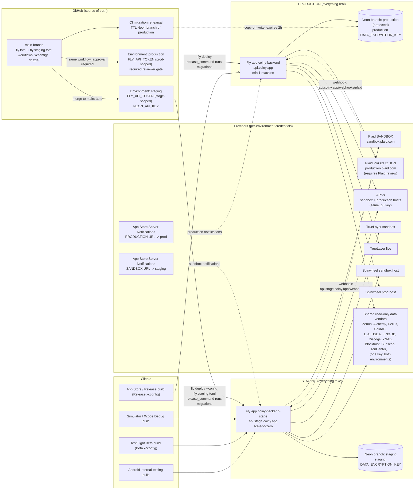

# Environments: Staging and Production Architecture

Decision document. The companion runbook with exact commands is
`docs/environments-setup.md`. Research date: 2026-08-13. Author: Claude, from
primary sources (Fly, Neon, Plaid, Apple, GitHub, DORA docs) plus direct
inspection of this repo. Anything that could not be verified is marked
**Unverified** with what would settle it.

---

## 1. The recommendation

Run **two long-lived environments plus two ephemeral tiers**, with GitHub as
the source of truth for everything that can be a file:

| Tier | Backend | Database | Keys | Cost |
|---|---|---|---|---|
| **local** | `pnpm dev`, PGlite in-process | PGlite, throwaway | Sandbox (Keychain) | $0 |
| **CI / rehearsal** | none deployed | Ephemeral Neon branch with a TTL, created per migration rehearsal | none | $0 on Free plan |
| **staging** | New Fly app `coiny-backend-stage`, scale-to-zero | Neon branch `staging` in the existing `Coiny` project | All sandbox/test keys, synthetic data only | ~$0 to $2/mo |
| **production** | The existing Fly app `coiny-backend` (kept, not renamed) | The existing Neon `production` branch, wiped at go-live, then protected | Real keys only, real data only | ~$2/mo now |

Everything is fake in staging, forever. Everything is real in production,
starting the day real keys arrive; until then production is frozen and dark.
No third environment, no preview-app-per-PR, no separate Neon project, no
separate Fly org.

**Total added cost today: under $5/month** (a mostly-stopped second Fly
machine, plus $0 on Neon's Free plan). At launch, expect roughly $25 to 40/mo
across Fly, Neon Launch-plan usage, and a domain, detailed in §10.

The deploy pipeline: merge to `main` deploys **staging automatically**;
the same workflow then offers a **production deploy gated on a manual
approval** via a GitHub Environment protection rule. Migrations move out of
application boot into Fly's `release_command`, and CI rehearses every
migration against a disposable copy-on-write Neon branch of the production
database before it can merge.

## 2. Why this shape, and what the mainstream actually does

The practitioner consensus for a small team shipping a hosted API in the
mid-2020s has converged, and it is smaller than folklore suggests:

- **Trunk-based development with a short-lived branch per change.** DORA's
  research target is "three or fewer active branches" and merging "to trunk
  at least once a day"; teams doing this show "higher levels of software
  delivery and operational performance"
  ([DORA, trunk-based development](https://dora.dev/capabilities/trunk-based-development/)).
  Coiny already works this way (squash-merge PRs off `main`,
  `CLAUDE.md` git conventions), with one glaring current exception: a 45-commit
  pending PR (#191). That is a batch-size failure by DORA's own measure, and
  the environment design below is partly chosen to make small merges safe
  enough that giant integration branches stop being tempting.
- **One production, one shared staging, ephemeral everything else.** The
  chain of four or five long-lived environments (dev, QA, UAT, pre-prod,
  prod) is dead outside enterprises; what replaced it is prod + a single
  staging for "the last look with production-shaped infrastructure," plus
  ephemeral per-PR resources where they are cheap. Neon's own guidance
  frames it exactly this way: production as the root branch, staging derived
  from it, previews as disposable branches
  ([Neon, production and staging as branches](https://neon.com/branching/production-staging-workflows)).
  Fly's blueprint likewise treats staging and production as separate apps
  with "their own `fly.toml` files"
  ([Fly, staging and production isolation](https://fly.io/docs/blueprints/staging-prod-isolation/)).
- **"Test in production with guardrails"** is a real position (feature
  flags, canaries, progressive delivery), but it presumes observability,
  fast rollback, and someone watching. Coiny has none of those and no one to
  wake. It is the wrong position for a solo fintech; the right lesson to
  take from it is the smaller one: keep staging honest about what it can and
  cannot tell you, and make production deploys cheap to roll back.
- **Preview-environment-per-PR** is the current darling (Vercel popularized
  it; Neon branches and Fly review apps make it possible here). It earns its
  keep when multiple people need to see each other's unmerged work. Solo,
  it is machinery without an audience: the PGlite test suite already gives
  every PR a real-SQL database (`backend/src/db/client.ts`), and the one
  thing PGlite cannot catch (journal-order skips against the real database)
  is covered far more cheaply by the CI rehearsal branch in §5.

The controlling constraint is stated in the brief and deserves to be treated
as an engineering requirement: **there is no ops person and will not be one.**
Every environment is a thing that drifts, expires certificates, and pages
nobody. Two long-lived environments is not a compromise down from the "right"
number; for this team size it is the right number. An architecture the
founder will not maintain is worse than a simpler one he will.

## 3. Application tier: Fly.io

**Separate apps, same org.** Fly's blueprint recommends separate
*organizations* for "dependable isolation" because org boundaries are network
boundaries ([Fly blueprint](https://fly.io/docs/blueprints/staging-prod-isolation/)).
That is the one place this document deliberately deviates from the vendor's
own guidance: multi-org exists to isolate *people* and private networks, and
Coiny has one person and no inter-app private networking. Two apps in the
personal org, with app-scoped deploy tokens per app
([Fly, access tokens](https://fly.io/docs/security/tokens/)), gives the
isolation that matters (separate secrets, separate machines, separate deploy
credentials) without a second org to administer. Trigger to revisit: the
first collaborator who should be able to touch staging but not production.

- **Production**: the existing app `coiny-backend` in `iad`
  (`/Users/antoinewiley/Tamogatchi/fly.toml`). Keep
  `min_machines_running = 1` once real users exist; keep the `/health` check.
  Fly apps cannot be renamed (the `fly apps` command set offers create,
  destroy, and move-to-another-org only; verified against `flyctl` v-current
  locally), which settles the rename question in §7.
- **Staging**: new app `coiny-backend-stage`, same region, defined by a
  second config file `fly.staging.toml` committed to the repo and deployed
  with `fly deploy --config fly.staging.toml`
  ([Fly config reference](https://fly.io/docs/reference/configuration/)).
  Set `auto_stop_machines = 'stop'` and `min_machines_running = 0`: a
  staging app that nobody is hitting stops completely, and a stopped machine
  bills only rootfs at $0.15/GB per 30 days; the same machine running
  full-time is about $2.02/mo
  ([Fly pricing](https://fly.io/docs/about/pricing/)). Cold start on first
  request is a couple of seconds and is an acceptable staging trade.
  One caveat to design around: scale-to-zero means **staging is down when
  Plaid sends it a webhook** and nothing auto-starts... actually Fly's proxy
  does auto-start machines on inbound HTTP (`auto_start_machines = true`),
  so webhooks wake it; the real caveat is latency and the suspended clock,
  which matters for the scheduler. Keep scheduled jobs disabled or
  best-effort in staging and treat only production's scheduler as real.

**NODE_ENV is `production` in both.** `NODE_ENV` is a runtime mode, not an
environment name: it controls config strictness
(`backend/src/config.ts` requires `DATA_ENCRYPTION_KEY`, `DATABASE_URL`,
and the Plaid triplet when `NODE_ENV=production`), disables the shared
Coinbase dev key (`isSharedCoinbaseKeyAllowed()`, `backend/src/config.ts:177`),
and selects the APNs host (`backend/src/push/apns.ts:28`). Staging exists to
rehearse production, so it must run in production mode. The question "which
environment am I" gets its own variable: add **`APP_ENV`**
(`staging | production`) to the config schema, used for log labels, the
`/health` payload, and nothing load-bearing. This preserves the standing rule
that `PLAID_ENV` is never a proxy for "is this production" (`CLAUDE.md`,
Operating Notes) and stops `NODE_ENV` from being bent into that role next.

## 4. Data tier: Neon

**One project, two branches.** The existing project `Coiny`
(`noisy-bonus-65551609`, aws-us-east-1, Postgres 17) already has a single
default branch named `production` (33 MB, unprotected, verified via the Neon
API on 2026-08-13). The recommendation:

- Mark `production` **protected**. Protected branches cannot be casually
  deleted or reset, and, the property that matters most here, child branches
  of a protected branch get **freshly generated credentials**, so staging
  physically cannot reuse the production connection string
  ([Neon, staging workflows](https://neon.com/branching/production-staging-workflows)).
- Create a long-lived **`staging` branch**. Today, pre-launch, branching from
  `production` is unambiguously safe: the parent contains only Plaid
  sandbox artifacts and the founder's own test rows; there is no real
  customer datum anywhere in the system. Copy-on-write branches are near-free
  ($1.50/branch-month beyond plan allowances, and within the 10 free branches
  on both Free and Launch plans; storage bills only the delta,
  [Neon plans](https://neon.com/docs/introduction/plans)).
- **The finance-app position, stated explicitly: after real data arrives,
  production data never flows downward again. Not once, not anonymized, not
  "just schema plus a few rows."** Staging runs on synthetic and sandbox
  data indefinitely, refreshed by the app's own seed paths, never by
  `neon branches reset`. This is stricter than Neon's supported pattern
  (their anonymized-branch workflow masks PII with the PostgreSQL Anonymizer
  extension and is designed for exactly this,
  [Neon, data anonymization](https://neon.com/docs/workflows/data-anonymization)),
  and the strictness is deliberate: the feature is Beta, masking-rule
  completeness is a per-column judgment that must be re-made every time the
  schema grows a column (this schema grew nine tables in one pending PR),
  and the failure mode is silent PII exfiltration into the environment with
  the weakest controls. A solo founder should not own a masking-rule
  ruleset. The `DATA_ENCRYPTION_KEY` split in §6 turns this policy into
  physics: rows encrypted with the production key are unreadable in staging
  anyway. Trigger to revisit: a class of bug that provably only reproduces
  on production-shaped data, at which point use Neon's anonymized branches
  with a reviewed rule set rather than ad-hoc copies.
- **Ephemeral rehearsal branches** with `--expires-at` TTLs for CI (§5);
  they self-delete
  ([Neon CLI branching](https://neon.com/docs/guides/branching-neon-cli)).

Why not a **separate Neon project** for production? Project-level isolation
is the compliance-maximal answer and costs nothing extra in dollars. It
costs the two things branches provide for free: the CI rehearsal workflow
(a branch of the *real* production data is what catches the journal-skip
bug class) and instant restore across one timeline. Separate credentials,
separate connection strings, and the protected-branch behavior already
deliver the isolation an auditor at this scale asks about (§9). Trigger to
revisit: a SOC 2 / partner due-diligence questionnaire that demands
account-level separation, or the need to run different Postgres major
versions.

Connection pooling: the backend holds a max-5 `postgres.js` pool
(`backend/src/db/client.ts:24`) against the direct endpoint; with one or two
machines per environment this is far below Postgres limits and Neon's
pooled endpoint is not needed yet. Trigger: more than ~5 machines or any
serverless/edge consumer.

Compute: each branch gets its own compute endpoint that scales to zero when
idle ([Neon, scale to zero](https://neon.com/docs/introduction/scale-to-zero)),
so an idle staging branch costs approximately nothing in CU-hours. The Free
plan's 100 CU-hours/project/month and 0.5 GB storage cover both branches at
current size (project is at 33 MB); the Launch plan is pay-as-you-go from $0
([Neon plans](https://neon.com/docs/introduction/plans)).

## 5. Migrations: the sharpest edge in this codebase

Current state, all verified in-repo: migrations are hand-written SQL under
`backend/drizzle/` with a `meta/_journal.json`; the Drizzle migrator runs
**at application boot** (`backend/src/server.ts:65` calls `runMigrations()`
from `backend/src/db/migrate.ts`); the journal silently skips any entry
whose `when` timestamp is below the last applied one (documented in
`backend/CLAUDE.md`, "The journal is the trap", bitten twice, most recently
fixed in commit `d09fff4`); and there is **no CI check on journal order and
no rehearsal against anything production-shaped**. PR #191 carries nine new
migrations (0039 to 0047) that will run for the first time against the only
database, at boot, on auto-deploy.

Where practice has landed, and what to adopt:

1. **Migrations run at deploy time, not at boot.** Fly's mechanism is
   `[deploy] release_command`, which runs "a one-off task, like a database
   migration, before any of your deployed Machines are created or updated,"
   and "if the command fails, the deploy will stop"
   ([Fly config reference](https://fly.io/docs/reference/configuration/)).
   Boot-time migration has two failure modes Coiny is currently exposed to:
   a bad migration turns into a crash-looping machine serving nothing rather
   than a halted deploy serving the old version, and once the app runs more
   than one machine, N machines race to migrate concurrently. Move the
   `runMigrations()` call into a small CLI entry invoked by
   `release_command`, and out of `server.ts`. This is an hour of work and
   is the single highest-leverage change in this document.
2. **A journal monotonicity check in CI.** A ten-line script that asserts
   `when` values are strictly increasing and not in the past relative to the
   previous entry, run in `backend-ci.yml`. This turns the twice-bitten
   silent skip into a red PR check. Fresh-database tests cannot catch it
   (a fresh database applies everything in journal order; only a database
   that has already applied a later timestamp exhibits the skip), which is
   why the next item exists.
3. **Rehearsal against a branch of the real production database.** DORA:
   "make sure you test every schema change against a production-like data
   set" ([DORA, database change management](https://dora.dev/capabilities/database-change-management/)).
   Neon makes this nearly free: CI creates a copy-on-write branch of
   `production` with a two-hour TTL, runs the exact migration entrypoint
   against it, smoke-queries the tables the journal claims exist, and lets
   the branch expire ([Neon branching in CI](https://neon.com/docs/guides/branching-github-actions)).
   This catches the journal-skip class *and* data-dependent failures
   (constraint violations against real rows) that no empty-DB test can.
   Post-launch this workflow touches real data; that is acceptable because
   it runs inside Neon's account boundary, the branch lives minutes, and no
   data leaves it. It is the one deliberate exception to "prod data never
   flows down," and it flows into a TTL'd branch, not into staging.
4. **Expand and contract for anything a live client depends on.** The
   pattern: add the new shape alongside the old, migrate, cut reads over,
   only then remove the old shape
   ([Prisma Data Guide, expand and contract](https://www.prisma.io/dataguide/types/relational/expand-and-contract-pattern)).
   Pre-launch with zero users, Coiny does not need the ceremony for every
   change; it needs the *rule* from it: **destructive schema changes
   (drop/rename of anything a shipped iOS build reads) are forbidden in the
   same release that changes the reader.** Adopt the full pattern the day
   the first TestFlight build is on someone else's phone.

## 6. Secrets, GitHub as source of truth, and drift

The founder's requirement: both environments must live in GitHub, not in
dashboards. Here is the exact split between what can be a file, what can be
a GitHub-managed object, and what must remain a dashboard setting with a
recorded runbook entry.

**Configuration as code (in the repo):**
`fly.toml` (production) and `fly.staging.toml` (staging); the two deploy
jobs in `.github/workflows/backend-deploy.yml`; the migration entrypoint and
journal check; the iOS `.xcconfig` files and `ios/project.yml`; the drizzle
folder; a **secret-name manifest** (names, owning environment, where to
re-obtain, rotation cadence, never values) inside
`docs/environments-setup.md` §2; and a drift-check workflow (below).

**GitHub Environments.** The repo (`pamplemousse-glitch/Coiny`) is public,
so environments, environment-scoped secrets, deployment branch policies,
required reviewers, and wait timers are all available on the Free plan
([GitHub, managing environments](https://docs.github.com/en/actions/how-tos/deploy/configure-and-manage-deployments/manage-environments);
private repos would need Pro, worth knowing if the repo ever goes private).
Create `staging` and `production` environments. A job that declares
`environment: production` cannot run, or read that environment's secrets,
until its protection rules pass; put a required-reviewer rule (the founder)
on `production` and a deployment branch policy restricting it to `main`.

**What is a GitHub secret versus a Fly secret.** The rule that prevents
drift: *GitHub holds only what CI needs to act; Fly holds only what the app
needs to run; nothing lives in both.* Concretely:

- GitHub `staging` environment: `FLY_API_TOKEN` = app-scoped deploy token
  for `coiny-backend-stage` only (`fly tokens create deploy`,
  [Fly tokens](https://fly.io/docs/security/tokens/)); `NEON_API_KEY` for
  the rehearsal-branch workflow.
- GitHub `production` environment: `FLY_API_TOKEN` = deploy token for
  `coiny-backend` only.
- Fly per-app secrets: everything in `backend/src/config.ts`, per the
  inventory table in the runbook. GitHub never holds a `PLAID_SECRET` or
  `DATABASE_URL`; CI never needs them, because migrations run via Fly's
  release command inside the app's own secret context.

The current repo-level `FLY_API_TOKEN` (used by
`.github/workflows/backend-deploy.yml:39`) is retired in favor of the two
scoped tokens; a leaked staging token then cannot touch production.

**Recovery if the laptop dies.** Today local secrets exist only in the macOS
Keychain via `bin/load-secrets.sh`, a stated single point of failure. After
this design: the code, workflows, both Fly configs, and the secret-name
manifest are in GitHub; every provider key in the inventory is re-issuable
from its provider dashboard (the manifest records where); Fly and Neon state
is reconstructible from the runbook. The two things that are *not*
re-issuable are `DATA_ENCRYPTION_KEY` (production) and the `age` backup key
(PRD R-20.3, `docs/prd.md:575`): losing the former makes every stored Plaid
token garbage and forces every user to re-link. Those two therefore get a
second offline home (password manager or printed sealed copy) in addition to
Keychain and Fly. Recommendation: adopt a password manager as the canonical
secret store, with Keychain demoted to a local cache that
`bin/load-secrets.sh` reads.

**`DATA_ENCRYPTION_KEY` must differ per environment**, and the consequences
are worth wanting: ciphertext is environment-bound, so a row copied from
production to staging (by any path, including a well-meaning future script)
is unreadable there, and vice versa; a staging key compromise discloses
nothing about production; and key rotation can be rehearsed on staging
before it is ever attempted on production. The costs: the two databases can
never be merged or swapped wholesale, and the go-live wipe in §7 is
mandatory rather than optional, because rows encrypted under the sandbox-era
key would be permanently opaque to a production app holding a new key.

**Drift detection.** A scheduled weekly workflow (plus `workflow_dispatch`)
that, per environment: runs `fly secrets list -a <app>` and diffs the
*names* against the manifest; runs `fly config show -a <app>` and diffs
against the committed toml; runs `neon branches list` and asserts
`production` is protected and `staging` exists. Names and settings only,
never values. It fails loudly into the Actions inbox, which the founder
already reads (the R-20.1 backup workflow will live in the same inbox).
This is deliberately a diff-and-alert, not an auto-reconciler; a solo
founder wants to be told, not to have a robot rewrite Fly state at 3 a.m.

## 7. What to do about the current situation

**The app named production that is really staging.** Verdict: **leave the
name, split the role.** Fly apps cannot be renamed, and the hostname
`coiny-backend.fly.dev` is already hardcoded into device builds
(`ios/Coiny/Services/API.swift:21`), so renaming would be both impossible
and pointless. Instead: `coiny-backend` keeps its name and *becomes* real
production at go-live; the new `coiny-backend-stage` takes over the job the
current app has been doing all along. Sequence, expanded into exact steps in
the runbook:

1. Stand up `coiny-backend-stage` + Neon `staging` branch; copy the current
   sandbox secret set to it; verify.
2. Repoint the auto-deploy at staging; production's deploy job now requires
   approval. Repoint simulator/dev clients at staging.
3. `coiny-backend` goes quiet. It keeps serving until go-live so any
   existing TestFlight-era build keeps working, but nothing deploys to it
   without the gate.
4. At go-live: wipe the Neon `production` branch (it holds only test data;
   the `DATA_ENCRYPTION_KEY` argument in §6 makes this mandatory), set real
   keys, protect the branch, deploy through the gate, verify with the
   checklist, and only then submit a build pointed at it.

**PR #191** (45 commits, backend-only, nine migrations, auto-deploys on
merge per `.github/workflows/backend-deploy.yml`). Do not let it be the last
unrehearsed migration run. Order of operations: (a) land the journal check
and rehearse 0039 to 0047 against a TTL Neon branch of `production` first,
an afternoon including the CI wiring; (b) merge #191, which deploys to the
single existing app, tolerable because that app is de facto staging with an
audience of one; (c) then build the environment split. Splitting first and
merging into it would also work, but sequencing the rehearsal first protects
against the known, twice-bitten failure at the earliest possible moment.
The 45-commit shape itself should not recur; with staging cheap to deploy,
the DORA small-batch norm (§2) becomes practical instead of aspirational.

## 8. The mobile clients

**How environment selection should work.** The current mechanism is a
compile-time `#if targetEnvironment(simulator)` picking localhost versus the
hardcoded Fly hostname (`ios/Coiny/Services/API.swift:17-23`). Replace it
with build-configuration-driven config: an `API_BASE_URL` build setting per
`.xcconfig` file, surfaced through `Info.plist` as `$(API_BASE_URL)` and
read at startup ([Apple, build configuration files](https://developer.apple.com/documentation/xcode/adding-a-build-configuration-file-to-your-project)).
Three configurations via `ios/project.yml` (XcodeGen makes this cheap):

| Configuration | Points at | Used for |
|---|---|---|
| Debug | `http://127.0.0.1:3000` (scheme-overridable to staging) | Local dev, simulator |
| Beta | staging URL | TestFlight internal testing until launch |
| Release | production URL | App Store, and TestFlight release-candidate builds after go-live |

TestFlight maps cleanly: internal-testing builds are Beta-config and talk to
staging; the build submitted for App Review is Release-config and must talk
to a **live production backend**, which is why production must exist and
hold real Plaid production credentials before first submission (App Review
exercises the real app; Plaid production access itself requires Plaid's
review first, [Plaid environments](https://plaid.com/docs/quickstart/glossary/)).
StoreKit purchases in TestFlight run against Apple's sandbox environment
regardless (the `ios/Coiny.storekit` file covers local Xcode testing;
[Apple, testing IAP with sandbox](https://developer.apple.com/documentation/storekit/testing-in-app-purchases-with-sandbox)),
so the entitlements webhook (`backend/src/webhook/appstore.ts`, pending in
PR #191) needs its **sandbox** notification URL pointed at staging and its
**production** URL at production; App Store Connect accepts separate URLs
per environment ([Apple, enabling App Store Server Notifications](https://developer.apple.com/documentation/appstoreservernotifications/enabling-app-store-server-notifications);
page is JS-rendered so the quote could not be captured, the two-URL
capability is standard and visible in App Store Connect under App
Information, **Unverified only as to exact current dashboard path**).

Android mirrors this with build types / product flavors carrying a
`BASE_URL` `buildConfigField`; Play internal testing maps to staging the
same way TestFlight internal does.

**Do this before the split, not after: buy the domain.** Device builds bake
the URL in. Every build shipped with `coiny-backend.fly.dev` in it couples
shipped clients to a Fly-owned hostname forever. Put `api.coiny.app` (prod)
and `api.stage.coiny.app` (staging) on the Fly apps via `fly certs` before
the first Beta build goes to anyone, and never ship a `*.fly.dev` URL in a
client again.

**The live mismatch.** The iOS code in the working tree calls endpoints
(goals CRUD, debts, entitlements) that the deployed backend does not serve;
the backend halves are sitting in PR #191, and `ios/Coiny/Services/API.swift`
on `main` already calls `PUT /api/pets/goals`. The standing rule that
prevents recurrence, enforceable in review: **the server must always be
newer than the oldest client that talks to it.** Backend changes merge and
deploy to staging before the client change that consumes them is merged;
client-visible API changes are additive (new endpoints, new optional
fields), never mutating or removing what a shipped build reads; removal
waits until no build in the field calls it (expand and contract, §5, applied
at the API layer). For the current instance concretely: merge and deploy
#191 (rehearsed) before any TestFlight build containing the goals/debts/
entitlements UI is distributed.

## 9. The compliance angle, sized honestly

Coiny's LLC is a "financial institution" in the FTC's broad sense once it
handles consumer financial data, and the Safeguards Rule requires a written
information security program: access controls, encryption of customer
information at rest and in transit, MFA, secure disposal, and testing
([FTC, Safeguards Rule guidance](https://www.ftc.gov/business-guidance/resources/ftc-safeguards-rule-what-your-business-needs-know);
the FTC page and eCFR both blocked automated fetch on 2026-08-13, so the
following specific is **Unverified against the current rule text and should
be confirmed by reading 16 CFR 314.6 directly**: institutions maintaining
customer information on fewer than 5,000 consumers are exempt from a subset
of the written-program requirements such as the written risk assessment,
continuous monitoring/annual penetration testing, and the written incident
response plan, while the core safeguards still apply).

What environment separation means at this scale, and what a partner
questionnaire (Plaid's own diligence, a future bank partner, an eventual
SOC 2) actually asks:

- **Production customer data is not present in non-production
  environments.** The §4 position ("never flows down") answers this in its
  strongest form. Frameworks generally permit anonymized copies; Coiny's
  stricter stance is easier to attest than to caveat.
- **Separate credentials per environment, least-privilege access.** The
  protected-branch credential behavior, per-app Fly secrets, per-app deploy
  tokens, and the split `DATA_ENCRYPTION_KEY` cover this.
- **Change management with an audit trail.** Trunk + PRs + a
  required-reviewer gate on the `production` GitHub Environment produces a
  reviewable deployment history for free (every production deploy is an
  approved, timestamped, SHA-linked event).
- **Encryption at rest and in transit.** Neon encrypts at rest and requires
  TLS; the app-layer AES-256-GCM on Plaid tokens
  (`.claude/rules/security.md` #4) plus `DATA_ENCRYPTION_KEY` handling is
  the part that is Coiny's own responsibility.
- **Backups and recovery.** Already specified as PRD R-20.1 to R-20.3
  (`docs/prd.md:575`, numbers owned by `docs/engineering-budgets.md` §7:
  RPO under 24 h worst case, RTO under 4 h, nightly encrypted `pg_dump`,
  30-day retention, rehearsed restores). Neon's own automated-pg_dump
  GitHub Actions guide is the implementation template
  ([Neon, automated backups](https://neon.com/docs/manage/backup-pg-dump-automate)).
  Status: Unbuilt, and a stated MAJOR blocker before the first tester.

## 10. Cross-cutting infrastructure Coiny does not yet have

Each with a now/later verdict and the trigger that flips it.

| Concern | Verdict | Detail |
|---|---|---|
| Error tracking, backend | **Later, at first tester** | Pre-tester, pino to Fly logs plus the Actions inbox suffices. At first external tester, add Sentry (or equivalent) to the *backend only*, with PII scrubbing configured to honor `.claude/rules/security.md` #2. Trigger: R-28.1's first invite wave, when a crash the founder didn't personally witness becomes possible. |
| Crash reporting, iOS | **Now, at zero cost, no SDK** | PRD §24 deliberately chose first-party instrumentation with "no third-party vendor" (`docs/prd.md`, R-24.1), and the privacy manifest (`ios/project.yml` note on `PrivacyInfo.xcprivacy`) must not grow vendor entries. Apple's built-in crash reports (Xcode Organizer) and MetricKit provide crash-free-session data with zero SDKs, which is exactly what the R-28.1 pause rule needs. A vendor crash SDK would undo a deliberate PRD decision; do not add one. |
| Logging and retention | **Later** | Fly log retention is short and best-effort; that is fine while the no-PII rule holds and debugging is same-day. Trigger: first paying users, or the first bug that needed logs older than Fly kept. Then: Fly's log-shipper to S3, cheapest possible sink, same no-PII discipline. |
| Uptime monitoring and alerting | **At go-live, free tier** | One external pinger (UptimeRobot or Healthchecks.io free tier) on production `/health`, alerting to email. Nobody is woken because there is nobody; the design compensates by making recovery automatic (Fly health checks restart machines per `fly.toml` `[[http_service.checks]]`) and deploys reversible. Staging gets no monitor; it is allowed to be asleep. |
| Backups, restore rehearsal | **Now-adjacent: before first tester** | Already specified (R-20.1 to R-20.3) and Unbuilt; see §9. This ranks immediately after the migration-rehearsal work in §5 and shares its skills (Actions cron, Neon, `age` encryption). |
| Secrets beyond Keychain | **Now** | Password manager as canonical store, Keychain as cache (§6). Rotation: annual for provider API keys, immediate on any suspicion, and rehearse `DATA_ENCRYPTION_KEY` rotation on staging before it is ever needed in production. |
| DNS and domains | **Now, before any distributed build** | §8. One domain (~$15/yr), two `fly certs` entries, marketing site wherever, `api.` and `api.stage.` subdomains on the Fly apps. |
| Transactional email | **Not yet** | No email flows exist: auth is Sign in with Apple/Google, receipts are Apple's. Trigger: the first genuine email need (support, legal notices); then a transactional provider on the free tier. Do not stand it up speculatively. |
| Status page | **Not yet** | Audience of ~30 testers reachable by TestFlight notes. Trigger: paying subscribers plus the first outage that generated support mail. |
| Feature flags | **Not as a vendor; as a table** | R-24.1's "no third-party vendor" logic applies. When a flag is first needed (staged behavioral rollout, kill switch), it is one `feature_flags` table and a config endpoint, readable per user. Trigger for a real flag service: multivariate rollout needs that a table demonstrably cannot serve. The kill-switch flavor is worth building at launch: one server-side flag that degrades expensive integrations if a provider misbehaves. |
| Staged rollout | **Already specified, needs no tooling** | R-28.1's 5/15/30 invite waves are TestFlight group mechanics; post-launch, App Store phased release is built into App Store Connect. No infrastructure to buy. |

## 11. How it all connects

Solid arrows are requests the environment makes; dashed arrows are calls
INTO the backend (webhooks), which is why each environment must have its own
stable, reachable HTTPS URL registered with each provider. No arrow crosses
the staging/production boundary, and the two red-labeled stores make a
crossing cryptographically useless: ciphertext from one environment cannot
be decrypted in the other.

Boundary rules the diagram encodes: clients select their environment at
build time and never fail over across the boundary; each Plaid environment's
webhook URL points only at its own backend (Plaid tokens are
environment-bound anyway, [Plaid glossary](https://plaid.com/docs/quickstart/glossary/));
Apple's two notification URLs are the one provider config where both
environments appear on a single dashboard page, which makes them the
likeliest future misconfiguration, hence the verification step in the
runbook; the shared vendor block is the deliberate exception, justified
because those keys read public market data, carry no user data, and the
only cross-environment coupling is a shared rate limit.

## 12. The migration path from today

In order; step 1 is the afternoon-sized one. Full commands in the runbook.

1. **This afternoon:** journal monotonicity check in CI + rehearse PR #191's
   nine migrations against a 2-hour TTL Neon branch of `production`. Then
   merge #191.
2. Move migrations from boot to a `release_command` entrypoint (both
   configs). Mark the Neon `production` branch protected.
3. Buy the domain; certs for `api.coiny.app` and `api.stage.coiny.app`.
4. Create Neon `staging` branch; create Fly `coiny-backend-stage`; load the
   sandbox secret set into it (this is the current secret set moving to its
   rightful home); verify with the runbook checklist including the
   two-databases proof.
5. GitHub Environments `staging` and `production`, scoped deploy tokens,
   split `backend-deploy.yml` into auto-staging + gated-production; retire
   the repo-level Fly token.
6. iOS xcconfigs (Debug/Beta/Release) and the Android equivalent; repoint
   dev and Beta builds at staging.
7. Backups per R-20.1 and the drift-check workflow (same Actions-cron
   skill set, do them together).
8. **At real-keys time (gated on Plaid production approval and Apple
   enrollment):** wipe the production DB, set real secrets, deploy through
   the gate, run the production verification checklist, submit.

## 13. Open questions for the founder

1. **Domain name and spelling of the staging host** (`api.stage.coiny.app`
   vs `api-stage.`). Recommendation: `api.stage.coiny.app`; dots are free
   and it reads as a hierarchy. Blocking step 3; everything else can proceed.
2. **Does staging keep running the scheduler and push notifications?**
   Recommendation: yes but pointed at the founder's own test devices only,
   because reaction dispatch is the product and needs rehearsal; accept that
   scale-to-zero makes staging's scheduler best-effort.
3. **When to start Plaid's production-access application.** Recommendation:
   now. It is the longest external lead time on the critical path, it is
   free to apply, and nothing in this document depends on its outcome
   ([Plaid launch center](https://plaid.com/docs/launch-checklist/)).
4. **Password manager choice** for the canonical secret store.
   Recommendation: any of 1Password/Bitwarden; the decision that matters is
   "there is exactly one canonical store and Keychain is a cache," not the
   vendor.
5. **Whether PR #191 merges before or after the environment split.**
   Recommendation: before, but after the step-1 rehearsal; argued in §7.
6. **Whether staging's Coinbase integration keeps using the founder's
   personal key.** Current code confines it to non-production
   (`backend/src/config.ts:177`), which after this design means staging
   keeps working and production's Coinbase silently needs the OAuth build.
   Recommendation: accept, and track the OAuth work as a launch-scope
   decision, not an environments problem.

## Sources not otherwise linked above

- Neon reset-from-parent semantics (complete overwrite, connection string
  survives): [Neon docs](https://neon.com/docs/guides/reset-from-parent)
- Neon backup strategy overview: [Neon docs](https://neon.com/docs/manage/backups)
- APNs hosts and the single .p8 key serving both environments:
  [Apple docs](https://developer.apple.com/documentation/usernotifications/sending-notification-requests-to-apns)
  (page is JS-rendered; hostnames `api.push.apple.com` /
  `api.sandbox.push.apple.com` additionally confirmed in this repo at
  `backend/src/push/apns.ts:28`)
- Plaid separate secret per environment, shared client_id:
  [Plaid quickstart](https://plaid.com/docs/quickstart/)

**Unverified items, consolidated:** 16 CFR 314.6 small-institution
exemption specifics (read the rule text); exact App Store Connect dashboard
path for the two notification URLs (open App Store Connect); Spinwheel and
TrueLayer production-onboarding requirements and lead times (both doc sites
returned 404/gated to automated fetch on 2026-08-13; settle by logging into
each dashboard, both are flagged with lead-time warnings in the runbook).
